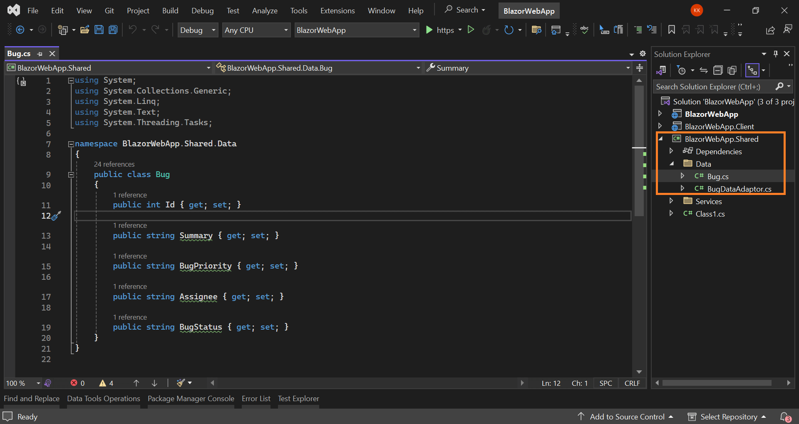

# How to Bind Data Using Dapper and Perform CRUD Operations

In this section, you can learn how to consume data from a database using [Dapper](https://github.com/DapperLib/Dapper), bind it to a `Syncfusion Blazor DataGrid` Component, and perform CRUD operations in Blazor Web App.

## Prerequisite software

* Visual Studio 2022.
* MS SQL Server.

## Creating Blazor application

* Open Visual Studio and follow the steps in the [documentation](https://learn.microsoft.com/en-us/aspnet/core/blazor/tooling?view=aspnetcore-8.0&pivots=windows) to create the Blazor Web App.

## Creating the database

First, create a database named `BugTracker` and a table named `Bugs` to hold the list of bugs.

1. Open SQL Server 2017 / latest version.
2. Now, create a new database named `BugTracker`.
3. Right-click on the created database and select New Query.
4. Use the following SQL query to create a table named Bugs.

```
Create Table Bugs(
Id BigInt Identity(1,1) Primary Key Not Null,
Summary Varchar(400) Not Null,
BugPriority Varchar(100) Not Null,
Assignee Varchar(100),
BugStatus Varchar(100) Not Null)
```

Now, the table design will look like below.


## Creating data access layer

Before creating a data access layer, you need to include the following code snippet in the `appsettings.json` file of server side project of Blazor Web App .




          // your localhost portal number
"BaseUri": "https://localhost:7105",
"Logging": {
  "LogLevel": {
    "Default": "Information",
    "Microsoft.AspNetCore": "Warning"
  }
},
"AllowedHosts": "*",
"ConnectionStrings": {
  "BugTrackerDatabase": "Server= {Your Server Name};Database=BugTracker;Integrated Security=True"
}





## Adding Dapper package and creating a model class

If you have created a Blazor Web App with the `Interactive render mode` set to `WebAssembly` or `Auto` ensure to follow these steps:

1. Create a new project with Class Library template named `BlazorWebApp.Shared` for the database accessing purpose.

To use Dapper and access database in the application, you need to install the following `NuGet` packages in server side & Shared projects .

Run the following commands in the Package Manager Console.

* The following command enable us to use Dapper in our application.

    ```
    Install-Package Dapper -Version 2.1.24

    ```

* The following command provide database access classes such as  `SqlConnection`, `SqlCommand`, etc. Also provides data provider for MS SQL Server.

    ```
    Install-Package Microsoft.Data.SqlClient -Version 5.1.2
    ```

2. Most of the ORMs provide scaffolding options to create model classes. Dapper doesn’t have any in-built scaffolding option. So, you need to create model class manually. In `BlazorWebApp.Shared` project , you are creating a class named `Bug.cs` in the `Data` folder  as follows.

```c#

namespace BlazorWebApp.Shared
{
    public class Bug
    {
        public int Id { get; set; }

        public string Summary { get; set; }

        public string BugPriority { get; set; }

        public string Assignee { get; set; }

        public string BugStatus { get; set; }
    }
}

```



3. Crete the `DataGridController` in server side application for handle CRUD (Create, Read, Update, Delete) operations.


```cshtml
using Microsoft.AspNetCore.Mvc;
using Dapper;
using BlazorWebApp.Shared.Data;
using Microsoft.Data.SqlClient;
using System.Data;
using System;

namespace BlazorWebApp.Controller
{
    [Route("api/[controller]")]
    [ApiController]
    public class DataGridController : ControllerBase
    {
        public IConfiguration Configuration;
        private const string BUGTRACKER_DATABASE = "BugTrackerDatabase";
        private const string SELECT_BUG = "select * from bugs";
        public DataGridController ( IConfiguration configuration )
        {
            Configuration = configuration; //Inject configuration to access Connection string from appsettings.json.
        }

        [HttpGet]
        public async Task<ActionResult<List<Bug>>> Get ()
        {
            using (IDbConnection db = new SqlConnection(Configuration.GetConnectionString(BUGTRACKER_DATABASE)))
            {
                db.Open();
                IEnumerable<Bug> result = await db.QueryAsync<Bug>(SELECT_BUG);
                return result.ToList();
            }
        }
        [HttpGet("BugCount")]
        public async Task<ActionResult<int>> GetBugCountAsync ()
        {
            try
            {
                using (IDbConnection db = new SqlConnection(Configuration.GetConnectionString(BUGTRACKER_DATABASE)))
                {
                    db.Open();
                    int bugCount = await db.ExecuteScalarAsync<int>("SELECT COUNT(*) FROM bugs");
                    return Ok(bugCount);
                }
            }
            catch (Exception ex)
            {
                // Log the exception or handle it accordingly
                return StatusCode(500, "Internal Server Error");
            }
        }


    [HttpPost]

        public async Task<ActionResult<Bug>> Post ( Bug value )
        {
            using (IDbConnection db = new SqlConnection(Configuration.GetConnectionString(BUGTRACKER_DATABASE)))
            {
                db.Open();
                await db.ExecuteAsync("insert into bugs (Summary, BugPriority, Assignee, BugStatus) values (@Summary, @BugPriority, @Assignee, @BugStatus)", value) ;
            }
            return Ok(value);
        }

        [HttpPut]
        public async Task<ActionResult<Bug>> Put ( Bug value )
        {
            using (IDbConnection db = new SqlConnection(Configuration.GetConnectionString(BUGTRACKER_DATABASE)))
            {
                db.Open();
                await db.ExecuteAsync("update bugs set Summary=@Summary, BugPriority=@BugPriority, Assignee=@Assignee, BugStatus=@BugStatus where id=@Id", value);
            }
            return Ok(value);
        }

        [HttpDelete("{id}")]
        public async Task<ActionResult> Delete ( long id )
        {
            using (IDbConnection db = new SqlConnection(Configuration.GetConnectionString(BUGTRACKER_DATABASE)))
            {
                db.Open();
                await db.ExecuteAsync("delete from bugs Where id=@BugId", new { BugId = id });
            }
            return NoContent();
        }
    }
}

```

Also, make sure to include the `AddControllers` and `MapControllers` methods in the Program.cs file of your server-side application.



....
builder.Services.AddControllers();
....
app.MapControllers();
....



4. Create a `Services` folder in the `BlazorWebApp.Shared` project. Inside the `Services` folder, create the ClientServices class. This class will be responsible for interacting with the server-side API to perform operations such as retrieving bugs, inserting a new bug, removing a bug, and updating a bug.



namespace BlazorWebApp.Shared.Services
{
    public class ClientServices
    {
        private readonly HttpClient _httpClient;

        public ClientServices ( HttpClient httpClient )
        {
            _httpClient = httpClient;

        }

        public async Task<List<Bug>> GetBugs ()
        {
            var result = await _httpClient.GetFromJsonAsync<List<Bug>>("https://localhost:7112/api/DataGrid");

            return result;
        }


        public async Task<Bug> InsertBug ( Bug value )
        {
            await _httpClient.PostAsJsonAsync<Bug>($"https://localhost:7112/api/DataGrid/", value);
            return value;
        }
        public async Task<int> RemoveBug ( int BugId )
        {
            HttpResponseMessage response = await _httpClient.DeleteAsync($"https://localhost:7112/api/DataGrid/{BugId}");

            return BugId;
        }

        public async Task<Bug> UpdateBug ( Bug updatedBug )
        {
            HttpResponseMessage response = await _httpClient.PutAsJsonAsync($"https://localhost:7112/api/DataGrid/", updatedBug);

            return updatedBug;

        }
        public async Task<int> GetBugCountAsync ()
        {
            var response = await _httpClient.GetAsync("https://localhost:7112/api/DataGrid/BugCount");

            if (response.IsSuccessStatusCode)
            {
                // Assuming the API returns an integer value for bug count
                int bugCount = await response.Content.ReadFromJsonAsync<int>();
                return bugCount;
            }
            else
            {
                // Handle the error response
                // You might want to return a default value or throw an exception
                return 0;
            }

        }
    }
}



Additionally, make sure to register the `ClientServices` class in both `Program.cs` files of your application.

```
....
builder.Services.AddScoped<ClientServices>();

```

## Adding Syncfusion Blazor DataGrid component

To add **Blazor DataGrid** component in the app, open the NuGet package manager in Visual Studio (*Tools → NuGet Package Manager → Manage NuGet Packages for Solution*), search and install [Syncfusion.Blazor.Grid](https://www.nuget.org/packages/Syncfusion.Blazor.Grid/) and [Syncfusion.Blazor.Themes](https://www.nuget.org/packages/Syncfusion.Blazor.Themes/).

If you utilize WebAssembly or automatic render modes in the Blazor web App need to be install Syncfusion Blazor components NuGet within the client project.

Alternatively, you can utilize the following package manager command to achieve the same.




Install-Package Syncfusion.Blazor.Grid -Version {{ site.releaseversion }}
Install-Package Syncfusion.Blazor.Themes -Version {{ site.releaseversion }}




N> Syncfusion Blazor components are available in [nuget.org](https://www.nuget.org/packages?q=syncfusion.blazor). Refer to [NuGet packages](https://blazor.syncfusion.com/documentation/nuget-packages) topic for available NuGet packages list with component details.

Open `_Import.razor` file and add the following namespaces which are required to use the Syncfusion Blazor DataGrid Component in this application.



@using Syncfusion.Blazor
@using Syncfusion.Blazor.Grids
@using Syncfusion.Blazor.Data



Open `Program.cs` file in your application and register the Syncfusion service. If you create Blazor Web App with an **Interactive render mode** as `WebAssembly` or `Auto`, you need to register the Syncfusion Blazor service in both(server side & client side project) **~/Program.cs** files.

```cshtml

....
using Syncfusion.Blazor;
....
builder.Services.AddSyncfusionBlazor();
....

```

Syncfusion Blazor provides different themes. They are:

* Bootstrap4
* Material
* Fabric
* Bootstrap
* High Contrast

In this demo application, the Bootstrap4 theme will be used.

* For **.NET 8** app, add theme in the `<head>` of the **~/Components/App.razor** file.


<head>
    ....
    <link href="_content/Syncfusion.Blazor.Themes/bootstrap4.css" rel="stylesheet" />
</head>



Also, include the script reference in the following files

* For **.NET 8** app, add script reference at end of the `<body>` section of the **~/Components/App.razor** file.


<body>
    ....
    <script src="_content/Syncfusion.Blazor.Core/scripts/syncfusion-blazor.min.js" type="text/javascript"></script>
</body>


In previous steps, you have successfully configured the Syncfusion Blazor package in the application. In client side project, you can add the DataGrid Component to the any razor page inside of pages folder.

If you have set the interactivity location to `Per page/component` in the web app, ensure that you define a render mode at the top of the Syncfusion Blazor component-included razor page as follows:




@* Your App render mode define here *@
@rendermode InteractiveAuto






<SfGrid>
</SfGrid>



## Binding data to the DataGrid component

Now, get SQL data using Dapper and bind it to the DataGrid component. To bind the database table to Syncfusion Blazor DataGrid, use the [custom data binding feature](https://blazor.syncfusion.com/documentation/datagrid/custom-binding) here.

The following points must be considered for creating a custom adaptor.

* Our custom adaptor must extend the `DataAdaptor` class.
* Override available CRUD methods to handle data querying and manipulation.
* Register our custom adaptor class as a service in the `Program.cs`.

Now, create a new class named `BugDataAdaptor.cs` under the `Data` folder in the `Blazor.Shared` project and replace the following code in that class.

In the following code example,

* Extended `BugDataAdaptor` class with `DataAdaptor` base class.
* Injected `ClientServices` instance to perform data operations.



namespace BlazorWebApp.Shared.Data
{
    public class BugDataAdaptor : DataAdaptor
    {

        ClientServices BugDetails = new ClientServices(new HttpClient());
        public override async Task<object> ReadAsync ( DataManagerRequest dataManagerRequest, string key = null )
        {
            List<Bug> bugs = await BugDetails.GetBugs();
            int count = await BugDetails.GetBugCountAsync();
            return dataManagerRequest.RequiresCounts ? new DataResult() { Result = bugs, Count = count } : count;
        }
    }
}



Now, Open the `Program.cs` file in the application and register the `BugDataAdaptor` class.

If you select an **Interactive render mode** as `WebAssembly` or `Auto`, you need to register the `BugDataAdaptor` as scoped service in both **~/Program.cs** files of your Blazor Web App.




....
builder.Services.AddSyncfusionBlazor();
builder.Services.AddScoped<BugDataAdaptor>();
.....




Now, you need to add the `SfDataManager` in Grid for binding the data to the Grid and added column definition.

In the following code example,

* Defined `SfDataManager` component to provide data source to the grid. You can see that we have specified the `AdaptorInstance` property with the type of the custom adaptor we created in the previous step and mentioned the `Adaptor` property as `Adaptors.CustomAdaptor`.

* `TValue` is specified as `Bug` class.



<SfGrid TValue="Bug">
    <SfDataManager AdaptorInstance="typeof(BugDataAdaptor)" Adaptor="Adaptors.CustomAdaptor"></SfDataManager>
</SfGrid>



Grid columns can be defined using the [GridColumn](https://blazor.syncfusion.com/documentation/datagrid/columns) component. Next, you can create columns using the following code. Let's explore the properties used and their applications.



<SfGrid TValue="Bug">
    <SfDataManager AdaptorInstance="typeof(BugDataAdaptor)" Adaptor="Adaptors.CustomAdaptor"></SfDataManager>
    <GridColumns>
        <GridColumn Field="@nameof(Bug.Id)" IsPrimaryKey="true" Visible="false"></GridColumn>
        <GridColumn Field="@nameof(Bug.Summary)" Width="100"></GridColumn>
        <GridColumn Field="@nameof(Bug.BugPriority)" HeaderText="Priority" Width="100"></GridColumn>
        <GridColumn Field="@nameof(Bug.Assignee)" Width="100"></GridColumn>
        <GridColumn Field="@nameof(Bug.BugStatus)" HeaderText="Status" Width="100"></GridColumn>
    </GridColumns>
</SfGrid>



Now, the DataGrid will look like this while running the application. The displayed records are fetched from the database.


## Handling CRUD operations with our Syncfusion Blazor DataGrid component

You can enable editing in the grid component using the [GridEditSettings](https://blazor.syncfusion.com/documentation/datagrid/editing) component. Grid provides various modes of editing options such as Inline/Normal, Dialog, and Batch editing. Refer to the following documentation for your reference.

[Grid Editing in Blazor](https://blazor.syncfusion.com/documentation/datagrid/editing#editing)

N> Normal editing is the default edit mode for the DataGrid component. You need to set the IsPrimaryKey property of Column as True for a particular column, whose value is a unique value for editing purposes.

Here, using inline edit mode and the [Toolbar](https://blazor.syncfusion.com/documentation/datagrid/tool-bar) property to show toolbar items for editing.



<SfGrid TValue="Bug" Toolbar="@(new List<string>() { "Add", "Edit", "Delete", "Update", "Cancel" })">
    <SfDataManager AdaptorInstance="typeof(BugDataAdaptor)" Adaptor="Adaptors.CustomAdaptor"></SfDataManager>
    <GridEditSettings AllowAdding="true" AllowEditing="true" AllowDeleting="true"></GridEditSettings>
    <GridColumns>
        <GridColumn Field="@nameof(Bug.Id)" IsPrimaryKey="true" Visible="false"></GridColumn>
        <GridColumn Field="@nameof(Bug.Summary)" Width="100"></GridColumn>
        <GridColumn Field="@nameof(Bug.BugPriority)" HeaderText="Priority" Width="100"></GridColumn>
        <GridColumn Field="@nameof(Bug.Assignee)" Width="100"></GridColumn>
        <GridColumn Field="@nameof(Bug.BugStatus)" HeaderText="Status" Width="100"></GridColumn>
    </GridColumns>
</SfGrid>



Now, going to call the  CRUD actions methods in your app.

## Insert a row

Add the following codes(`InsertAsync`) in the `BugDataAdaptor`(CustomAdaptor) class to perform insert operation.



public override async Task<object> InsertAsync ( DataManager dataManager, object data, string key )
{
    await BugDetails.InsertBug(data as Bug);
    return data;
}



To insert a new row, click the `Add` toolbar button. The new record edit form will look like below.


Clicking the `Update` toolbar button will call the `UpdateAsync` method of our `BugDataAdaptor` to insert the record in the `Bug` table. Now, the successfully inserted record in the grid will look like below.


## Update a row

Add the following codes (`UpdateAsync`) in the `BugDataAdaptor`(CustomAdaptor) class to perform update operation.



public override async Task<object> UpdateAsync ( DataManager dataManager, object data, string keyField, string key )
{
    await BugDetails.UpdateBug(data as Bug);
    return data;
}



To edit a row, select any row and click the `Edit` toolbar button. The edit form will look like below.


Here, the `Status` field value is changed from `Not started` to `In progress`. Clicking the `Update` toolbar button will call the `UpdateAsync` method of `BugDataAdaptor` to update the record in the `Bug` table. Now, the successfully updated record in the grid will look like below.


## Delete a row

Add the following codes(`RemoveAsync`) in the `BugDataAdaptor`(CustomAdaptor) class to perform update operation.



public override async Task<object> RemoveAsync ( DataManager dataManager, object primaryKeyValue, string keyField, string key )
{
    await BugDetails.RemoveBug(Convert.ToInt32(primaryKeyValue));
    return primaryKeyValue;
}



To delete a row, select any row and click the `Delete` toolbar button. Clicking the `Delete` toolbar button will call the `RemoveAsync` method of our `BugDataAdaptor` to update the record in the `Bug` table.

N> Find the sample from this [Github](https://github.com/SyncfusionExamples/blazor-datagrid-dapper-crud) location.

## See also

* [Create Blazor CRUD Application with PostgreSQL and Dapper](https://www.syncfusion.com/blogs/post/create-blazor-crud-application-with-postgresql-and-dapper.aspx)
