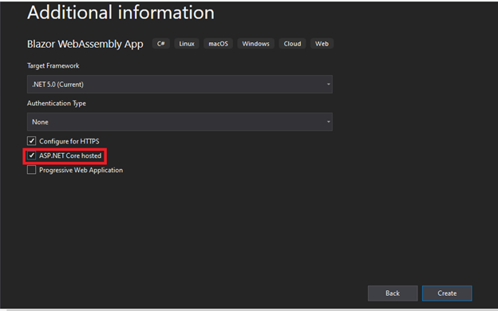
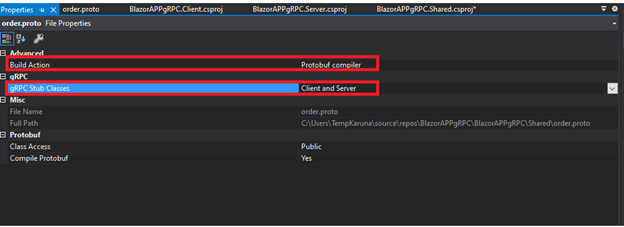
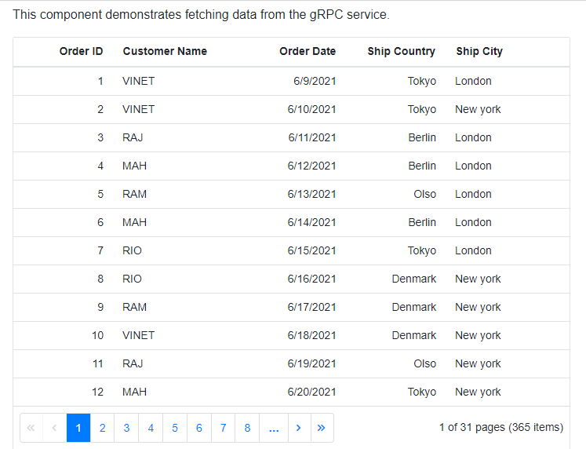
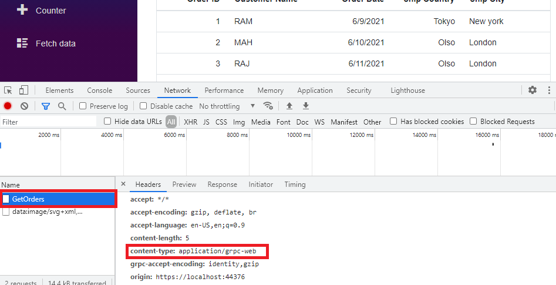

# Bind Data to the Syncfusion Blazor Components Using gRPC Service

## Introduction

This section describes how to consume data from a [gRPC](https://grpc.io/) service and bind it to Syncfusion&reg; Blazor components. The approach leverages gRPC for efficient communication between the client and server in Blazor applications, enabling high-performance data transfer compared to traditional REST services.

**What is gRPC?**

**gRPC** (gRPC Remote Procedure Call) is an open-source framework developed by Google for high-performance communication between distributed systems. It uses **HTTP/2** for transport and Protocol Buffers for message serialization, making it faster and more efficient than JSON-based REST APIs. **gRPC** allows client applications to invoke server methods as if they were local, supports multiple programming languages, and provides features such as streaming and strong typing.

## Prerequisite software

The following software must be installed before configuring gRPC with Syncfusion&reg; Blazor components:

* [Visual Studio 2022 or later](https://visualstudio.microsoft.com/downloads/)
* [.NET 8 or later](https://dotnet.microsoft.com/en-us/download/dotnet)

## Creating Blazor webassembly application

Create a **Blazor WebAssembly App** with **ASP.NET Core Hosted** using **Visual Studio**. This configuration enables the client-side Blazor application to communicate with the server through gRPC services.

To create the application:

* Open **Visual Studio** and select **Blazor WebAssembly Standalone App** from the project templates.
* Enable the **ASP.NET Core Hosted** option during project creation.

N> The **ASP.NET Core Hosted** option is required because gRPC services run on the server and must be accessible to the client application.

## Adding gRPC dependencies

Install the required NuGet packages in the **Shared**, **Server**, and **Client** projects to enable gRPC communication.

* **Shared Project**

    * [Google.Protobuf](https://www.nuget.org/packages/Google.Protobuf) – Provides Protocol Buffers serialization.
    * [Grpc.Net.Client](https://www.nuget.org/packages/Grpc.Net.Client/) – Enables gRPC client functionality.
    * [Grpc.Tools](https://www.nuget.org/packages/Grpc.Tools/) – Generates strongly typed classes from .proto files.

* **Server Project**

    * [Grpc.AspNetCore](https://www.nuget.org/packages/Grpc.AspNetCore/) – Adds gRPC server support.
    * [Grpc.AspNetCore.Web](https://www.nuget.org/packages/Grpc.AspNetCore.Web/) – Enables gRPC-Web for browser-based clients.

* **Client Project**

    * [Grpc.Net.Client.Web](https://www.nuget.org/packages/Grpc.Net.Client.Web/) – Provides gRPC-Web client support.

**Options to Install**

* Using **NuGet Package Manager** in Visual Studio

  * Navigate to: Tools → NuGet Package Manager → Manage NuGet Packages for Solution

    Select the appropriate project and install the packages listed above.

* Using **Package Manager Console**

    
    

    Install-Package Google.Protobuf -ProjectName Shared
    Install-Package Grpc.Net.Client -ProjectName Shared
    Install-Package Grpc.Tools -ProjectName Shared
    Install-Package Grpc.AspNetCore -ProjectName Server
    Install-Package Grpc.AspNetCore.Web -ProjectName Server
    Install-Package Grpc.Net.Client.Web -ProjectName Client

    
    

## Add proto file and service

Proto files are written in the Protocol Buffers language and define the structure of messages and services for gRPC. For detailed syntax and examples, refer to the [Protocol Buffers guide](https://developers.google.com/protocol-buffers/docs/proto3#simple).

1. **Add the .proto File**

    Create a Protocol Buffers file to define the **gRPC service** and **message structure**.

    **Steps**:

    1. In the **Shared** project, right-click and select **Add → New Item**.
    2. Add a new file named **order.proto**.
    3. Replace the default content with the following:

        
        
        syntax = "proto3";

        import "google/protobuf/empty.proto";
        import "google/protobuf/timestamp.proto";

        option csharp_namespace = "BlazorAPPgRPC.Shared";
        package Orders;

        service OrdersService {
        rpc GetOrders (google.protobuf.Empty) returns (OrdersResponse);
        }

        message OrdersResponse {
        repeated Orders orders = 1;
        }

        message Orders {
        google.protobuf.Timestamp dateTimeStamp = 1;
        int32 OrderID = 2;
        string CustomerName = 3;
        string ShipCountry = 4;
        string ShipCity = 5;
        }
        
        

    **Configure Build Action**:

    * Set **Build Action** to **Protobuf Compiler**.
    * Select **Client** and **Server** for gRPC Stub Classes.

    

2. **Add Partial Class for Orders**

    Extend the generated **Orders** class in the **Shared** project with an additional property for easier date handling:

    
    
    using Google.Protobuf.WellKnownTypes;
    using System;

    namespace BlazorAPPgRPC.Shared
    {
        public partial class Orders
        {
            public DateTime OrderDate
            {
                get => DateTimeStamp.ToDateTime();
                set => DateTimeStamp = Timestamp.FromDateTime(value.ToUniversalTime());
            }
        }
    }

    
    

3. **Implement the gRPC Service**

    Create a **Services** folder in the **Server** project and add **OrdersService.cs** to implement the gRPC service logic:

    
    
    using BlazorAPPgRPC.Shared;
    using Google.Protobuf.WellKnownTypes;
    using Grpc.Core;

    public class OrdersService : OrdersServiceBase
    {
        private static readonly string[] Countries = { "Berlin", "Tokyo", "Denmark", "Oslo" };
        private static readonly string[] Names = { "VINET", "RIO", "RAJ", "MAH", "RAM" };
        private static readonly string[] Cities = { "New York", "London", "Hue" };

        public override Task<OrdersResponse> GetOrders(Empty request, ServerCallContext context)
        {
            var response = new OrdersResponse();
            response.Orders.AddRange(GetOrders());
            return Task.FromResult(response);
        }

        private IEnumerable<Orders> GetOrders()
        {
            var rng = new Random();
            return Enumerable.Range(1, 365).Select(index => new Orders
            {
                OrderID = index,
                OrderDate = DateTime.Now.AddDays(index),
                ShipCountry = Countries[rng.Next(Countries.Length)],
                CustomerName = Names[rng.Next(Names.Length)],
                ShipCity = Cities[rng.Next(Cities.Length)]
            });
        }
    }

    
    

    N> The **OrdersService** class inherits from **OrdersServiceBase**, which is generated from the **.proto** file.

## Configure gRPC and gRPC-Web

To enable communication between the Blazor WebAssembly client and the server using gRPC-Web, configure both the **Server** and **Client** projects.

1. **Server Configuration**

* **Register gRPC Services**

    Add the gRPC service and required dependencies in the **ConfigureServices** method of **Startup.cs**:

    
    
    public void ConfigureServices(IServiceCollection services)
    {
        services.AddScoped<OrdersService>();
        services.AddGrpc();
        // Other service registrations
    }
    
    

* **Enable gRPC-Web Middleware**

    Add the gRPC-Web middleware in the **Configure** method. This must be placed **after UseRouting** and **before UseEndpoints**:

    
    public void Configure(IApplicationBuilder app, IWebHostEnvironment env)
    {
        app.UseRouting();
        app.UseGrpcWeb(new GrpcWebOptions { DefaultEnabled = true });
        app.UseEndpoints(endpoints =>
        {
            endpoints.MapGrpcService<OrdersService>();
            // Other endpoints
        });
    }
    

2. **Client Configuration**

    In the **Client** project, create a gRPC-Web channel and register the gRPC client in **Program.cs**:`

    
    
    using Grpc.Net.Client;
    using Grpc.Net.Client.Web;
    using Microsoft.AspNetCore.Components;

    public static async Task Main(string[] args)
    {
        var builder = WebAssemblyHostBuilder.CreateDefault(args);

        builder.Services.AddSingleton(services =>
        {
            var httpClient = new HttpClient(new GrpcWebHandler(GrpcWebMode.GrpcWeb, new HttpClientHandler()));
            var backendUrl = services.GetRequiredService<NavigationManager>().BaseUri;
            var channel = GrpcChannel.ForAddress(backendUrl, new GrpcChannelOptions { HttpClient = httpClient });
            return new OrdersService.OrdersServiceClient(channel);
        });

        await builder.Build().RunAsync();
    }
    
    

    N> The **OrdersService.OrdersServiceClient** class is generated automatically from the **.proto** file.

## Add Syncfusion&reg; Blazor DataGrid

The Syncfusion&reg; Blazor [DataGrid](https://blazor.syncfusion.com/documentation/datagrid/getting-started) component will be used to display data retrieved from the gRPC service.

1. **Install Syncfusion NuGet Package**

    Install the required NuGet package in the Client project:

    * [Syncfusion.Blazor.Grid](https://www.nuget.org/packages/Syncfusion.Blazor.Grid/)
    * [Syncfusion.Blazor.Themes](https://www.nuget.org/packages/Syncfusion.Blazor.Themes/)

    **Options to install**:

    * **Using NuGet Package Manager**

        Navigate to: **Tools → NuGet Package Manager → Manage NuGet Packages for Solution**

        Select the Client project and install above packages.

    * **Using Package Manager Console**

        
        

        Install-Package Syncfusion.Blazor.Grid -ProjectName Client

        
        

2. **Register Syncfusion Services**

    Add the required namespaces in **_Imports.razor**:

    

    @using Syncfusion.Blazor
    @using Syncfusion.Blazor.Grids

    

    Register Syncfusion&reg; services in **Program.cs**:

    
    
    using Syncfusion.Blazor;

    namespace BlazorAPPgRPC.Client
    {
        public class Program
        {
            public static async Task Main(string[] args)
            {
                var builder = WebAssemblyHostBuilder.CreateDefault(args);
                builder.RootComponents.Add<App>("#app");
                builder.Services.AddSyncfusionBlazor();
                await builder.Build().RunAsync();
            }
        }
    }

    
    

3. **Apply Theme stylesheet**

    Include the Syncfusion theme in the **&lt;head&gt;** section of **wwwroot/index.html**:

    

    <link href="_content/Syncfusion.Blazor.Themes/bootstrap5.css" rel="stylesheet" />

    

    Add this stylesheet in the following locations based on the project type:

    * **Blazor Web App**: **~/Components/App.razor**
    * **Blazor WebAssembly**: **wwwroot/index.html**
    * **Blazor Server**: **~/Pages/_Host.cshtml**

4. **Add Script Reference**

    Include the Syncfusion script at the end of the **&lt;body&gt;**:

    

    

    

5. **Add DataGrid Component**

    Insert the [DataGrid](https://help.syncfusion.com/cr/blazor/Syncfusion.Blazor.Grids.SfGrid-1.html) component in **Index.razor**:

    
    
    <SfGrid>

    </SfGrid>
    
    

## Bind data to Blazor DataGrid component

To display data from the gRPC service in the Syncfusion&reg; Blazor DataGrid:

1. **Inject the gRPC Client**

    Add the **OrdersServiceClient** to the **Razor** page:

    
    

    @inject OrdersService.OrdersServiceClient OrdersServiceClient
    @using BlazorAPPgRPC.Shared
    @using Google.Protobuf.WellKnownTypes

    
    

2. **Define the Grid Layout**

    Configure the `DataGrid` with [GridColumn](https://help.syncfusion.com/cr/blazor/Syncfusion.Blazor.Grids.GridColumn.html) mapped to the Orders model:

    
    
    <h1>Orders</h1>
    
This component demonstrates fetching data from the gRPC service.

    @if (orders == null)
    {
        
<em>Loading...</em>

    }
    else
    {
        <SfGrid DataSource="@orders" AllowPaging="true">
            <GridColumns>
                <GridColumn Field=@nameof(Orders.OrderID) HeaderText="Order ID" TextAlign="TextAlign.Right" Width="120"></GridColumn>
                <GridColumn Field=@nameof(Orders.CustomerName) HeaderText="Customer Name" Width="150"></GridColumn>
                <GridColumn Field=@nameof(Orders.OrderDate) HeaderText="Order Date" Format="d" Type="ColumnType.Date" TextAlign="TextAlign.Right" Width="130"></GridColumn>
                <GridColumn Field=@nameof(Orders.ShipCountry) HeaderText="Ship Country" TextAlign="TextAlign.Right" Width="120"></GridColumn>
                <GridColumn Field=@nameof(Orders.ShipCity) HeaderText="Ship City" Width="150"></GridColumn>
            </GridColumns>
        </SfGrid>
    }

    @code {
        private IList<Orders> orders;

        protected override async Task OnInitializedAsync()
        {
            orders = (await OrdersServiceClient.GetOrdersAsync(new Empty())).Orders;
        }
    }
    
    

    

3. **Verify gRPC Communication**

    After running the application, open the **Network tab** in browser developer tools. Reload the page and check the **GetOrders** request. The response headers should include **content-type: application/grpc-web**, confirming gRPC-Web is used.

    

## Performance Comparison: gRPC vs REST

The **Index.razor** page renders a `DataGrid` using a **gRPC service**, while the **FetchData.razor** page uses a **REST API**. Network performance for both approaches can be evaluated by analyzing **payload size** and **response time**.

* **REST Service**

    * **Payload Size**: 616 B
    * **Traffic Time**: 244 ms

* **gRPC Service**

    * **Payload Size**: 14.4 KB
    * **Traffic Time**: 15 ms

N> **Observation**: gRPC demonstrates significantly lower latency compared to REST, making it suitable for high-performance scenarios in Blazor applications.