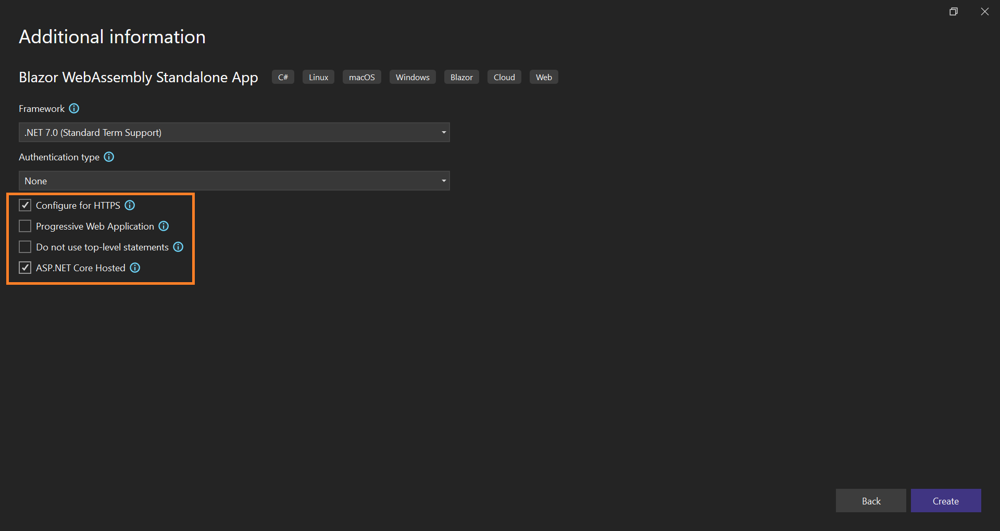

# Bind Data to the Syncfusion Blazor Components Using gRPC Service

In this topic, you can learn how to consume data from [gRPC](https://grpc.io/) service and bind it to a Syncfusion Blazor Component.

## Prerequisite software

The following software are needed,

* Visual Studio 2022 or later.
* .NET 6.0 or later.

## Creating Blazor server-side application

Open Visual Studio 2022 and follow the steps in the below documentation to **create the Blazor WebAssembly(Hosted) Application**.

[Create Blazor WebAssembly Application](https://blazor.syncfusion.com/documentation/getting-started/blazor-webassembly-visual-studio)

Finally, ensure to select the **ASP.NET Core Hosted** application.



## Adding gRPC dependencies

You need to install the following dependencies on your **Client**, **Server**, and **Shared** projects.

Starting with the **Shared project**, **Right-click** the project and go to **Manage NuGet packages**. Browse for and install the following packages in the **Shared** project:

* [Google.Protobuf](https://www.nuget.org/packages/Google.Protobuf)
* [Grpc.Net.Client](https://www.nuget.org/packages/Grpc.Net.Client/)
* [Grpc.Tools](https://www.nuget.org/packages/Grpc.Tools/)

Next, follow the same process and go to your **Server** project to install these packages:

* [Grpc.AspNetCore](https://www.nuget.org/packages/Grpc.AspNetCore/)
* [Grpc.AspNetCore.Web](https://www.nuget.org/packages/Grpc.AspNetCore.Web/)

Then, go to your **Client** project and install the following package:

* [Grpc.Net.Client.Web](https://www.nuget.org/packages/Grpc.Net.Client.Web/)

## Add proto file and service to the project

gRPC works with Proto files which are written in protocol buffer language that define your messaging. To learn more about the language, visit this [guide](https://developers.google.com/protocol-buffers/docs/proto3#simple).

To add a proto file, **Right-click** the **Shared** project, go to **Add**, and then select **New item**. You can choose a Class file and name it as `order.proto` and select **Add**.

Remove the boiler plate code in the file. Copy the following code and paste it into your proto file.

```c#

syntax = "proto3";

import "google/protobuf/empty.proto";
import "google/protobuf/timestamp.proto";

option csharp_namespace = "BlazorAPPgRPC.Shared";

package Orders;

service OrdersService {
  rpc GetOrders (google.protobuf.Empty) returns (OrdersResponse);
}

message OrdersResponse {
  repeated Orders = 1;
}

message Orders {
  google.protobuf.Timestamp dateTimeStamp = 1;
  int32 OrderID = 2;
  string CustomerName = 3;
  string ShipCountry = 4;
  string ShipCity = 5;
}
```

Go to the proto file `properties` and select the `Protobuf` compiler as the **Build Action**. Then, select the `Client and Server option` as the `gRPC Stub Classes`. Refer to the following screenshot.


## Adding Orders Service

Now, add `Orders` partial class in the **Shared** project. The main properties of this class are generated from the `.proto` file. However, you can also add some extra useful properties to this partial class.

```c#
using Google.Protobuf.WellKnownTypes;
using System;

namespace BlazorAPPgRPC.Shared
{
    public partial class Orders
    {
        public DateTime OrderDate
        {
            get => DateTimeStamp.ToDateTime();
            set { DateTimeStamp = Timestamp.FromDateTime(value.ToUniversalTime()); }
        }
    }
}
```

Create **Services folder** in the **Server** project and add **OrdersService** file in that folder. Then, copy the following code and paste it into your service file or create your own service logic.

```c#
public class OrdersService : BlazorAPPgRPC.Shared.OrdersService.OrdersServiceBase
{
    private static readonly string[] Countries = new[]
    {
        "Berlin", "Tokyo", "Denmark", "Tokyo", "Olso"
    };
    private static readonly string[] Names = new[]
    {
        "VINET", "RIO", "RAJ", "MAH", "RAM"
    };
    private static readonly string[] Cities = new[]
    {
            "New York", "London", "Hue"
    };
    public override Task<OrdersResponse> GetOrders(Empty request, ServerCallContext context)
    {
        var response = new OrdersResponse();

        response.Orders.AddRange(GetOrders());

        return Task.FromResult<OrdersResponse>(response);
    }
    public IEnumerable<Orders> GetOrders()
    {
        var rng = new Random();
        return Enumerable.Range(1, 365).Select(index => new Orders
        {
            OrderID = index,
            OrderDate = DateTime.Now.AddDays(index),
            ShipCountry = Countries[rng.Next(Countries.Length)],
            CustomerName = Names[rng.Next(Names.Length)],
            ShipCity = Cities[rng.Next(Cities.Length)]
        });
    }
}
```

N> The **OrdersService** class is inherited from **BlazorAPPgRPC.Shared.OrdersService.OrdersServiceBase**, which is generated automatically from the `.proto` file.

## Configure gRPC and gRPC-Web in the server

You need to register the **gRPC service** in your `Startup.cs` file. This enables you to use dependency injection to consume the service across the app. Add the following code to your `ConfigureServices` method in the **Server Startup.cs** file:

```c#
public void ConfigureServices(IServiceCollection services)
{
    services.AddScoped<OrdersService>();
    services.AddGrpc();
    . . .
}
```

Then, add the gRPC-Web middleware to the apps configuration and register the gRPC service. This must be added after UseRouting and before UseEndpoints in the `Configure` method.

```c#
public void Configure(IApplicationBuilder app, IWebHostEnvironment env)
{
    . . .
    app.UseRouting();
    app.UseGrpcWeb(new GrpcWebOptions { DefaultEnabled = true });
    app.UseEndpoints(endpoints =>
    {
        endpoints.MapGrpcService<OrdersService>();
        .  . .
    });
}
```

In the **Client** project, add the **OrdersService** to the container, then create a gRPC-Web channel pointing to the back-end server and instantiate the gRPC clients for this channel. Refer to the following code to modify the `Program.cs` file.

```c#
using Grpc.Net.Client;
using Grpc.Net.Client.Web;
using Microsoft.AspNetCore.Components;
. . .
public static async Task Main(string[] args)
{
    var builder = WebAssemblyHostBuilder.CreateDefault(args);
    . . .
    builder.Services.AddSingleton(services =>
    {
        var httpClient = new HttpClient(new GrpcWebHandler(GrpcWebMode.GrpcWeb, new HttpClientHandler()));
        var backendUrl = services.GetRequiredService<NavigationManager>().BaseUri;
        var channel = GrpcChannel.ForAddress(backendUrl, new GrpcChannelOptions { HttpClient = httpClient });

        return new OrdersService.OrdersServiceClient(channel);
    });
}
```

N> The **OrdersService.OrdersServiceClient** class is also generated automatically from the `.proto` file.

## Add Syncfusion Blazor DataGrid package

We are going to explain this data (gRPC service data) binding process using the Syncfusion DataGrid component. So, we are going to install the packages required to use the Syncfusion Blazor components. Now, right-click **Dependencies** in the project and select **Manage NuGet Packages**.


In the **Browse** tab, search and install the `Syncfusion.Blazor.Grid` NuGet package.


N> For this demo, `Syncfusion.Blazor`(19.1.0.66) NuGet package is used. A new `Syncfusion.Blazor` NuGet package with new enhancement will be released in our every-week release and main release. So, you can check and update to the [latest versions](https://www.nuget.org/packages/Syncfusion.Blazor).

## Adding Syncfusion Blazor DataGrid component

Open `_Import.razor` file and add the following namespaces which are required to use Syncfusion Blazor DataGrid Component in this application.

```cshtml
@using Syncfusion.Blazor
@using Syncfusion.Blazor.Grids
```

Open `Program.cs` file in a **Client** project and **register** the `Syncfusion service` in the **ConfigureServices** method as follows.

```c#
using Syncfusion.Blazor;

namespace BlazorAPPgRPC.Client
{
    public class Program
    {
        public static async Task Main(string[] args)
        {
            var builder = WebAssemblyHostBuilder.CreateDefault(args);
            builder.RootComponents.Add<App>("#app");
            builder.Services.AddSyncfusionBlazor();
            . . .
        }
    }
}
```

In this demo application, the **Bootstrap4** theme will be used. To add the theme, open `~/wwwroot/index.html` file and add the following CSS reference code.

```html
<link href="_content/Syncfusion.Blazor.Themes/ bootstrap4.css" rel="stylesheet" />
```

In previous steps, we have successfully configured the Syncfusion Blazor package in the application. Now, we can add the DataGrid Component to the `Index.razor`.

```cshtml
<SfGrid>

</SfGrid>
```

## Bind data to Blazor DataGrid component

To consume data from the gRPC service, inject the **OrdersServiceClient** into the razor page and assign it to the DataGrid’s `DataSource` property.

Here,  the `DataSource` property of the DataGrid component is used to bind the data to DataGrid in the WebAssembly application.

Grid columns can be defined using the [GridColumn](https://blazor.syncfusion.com/documentation/datagrid/columns/) component. Columns are created using the following code, let’s see the properties used and their usage.

* `Field` property specifies the column name of the **Orders** table to display in the grid column.
* The `Width` property specifies the column width.
* `Format` property helps to format number, currencies, and date in a particular culture. Here, the **OrderDate** column has been formatted.
* `HeaderText` property specifies the column header name.

```cshtml
@inject OrdersService.OrdersServiceClient OrdersServiceClient
@using BlazorAPPgRPC.Shared
@using Google.Protobuf.WellKnownTypes

<h1>Orders</h1>

<p>This component demonstrates fetching data from the gRPC service.</p>

@if (orders == null)
{
    <p><em>Loading...</em></p>
}
else
{
    <SfGrid DataSource="@orders" AllowPaging="true">
        <GridColumns>
            <GridColumn Field=@nameof(Orders.OrderID) HeaderText="Order ID" TextAlign="TextAlign.Right" Width="120"></GridColumn>
            <GridColumn Field=@nameof(Orders.CustomerName) HeaderText="Customer Name" Width="150"></GridColumn>
            <GridColumn Field=@nameof(Orders.OrderDate) HeaderText=" Order Date" Format="d" Type="ColumnType.Date" TextAlign="TextAlign.Right" Width="130"></GridColumn>
            <GridColumn Field=@nameof(Orders.ShipCountry) HeaderText="Ship Country" TextAlign="TextAlign.Right" Width="120"></GridColumn>
            <GridColumn Field=@nameof(Orders.ShipCity) HeaderText="Ship City" Width="150"></GridColumn>
        </GridColumns>
    </SfGrid>
}

@code {

    private IList<Orders> orders;

    protected override async Task OnInitializedAsync()
    {
        orders = (await OrdersServiceClient.GetOrdersAsync(new Empty())).Orders;
    }
}
```

Now, the DataGrid will look like this while running the application. The displayed records are fetched from the gRPC service.


After rendering the Grid with data, you can verify that we are using the gRPC-Web service by using the following way. Open **Network** Tab and reload the index page.

The **Orders** data will be loaded, and you will see the name of the method **GetOrders**. Click on the **GetOrders** name to view the Response Headers which show the **content-type** being **application/grpc-web**.


In the ``Index.razor`` page, **Grid with gRPC service** has been rendered, and in the `FetchData.razor` page, **Grid with normal REST service** has been rendered.

You can see both page **payload size** and **traffic time** in the following screenshot. In the screenshot above, you can see that the **REST service** has sent **616 B**, but the **gRPC service** has sent only **14.4 kB** Also **traffic time** for **REST** is **244ms** and the traffic time for **gRPC** is **15ms** only.

