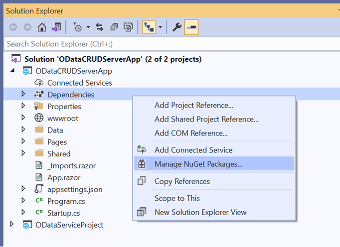
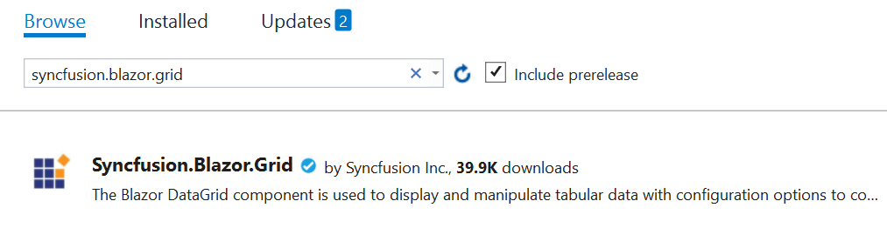

# Bind Data from RESTful Web Services to Syncfusion Blazor Components

In this topic, you can learn how to retrieve data from RESTful web services, bind data to a Grid component, and perform CRUD operations. Here, data is fetched from the ODataV4 service using [ODataV4Adaptor](https://blazor.syncfusion.com/documentation/data/adaptors#odatav4-adaptor) of `SfDataManger`.

It is recommended to choose the suitable adaptor based on the RESTful service which you are using to bind data for the Syncfusion Blazor component. Refer to the following documentation to know about the available Adaptors of SfDataManager.
 * [Adaptors](https://blazor.syncfusion.com/documentation/data/adaptors)

## Prerequisite software

The following software are needed
* Visual Studio 2022 or later.
* .NET 6.0 or later.

## Create the database

Open Visual Studio , select **View -> SQL Server Object Explorer**. Right-click on the Databases folder to create a new Database and name it as OrdersDetails.


Right-click on the **Tables** folder of the created database and click **Add New Table**.


Use the following query to add a new table named **Orders**.

```
Create Table Orders(
 OrderID BigInt Identity(1,1) Primary Key Not Null,
 CustomerID Varchar(100) Not Null,
 Freight int Null,
 OrderDate datetime null
)
```

Now, the Orders table design will look like below. Click on the **Update** button.


Now, click on **Update Database**.


## Create OData service project

Open Visual Studio 2022 and create an empty ASP.NET Core Web Application and name it as ODataServiceProject. After creating the application, install [Microsoft.AspNetCore.OData](https://www.nuget.org/packages/Microsoft.AspNetCore.OData/) package by running the following command in the Package Manager Console.

```
Install-Package Microsoft.AspNetCore.OData -Version 8.2.3

```
This package contains everything you need to create OData v4.0 endpoints using ASP.NET Core MVC and to support OData query syntax for your web APIs.

### Generate DbContext and model class from the database

Now, you need to scaffold **DbContext** and **model classes** from the existing **OrdersDetails** database. To perform scaffolding and work with the SQL Server database in our application, install the following NuGet packages.

* [Microsoft.EntityFrameworkCore.Tools](https://www.nuget.org/packages/Microsoft.EntityFrameworkCore.Tools) : This package creates database context and model classes from the database.

* [Microsoft.EntityFrameworkCore.SqlServer](https://www.nuget.org/packages/Microsoft.EntityFrameworkCore.SqlServer/) :The database provider that allows Entity Framework Core to work with SQL Server.

Run the following commands in the **Package Manager Console**.

```
Install-Package Microsoft.EntityFrameworkCore.Tools -Version 7.0.11
```
```
Install-Package Microsoft.EntityFrameworkCore.SqlServer -Version 7.0.11

```

Once the above packages are installed, you can scaffold DbContext and Model classes. Run the following command in the **Package Manager Console**.

```
Scaffold-DbContext “Data Source=(localdb)\MSSQLLocalDB;Initial Catalog=OrdersDetails;Integrated Security=True;Connect Timeout=30;Encrypt=False;TrustServerCertificate=False;ApplicationIntent=ReadWrite;MultiSubnetFailover=False” Microsoft.EntityFrameworkCore.SqlServer -OutputDir Models
```

The above scaffolding command contains the following details for creating DbContext and model classes for the existing database and its tables.
* **Connection string**: Data Source=(localdb)\MSSQLLocalDB;Initial Catalog=OrdersDetails;Integrated Security=True;Connect Timeout=30;Encrypt=False;TrustServerCertificate=False;ApplicationIntent=ReadWrite;MultiSubnetFailover=False
* **Data provider**: Microsoft.EntityFrameworkCore.SqlServer
* **Output directory**: -OutputDir Models

After running the above command, the **OrdersDetailsContext.cs** and **Orders.cs** files will be created under the **ODataServiceProject.Models** folder as follows.


You can see that OrdersDetailsContext.cs file contains the connection string details in the **OnConfiguring** method.




using System;
using Microsoft.EntityFrameworkCore;
using Microsoft.EntityFrameworkCore.Metadata;

namespace ODataServiceProject.Models
{
    public partial class OrdersDetailsContext : DbContext
    {
        public OrdersDetailsContext()
        {
        }

        public OrdersDetailsContext(DbContextOptions<OrdersDetailsContext> options)
            : base(options)
        {
        }

        public virtual DbSet<Orders> Orders { get; set; }

        protected override void OnConfiguring(DbContextOptionsBuilder optionsBuilder)
        {
            if (!optionsBuilder.IsConfigured)
            {
                optionsBuilder.UseSqlServer("Data Source=(localdb)\\MSSQLLocalDB;Initial Catalog=OrdersDetails;Integrated Security=True;Connect Timeout=30;Encrypt=False;TrustServerCertificate=False;ApplicationIntent=ReadWrite;MultiSubnetFailover=False");
            }
        }

        ...
    }
}




It is not recommended to have a connection string with sensitive information in the OrdersDetailsContext.cs file, so the connection string is moved to the **appsettings.json** file.




{
  "Logging": {
    "LogLevel": {
      "Default": "Information",
      "Microsoft.AspNetCore": "Warning"
    }
  },
  "AllowedHosts": "*",
  "ConnectionStrings": {
    "OrdersDetailsDatabase": "Data Source=(localdb)\\MSSQLLocalDB;Initial Catalog=OrdersDetails;Integrated Security=True;Connect Timeout=30;Encrypt=False;TrustServerCertificate=False;ApplicationIntent=ReadWrite;MultiSubnetFailover=False"
  }
}




Now, the DbContext must be configured using connection string and registered as scoped service using the AddDbContext method in **Program.cs**.




builder.Services.AddDbContext<OrdersDetailsContext>(option =>
                option.UseSqlServer(builder.Configuration.GetConnectionString("OrdersDetailsDatabase")));




### Creating ODataV4 service

The application is now configured to connect with the **OrdersDetails** database using Entity Framework. Now, it’s time to consume data from the OrdersDetails database. To do so, you need an OData controller to serve data from the DbContext to the Blazor application.

To create OData controller, right-click **Controller** folder in ODataServiceProject and select **Add -> New Item -> API controller with read/write actions**. We are naming this controller as **OrdersController** as it returns Orders table records.

Now, replace the controller with the following code which contains code to handle CRUD operations in the Orders table.




using Microsoft.AspNet.OData;
using System.Threading.Tasks;
using ODataServiceProject.Models;
using Microsoft.AspNetCore.Mvc;

// For more information on enabling Web API for empty projects, visit https://go.microsoft.com/fwlink/?LinkID=397860

namespace ODataServiceProject.Controllers
{
    [Route("api/[controller]")]
    public class OrdersController : ODataController
    {
        private OrdersDetailsContext _db;
        public OrdersController(OrdersDetailsContext context)
        {
            _db = context;
        }
        [HttpGet]
        [EnableQuery]
        public IActionResult Get()
        {
            return Ok(_db.Orders);
        }
        [EnableQuery]
        public async Task<IActionResult> Post([FromBody] Orders book)
        {
            _db.Orders.Add(book);
            _db.SaveChanges();
            return Created(book);
        }
        [EnableQuery]
        public async Task<IActionResult> Patch([FromODataUri] long key, [FromBody] Delta<Orders> book)
        {
            var entity = await _db.Orders.FindAsync(key);
            book.Patch(entity);
            await _db.SaveChangesAsync();
            return Updated(entity);
        }
        [EnableQuery]
        public long Delete([FromODataUri] long key)
        {
            var deleterow = _db.Orders.Find(key);
            _db.Orders.Remove(deleterow);
            _db.SaveChanges();
            return key;
        }
    }
}




Add the following line in the **launchSettings.json** file.




{
  "iisSettings": {
    "windowsAuthentication": false,
    "anonymousAuthentication": true,
    "iisExpress": {
      "applicationUrl": "http://localhost:59323",
      "sslPort": 44392
    }
  },
  "profiles": {
    "IIS Express": {
      "commandName": "IISExpress",
      "launchBrowser": true,
      "launchUrl": "odata/orders",
      "environmentVariables": {
        "ASPNETCORE_ENVIRONMENT": "Development"
      }
    },
    "ODataServiceProject": {
      "commandName": "Project",
      "dotnetRunMessages": "true",
      "launchBrowser": true,
      "applicationUrl": "https://localhost:5001;http://localhost:5000",
      "environmentVariables": {
        "ASPNETCORE_ENVIRONMENT": "Development"
      }
    }
  }
}




Open **Program.cs** file in .NET 6 and .NET 7 application and configure by referring to the following codes.




var builder = WebApplication.CreateBuilder(args);

// Add services to the container.

static IEdmModel GetEdmModel()
{
    ODataConventionModelBuilder builder = new ODataConventionModelBuilder();
    var books = builder.EntitySet<Orders>("Orders");
    FunctionConfiguration myFirstFunction = books.EntityType.Collection.Function("MyFirstFunction");
    myFirstFunction.ReturnsCollectionFromEntitySet<Orders>("Orders");
    return builder.GetEdmModel();
}

builder.Services.AddControllers();
// Learn more about configuring Swagger/OpenAPI at https://aka.ms/aspnetcore/swashbuckle
builder.Services.AddEndpointsApiExplorer();
builder.Services.AddSwaggerGen(c =>
{
    c.SwaggerDoc("v1", new() { Title = "ODataTutorial", Version = "v1" });
});
builder.Services.AddDbContext<OrdersDetailsContext>(option =>
                option.UseSqlServer(builder.Configuration.GetConnectionString("OrdersDetailsDatabase")));
builder.Services.AddControllers().AddOData(opt => opt.AddRouteComponents("odata", GetEdmModel()).Count().Filter().OrderBy().Expand().Select().SetMaxTop(null));

var app = builder.Build();

// Configure the HTTP request pipeline.
if (app.Environment.IsDevelopment())
{
    app.UseSwagger();
    app.UseSwaggerUI();
}
app.UseHttpsRedirection();

app.UseAuthorization();

app.MapControllers();

app.Run();




## Create Blazor Server Application

Open Visual Studio 2022 and follow the steps in the below documentation to create the Blazor Server Application.

[Getting Started](https://blazor.syncfusion.com/documentation/getting-started/blazor-server-side-visual-studio)

### Add Syncfusion Blazor DataGrid package

To add Syncfusion components into the project, right-click **Dependencies** and select **Manage NuGet Packages**.



Now, in the **Browse** tab, search and install the **Syncfusion.Blazor.Grid** NuGet package.



N> For this demo, Syncfusion.Blazor(**19.1.0.66**) NuGet package is used. A new **Syncfusion.Blazor** NuGet package with new enhancement has been released in our every-week release and main release. So, you can check and update to the latest versions by using this [link](https://www.nuget.org/packages/Syncfusion.Blazor).

Open **_Import.razor** file and add the following namespaces which are required to use Syncfusion Blazor components in this application.




@using Syncfusion.Blazor
@using Syncfusion.Blazor.Grids
@using Syncfusion.Blazor.Data
@using ODataServiceProject.Models




Refer to [Register Services](https://blazor.syncfusion.com/documentation/getting-started/blazor-server-side-visual-studio#register-syncfusion-blazor-service) and add the Syncfusion service in the application.

Themes provide life to components. Syncfusion Blazor has different themes. They are:

* Bootstrap4
* Material
* Office 365
* Bootstrap
* High Contrast

In this demo application, the **Bootstrap4** theme will be used.

* For **.NET 6** app, add theme in the `<head>` of the **~/Pages/_Layout.cshtml** file.

* For **.NET 7** app, add theme in the `<head>` of the **~/Pages/_Host.cshtml** file.





<link href="_content/Syncfusion.Blazor.Themes/fabric.css" rel="stylesheet" />





<link href="_content/Syncfusion.Blazor.Themes/fabric.css" rel="stylesheet" />





## Add Syncfusion Blazor DataGrid component to an application

In previous steps, we have successfully configured the Syncfusion Blazor package in the application. Now, we can add the grid component to the **Index.razor** page.




<SfGrid TValue="Orders"></SfGrid>




## Binding data to Blazor DataGrid component using ODataV4Adaptor

To consume data from the OData Controller, you need to add the **SfDataManager** with **ODataV4Adaptor**. Refer to the following documentation for more details on ODataV4Adaptor.

[ODataV4Adaptor](https://blazor.syncfusion.com/documentation/data/adaptors#odatav4-adaptor)




<SfGrid TValue="Orders">
    <SfDataManager Url="https://localhost:44392/odata/orders" Adaptor="Adaptors.ODataV4Adaptor"></SfDataManager>
</SfGrid>




N> In the above code example, we have used our localhost address from our application. Instead of localhost, you can give the exact URL of your OData service.

Grid columns can be defined by using the [GridColumn](https://help.syncfusion.com/cr/blazor/Syncfusion.Blazor.Grids.GridColumn.html) component. We are going to create columns using the following code.




<SfGrid TValue="Orders">
    <SfDataManager Url="https://localhost:44392/odata/orders" Adaptor="Adaptors.ODataV4Adaptor"></SfDataManager>
    <GridColumns>
        <GridColumn Field=@nameof(Orders.OrderId) HeaderText="Order ID" IsPrimaryKey="true" Visible="false" TextAlign="TextAlign.Right" Width="120"></GridColumn>
        <GridColumn Field=@nameof(Orders.CustomerId) HeaderText="Customer Name" Width="150"></GridColumn>
        <GridColumn Field=@nameof(Orders.OrderDate) HeaderText=" Order Date" Format="d" Type="ColumnType.Date" TextAlign="TextAlign.Right" Width="130"></GridColumn>
        <GridColumn Field=@nameof(Orders.Freight) HeaderText="Freight" Format="C2" TextAlign="TextAlign.Right" Width="120"></GridColumn>
    </GridColumns>
</SfGrid>




When you run the application, the **Get()** method will be called in your OData controller.




[Route("api/[controller]")]
public class OrdersController : ODataController
{
    private OrdersDetailsContext _db;
    public OrdersController(OrdersDetailsContext context)
    {
        _db = context;
    }
    [HttpGet]
    [EnableQuery]
    public IActionResult Get()
    {
        return Ok(_db.Orders);
    }
    ...
}




## Handling CRUD operations with our Syncfusion Blazor DataGrid component

You can enable editing in the grid component using the [GridEditSettings](https://help.syncfusion.com/cr/blazor/Syncfusion.Blazor.Grids.GridEditSettings.html) component. Grid provides various modes of editing options such as [Inline/Normal](https://blazor.syncfusion.com/documentation/datagrid/in-line-editing), [Dialog](https://blazor.syncfusion.com/documentation/datagrid/dialog-editing), and [Batch](https://blazor.syncfusion.com/documentation/datagrid/batch-editing) editing.

Here, we are using **Inline** edit mode and used Toolbar property to show toolbar items for editing.
We have added the DataGrid Editing and Toolbar code with previous Grid model.




<SfGrid TValue="Orders" Toolbar="@(new List<string>() { "Add", "Edit", "Delete", "Cancel", "Update" })">
    <SfDataManager Url="https://localhost:44392/odata/orders" Adaptor="Adaptors.ODataV4Adaptor"></SfDataManager>
    <GridEditSettings AllowAdding="true" AllowDeleting="true" AllowEditing="true" Mode="EditMode.Normal"></GridEditSettings>
    <GridColumns>
        <GridColumn Field=@nameof(Orders.OrderId) HeaderText="Order ID" IsPrimaryKey="true" Visible="false" TextAlign="TextAlign.Right" Width="120"></GridColumn>
        <GridColumn Field=@nameof(Orders.CustomerId) HeaderText="Customer Name" Width="150"></GridColumn>
        <GridColumn Field=@nameof(Orders.OrderDate) HeaderText=" Order Date" Format="d" Type="ColumnType.Date" TextAlign="TextAlign.Right" Width="130"></GridColumn>
        <GridColumn Field=@nameof(Orders.Freight) HeaderText="Freight" Format="C2" TextAlign="TextAlign.Right" Width="120"></GridColumn>
    </GridColumns>
</SfGrid>




N> Normal editing is the default edit mode for the DataGrid component. Set the [IsPrimaryKey](https://help.syncfusion.com/cr/blazor/Syncfusion.Blazor.Grids.GridColumn.html#Syncfusion_Blazor_Grids_GridColumn_IsPrimaryKey) property of Column as **true** for a particular column, whose value is a unique value for editing purposes.

### Insert a row

To insert a new row, click the **Add** toolbar button. The new record edit form will look like below.


Clicking the **Update** toolbar button will insert the record in the Orders table by calling the below **POST** method of the OData controller.




public async Task<IActionResult> Post([FromBody] Orders book)
{
    _db.Orders.Add(book);
    _db.SaveChanges();
    return Created(book);
}





### Update a row

To edit a row, select any row and click the **Edit** toolbar button. The edit form will look like below. Edit the Customer Name column.


Clicking the **Update** toolbar button will update the record in the Orders table by calling the below **PATCH** method of the OData controller.




public async Task<IActionResult> Patch([FromODataUri] long key, [FromBody] Delta<Orders> book)
{
    var entity = await _db.Orders.FindAsync(key);
    book.Patch(entity);
    await _db.SaveChangesAsync();
    return Updated(entity);
}




The resultant grid will look like below.


### Delete a row

To delete a row, select any row and click the **Delete** toolbar button. Deleting operation will send a **DELETE** request to the OData controller with the selected record's primary key value to remove the corresponding record from the Orders table.




public long Delete([FromODataUri] long key)
{
    var deleterow = _db.Orders.Find(key);
    _db.Orders.Remove(deleterow);
    _db.SaveChanges();
    return key;
}




N> Find the sample from this [Github](https://github.com/SyncfusionExamples/binding-odata-services-and-perform-crud) location.
