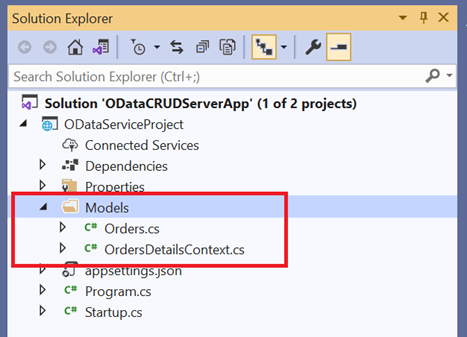

# Bind data from RESTful web services to Syncfusion® Blazor components

This article explains how to retrieve data from RESTful web services, bind it to the Blazor Grid component, and perform CRUD operations. The example demonstrates fetching data from an OData v4 service using the [ODataV4Adaptor](https://blazor.syncfusion.com/documentation/data/adaptors#odatav4-adaptor) of `SfDataManager`.

Choose the appropriate adaptor based on the RESTful service used for binding data to the Syncfusion<sup style="font-size:70%">&reg;</sup> Blazor component. Refer to the following documentation for details about the available adaptors in SfDataManager.
 * [Adaptors](https://blazor.syncfusion.com/documentation/data/adaptors)

## Prerequisite software

The following software are required:
* Visual Studio 2026 or earlier
* .NET 10.0 or earlier versions.

## Create the database

Open Visual Studio, select **View -> SQL Server Object Explorer**. Right-click the Databases folder, create a new database, and name it OrdersDetails.


Right-click the **Tables** folder in the OrdersDetails database and select **Add New Table**.


Use the following SQL query to create a table named **Orders**:

```
Create Table Orders(
 OrderID BigInt Identity(1,1) Primary Key Not Null,
 CustomerID Varchar(100) Not Null,
 Freight int Null,
 OrderDate datetime null
)
```

After executing the query, the Orders table schema will appear in the designer as shown in the snippet below.
Verify that the columns and data types are correctly defined, then click **Update** to apply the changes.


Now, select **Update Database** to confirm and create the table in the OrdersDetails database.


## Create OData service project

Follow the steps below to set up an ASP.NET Core Web API project with OData support.

* Open Visual Studio 2026 or an earlier version.
* Create a new ASP.NET Core Web API project and set the project name to ODataServiceProject.
* Open the Package Manager Console.
* Install the [Microsoft.AspNetCore.OData](https://www.nuget.org/packages/Microsoft.AspNetCore.OData/) package by running the following command.

```
Install-Package Microsoft.AspNetCore.OData

```
This package provides all the necessary components to create OData v4.0 endpoints using ASP.NET Core MVC and enables support for OData query syntax in web APIs.

### Generate DbContext and model class from the database

To integrate your application with the existing **OrdersDetails** database, you must scaffold a **DbContext** and the corresponding **model classes**. Scaffolding is a proven approach that automatically generates strongly typed classes mapped to your database tables, ensuring reliable and maintainable data access throughout your application.

Install the following NuGet packages:

* [Microsoft.EntityFrameworkCore.Tools](https://www.nuget.org/packages/Microsoft.EntityFrameworkCore.Tools) : Provides tools to generate the database context and model classes.

* [Microsoft.EntityFrameworkCore.SqlServer](https://www.nuget.org/packages/Microsoft.EntityFrameworkCore.SqlServer/) :Enables [Entity Framework Core](https://learn.microsoft.com/en-us/ef/core/) to work with SQL Server.

Run the following commands in the **Package Manager Console**.

```
Install-Package Microsoft.EntityFrameworkCore.Tools
Install-Package Microsoft.EntityFrameworkCore.SqlServer

```

Once the required packages are installed, you can scaffold the DbContext and model classes. Execute the following command in the **Package Manager Console**.

```
Scaffold-DbContext “Data Source=(localdb)\MSSQLLocalDB;Initial Catalog=OrdersDetails;Integrated Security=True;Connect Timeout=30;Encrypt=False;TrustServerCertificate=False;ApplicationIntent=ReadWrite;MultiSubnetFailover=False” Microsoft.EntityFrameworkCore.SqlServer -OutputDir Models
```

The scaffolding command includes all the necessary details to generate the DbContext and model classes for the existing database and its tables.
* **Connection string**: Data Source=(localdb)\MSSQLLocalDB;Initial Catalog=OrdersDetails;Integrated Security=True;Connect Timeout=30;Encrypt=False;TrustServerCertificate=False;ApplicationIntent=ReadWrite;MultiSubnetFailover=False
* **Data provider**: Microsoft.EntityFrameworkCore.SqlServer
* **Output directory**: -OutputDir Models

After executing the above command, the files **OrdersDetailsContext.cs** and **Orders.cs** will be generated inside the **ODataServiceProject.Models** folder, as shown below.



You can see that the OrdersDetailsContext.cs file includes the connection string configuration within the **OnConfiguring** method.




using System;
using Microsoft.EntityFrameworkCore;
using Microsoft.EntityFrameworkCore.Metadata;

namespace ODataServiceProject.Models
{
    public partial class OrdersDetailsContext : DbContext
    {
        public OrdersDetailsContext()
        {
        }

        public OrdersDetailsContext(DbContextOptions<OrdersDetailsContext> options)
            : base(options)
        {
        }

        public virtual DbSet<Orders> Orders { get; set; }

        protected override void OnConfiguring(DbContextOptionsBuilder optionsBuilder)
        {
            if (!optionsBuilder.IsConfigured)
            {
                optionsBuilder.UseSqlServer("Data Source=(localdb)\\MSSQLLocalDB;Initial Catalog=OrdersDetails;Integrated Security=True;Connect Timeout=30;Encrypt=False;TrustServerCertificate=False;ApplicationIntent=ReadWrite;MultiSubnetFailover=False");
            }
        }

        ...
    }
}




It’s generally a better practice to avoid keeping the connection string with sensitive information directly in the OrdersDetailsContext.cs file. Instead, it’s recommended to move the connection string to the **appsettings.json** file for improved security and easier configuration.




{
  "Logging": {
    "LogLevel": {
      "Default": "Information",
      "Microsoft.AspNetCore": "Warning"
    }
  },
  "AllowedHosts": "*",
  "ConnectionStrings": {
    "OrdersDetailsDatabase": "Data Source=(localdb)\\MSSQLLocalDB;Initial Catalog=OrdersDetails;Integrated Security=True;Connect Timeout=30;Encrypt=False;TrustServerCertificate=False;ApplicationIntent=ReadWrite;MultiSubnetFailover=False"
  }
}




Now, you need to set up the DbContext so that it uses the connection string from your configuration. This tells your application how to connect to the database. After that, you must register the DbContext as a service so that it can be used throughout your application whenever needed. To do this, use the **AddDbContext** method in the **Program.cs** file.




builder.Services.AddDbContext<OrdersDetailsContext>(option =>
                option.UseSqlServer(builder.Configuration.GetConnectionString("OrdersDetailsDatabase")));




### Creating ODataV4 service

The application is now set up to connect to the **OrdersDetails** database using E[Entity Framework](https://learn.microsoft.com/en-us/ef/core/). Now, we need to retrieve data from this database and make it available to the Blazor application. To achieve this, we will create an OData controller that serves data from the DbContext to the Blazor app.

To create the OData controller, right-click the **Controller** folder in the ODataServiceProject, then select **Add -> New Item -> API controller with read/write actions**. Name this controller **OrdersController**, as it will handle records from the Orders table.

After creating the controller, replace its content with the following code. This code includes all the logic required to perform CRUD operations (Create, Read, Update, Delete) on the Orders table.




using Microsoft.AspNet.OData;
using System.Threading.Tasks;
using ODataServiceProject.Models;
using Microsoft.AspNetCore.Mvc;

// For more information on enabling Web API for empty projects, visit https://go.microsoft.com/fwlink/?LinkID=397860

namespace ODataServiceProject.Controllers
{
    [Route("api/[controller]")]
    public class OrdersController : ODataController
    {
        private OrdersDetailsContext _db;
        public OrdersController(OrdersDetailsContext context)
        {
            _db = context;
        }
        [HttpGet]
        [EnableQuery]
        public IActionResult Get()
        {
            return Ok(_db.Orders);
        }
        [EnableQuery]
        public async Task<IActionResult> Post([FromBody] Orders book)
        {
            _db.Orders.Add(book);
            _db.SaveChanges();
            return Created(book);
        }
        [EnableQuery]
        public async Task<IActionResult> Patch([FromODataUri] long key, [FromBody] Delta<Orders> book)
        {
            var entity = await _db.Orders.FindAsync(key);
            book.Patch(entity);
            await _db.SaveChangesAsync();
            return Updated(entity);
        }
        [EnableQuery]
        public long Delete([FromODataUri] long key)
        {
            var deleterow = _db.Orders.Find(key);
            _db.Orders.Remove(deleterow);
            _db.SaveChanges();
            return key;
        }
    }
}




Add the following line in the **launchSettings.json** file.




{
  "iisSettings": {
    "windowsAuthentication": false,
    "anonymousAuthentication": true,
    "iisExpress": {
      "applicationUrl": "http://localhost:59323",
      "sslPort": 44392
    }
  },
  "profiles": {
    "IIS Express": {
      "commandName": "IISExpress",
      "launchBrowser": true,
      "launchUrl": "odata/orders",
      "environmentVariables": {
        "ASPNETCORE_ENVIRONMENT": "Development"
      }
    },
    "ODataServiceProject": {
      "commandName": "Project",
      "dotnetRunMessages": "true",
      "launchBrowser": true,
      "applicationUrl": "https://localhost:5001;http://localhost:5000",
      "environmentVariables": {
        "ASPNETCORE_ENVIRONMENT": "Development"
      }
    }
  }
}




Additionally, when configuring the application to work with a Blazor Web App, make sure to include the AddCors() and UseCors() methods in the **Program.cs** file of the ODataService project. These methods enable cross-origin requests, which are required for the Blazor app to communicate with the OData service.
Open the **Program.cs** file in your .NET application and configure it by referring to the following code




var builder = WebApplication.CreateBuilder(args);

// Add services to the container.

static IEdmModel GetEdmModel()
{
    ODataConventionModelBuilder builder = new ODataConventionModelBuilder();
    var books = builder.EntitySet<Orders>("Orders");
    FunctionConfiguration myFirstFunction = books.EntityType.Collection.Function("MyFirstFunction");
    myFirstFunction.ReturnsCollectionFromEntitySet<Orders>("Orders");
    return builder.GetEdmModel();
}

builder.Services.AddControllers();
// Learn more about configuring Swagger/OpenAPI at https://aka.ms/aspnetcore/swashbuckle
builder.Services.AddEndpointsApiExplorer();
builder.Services.AddSwaggerGen(c =>
{
    c.SwaggerDoc("v1", new() { Title = "ODataTutorial", Version = "v1" });
});
builder.Services.AddDbContext<OrdersDetailsContext>(option =>
                option.UseSqlServer(builder.Configuration.GetConnectionString("OrdersDetailsDatabase")));
builder.Services.AddControllers().AddOData(opt => opt.AddRouteComponents("odata", GetEdmModel()).Count().Filter().OrderBy().Expand().Select().SetMaxTop(null));
//if your configured with Blazor Web App only, call AddCors method
builder.Services.AddCors(options =>
{
    options.AddPolicy("NewPolicy", builder =>
    builder.AllowAnyOrigin()
        .AllowAnyMethod()
        .AllowAnyHeader());
});
var app = builder.Build();

//if your configured with Blazor Web App only, call UseCors method
if (app.Environment.IsDevelopment())
{
    app.UseSwagger();
    app.UseSwaggerUI();
}
app.UseHttpsRedirection();
app.UseCors("NewPolicy");
app.UseAuthorization();

app.MapControllers();

app.Run();




## Create Blazor Web App

Create a **Blazor Web App** using Visual Studio 2026 or an earlier version. You can use the official [Microsoft templates](https://learn.microsoft.com/en-us/aspnet/core/blazor/tooling) or the [Syncfusion<sup style="font-size:70%">&reg;</sup> Blazor Extension](https://blazor.syncfusion.com/documentation/visual-studio-integration/template-studio).

When creating the Blazor Web App, make sure to configure the appropriate [interactive render mode](https://learn.microsoft.com/en-us/aspnet/core/blazor/components/render-modes#render-modes) and [interactivity location](https://learn.microsoft.com/en-us/aspnet/core/blazor/tooling#interactivity-location) based on your project requirements.

## Create Blazor Server Application

You can also create a **Blazor Server App** using Visual Studio through [Microsoft templates](https://learn.microsoft.com/en-us/aspnet/core/blazor/tooling) or the [Syncfusion<sup style="font-size:70%">&reg;</sup> Blazor Extension](https://blazor.syncfusion.com/documentation/visual-studio-integration/template-studio).

## Add Syncfusion<sup style="font-size:70%">&reg;</sup> Blazor Grid and Themes NuGet in Blazor App

To use the **Blazor DataGrid** component in your application, open the NuGet Package Manager in Visual Studio (*Tools → NuGet Package Manager → Manage NuGet Packages for Solution*),Search for and install the following packages:

* [Syncfusion.Blazor.Grid](https://www.nuget.org/packages/Syncfusion.Blazor.Grid/)
* [Syncfusion.Blazor.Themes](https://www.nuget.org/packages/Syncfusion.Blazor.Themes/)

For projects using `WebAssembly` or `Auto` render modes in a Blazor Web App, make sure to install the Syncfusion<sup style="font-size:70%">&reg;</sup> Blazor NuGet packages in the client project.

Alternatively, you can use the following Package Manager Console command to install the packages




Install-Package Syncfusion.Blazor.Grid -Version {{ site.releaseversion }}
Install-Package Syncfusion.Blazor.Themes -Version {{ site.releaseversion }}




N> Syncfusion<sup style="font-size:70%">&reg;</sup> Blazor components are available in [nuget.org](https://www.nuget.org/packages?q=syncfusion.blazor). Refer to [NuGet packages](https://blazor.syncfusion.com/documentation/nuget-packages) topic for available NuGet packages list with component details.

Open **~/_Imports.razor** file and import the following namespace.



@using Syncfusion.Blazor
@using Syncfusion.Blazor.Grids



Now, register the  Syncfusion<sup style="font-size:70%">&reg;</sup> Blazor Service in the **~/Program.cs** file of the application.

For a Blazor Web App that uses `WebAssembly` or `Auto (Server and WebAssembly)` interactive render mode, the Syncfusion<sup style="font-size:70%">&reg;</sup> Blazor service must be registered in both **~/Program.cs** files of the web application.

```cshtml

....
using Syncfusion.Blazor;
....
builder.Services.AddSyncfusionBlazor();
....

```

Themes provide life to components, and Syncfusion®<sup style="font-size:70%">&reg;</sup> Blazor offers different themes:

- Bootstrap5
- Material 3
- Tailwind CSS
- High Contrast
- Fluent

In this demo application, the latest theme will be used.

* For **.NET 8, .NET 9, and .NET 10** Blazor Web Apps using any render mode (Server, WebAssembly, or Auto), refer the stylesheet inside the `<head>` of **~/Components/App.razor**.

* For **Blazor WebAssembly applications**, refer the stylesheet inside the `<head>` element of **wwwroot/index.html** file.



<link href="_content/Syncfusion.Blazor.Themes/bootstrap5.css" rel="stylesheet" />



* For **Blazor Web App**, reference scripts in end of `<body>`section at `~/Components/App.razor` file.
* For **Blazor WASM App**, reference scripts in end of `<body>`section at `~/wwwroot/index.html` file.
* For **Blazor Server App**, reference scripts in end of `<body>`section at `~/Pages/_Layout.cshtml` file for `.NET 6` project and in `~/Pages/_Host.cshtml` file for `.NET 7` project.

```html
<body>
    ....
    <script src="_content/Syncfusion.Blazor.Core/scripts/syncfusion-blazor.min.js" type="text/javascript"></script>
</body>
```

## Add Syncfusion<sup style="font-size:70%">&reg;</sup> Blazor DataGrid component to an application

In the previous steps, the Syncfusion<sup style="font-size:70%">&reg;</sup> Blazor package has been successfully configured in the application. The next step is to add the grid component to a `.razor` page located inside the `Pages` folder.

If the interactivity location is set to `Per page/component` in the web app, ensure that you define a render mode at the top of the Syncfusion<sup style="font-size:70%">&reg;</sup> Blazor component-included razor page as follows:




@* Your App render mode define here *@
@rendermode InteractiveAuto







<SfGrid TValue="Orders"></SfGrid>




## Binding data to Blazor DataGrid component using ODataV4Adaptor

To retrieve data from the OData controller, configure the **SfDataManager** component with the **ODataV4Adaptor**. For more details about ODataV4Adaptor and its configuration options, refer to the following documentation.

[ODataV4Adaptor](https://blazor.syncfusion.com/documentation/data/adaptors#odatav4-adaptor)




<SfGrid TValue="Orders">
    <SfDataManager Url="https://localhost:44392/odata/orders" Adaptor="Adaptors.ODataV4Adaptor"></SfDataManager>
</SfGrid>




N> In the example above, a localhost URL is used. Replace it with the actual URL of your OData service.

Grid columns can be defined using the [GridColumn](https://help.syncfusion.com/cr/blazor/Syncfusion.Blazor.Grids.GridColumn.html) component. The following code demonstrates how to create columns for the grid.




<SfGrid TValue="Orders">
    <SfDataManager Url="https://localhost:44392/odata/orders" Adaptor="Adaptors.ODataV4Adaptor"></SfDataManager>
    <GridColumns>
        <GridColumn Field=@nameof(Orders.OrderId) HeaderText="Order ID" IsPrimaryKey="true" Visible="false" TextAlign="TextAlign.Right" Width="120"></GridColumn>
        <GridColumn Field=@nameof(Orders.CustomerId) HeaderText="Customer Name" Width="150"></GridColumn>
        <GridColumn Field=@nameof(Orders.OrderDate) HeaderText=" Order Date" Format="d" Type="ColumnType.Date" TextAlign="TextAlign.Right" Width="130"></GridColumn>
        <GridColumn Field=@nameof(Orders.Freight) HeaderText="Freight" Format="C2" TextAlign="TextAlign.Right" Width="120"></GridColumn>
    </GridColumns>
</SfGrid>

@code {
    public class Order
    {
        public long OrderId { get; set; }

        public string CustomerId { get; set; } = null!;

        public int? Freight { get; set; }

        public DateTime? OrderDate { get; set; }
    }
}




When the application runs, the **Get()** method in the OData controller is automatically invoked to retrieve data from the database.




[Route("api/[controller]")]
public class OrdersController : ODataController
{
    private OrdersDetailsContext _db;
    public OrdersController(OrdersDetailsContext context)
    {
        _db = context;
    }
    [HttpGet]
    [EnableQuery]
    public IActionResult Get()
    {
        return Ok(_db.Orders);
    }
    ...
}




## Handling CRUD operations with our Syncfusion<sup style="font-size:70%">&reg;</sup> Blazor DataGrid component

Editing can be enabled in the DataGrid component by using [GridEditSettings](https://help.syncfusion.com/cr/blazor/Syncfusion.Blazor.Grids.GridEditSettings.html). The grid supports multiple editing modes, including [Inline/Normal](https://blazor.syncfusion.com/documentation/datagrid/in-line-editing), [Dialog](https://blazor.syncfusion.com/documentation/datagrid/dialog-editing), and [Batch](https://blazor.syncfusion.com/documentation/datagrid/batch-editing).

In this example, the Inline edit mode is used along with the Toolbar to display editing actions. The DataGrid editing configuration and toolbar code have been added to the existing grid model.




<SfGrid TValue="Orders" Toolbar="@(new List<string>() { "Add", "Edit", "Delete", "Cancel", "Update" })">
    <SfDataManager Url="https://localhost:44392/odata/orders" Adaptor="Adaptors.ODataV4Adaptor"></SfDataManager>
    <GridEditSettings AllowAdding="true" AllowDeleting="true" AllowEditing="true" Mode="EditMode.Normal"></GridEditSettings>
    <GridColumns>
        <GridColumn Field=@nameof(Orders.OrderId) HeaderText="Order ID" IsPrimaryKey="true" Visible="false" TextAlign="TextAlign.Right" Width="120"></GridColumn>
        <GridColumn Field=@nameof(Orders.CustomerId) HeaderText="Customer Name" Width="150"></GridColumn>
        <GridColumn Field=@nameof(Orders.OrderDate) HeaderText=" Order Date" Format="d" Type="ColumnType.Date" TextAlign="TextAlign.Right" Width="130"></GridColumn>
        <GridColumn Field=@nameof(Orders.Freight) HeaderText="Freight" Format="C2" TextAlign="TextAlign.Right" Width="120"></GridColumn>
    </GridColumns>
</SfGrid>

@code {
    public class Order
    {
        public long OrderId { get; set; }

        public string CustomerId { get; set; } = null!;

        public int? Freight { get; set; }

        public DateTime? OrderDate { get; set; }
    }
}




N> Normal editing is the default edit mode for the DataGrid component. To perform CRUD operations, ensure that the [IsPrimaryKey](https://help.syncfusion.com/cr/blazor/Syncfusion.Blazor.Grids.GridColumn.html#Syncfusion_Blazor_Grids_GridColumn_IsPrimaryKey) property is set to True for a specific GridColumn whose value is unique. This allows the grid to correctly identify and update records during editing.

### Insert a row

To add a new record, click the **Add** button in the toolbar. This will open the new record edit form, as shown below.


After entering the required details, click the **Update** button in the toolbar. This action will insert the record into the Orders table by calling the **POST** method in the OData controller, as shown in the following code.




public async Task<IActionResult> Post([FromBody] Orders book)
{
    _db.Orders.Add(book);
    _db.SaveChanges();
    return Created(book);
}





### Update a row

To edit an existing record, select the row and click the **Edit** button in the toolbar. The edit form will appear, as shown below. For example, the Customer Name column can be modified.


After making the changes, click the **Update** button in the toolbar. This action updates the record in the Orders table by calling the **PATCH** method in the OData controller, as shown in the following code.




public async Task<IActionResult> Patch([FromODataUri] long key, [FromBody] Delta<Orders> book)
{
    var entity = await _db.Orders.FindAsync(key);
    book.Patch(entity);
    await _db.SaveChangesAsync();
    return Updated(entity);
}




The resultant grid will look like below.


### Delete a row

To remove a record, select the desired row and click the **Delete** button in the toolbar. This action sends a **DELETE** request to the OData controller, using the primary key of the selected record to identify and remove it from the Orders table.
The following code shows the implementation of the Delete method in the OData controller.




public long Delete([FromODataUri] long key)
{
    var deleterow = _db.Orders.Find(key);
    _db.Orders.Remove(deleterow);
    _db.SaveChanges();
    return key;
}




N> Find the sample at this [GitHub repository](https://github.com/SyncfusionExamples/binding-odata-services-and-perform-crud).
