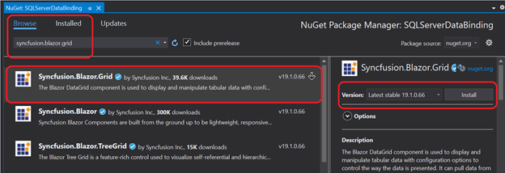

# SQL server data binding and performing CRUD operations

## Introduction

This topic gives a clear idea about how to consume data from [SQL Server](https://learn.microsoft.com/en-us/sql/sql-server/?view=sql-server-ver15) using Microsoft SQL Client, bind it to a Syncfusion Component, and perform CRUD operations.

## Prerequisite software

The following software are needed:

* Microsoft.EntityFrameworkCore.SqlServer
* Visual Studio 2022 or later
* .NET 6.0 or later.

## Create Blazor Server Application

Open Visual Studio and follow the steps in the [documentation](https://blazor.syncfusion.com/documentation/getting-started/blazor-server-side-visual-studio) to create the Blazor Server Application.

## Add Syncfusion Blazor DataGrid package

The SQL server data binding process using the Blazor DataGrid component and the method of performing the CRUD operations in it are explained as follows.

The first approach is to install the necessary packages alone. Now, right-click Dependencies in the project and select Manage NuGet Packages.

Now, in the Browse tab, search and install the Syncfusion.Blazor.Grid NuGet package.

Alternatively, you can utilize the following package manager command to achieve the same.




Install-Package Syncfusion.Blazor.Grid -Version {{ site.releaseversion }}




## Adding Syncfusion Blazor DataGrid Component into the application

Open **_Import.razor** file and add the following namespaces which are required to use Syncfusion Blazor DataGrid Component in this application.



@using Syncfusion.Blazor
@using Syncfusion.Blazor.Grids



Open **Program.cs** file in .NET 6 and .NET 7 application and register the Syncfusion service.




builder.Services.AddRazorPages();
builder.Services.AddServerSideBlazor();
builder.Services.AddSingleton<WeatherForecastService>();
builder.Services.AddSyncfusionBlazor();




Themes provide life to components. Syncfusion Blazor has different themes. They are as follows:

* Bootstrap4
* Material
* Office 365
* Bootstrap
* High Contrast

To add the theme, open the **Pages/_Host.cshtml** file and add the following CSS reference code.



<link href="_content/Syncfusion.Blazor/styles/bootstrap4.css" rel="stylesheet" />



In previous steps, Syncfusion Blazor DataGrid package is successfully configured in the application. Now, add the DataGrid Component to the **Index.razor**.



<SfGrid TValue="Order" AllowPaging="true">
</SfGrid >



## Binding SQL data to the Blazor DataGrid Component

Now, get the SQL data from the SQL server and bind it to the DataGrid component as a datasource by using the Custom adaptor feature. The Custom Adaptor can be created as a [Component](https://blazor.syncfusion.com/documentation/datagrid/custom-binding#custom-adaptor-as-component). Refer the [Grid Custom Binding](https://blazor.syncfusion.com/documentation/datagrid/custom-binding) and [Custom adaptor as component](https://blazor.syncfusion.com/documentation/datagrid/custom-binding#custom-adaptor-as-component) documentation for more details on the Custom adaptor.

Grid columns can be defined using the [GridColumn](https://blazor.syncfusion.com/documentation/datagrid/columns) component. Create columns using the following code. The properties used and their usage are discussed below.




<SfGrid @ref="Grid" TValue="Order" AllowPaging="true" >
    <SfDataManager Adaptor="Adaptors.CustomAdaptor">
        <CustomAdaptorComponent></CustomAdaptorComponent>
    </SfDataManager>
    <GridColumns>
        <GridColumn Field=@nameof(Order.OrderID) HeaderText="Order ID" IsIdentity="true" IsPrimaryKey="true" TextAlign="TextAlign.Right" Width="120">
        </GridColumn>
        <GridColumn Field=@nameof(Order.CustomerID) HeaderText="Customer Name" Width="150"></GridColumn>
    </GridColumns>
</SfGrid>
@code{
    SfGrid<Order> Grid { get; set; }
    public static List<Order> Orders { get; set; }

    public class Order
    {
        public int? OrderID { get; set; }
        public string CustomerID { get; set; }
    }
}




In the custom adaptor’s **Read** method, you can get the Grid action details like paging,filtering,sorting information, etc., using **DataManagerRequest**.

* Based on the DataManagerRequest, form a SQL query string (to perform paging) and execute the SQL query. Retrieve the data from the database using SqlDataAdapter.

* The Fill method of the DataAdapter is used to populate a DataSet with the results of the SelectCommand of the DataAdapter, then convert the DataSet into the List.

* Return the response in Result and Count pair object in Read method to bind the data to the DataGrid.



[CustomAdaptorComponent.razor]

@using Syncfusion.Blazor;
@using Syncfusion.Blazor.Data;
@using Newtonsoft.Json
@using static EFGrid.Pages.Index;
@using Microsoft.Data.SqlClient;
@using System.Data;
@using System.IO;
@using Microsoft.AspNetCore.Hosting;
@inject IHostingEnvironment _env

@inherits DataAdaptor<Order>

//Here, we are rendering the CustomAdaptorComponent as a child component for the SfDataManager
<CascadingValue Value="@this">
    @ChildContent
</CascadingValue>

@code {
[Parameter]
[JsonIgnore]
public RenderFragment ChildContent { get; set; }

public static DataSet CreateCommand(string queryString, string connectionString)
{
    using (SqlConnection connection = new SqlConnection(
               connectionString))
    {
        SqlDataAdapter adapter = new SqlDataAdapter(queryString, connection);
        DataSet dt = new DataSet();
        try
        {
            connection.Open();

// Using sqlDataAdapter, we process the query string and fill the data into the dataset

            adapter.Fill(dt);
        }
        catch (SqlException se)
        {
            Console.WriteLine(se.ToString());
        }
        finally
        {
            connection.Close();
        }
        return dt;
    }
}

// Performs data Read operation
// DataManagerRequest defines the members of the query
public override object Read(DataManagerRequest DataManagerReq, string Key = null)
{
    string AppData = _env.ContentRootPath;
    string DatabasePath = Path.Combine(AppData, "App_Data\\NORTHWND.MDF");
string ConnectionStr = $"Data Source=(LocalDB)\\MSSQLLocalDB;AttachDbFilename='{DatabasePath}';Integrated Security=True;Connect Timeout=30";

    // Here, we formed the SQL query string based on the skip and take count from the DataManagerRequest

    string QueryStr = "SELECT OrderID, CustomerID FROM dbo.Orders ORDER BY OrderID OFFSET " + DataManagerReq.Skip + " ROWS FETCH NEXT " + DataManagerReq.Take + " ROWS ONLY;";
    DataSet Data = CreateCommand(QueryStr, ConnectionStr);
    Orders = Data.Tables[0].AsEnumerable().Select(r => new Order
    {
        OrderID = r.Field<int>("OrderID"),
        CustomerID = r.Field<string>("CustomerID")
    }).ToList();  // Here, we convert dataset into list
    IEnumerable<Order> DataSource = Orders;
    SqlConnection Con = new SqlConnection(ConnectionStr);
    Con.Open();
    SqlCommand Cmd = new SqlCommand("SELECT COUNT(*) FROM dbo.Orders", Con);
    Int32 Count = (Int32)Cmd.ExecuteScalar();
    return DataManagerReq.RequiresCounts ? new DataResult() { Result = DataSource, Count = Count } : (object)DataSource;
}
}



While running the application, the grid will be displayed as follows.

## Handling CRUD operations with our Syncfusion Blazor DataGrid component

Enable editing in the grid component using the [GridEditSettings](https://help.syncfusion.com/cr/blazor/Syncfusion.Blazor.Grids.GridEditSettings.html) component. Grid provides various modes of editing options such as Inline/Normal, Dialog and Batch editing. Refer the [Grid Editing](https://blazor.syncfusion.com/documentation/datagrid/editing) documentation for reference.

Here, inline edit mode and [Toolbar](https://blazor.syncfusion.com/documentation/datagrid/tool-bar) property are used to show toolbar items for editing.



<SfGrid @ref="Grid" TValue="Order" AllowPaging="true" Toolbar="@(new List<string>() { "Add","Edit","Delete","Update","Cancel"})">
    <GridEditSettings AllowAdding="true" AllowDeleting="true" AllowEditing="true"></GridEditSettings>
</SfGrid>



N> Normal editing is the default edit mode for the DataGrid component. Also, to perform CRUD operations, set IsPrimaryKey property as True for a particular GridColumn, whose value is a unique.

The CRUD operations can be performed and customized on our own by overriding the following CRUD methods of the DataAdaptor abstract class.

* Insert/InsertAsync
* Remove/RemoveAsync
* Update/UpdateAsync
* BatchUpdate/BatchUpdateAsync

Let’s see how to perform CRUD operation using SQL server data with Syncfusion Blazor DataGrid component

### Insert Operation

To Perform the Insert operation, override the Insert/InsertAsync method of the custom adaptor and add the following code in the CustomAdaptorComponent.razor.



// Performs Insert operation
//You will get the DataManager instance in the DataManager parameter
//You will get the record in the Value parameter
public override object Insert(DataManager DataManager, object Value, string Key)
{

//Here, you can implement your own code to update the record from the grid.

    string AppData = _env.ContentRootPath;
    string DatabasePath = Path.Combine(AppData, "App_Data\\NORTHWND.MDF");
    string ConnectionStr = $"Data Source=(LocalDB)\\MSSQLLocalDB;AttachDbFilename='{DatabasePath}';Integrated Security=True;Connect Timeout=30";
    string QueryStr = $"Insert into Orders(CustomerID) values('{(Value as Order).CustomerID}')";
    SqlConnection Con = new SqlConnection(ConnectionStr);
    try
    {
        Con.Open();
        SqlCommand Cmd = new SqlCommand(QueryStr, Con);
        Cmd.ExecuteNonQuery();
    }
    catch (SqlException Exception)
    {
        Console.WriteLine(Exception.ToString());
    }
    finally
    {
        Con.Close();
    }
    return Value;
}



The resultant grid will look like below.

### Update Operation

To Perform the Update operation, override the Update/UpdateAsync method of the custom adaptor and add the following code in the CustomAdaptorComponent.razor.



// Performs Update operation
//You will get the DataManager instance in the DataManager parameter
//You will get the edited record in the Value parameter
//You will get the PrimaryKey field in the KeyField parameter
public override object Update(DataManager DataManager, object Value, string KeyField, string Key)
{
//Here, you can implement your own code to update the record from the grid.
    string AppData = _env.ContentRootPath;
    string DatabasePath = Path.Combine(AppData, "App_Data\\NORTHWND.MDF");
    string ConnectionStr = $"Data Source=(LocalDB)\\MSSQLLocalDB;AttachDbFilename='{DatabasePath}';Integrated Security=True;Connect Timeout=30";
    string QueryStr = $"Update Orders set CustomerID='{(Value as Order).CustomerID}' where OrderID={(Value as Order).OrderID}";
    SqlConnection Con = new SqlConnection(ConnectionStr);
    try
    {
        Con.Open();
        SqlCommand Cmd = new SqlCommand(QueryStr, Con);
        Cmd.ExecuteNonQuery();
    }
    catch (SqlException Exception)
    {
        Console.WriteLine(Exception.ToString());
    }
    finally
    {
        Con.Close();
    }
    return Value;
}



The resultant grid will look like below.

### Delete Operation

To Perform the Delete operation, override the Remove/RemoveAsync method of the custom adaptor and add the following code in the CustomAdaptorComponent.razor.



// Performs Remove operation
//You will get the DataManager instance in the DataManager parameter
//You will get the record in the Value parameter
//You will get the PrimaryKey field in the KeyField parameter
public override object Remove(DataManager DataManager, object Value, string KeyField, string Key)
{
//Here, you can implement your own code to delete the record from the grid.

    string AppData = _env.ContentRootPath;
    string DatabasePath = Path.Combine(AppData, "App_Data\\NORTHWND.MDF");
    string Connectionstr = $"Data Source=(LocalDB)\\MSSQLLocalDB;AttachDbFilename='{DatabasePath}';Integrated Security=True;Connect Timeout=30";
    string QueryStr = $"Delete from Orders where OrderID={Value}";
    SqlConnection Con = new SqlConnection(Connectionstr);
    try
    {
        Con.Open();
        SqlCommand Cmd = new SqlCommand(QueryStr, Con);
        Cmd.ExecuteNonQuery();
    }
    catch (SqlException Exception)
    {
        Console.WriteLine(Exception.ToString());
    }
    finally
    {
        Con.Close();
    }
    return Value;
}



The resultant grid will look like below.

N> You can find the sample in this [GitHub location](https://github.com/SyncfusionExamples/blazor-grid-sqldatabinding)
