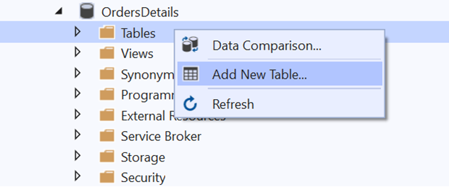
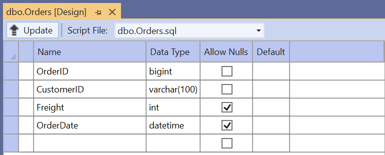
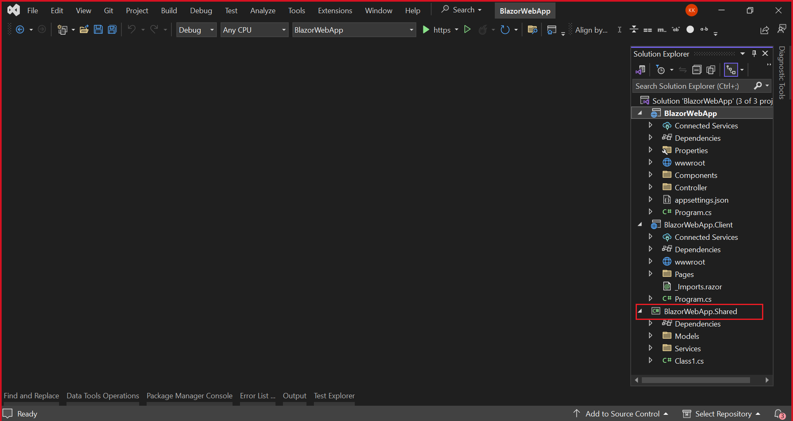
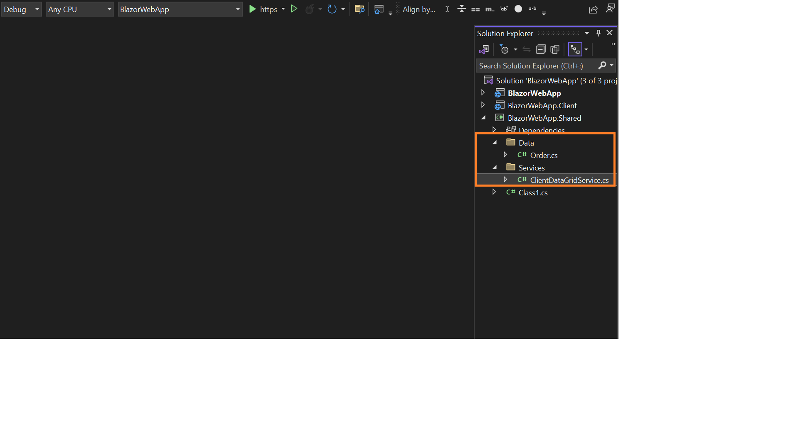
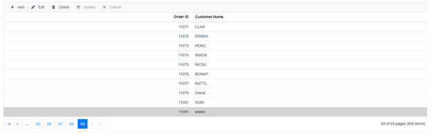
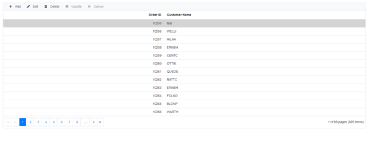
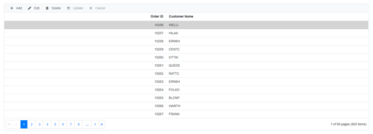

# SQL server data binding and performing CRUD operations

## Introduction

This topic gives a clear idea about how to consume data from [SQL Server](https://learn.microsoft.com/en-us/sql/sql-server/?view=sql-server-ver15) using Microsoft SQL Client, bind it to a Syncfusion<sup style="font-size:70%">&reg;</sup> Component, and perform CRUD operations.

## Prerequisite software

The following software are needed:

* Microsoft.EntityFrameworkCore.SqlServer
* Visual Studio 2022
* .NET 8.0 or later.

## Create the database

Open Visual Studio , select **View -> SQL Server Object Explorer**. Right-click on the Databases folder to create a new Database and name it as OrdersDetails.


Right-click on the **Tables** folder of the created database and click **Add New Table**.



Use the following query to add a new table named **Orders**.

```
Create Table Orders(
 OrderID BigInt Identity(1,1) Primary Key Not Null,
 CustomerID Varchar(100) Not Null,
 Freight int Null,
 OrderDate datetime null
)
```

Now, the Orders table design will look like below. Click on the **Update** button.



Now, click on **Update Database**.


## Creating Blazor Web App

Open Visual Studio and follow the steps in the [documentation](https://learn.microsoft.com/en-us/aspnet/core/blazor/tooling?view=aspnetcore-8.0&pivots=windows) to create the Blazor Web App.

You need to configure the corresponding [Interactive render mode](https://learn.microsoft.com/en-us/aspnet/core/blazor/components/render-modes?view=aspnetcore-8.0#render-modes) and [Interactivity location](https://learn.microsoft.com/en-us/aspnet/core/blazor/tooling?view=aspnetcore-8.0&pivots=windows) while creating a Blazor Web Application.

### Generate model class and API services from the database

Now, you need to add **model classes** from the existing **OrdersDetails** database. To work with the SQL Server database in our application, install the following NuGet packages.If you have created a Blazor Web App with the `Interactive render mode` set to `WebAssembly` or `Auto` ensure to follow these steps:

* Create the new project with Class Library template named as `BlazorWebApp.Shared` for model class and API services as shown below.



Additionally, ensure that you have added a reference to the `BlazorWebApp.Shared` project in both the server-side and client-side projects of your web application.

* Then, open the NuGet Package Manager and install the following packages in both the shared and server-side projects of your Blazor Web App.

   * [Microsoft.EntityFrameworkCore.Tools](https://www.nuget.org/packages/Microsoft.EntityFrameworkCore.Tools): This package creates database context and model classes from the database.
   * [Microsoft.EntityFrameworkCore.SqlServer](https://www.nuget.org/packages/Microsoft.EntityFrameworkCore.SqlServer/): The database provider that allows Entity Framework Core to work with SQL Server.

Alternatively, you can utilize the following package manager command to achieve the same.




Install-Package Microsoft.EntityFrameworkCore.Tools -Version 7.0.11

Install-Package Microsoft.EntityFrameworkCore.SqlServer -Version 7.0.11




* Once the above packages are installed, you can add the following classes in the `BlazorWebApp.Shared` project  like shown below,






public class Order
{
    public int? OrderID { get; set; }

    public string CustomerID { get; set; }

    public int? Freight { get; set; }

    public DateTime? OrderDate { get; set; }
}




public class ClientServices
{
    private readonly HttpClient _httpClient;

    public ClientServices ( HttpClient httpClient )
    {
        _httpClient = httpClient;

    }

    public async Task<List<Order>> GetOrders (int skip, int take)
    {
        var apiUrl = $"https://localhost:7223/api/DataGrid?skip={skip}&take={take}";
        var result = await _httpClient.GetFromJsonAsync<List<Order>>(apiUrl);
        return result;
    }


    public async Task<object> InsertOrder ( object value)
    {
        string apiUrl = $"https://localhost:7223/api/DataGrid/";

        await _httpClient.PostAsJsonAsync<object>(apiUrl, value);
        return value;
    }
    public async Task<object> RemoveOrder ( object value )
    {
        await _httpClient.DeleteAsync($"https://localhost:7223/api/DataGrid/{value}");
        return value;
    }

    public async Task<object> UpdateOrder ( object value)
    {

            string apiUrl = $"https://localhost:7223/api/DataGrid/";
            await _httpClient.PutAsJsonAsync<object>(apiUrl, value);
            return value;
    }
    public async Task<int> GetOrderCountAsync ()
    {
        var response = await _httpClient.GetAsync("https://localhost:7223/api/DataGrid/OrderCount");

        if (response.IsSuccessStatusCode)
        {
            // Assuming the API returns an integer value for Order count
            int OrderCount = await response.Content.ReadFromJsonAsync<int>();
            return OrderCount;
        }
        else
        {
            // Handle the error response
            // You might want to return a default value or throw an exception
            return 0;
        }

    }
}




 Here, `ClientServices` class will be responsible for interacting with the server-side API to perform operations such as retrieving data, inserting a new data, removing a data, and updating a data.

* Additionally, make sure to register the `ClientServices` class in `Program.cs` files of both server & client side project.

```
builder.Services.AddScoped<ClientServices>();
```
N> To ensure the using correct your's localhost portable number in code snippet.

* Next, ensure the `BaseUri` added in the **appsettings.json** file of server side project of your Web App.

```
{
 // your app localhost
  "BaseUri": "https://localhost:7223",
  "Logging": {
    "LogLevel": {
      "Default": "Information",
      "Microsoft.AspNetCore": "Warning"
    }
  },
  "AllowedHosts": "*"
}

```
* Add the following code snippet to configure a scoped HttpClient with a base address in **Program.cs** file in server side application.




builder.Services.AddScoped(http => new HttpClient { BaseAddress = new Uri(builder.Configuration.GetSection("BaseUri").Value!) });




* Crete the `DataGridController` in server side application for handle CRUD (Create, Read, Update, Delete) operations for the Order entity.

```cshtml
namespace BlazorWebApp.Controller
{

    [Route("api/[controller]")]
    [ApiController]
    public class DataGridController : ControllerBase
    {
        public static DataSet CreateCommand(string queryString, string connectionString)
        {
            using (SqlConnection connection = new SqlConnection(
                       connectionString))
            {
                SqlDataAdapter adapter = new SqlDataAdapter(queryString, connection);
                DataSet dt = new DataSet();
                try
                {
                    connection.Open();

                    // Using sqlDataAdapter, we process the query string and fill the data into the dataset

                    adapter.Fill(dt);
                }
                catch (SqlException se)
                {
                    Console.WriteLine(se.ToString());
                }
                finally
                {
                    connection.Close();
                }
                return dt;
            }
        }


        // GET: api/<DataGridController>
        [HttpGet]
        public async Task<ActionResult<List<Order>>> Get (int skip, int take)
        {

            string ConnectionStr = $"Data Source=(LocalDB)\\MSSQLLocalDB;AttachDbFilename=D:\\VIDEOTEAM\\BLAZOR UG\\IMPLEMENTATION\\BINDDATAUSINGSQL\\SERVERRENDERMODE\\APP_DATA\\NORTHWND.MDF;Integrated Security=True;Connect Timeout=30";

            // Here, we formed the SQL query string based on the skip and take count from the DataManagerRequest

            string QueryStr = "SELECT OrderID, CustomerID FROM dbo.Orders ORDER BY OrderID OFFSET " + skip + " ROWS FETCH NEXT " + take + " ROWS ONLY;";
            DataSet Data = CreateCommand(QueryStr, ConnectionStr);
            Orders = Data.Tables[0].AsEnumerable().Select(r => new Order
            {
                OrderID = r.Field<int>("OrderID"),
                CustomerID = r.Field<string>("CustomerID")
            }).ToList();  // Here, we convert dataset into list
            List<Order> DataSource = Orders;
            return (DataSource);
        }

        [HttpGet("OrderCount")]
        public async Task<ActionResult<int>> GetOrderCountAsync ()
        {
            string ConnectionStr = $"Data Source=(LocalDB)\\MSSQLLocalDB;AttachDbFilename=D:\\VIDEOTEAM\\BLAZOR UG\\IMPLEMENTATION\\BINDDATAUSINGSQL\\SERVERRENDERMODE\\APP_DATA\\NORTHWND.MDF;Integrated Security=True;Connect Timeout=30";

            SqlConnection Con = new SqlConnection(ConnectionStr);
            Con.Open();
            SqlCommand Cmd = new SqlCommand("SELECT COUNT(*) FROM dbo.Orders", Con);
            Int32 Count = (Int32)Cmd.ExecuteScalar();
            return Ok(Count);
        }
        // GET api/<DataGridController>/5
        [HttpGet("{id}")]
        public string Get ( int id )
        {
            return "value";
        }

        // POST api/<DataGridController>
        [HttpPost]
        public void Post([FromBody] object value)
        {
            Order order = Newtonsoft.Json.JsonConvert.DeserializeObject<Order>(value.ToString());
            string ConnectionStr = $"Data Source=(LocalDB)\\MSSQLLocalDB;AttachDbFilename=D:\\VIDEOTEAM\\BLAZOR UG\\IMPLEMENTATION\\BINDDATAUSINGSQL\\SERVERRENDERMODE\\APP_DATA\\NORTHWND.MDF;Integrated Security=True;Connect Timeout=30";
            string QueryStr = $"Insert into Orders(CustomerID) values('{order.CustomerID}')";
            SqlConnection Con = new SqlConnection(ConnectionStr);
            try
            {
                Con.Open();
                SqlCommand Cmd = new SqlCommand(QueryStr, Con);
                Cmd.ExecuteNonQuery();
            }
            catch (SqlException Exception)
            {
                Console.WriteLine(Exception.ToString());
            }
            finally
            {
                Con.Close();
            }

        }

        // PUT api/<DataGridController>/5
        [HttpPut]
        public void Put([FromBody] object value)
        {
            Order order = Newtonsoft.Json.JsonConvert.DeserializeObject<Order>(value.ToString());
            string ConnectionStr = $"Data Source=(LocalDB)\\MSSQLLocalDB;AttachDbFilename=D:\\VIDEOTEAM\\BLAZOR UG\\IMPLEMENTATION\\BINDDATAUSINGSQL\\SERVERRENDERMODE\\APP_DATA\\NORTHWND.MDF;Integrated Security=True;Connect Timeout=30";
            string QueryStr = $"Update Orders set CustomerID='{order.CustomerID}' where OrderID={order.OrderID}";
            SqlConnection Con = new SqlConnection(ConnectionStr);
            try
            {
                Con.Open();
                SqlCommand Cmd = new SqlCommand(QueryStr, Con);
                Cmd.ExecuteNonQuery();
            }
            catch (SqlException Exception)
            {
                Console.WriteLine(Exception.ToString());
            }
            finally
            {
                Con.Close();
            }

        }

        // DELETE api/<DataGridController>/5
        [HttpDelete("{id}")]
        public void Delete(int id)
        {

            string ConnectionStr = $"Data Source=(LocalDB)\\MSSQLLocalDB;AttachDbFilename=D:\\VIDEOTEAM\\BLAZOR UG\\IMPLEMENTATION\\BINDDATAUSINGSQL\\SERVERRENDERMODE\\APP_DATA\\NORTHWND.MDF;Integrated Security=True;Connect Timeout=30";
            string QueryStr = $"Delete from Orders where OrderID={id}";
            SqlConnection Con = new SqlConnection(ConnectionStr);
            try
            {
                Con.Open();
                SqlCommand Cmd = new SqlCommand(QueryStr, Con);
                Cmd.ExecuteNonQuery();
            }
            catch (SqlException Exception)
            {
                Console.WriteLine(Exception.ToString());
            }
            finally
            {
                Con.Close();
            }

        }

    }

}

```
## Create Blazor Server Application

Open Visual Studio and follow the steps in the [documentation](https://blazor.syncfusion.com/documentation/getting-started/blazor-server-side-visual-studio) to create the Blazor Server Application.

## Add Syncfusion<sup style="font-size:70%">&reg;</sup> Blazor DataGrid package

To add **Blazor DataGrid** component in the app, open the NuGet package manager in Visual Studio (*Tools → NuGet Package Manager → Manage NuGet Packages for Solution*), search and install [Syncfusion.Blazor.Grid](https://www.nuget.org/packages/Syncfusion.Blazor.Grid/) and [Syncfusion.Blazor.Themes](https://www.nuget.org/packages/Syncfusion.Blazor.Themes/).

If you utilize `WebAssembly or Auto` render modes in the Blazor Web App need to be install Syncfusion<sup style="font-size:70%">&reg;</sup> Blazor components NuGet packages within the client project.

Alternatively, you can utilize the following package manager command to achieve the same.




Install-Package Syncfusion.Blazor.Grid -Version {{ site.releaseversion }}
Install-Package Syncfusion.Blazor.Themes -Version {{ site.releaseversion }}




N> Syncfusion<sup style="font-size:70%">&reg;</sup> Blazor components are available in [nuget.org](https://www.nuget.org/packages?q=syncfusion.blazor). Refer to [NuGet packages](https://blazor.syncfusion.com/documentation/nuget-packages) topic for available NuGet packages list with component details.

Open **~/_Imports.razor** file and import the following namespace.



@using Syncfusion.Blazor
@using Syncfusion.Blazor.Grids



Now, register the Syncfusion<sup style="font-size:70%">&reg;</sup> Blazor Service in the **~/Program.cs** file of your App.

For a Blazor Web App with `WebAssembly` or `Auto (Server and WebAssembly)` interactive render mode, register the Syncfusion<sup style="font-size:70%">&reg;</sup> Blazor service in both **~/Program.cs** files of your web app.

```cshtml

....
using Syncfusion.Blazor;
....
builder.Services.AddSyncfusionBlazor();
....

```

Themes provide life to components. Syncfusion<sup style="font-size:70%">&reg;</sup> Blazor has different themes. They are:

* Bootstrap5
* Material 3
* Tailwind CSS
* High Contrast
* Fluent

In this demo application, the latest theme will be used.

  * For **.NET 8 and .NET 9**  Blazor Web Apps using any render mode (Server, WebAssembly, or Auto),  refer stylesheet inside the `<head>` of **~/Components/App.razor** .

  * For **Blazor WebAssembly application**, refer stylesheet inside the `<head>` element of **wwwroot/index.html** file.



<link href="_content/Syncfusion.Blazor.Themes/bootstrap5.css" rel="stylesheet" />



Also, Include the script reference at the end of the `<body>` of **~/Components/App.razor**(For Blazor Web App) or **Pages/_Host.cshtml** (for Blazor Server App) file as shown below:

```html
<body>
    ....
    <script src="_content/Syncfusion.Blazor.Core/scripts/syncfusion-blazor.min.js" type="text/javascript"></script>
</body>
```
## Add Syncfusion<sup style="font-size:70%">&reg;</sup> Blazor DataGrid component to an application

In previous steps, you have successfully configured the Syncfusion<sup style="font-size:70%">&reg;</sup> Blazor package in the application. Now, you can add the grid component to the to the `.razor` page inside the `Pages` folder.

If you have set the interactivity location to `Per page/component` in the web app, ensure that you define a render mode at the top of the Syncfusion<sup style="font-size:70%">&reg;</sup> Blazor component-included razor page as follows:




@* Your App render mode define here *@
@rendermode InteractiveAuto







<SfGrid TValue="Order"></SfGrid>




## Binding SQL data to the Blazor DataGrid Component

Now, get the SQL data from the SQL server and bind it to the DataGrid component as a datasource by using the Custom adaptor feature. The Custom Adaptor can be created as a [Component](https://blazor.syncfusion.com/documentation/datagrid/custom-binding#custom-adaptor-as-component). Refer the [Grid Custom Binding](https://blazor.syncfusion.com/documentation/datagrid/custom-binding) and [Custom adaptor as component](https://blazor.syncfusion.com/documentation/datagrid/custom-binding#custom-adaptor-as-component) documentation for more details on the Custom adaptor.

Grid columns can be defined using the [GridColumn](https://blazor.syncfusion.com/documentation/datagrid/columns) component. Create columns using the following code. The properties used and their usage are discussed below.




@* Your App render mode define here *@
@rendermode InteractiveAuto
@using BlazorWebApp.Shared.Data

<SfGrid @ref="Grid" TValue="Order" AllowPaging="true">
    <SfDataManager Adaptor="Adaptors.CustomAdaptor">
        <CustomAdaptorComponent></CustomAdaptorComponent>
    </SfDataManager>
    <GridEditSettings AllowAdding="true" AllowEditing="true" AllowDeleting="true"></GridEditSettings>
    <GridColumns>
        <GridColumn Field=@nameof(Order.OrderID) HeaderText="Order ID"  IsIdentity="true" IsPrimaryKey="true" TextAlign="TextAlign.Right" Width="120">
        </GridColumn>
        <GridColumn Field=@nameof(Order.CustomerID) HeaderText="Customer Name" Width="150"></GridColumn>
    </GridColumns>
</SfGrid>
@code{
    SfGrid<Order> Grid { get; set; }
    public static List<Order> Orders { get; set; }
}




<SfGrid @ref="Grid" TValue="Order" AllowPaging="true" >
    <SfDataManager Adaptor="Adaptors.CustomAdaptor">
        <CustomAdaptorComponent></CustomAdaptorComponent>
    </SfDataManager>
    <GridColumns>
        <GridColumn Field=@nameof(Order.OrderID) HeaderText="Order ID" IsIdentity="true" IsPrimaryKey="true" TextAlign="TextAlign.Right" Width="120">
        </GridColumn>
        <GridColumn Field=@nameof(Order.CustomerID) HeaderText="Customer Name" Width="150"></GridColumn>
    </GridColumns>
</SfGrid>
@code{
    SfGrid<Order> Grid { get; set; }
    public static List<Order> Orders { get; set; }

    public class Order
    {
        public int? OrderID { get; set; }
        public string CustomerID { get; set; }
    }
}




In the custom adaptor’s **Read** method, you can get the Grid action details like paging,filtering,sorting information, etc., using **DataManagerRequest**.

* Based on the DataManagerRequest, form a SQL query string (to perform paging) and execute the SQL query. Retrieve the data from the database using SqlDataAdapter.

* The Fill method of the DataAdapter is used to populate a DataSet with the results of the SelectCommand of the DataAdapter, then convert the DataSet into the List.

* Return the response in Result and Count pair object in Read method to bind the data to the DataGrid.



[CustomAdaptorComponent.razor]
@using Newtonsoft.Json
@using BlazorWebApp.Shared.Data;
@using Microsoft.Data.SqlClient;
@using System.Data;
@using System.IO;
@using Microsoft.AspNetCore.Hosting;
@inherits DataAdaptor<Order>
@using BlazorWebApp.Shared.Services;

<CascadingValue Value="@this">
    @ChildContent
</CascadingValue>

@code {
    [Parameter]
    [JsonIgnore]
    public RenderFragment ChildContent { get; set; }


    ClientServices OrderDetails = new ClientServices(new HttpClient());
    public override async Task<object> ReadAsync ( DataManagerRequest dataManagerRequest, string key = null )
    {
        List<Order> orders = await OrderDetails.GetOrders(dataManagerRequest.Skip, dataManagerRequest.Take);
        int count = await OrderDetails.GetOrderCountAsync();
        return dataManagerRequest.RequiresCounts ? new DataResult() { Result = orders, Count = count } : count;
    }

}



[CustomAdaptorComponent.razor]
[CustomAdaptorComponent.razor]

@using Syncfusion.Blazor;
@using Syncfusion.Blazor.Data;
@using Newtonsoft.Json
@using static EFGrid.Pages.Index;
@using Microsoft.Data.SqlClient;
@using System.Data;
@using System.IO;
@using Microsoft.AspNetCore.Hosting;
@inject IHostingEnvironment _env

@inherits DataAdaptor<Order>

//Here, we are rendering the CustomAdaptorComponent as a child component for the SfDataManager
<CascadingValue Value="@this">
    @ChildContent
</CascadingValue>

@code {
[Parameter]
[JsonIgnore]
public RenderFragment ChildContent { get; set; }

public static DataSet CreateCommand(string queryString, string connectionString)
{
    using (SqlConnection connection = new SqlConnection(
               connectionString))
    {
        SqlDataAdapter adapter = new SqlDataAdapter(queryString, connection);
        DataSet dt = new DataSet();
        try
        {
            connection.Open();

// Using sqlDataAdapter, we process the query string and fill the data into the dataset

            adapter.Fill(dt);
        }
        catch (SqlException se)
        {
            Console.WriteLine(se.ToString());
        }
        finally
        {
            connection.Close();
        }
        return dt;
    }
}

// Performs data Read operation
// DataManagerRequest defines the members of the query
public override object Read(DataManagerRequest DataManagerReq, string Key = null)
{
    string AppData = _env.ContentRootPath;
    string DatabasePath = Path.Combine(AppData, "App_Data\\NORTHWND.MDF");
string ConnectionStr = $"Data Source=(LocalDB)\\MSSQLLocalDB;AttachDbFilename='{DatabasePath}';Integrated Security=True;Connect Timeout=30";

    // Here, we formed the SQL query string based on the skip and take count from the DataManagerRequest

    string QueryStr = "SELECT OrderID, CustomerID FROM dbo.Orders ORDER BY OrderID OFFSET " + DataManagerReq.Skip + " ROWS FETCH NEXT " + DataManagerReq.Take + " ROWS ONLY;";
    DataSet Data = CreateCommand(QueryStr, ConnectionStr);
    Orders = Data.Tables[0].AsEnumerable().Select(r => new Order
    {
        OrderID = r.Field<int>("OrderID"),
        CustomerID = r.Field<string>("CustomerID")
    }).ToList();  // Here, we convert dataset into list
    IEnumerable<Order> DataSource = Orders;
    SqlConnection Con = new SqlConnection(ConnectionStr);
    Con.Open();
    SqlCommand Cmd = new SqlCommand("SELECT COUNT(*) FROM dbo.Orders", Con);
    Int32 Count = (Int32)Cmd.ExecuteScalar();
    return DataManagerReq.RequiresCounts ? new DataResult() { Result = DataSource, Count = Count } : (object)DataSource;
}
}




While running the application, the grid will be displayed as follows.


## Handling CRUD operations with our Syncfusion<sup style="font-size:70%">&reg;</sup> Blazor DataGrid component

Enable editing in the grid component using the [GridEditSettings](https://help.syncfusion.com/cr/blazor/Syncfusion.Blazor.Grids.GridEditSettings.html) component. Grid provides various modes of editing options such as Inline/Normal, Dialog and Batch editing. Refer the [Grid Editing](https://blazor.syncfusion.com/documentation/datagrid/editing) documentation for reference.

Here, inline edit mode and [Toolbar](https://blazor.syncfusion.com/documentation/datagrid/tool-bar) property are used to show toolbar items for editing.



<SfGrid @ref="Grid" TValue="Order" AllowPaging="true" Toolbar="@(new List<string>() { "Add","Edit","Delete","Update","Cancel"})">
    <GridEditSettings AllowAdding="true" AllowDeleting="true" AllowEditing="true"></GridEditSettings>
</SfGrid>



N> Normal editing is the default edit mode for the DataGrid component. Also, to perform CRUD operations, set IsPrimaryKey property as True for a particular GridColumn, whose value is a unique.

The CRUD operations can be performed and customized on our own by overriding the following CRUD methods of the DataAdaptor abstract class.

* Insert/InsertAsync
* Remove/RemoveAsync
* Update/UpdateAsync
* BatchUpdate/BatchUpdateAsync

Let’s see how to perform CRUD operation using SQL server data with Syncfusion<sup style="font-size:70%">&reg;</sup> Blazor DataGrid component

### Insert Operation

To Perform the Insert operation, override the Insert/InsertAsync method of the custom adaptor and add the following code in the CustomAdaptorComponent.razor.




public override async Task<object> InsertAsync(DataManager DataManager, object Value, string Key)
{
    await OrderDetails.InsertOrder(Value);
    return Value;
}



// Performs Insert operation
//You will get the DataManager instance in the DataManager parameter
//You will get the record in the Value parameter
public override object Insert(DataManager DataManager, object Value, string Key)
{

//Here, you can implement your own code to update the record from the grid.

    string AppData = _env.ContentRootPath;
    string DatabasePath = Path.Combine(AppData, "App_Data\\NORTHWND.MDF");
    string ConnectionStr = $"Data Source=(LocalDB)\\MSSQLLocalDB;AttachDbFilename='{DatabasePath}';Integrated Security=True;Connect Timeout=30";
    string QueryStr = $"Insert into Orders(CustomerID) values('{(Value as Order).CustomerID}')";
    SqlConnection Con = new SqlConnection(ConnectionStr);
    try
    {
        Con.Open();
        SqlCommand Cmd = new SqlCommand(QueryStr, Con);
        Cmd.ExecuteNonQuery();
    }
    catch (SqlException Exception)
    {
        Console.WriteLine(Exception.ToString());
    }
    finally
    {
        Con.Close();
    }
    return Value;
}



The resultant grid will look like below.



### Update Operation

To Perform the Update operation, override the Update/UpdateAsync method of the custom adaptor and add the following code in the CustomAdaptorComponent.razor.




// Performs Update operation
public override async Task<object> Update(DataManager dm, object value, string keyField, string key)
{
    await OrderDetails.UpdateOrder(value);
    return value;
}




// Performs Update operation
//You will get the DataManager instance in the DataManager parameter
//You will get the edited record in the Value parameter
//You will get the PrimaryKey field in the KeyField parameter
public override object Update(DataManager DataManager, object Value, string KeyField, string Key)
{
//Here, you can implement your own code to update the record from the grid.
    string AppData = _env.ContentRootPath;
    string DatabasePath = Path.Combine(AppData, "App_Data\\NORTHWND.MDF");
    string ConnectionStr = $"Data Source=(LocalDB)\\MSSQLLocalDB;AttachDbFilename='{DatabasePath}';Integrated Security=True;Connect Timeout=30";
    string QueryStr = $"Update Orders set CustomerID='{(Value as Order).CustomerID}' where OrderID={(Value as Order).OrderID}";
    SqlConnection Con = new SqlConnection(ConnectionStr);
    try
    {
        Con.Open();
        SqlCommand Cmd = new SqlCommand(QueryStr, Con);
        Cmd.ExecuteNonQuery();
    }
    catch (SqlException Exception)
    {
        Console.WriteLine(Exception.ToString());
    }
    finally
    {
        Con.Close();
    }
    return Value;
}




The resultant grid will look like below.



### Delete Operation

To Perform the Delete operation, override the Remove/RemoveAsync method of the custom adaptor and add the following code in the CustomAdaptorComponent.razor.




public override async Task<object> RemoveAsync(DataManager dm, object value, string keyField, string key)
{
    await OrderDetails.RemoveOrder(value);
    return value;
}




// Performs Remove operation
//You will get the DataManager instance in the DataManager parameter
//You will get the record in the Value parameter
//You will get the PrimaryKey field in the KeyField parameter
public override object Remove(DataManager DataManager, object Value, string KeyField, string Key)
{
//Here, you can implement your own code to delete the record from the grid.

    string AppData = _env.ContentRootPath;
    string DatabasePath = Path.Combine(AppData, "App_Data\\NORTHWND.MDF");
    string Connectionstr = $"Data Source=(LocalDB)\\MSSQLLocalDB;AttachDbFilename='{DatabasePath}';Integrated Security=True;Connect Timeout=30";
    string QueryStr = $"Delete from Orders where OrderID={Value}";
    SqlConnection Con = new SqlConnection(Connectionstr);
    try
    {
        Con.Open();
        SqlCommand Cmd = new SqlCommand(QueryStr, Con);
        Cmd.ExecuteNonQuery();
    }
    catch (SqlException Exception)
    {
        Console.WriteLine(Exception.ToString());
    }
    finally
    {
        Con.Close();
    }
    return Value;
}




The resultant grid will look like below.



N> You can find the sample in this [GitHub location](https://github.com/SyncfusionExamples/blazor-grid-sqldatabinding)
