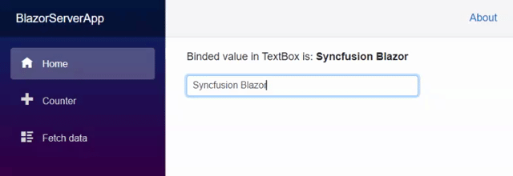

# Two-way data binding in Blazor

Syncfusion<sup style="font-size:70%">&reg;</sup> Blazor components provide data binding features with the `@bind-value` Razor directive attribute with a field, property, or Razor expression value. By default, the `bind-value` attribute binds the data value in the `OnChange` event. The `OnChange` event triggers when the element loses its focus.

To enable two-way binding on Syncfusion<sup style="font-size:70%">&reg;</sup> components, use `@bind-Value`. In the following example, the `SfTextBox` component is bound to the C# `textValue` property. When the textbox loses focus, the bound field is updated.

```cshtml

@using Syncfusion.Blazor.Inputs

<p>Binded value in TextBox is: <b>@textValue</b></p>

<SfTextBox @bind-Value="textValue"></SfTextBox>

@code {
    private string textValue { get; set; }

    protected override void OnInitialized()
    {
        textValue = "Syncfusion Blazor";
    }
}

```



The following Syncfusion<sup style="font-size:70%">&reg;</sup> Blazor components support two-way binding:

* [AutoComplete](https://blazor.syncfusion.com/documentation/autocomplete/data-binding)
* [Calendar](https://blazor.syncfusion.com/documentation/calendar/data-binding)
* [ComboBox](https://blazor.syncfusion.com/documentation/combobox/data-binding)
* [DatePicker](https://blazor.syncfusion.com/documentation/datepicker/data-binding)
* [DateRange Picker](https://blazor.syncfusion.com/documentation/daterangepicker/data-binding)
* [DateTime Picker](https://blazor.syncfusion.com/documentation/datetime-picker/data-binding)
* [DropDown List](https://blazor.syncfusion.com/documentation/dropdown-list/data-binding)
* [InPlace Editor](https://blazor.syncfusion.com/documentation/in-place-editor/data-binding)
* [Input Mask](https://blazor.syncfusion.com/documentation/input-mask/data-binding)
* [MultiSelect Dropdown](https://blazor.syncfusion.com/documentation/multiselect-dropdown/data-binding)
* [Numeric TextBox](https://blazor.syncfusion.com/documentation/numeric-textbox/data-binding)
* [RichTextEditor](https://blazor.syncfusion.com/documentation/rich-text-editor/data-binding)
* [Splitter](https://blazor.syncfusion.com/documentation/splitter/two-way-binding)
* [TextBox](https://blazor.syncfusion.com/documentation/textbox/data-binding)
* [TimePicker](https://blazor.syncfusion.com/documentation/timepicker/data-binding)

## Bind a component generated dynamically using RenderFragment

Blazor render trees can be built manually with `RenderTreeBuilder`, which provides methods for creating and configuring components in C# code. The following example shows how to bind a value for a `DatePicker` component generated via `RenderFragment`. See steps 3 and 4 where the value binding and callback are handled.

```cshtml

@using Syncfusion.Blazor.Calendars
@using Syncfusion.Blazor.Buttons

<div id="component-container">
    @dynamicComponent
</div>

<SfButton ID="dynamic-button" Content="Render DatePicker" @onclick="RenderComponent"></SfButton>
<SfButton ID="button" Content="Change Date" @onclick="onChange"></SfButton>

@code {
    public DateTime? DateValue { get; set; } = DateTime.Now.Date;
    private RenderFragment dynamicComponent { get; set; } 
    private RenderFragment CreateComponent() => builder =>
    {
        builder.OpenComponent(0, typeof(SfDatePicker<DateTime>));
        builder.AddAttribute(1, "ID", "MyDynamicId");
        builder.AddAttribute(2, "Placeholder", "Choose a date");
        //Binding the value property with DateValue property.
        builder.AddAttribute(3, "Value", DateValue);
        builder.AddAttribute(4, "onchange", Microsoft.AspNetCore.Components.EventCallback.Factory.
                CreateBinder(this, _value => DateValue = _value, DateValue));
                
        builder.CloseComponent();
    };

    private void RenderComponent()
    {
        dynamicComponent = CreateComponent();
    }
    private void onChange()
    {
        DateValue = new DateTime(DateTime.Now.Year,DateTime.Now.Month,07);
    }
}
```


For more information, see the Blazor documentation on [manually building a render tree](https://docs.microsoft.com/en-us/aspnet/core/blazor/advanced-scenarios?#manually-build-a-render-tree-rendertreebuilder).
