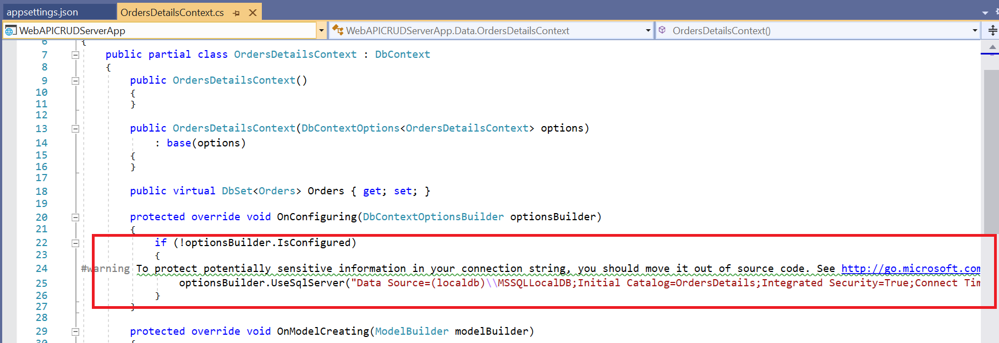
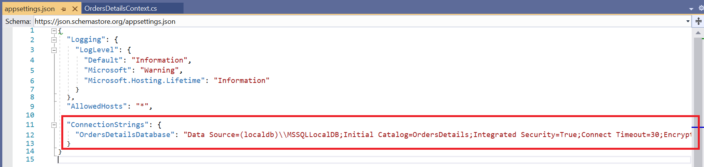
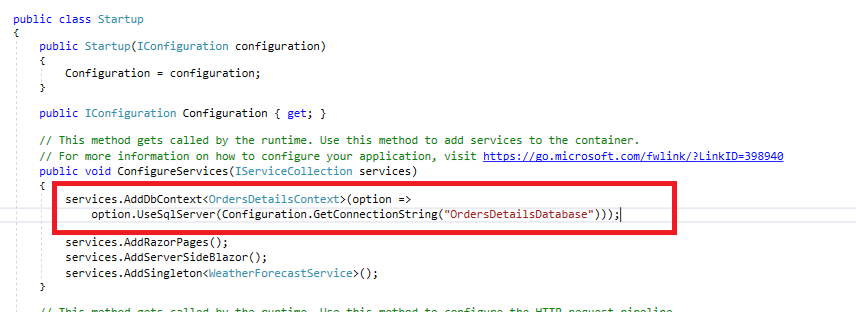
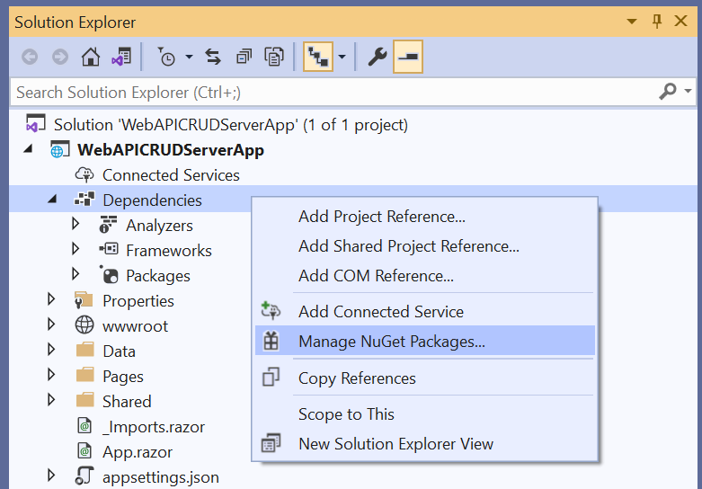

# Bind data to the Syncfusion Blazor components using WebApiAdaptor of SfDataManager and perform CRUD operations

In this topic, we are going to learn how to retrieve data from WebApi Controller, bind to Grid component using [WebApiAdaptor](https://blazor.syncfusion.com/documentation/data/adaptors/#web-api-adaptor) of `SfDataManger`, and perform CRUD operations.

You can use the WebApiAdaptor of SfDataManager to interact with Web APIs created with OData endpoint. The WebApiAdaptor is extended from the ODataAdaptor. Hence, to use WebApiAdaptor, the endpoint should understand the OData formatted queries sent along with the request.

To enable the OData query option for Web API, please refer to this [documentation](https://docs.microsoft.com/en-us/aspnet/web-api/overview/odata-support-in-aspnet-web-api/supporting-odata-query-options).

## Prerequisite software

The following software are needed
* Visual Studio 2019 v16.8.0 Preview 3.0 or later
* .NET SDK 5.0 RC2 or later.

## Create the database

Open Visual Studio 2019 Preview, select **View -> SQL Server Object Explorer**. Right-click on the Databases folder to create a new Database and name it as OrdersDetails.


Right-click on the **Tables** folder of the created database and click **Add New Table**.


Use the following query to add a new table named **Orders**.

```sql

Create Table Orders(
 OrderID BigInt Identity(1,1) Primary Key Not Null,
 CustomerID Varchar(100) Not Null,
 Freight int Null,
 OrderDate datetime null
)

```

Now, the Orders table design will look like below. Click on the **Update** button.


Now, click on **Update Database**.


## Create Blazor Server Application

Open Visual Studio 2019 and follow the steps in the below documentation to create the Blazor Server Application.

[Getting Started](https://blazor.syncfusion.com/documentation/getting-started/blazor-server-side-visual-studio-2019/)

### Generate DbContext and model class from the database

Now, we are going to scaffold **DbContext** and **model classes** from the existing **OrdersDetails** database. To perform scaffolding and work with the SQL Server database in our application, we need to install the following NuGet packages.

Run the following commands in the **Package Manager Console**.

* **Install-Package Microsoft.EntityFrameworkCore.Tools -Version 3.0.0**: This package creates database context and model classes from the database.
* **Install-Package Microsoft.EntityFrameworkCore.SqlServer -Version 3.0.0**: The database provider that allows Entity Framework Core to work with SQL Server.

Once the above packages are installed, we can scaffold DbContext and Model classes. Run the following command in the **Package Manager Console**.

```

Scaffold-DbContext “Data Source=(localdb)\MSSQLLocalDB;Initial Catalog=OrdersDetails;Integrated Security=True;Connect Timeout=30;Encrypt=False;TrustServerCertificate=False;ApplicationIntent=ReadWrite;MultiSubnetFailover=False” Microsoft.EntityFrameworkCore.SqlServer -OutputDir Data

```

The above scaffolding command contains the following details for creating DbContext and model classes for the existing database and its tables.
* **Connection string**: Data Source=(localdb)\MSSQLLocalDB;Initial Catalog=OrdersDetails;Integrated Security=True;Connect Timeout=30;Encrypt=False;TrustServerCertificate=False;ApplicationIntent=ReadWrite;MultiSubnetFailover=False
* **Data provider**: Microsoft.EntityFrameworkCore.SqlServer
* **Output directory**: -OutputDir Data

After running the above command, **OrdersDetailsContext.cs** and **Orders.cs** files will be created under the **WebAPICRUDServerApp.Data** folder as follows.


We can see that OrdersDetailsContext.cs file contains the connection string details in the **OnConfiguring** method.



It is not recommended to have a connection string with sensitive information in the OrdersDetailsContext.cs file, so we are moving the connection string to the **appsettings.json** file.



Now, the DbContext must be configured using connection string and registered as scoped service using the **AddDbContext** method in **Startup.cs**.



### Creating API Controller

The application is now configured to connect with the **OrdersDetails** database using Entity Framework. Now, it’s time to consume data from the OrdersDetails database. To do so, we need a Web API controller to serve data from the DbContext to the Blazor application.

To create a Web API controller, right-click the **Controller** folder in the Server project and select **Add -> New Item -> API controller with read/write actions** to create a new Web API controller. We are naming this controller as OrdersController as it returns Orders table records.

Now, replace the Web API controller with the following code which contains code to handle CRUD operations in the Orders table.

```csharp

using Microsoft.AspNetCore.Mvc;
using System;
using System.Collections.Generic;
using System.Linq;
using System.Threading.Tasks;
using WebAPICRUDServerApp.Data;

namespace WebAPICRUDServerApp
{
    [Route("api/[controller]")]
    [ApiController]
    public class OrdersController : ControllerBase
    {
        private OrdersDetailsContext _context;
        public OrdersController(OrdersDetailsContext context)
        {
            _context = context;
        }
        // GET: api/<OrdersController>
        [HttpGet]
        public object Get()
        {
            return new { Items = _context.Orders, Count = _context.Orders.Count() };
        }
        // POST api/<OrdersController>
        [HttpPost]
        public void Post([FromBody] Orders book)
        {
            _context.Orders.Add(book);
            _context.SaveChanges();
        }
        // PUT api/<OrdersController>
        [HttpPut]
        public void Put(long id, [FromBody] Orders book)
        {
            Orders _book = _context.Orders.Where(x => x.OrderId.Equals(book.OrderId)).FirstOrDefault();
            _book.CustomerId = book.CustomerId;
            _book.Freight = book.Freight;
            _book.OrderDate = book.OrderDate;
            _context.SaveChanges();
        }
        // DELETE api/<OrdersController>
        [HttpDelete("{id}")]
        public void Delete(long id)
        {
            Orders _book = _context.Orders.Where(x => x.OrderId.Equals(id)).FirstOrDefault();
            _context.Orders.Remove(_book);
            _context.SaveChanges();
        }
    }
}

```

Open **Startup.cs** file and add **MapDefaultControllerRoute** in **Configure** method as follows.

```csharp

public void Configure(IApplicationBuilder app, IWebHostEnvironment env)
{
    ...
    app.UseEndpoints(endpoints =>
    {
        endpoints.MapDefaultControllerRoute();
        endpoints.MapBlazorHub();
        endpoints.MapFallbackToPage("/_Host");
    });
}

```

### Add Syncfusion Blazor DataGrid package

To add Syncfusion components into the project, right-click **Dependencies** and select the **Manage NuGet Packages**.



Now, in the **Browse** tab, search and install the Syncfusion.Blazor.Grid NuGet package.


> For this demo, we have used Syncfusion.Blazor(**19.1.0.66**) NuGet package. We have released a new **Syncfusion.Blazor** NuGet package with new enhancement in our every-week release and main release. So, you can check and update to the latest versions by using this [`link`](https://www.nuget.org/packages/Syncfusion.Blazor).

Open **_Import.razor** file and add the following namespaces which are required to use Syncfusion Blazor components in this application.

```cshtml

@using Syncfusion.Blazor
@using Syncfusion.Blazor.Data
@using Syncfusion.Blazor.Grids
@using WebAPICRUDServerApp.Data

```

Open **Startup.cs** file and register the Syncfusion service in the **ConfigureServices** method as follows.

```csharp

public void ConfigureServices(IServiceCollection services)
{
    services.AddDbContext<OrdersDetailsContext>(option => option.UseSqlServer(Configuration.GetConnectionString("OrdersDetailsDatabase")));
    services.AddRazorPages();
    services.AddServerSideBlazor();
    services.AddSingleton<WeatherForecastService>();
    services.AddSyncfusionBlazor();
}

```

Themes provide life to components. Syncfusion Blazor has different themes. They are:

* Bootstrap4
* Material
* Office 365
* Bootstrap
* High Contrast

In this demo application, the **Bootstrap4** theme will be used. To add the theme, open **Pages/_Host.cshtml** file and add the following CSS reference code.

```html

<link href="_content/Syncfusion.Blazor.Themes/fabric.css" rel="stylesheet" />

```

## Add Syncfusion Blazor DataGrid component to an application

In previous steps, we have successfully configured the Syncfusion Blazor package in the application. Now, we can add the grid component to the **Index.razor** page.

```cshtml

<SfGrid TValue="Orders"></SfGrid>

```

## Binding data to Blazor DataGrid component using WebApiAdaptor

To consume data from the WebApi Controller, we need to add the **SfDataManager** with **WebApiAdaptor**. Please refer to the following documentation for more details on WebApiAdaptor.

[WebApiAdaptor](https://blazor.syncfusion.com/documentation/data/adaptors/#web-api-adaptor)

```cshtml

<SfGrid TValue="Orders">
    <SfDataManager Url="api/Orders" Adaptor="Adaptors.WebApiAdaptor"></SfDataManager>
</SfGrid>

```

Grid columns can be defined by using the [`GridColumn`](https://help.syncfusion.com/cr/aspnetcore-blazor/Syncfusion.Blazor.Grids.GridColumn.html) component. We are going to create columns using the following code.

```cshtml

<SfGrid TValue="Orders">
    <SfDataManager Url="api/Orders" Adaptor="Adaptors.WebApiAdaptor"></SfDataManager>
    <GridColumns>
        <GridColumn Field=@nameof(Orders.OrderId) HeaderText="Order ID" IsPrimaryKey="true" Visible="false" TextAlign="TextAlign.Right" Width="120"></GridColumn>
        <GridColumn Field=@nameof(Orders.CustomerId) HeaderText="Customer Name" Width="150"></GridColumn>
        <GridColumn Field=@nameof(Orders.OrderDate) HeaderText=" Order Date" Format="d" Type="ColumnType.Date" TextAlign="TextAlign.Right" Width="130"></GridColumn>
        <GridColumn Field=@nameof(Orders.Freight) HeaderText="Freight" Format="C2" TextAlign="TextAlign.Right" Width="120"></GridColumn>
    </GridColumns>
</SfGrid>

```

When you run the application, the `Get()` method will be called in your API controller.

```csharp

using System.Collections.Generic;
using System.Linq;
using System.Threading.Tasks;
using WebAPICRUDServerApp.Data;

namespace WebAPICRUDServerApp
{
    [Route("api/[controller]")]
    [ApiController]
    public class OrdersController : ControllerBase
    {
        private OrdersDetailsContext _context;
        public OrdersController(OrdersDetailsContext context)
        {
            _context = context;
        }
        // GET: api/<OrdersController>
        [HttpGet]
        public object Get()
        {
            return new { Items = _context.Orders, Count = _context.Orders.Count() };
        }
        ...
    }
}

```

The response object from the Web API should contain the properties, `Items` and `Count`, whose values are a collection of entities and the total count of the entities, respectively.

The sample response object should look like this:

```csharp

{
    "Items": [{..}, {..}, {..}, ...],
    "Count": 830
}

```

## Handling CRUD operations with our Syncfusion Blazor DataGrid component

We can enable editing in the grid component using the [`GridEditSettings`](https://help.syncfusion.com/cr/aspnetcore-blazor/Syncfusion.Blazor.Grids.GridEditSettings.html) component. Grid provides various modes of editing options such as [`Inline/Normal`](https://blazor.syncfusion.com/documentation/datagrid/editing/#normal), [`Dialog`](https://blazor.syncfusion.com/documentation/datagrid/editing/#dialog), and [`Batch`](https://blazor.syncfusion.com/documentation/datagrid/editing/#batch) editing.

Here, we are using **Inline** edit mode and used Toolbar property to show toolbar items for editing.
We have added the DataGrid Editing and Toolbar code with previous Grid model.

```cshtml

<SfGrid TValue="Orders" Toolbar="@(new List<string>() { "Add", "Edit", "Delete", "Cancel", "Update" })">
    <SfDataManager Url="api/Orders" Adaptor="Adaptors.WebApiAdaptor"></SfDataManager>
    <GridEditSettings AllowAdding="true" AllowDeleting="true" AllowEditing="true" Mode="EditMode.Normal"></GridEditSettings>
    <GridColumns>
        <GridColumn Field=@nameof(Orders.OrderId) HeaderText="Order ID" IsPrimaryKey="true" Visible="false" TextAlign="TextAlign.Right" Width="120"></GridColumn>
        <GridColumn Field=@nameof(Orders.CustomerId) HeaderText="Customer Name" Width="150"></GridColumn>
        <GridColumn Field=@nameof(Orders.OrderDate) HeaderText=" Order Date" Format="d" Type="ColumnType.Date" TextAlign="TextAlign.Right" Width="130"></GridColumn>
        <GridColumn Field=@nameof(Orders.Freight) HeaderText="Freight" Format="C2" TextAlign="TextAlign.Right" Width="120"></GridColumn>
    </GridColumns>
</SfGrid>

```

> Normal editing is the default edit mode for the DataGrid component. Set the [`IsPrimaryKey`](https://help.syncfusion.com/cr/blazor/Syncfusion.Blazor.Grids.GridColumn.html#Syncfusion_Blazor_Grids_GridColumn_IsPrimaryKey) property of Column as **true** for a particular column, whose value is a unique value for editing purposes.

### Insert a row

To insert a new row, click the **Add** toolbar button. The new record edit form will look like below.


Clicking the **Update** toolbar button will insert the record in the Orders table by calling the following **POST** method of the Web API.

```csharp

[HttpPost]
public void Post([FromBody] Orders book)
{
    _context.Orders.Add(book);
    _context.SaveChanges();
}

```


### Update a row

To edit a row, select any row and click the **Edit** toolbar button. The edit form will look like below. Edit the Customer Name column.


Clicking the **Update** toolbar button will update the record in the Orders table by calling the following **PUT** method of the Web API.

```csharp

[HttpPut]
public void Put(long id, [FromBody] Orders book)
{
    Orders _book = _context.Orders.Where(x => x.OrderId.Equals(book.OrderId)).FirstOrDefault();
    _book.CustomerId = book.CustomerId;
    _book.Freight = book.Freight;
    _book.OrderDate = book.OrderDate;
    _context.SaveChanges();
}

```

The resultant grid will look like below.


### Delete a row

To delete a row, select any row and click the **Delete** toolbar button. Deleting operation will send a **DELETE** request to the Web API with the selected record`s primary key value to remove the corresponding record from the Orders table.

```csharp

[HttpDelete("{id}")]
public void Delete(long id)
{
    Orders _book = _context.Orders.Where(x => x.OrderId.Equals(id)).FirstOrDefault();
    _context.Orders.Remove(_book);
    _context.SaveChanges();
}

```

> Please find the sample from this [Github](https://github.com/SyncfusionExamples/binding-webapi-services-and-perform-crud) location.