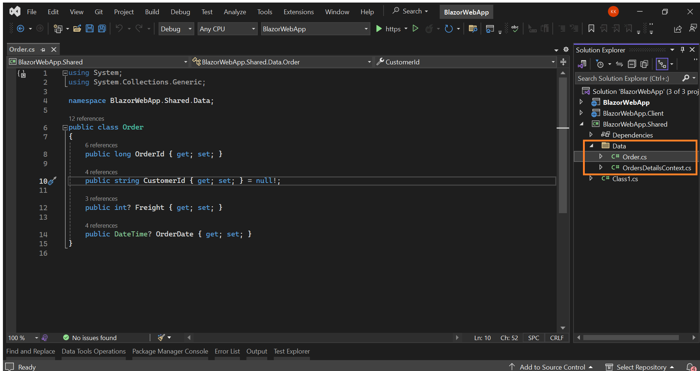
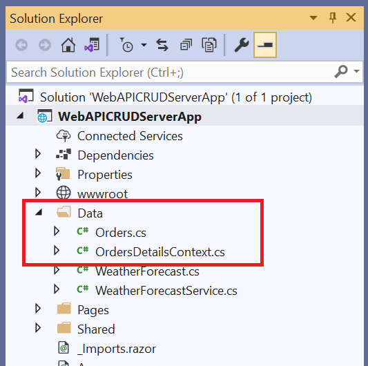
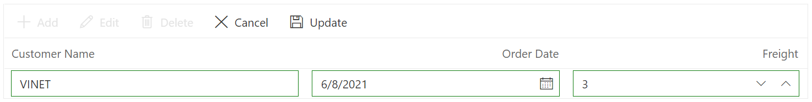
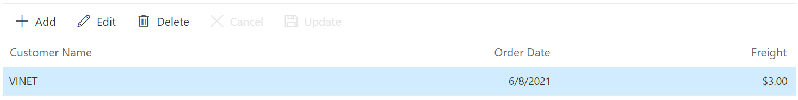
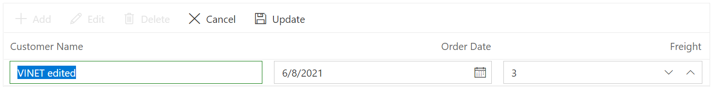
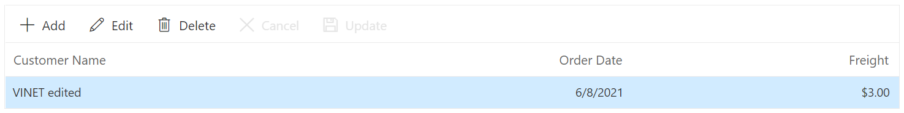

# Bind data to Blazor components using WebApiAdaptor and perform CRUD

This article shows how to retrieve data from a WebAPI controller, bind it to the DataGrid using the [WebApiAdaptor](https://blazor.syncfusion.com/documentation/data/adaptors#web-api-adaptor) of `SfDataManager`, and perform CRUD operations.

You can use the WebApiAdaptor of SfDataManager to interact with Web APIs created with OData endpoint. The WebApiAdaptor is extended from the ODataAdaptor. Hence, to use WebApiAdaptor, the endpoint should understand the OData formatted queries sent along with the request.

To enable the OData query option for Web API, Refer to this [documentation](https://learn.microsoft.com/en-us/aspnet/web-api/overview/odata-support-in-aspnet-web-api/supporting-odata-query-options).

## Prerequisite software

The following software are required:
* Visual Studio 2022
* .NET 7.0 or .NET 8.0 or .NET 9.0 or .NET 10

## Create the database

Open Visual Studio , select **View -> SQL Server Object Explorer**. Right-click on the Databases folder to create a new Database and name it as OrdersDetails.


Right-click on the **Tables** folder of the created database and click **Add New Table**.


Use the following query to add a new table named **Orders**.

```
Create Table Orders(
 OrderID BigInt Identity(1,1) Primary Key Not Null,
 CustomerID Varchar(100) Not Null,
 Freight int Null,
 OrderDate datetime null
)
```

Now, the Orders table design will look like below. Click on the **Update** button.


Now, click on **Update Database**.


## Create a new Blazor Web App

Create a **Blazor Web App** using Visual Studio 2022 via [Microsoft templates](https://learn.microsoft.com/en-us/aspnet/core/blazor/tooling) or the [Syncfusion<sup style="font-size:70%">&reg;</sup> Blazor Extension](https://blazor.syncfusion.com/documentation/visual-studio-integration/template-studio).

Configure the appropriate [interactive render mode](https://learn.microsoft.com/en-us/aspnet/core/blazor/components/render-modes#render-modes) and [interactivity location](https://learn.microsoft.com/en-us/aspnet/core/blazor/tooling#interactivity-location) when creating the Blazor Web App.

### Generate DbContext and model class from the database

Now, you need to scaffold **DbContext** and **model classes** from the existing **OrdersDetails** database. To perform scaffolding and work with the SQL Server database in our application, install the following NuGet packages.If you have created a Blazor Web App with the `Interactive render mode` set to `WebAssembly` or `Auto` ensure to follow these steps:

* Create the new project with Class Library template named as `BlazorWebApp.Shared` for DbContext and model class as shown below.


Additionally, ensure that you have added a reference to the `BlazorWebApp.Shared` project in both the server-side and client-side projects of your web application.

* Then, open the NuGet Package Manager and install the following packages in both the shared and server-side projects of your Blazor Web App.

   * [Microsoft.EntityFrameworkCore.Tools](https://www.nuget.org/packages/Microsoft.EntityFrameworkCore.Tools): This package creates database context and model classes from the database.
   * [Microsoft.EntityFrameworkCore.SqlServer](https://www.nuget.org/packages/Microsoft.EntityFrameworkCore.SqlServer/): The database provider that allows Entity Framework Core to work with SQL Server.

Alternatively, you can utilize the following package manager command to achieve the same.




Install-Package Microsoft.EntityFrameworkCore.Tools

Install-Package Microsoft.EntityFrameworkCore.SqlServer




Once the above packages are installed, you can scaffold DbContext and Model classes. Run the following command in the Package Manager Console under the `BlazorWebApp.Shared` project.

```
Scaffold-DbContext “Server=localhost;Database=OrdersDetails;Integrated Security=True;Connect Timeout=30;Encrypt=False;TrustServerCertificate=False;ApplicationIntent=ReadWrite;MultiSubnetFailover=False” Microsoft.EntityFrameworkCore.SqlServer -OutputDir Data
```

The above scaffolding command contains the following details for creating DbContext and model classes for the existing database and its tables.
  * **Connection string**: Server=localhost;Database=OrdersDetails;Integrated Security=True;Connect Timeout=30;Encrypt=False;TrustServerCertificate=False;ApplicationIntent=ReadWrite;MultiSubnetFailover=False
  * **Data provider**: Microsoft.EntityFrameworkCore.SqlServer
  * **Output directory**: -OutputDir Data

After running the above command, **OrdersDetailsContext.cs** and **Orders.cs** files will be created under the Data folder of `BlazorWebApp.Shared` project as follows.



You can see that OrdersDetailsContext.cs file contains the connection string details in the **OnConfiguring** method.




using Microsoft.EntityFrameworkCore;

namespace BlazorWebApp.Shared.Data;

public partial class OrdersDetailsContext : DbContext
{
    public OrdersDetailsContext()
    {
    }

    public OrdersDetailsContext(DbContextOptions<OrdersDetailsContext> options)
        : base(options)
    {
    }

    public virtual DbSet<Order> Orders { get; set; }

    protected override void OnConfiguring(DbContextOptionsBuilder optionsBuilder)=> optionsBuilder.UseSqlServer("Server=(localdb)\\MSSQLLocalDB;Database=OrdersDetails;Integrated Security=True;Connect Timeout=30;Encrypt=False;TrustServerCertificate=False;ApplicationIntent=ReadWrite;MultiSubnetFailover=False");
  .....
}



Additionally ensure the connection strings added in the **appsettings.json** file of server side project of your Web App.

```
{
  "Logging": {
    "LogLevel": {
      "Default": "Information",
      "Microsoft.AspNetCore": "Warning"
    }
  },
  "AllowedHosts": "*",
  "ConnectionStrings": {
    "OrdersDetailsDatabase": "Server=(localdb)\\MSSQLLocalDB;Database=OrdersDetails;Integrated Security=True;Connect Timeout=30;Encrypt=False;TrustServerCertificate=False;ApplicationIntent=ReadWrite;MultiSubnetFailover=False"
  }
}
```
* Now, the DbContext must be configured using connection string and registered as scoped service using the AddDbContext method in **Program.cs**  of server side project only.

```
builder.Services.AddDbContext<OrdersDetailsContext>(option =>
                option.UseSqlServer(builder.Configuration.GetConnectionString("OrdersDetailsDatabase")));
```

### Creating API Controller

The application is now configured to connect with the **OrdersDetails** database using Entity Framework. Now, it’s time to consume data from the OrdersDetails database. To do so, you need a Web API controller to serve data from the DbContext to the Blazor application.

To create a Web API controller, right-click the **Controller** folder in the Server side project and select **Add -> New Item -> API controller with read/write actions** to create a new Web API controller. We are naming this controller as OrdersController as it returns Orders table records.

Now, replace the Web API controller with the following code which contains code to handle CRUD operations in the Orders table.




using Microsoft.AspNetCore.Mvc;
using System;
using System.Collections.Generic;
using System.Linq;
using System.Threading.Tasks;
using WebAPICRUDServerApp.Data;

namespace WebAPICRUDServerApp
{
    [Route("api/[controller]")]
    [ApiController]
    public class OrdersController : ControllerBase
    {
        private OrdersDetailsContext _context;
        public OrdersController(OrdersDetailsContext context)
        {
            _context = context;
        }
        // GET: api/<OrdersController>
        [HttpGet]
        public object Get()
        {
            return new { Items = _context.Orders, Count = _context.Orders.Count() };
        }
        // POST api/<OrdersController>
        [HttpPost]
        public void Post([FromBody] Orders book)
        {
            _context.Orders.Add(book);
            _context.SaveChanges();
        }
        // PUT api/<OrdersController>
        [HttpPut]
        public void Put(long id, [FromBody] Orders book)
        {
            Orders _book = _context.Orders.Where(x => x.OrderId.Equals(book.OrderId)).FirstOrDefault();
            _book.CustomerId = book.CustomerId;
            _book.Freight = book.Freight;
            _book.OrderDate = book.OrderDate;
            _context.SaveChanges();
        }
        // DELETE api/<OrdersController>
        [HttpDelete("{id}")]
        public void Delete(long id)
        {
            Orders _book = _context.Orders.Where(x => x.OrderId.Equals(id)).FirstOrDefault();
            _context.Orders.Remove(_book);
            _context.SaveChanges();
        }
    }
}




* Now, open **Program.cs** file and add **AddControllers & MapControllers** method as follows.




......
builder.Services.AddControllers();
....
app.MapControllers();
.....




## Create Blazor Server Application

You can create a **Blazor Server App** using Visual Studio via [Microsoft Templates](https://learn.microsoft.com/en-us/aspnet/core/blazor/tooling?view=aspnetcore-7.0) or the [Syncfusion<sup style="font-size:70%">&reg;</sup> Blazor Extension](https://blazor.syncfusion.com/documentation/visual-studio-integration/template-studio).

### Generate DbContext and model class from the database

Now, you need to scaffold **DbContext** and **model classes** from the existing **OrdersDetails** database. To perform scaffolding and work with the SQL Server database in our application, install the following NuGet packages.

* [Microsoft.EntityFrameworkCore.Tools](https://www.nuget.org/packages/Microsoft.EntityFrameworkCore.Tools): This package creates database context and model classes from the database.
* [Microsoft.EntityFrameworkCore.SqlServer](https://www.nuget.org/packages/Microsoft.EntityFrameworkCore.SqlServer/): The database provider that allows Entity Framework Core to work with SQL Server.

Run the following commands in the Package Manager Console.




Install-Package Microsoft.EntityFrameworkCore.Tools

Install-Package Microsoft.EntityFrameworkCore.SqlServer




```
Scaffold-DbContext “Server=localhost;Database=OrdersDetails;Integrated Security=True;Connect Timeout=30;Encrypt=False;TrustServerCertificate=False;ApplicationIntent=ReadWrite;MultiSubnetFailover=False” Microsoft.EntityFrameworkCore.SqlServer -OutputDir Data
```

The above scaffolding command contains the following details for creating DbContext and model classes for the existing database and its tables.
* **Connection string**: Server=localhost;Database=OrdersDetails;Integrated Security=True;Connect Timeout=30;Encrypt=False;TrustServerCertificate=False;ApplicationIntent=ReadWrite;MultiSubnetFailover=False
* **Data provider**: Microsoft.EntityFrameworkCore.SqlServer
* **Output directory**: -OutputDir Data

After running the above command, **OrdersDetailsContext.cs** and **Orders.cs** files will be created under the **WebAPICRUDServerApp.Data** folder as follows.



You can see that OrdersDetailsContext.cs file contains the connection string details in the **OnConfiguring** method.




using System;
using System.Collections.Generic;
using Microsoft.EntityFrameworkCore;
using Microsoft.EntityFrameworkCore.Metadata;

namespace WebAPICRUDServerApp.Data
{
    public partial class OrdersDetailsContext : DbContext
    {
        public OrdersDetailsContext()
        {
        }

        public OrdersDetailsContext(DbContextOptions<OrdersDetailsContext> options)
            : base(options)
        {
        }

        public virtual DbSet<Order> Orders { get; set; } = null!;

        protected override void OnConfiguring(DbContextOptionsBuilder optionsBuilder)
        {
            if (!optionsBuilder.IsConfigured)
            {
                optionsBuilder.UseSqlServer("Data Source=(localdb)\\MSSQLLocalDB;Initial Catalog=OrdersDetails;Integrated Security=True;Connect Timeout=30;Encrypt=False;TrustServerCertificate=False;ApplicationIntent=ReadWrite;MultiSubnetFailover=False");
            }
        }

        ...
    }
}




It is not recommended to have a connection string with sensitive information in the OrdersDetailsContext.cs file, so the connection string is moved to the **appsettings.json** file.




{
  "Logging": {
    "LogLevel": {
      "Default": "Information",
      "Microsoft.AspNetCore": "Warning"
    }
  },
  "AllowedHosts": "*",
  "ConnectionStrings": {
    "OrdersDetailsDatabase": "Data Source=(localdb)\\MSSQLLocalDB;Initial Catalog=OrdersDetails;Integrated Security=True;Connect Timeout=30;Encrypt=False;TrustServerCertificate=False;ApplicationIntent=ReadWrite;MultiSubnetFailover=False"
  }
}




Now, the DbContext must be configured using connection string and registered as scoped service using the AddDbContext method in **Program.cs** file in .NET 6 and .NET 7 application.




builder.Services.AddDbContext<OrdersDetailsContext>(option =>
                option.UseSqlServer(builder.Configuration.GetConnectionString("OrdersDetailsDatabase")));




### Creating API Controller

The application is now configured to connect with the **OrdersDetails** database using Entity Framework. Now, it’s time to consume data from the OrdersDetails database. To do so, you need a Web API controller to serve data from the DbContext to the Blazor application.

To create a Web API controller, right-click the **Controller** folder in the Server project and select **Add -> New Item -> API controller with read/write actions** to create a new Web API controller. We are naming this controller as OrdersController as it returns Orders table records.

Now, replace the Web API controller with the following code which contains code to handle CRUD operations in the Orders table.




using Microsoft.AspNetCore.Mvc;
using System;
using System.Collections.Generic;
using System.Linq;
using System.Threading.Tasks;
using WebAPICRUDServerApp.Data;

namespace WebAPICRUDServerApp
{
    [Route("api/[controller]")]
    [ApiController]
    public class OrdersController : ControllerBase
    {
        private OrdersDetailsContext _context;
        public OrdersController(OrdersDetailsContext context)
        {
            _context = context;
        }
        // GET: api/<OrdersController>
        [HttpGet]
        public object Get()
        {
            return new { Items = _context.Orders, Count = _context.Orders.Count() };
        }
        // POST api/<OrdersController>
        [HttpPost]
        public void Post([FromBody] Orders book)
        {
            _context.Orders.Add(book);
            _context.SaveChanges();
        }
        // PUT api/<OrdersController>
        [HttpPut]
        public void Put(long id, [FromBody] Orders book)
        {
            Orders _book = _context.Orders.Where(x => x.OrderId.Equals(book.OrderId)).FirstOrDefault();
            _book.CustomerId = book.CustomerId;
            _book.Freight = book.Freight;
            _book.OrderDate = book.OrderDate;
            _context.SaveChanges();
        }
        // DELETE api/<OrdersController>
        [HttpDelete("{id}")]
        public void Delete(long id)
        {
            Orders _book = _context.Orders.Where(x => x.OrderId.Equals(id)).FirstOrDefault();
            _context.Orders.Remove(_book);
            _context.SaveChanges();
        }
    }
}




* For **.NET 6 and .NET 7** applications open **Program.cs** file and add **MapDefaultControllerRoute** method as follows.




......

app.UseRouting();

app.MapDefaultControllerRoute();
app.MapBlazorHub();
app.MapFallbackToPage("/_Host");

app.Run();




## Add Syncfusion<sup style="font-size:70%">&reg;</sup> Blazor DataGrid package

To add **Blazor DataGrid** component in the app, open the NuGet package manager in Visual Studio (*Tools → NuGet Package Manager → Manage NuGet Packages for Solution*), search and install [Syncfusion.Blazor.Grid](https://www.nuget.org/packages/Syncfusion.Blazor.Grid/) and [Syncfusion.Blazor.Themes](https://www.nuget.org/packages/Syncfusion.Blazor.Themes/).

If using `WebAssembly` or `Auto` render modes in a Blazor Web App, install Syncfusion<sup style="font-size:70%">&reg;</sup> Blazor NuGet packages in the client project.

Alternatively, you can utilize the following package manager command to achieve the same.




Install-Package Syncfusion.Blazor.Grid -Version {{ site.releaseversion }}
Install-Package Syncfusion.Blazor.Themes -Version {{ site.releaseversion }}




N> Syncfusion<sup style="font-size:70%">&reg;</sup> Blazor components are available in [nuget.org](https://www.nuget.org/packages?q=syncfusion.blazor). Refer to [NuGet packages](https://blazor.syncfusion.com/documentation/nuget-packages) topic for available NuGet packages list with component details.

Open **~/_Imports.razor** file and import the following namespace.



@using Syncfusion.Blazor
@using Syncfusion.Blazor.Grids



Now, register the Syncfusion<sup style="font-size:70%">&reg;</sup> Blazor Service in the **~/Program.cs** file of your App.

For a Blazor Web App with `WebAssembly` or `Auto (Server and WebAssembly)` interactive render mode, register the Syncfusion<sup style="font-size:70%">&reg;</sup> Blazor service in both **~/Program.cs** files of your web app.

```cshtml

....
using Syncfusion.Blazor;
....
builder.Services.AddSyncfusionBlazor();
....

```

Themes provide life to components. Syncfusion<sup style="font-size:70%">&reg;</sup> Blazor has different themes. They are:

* Fabric
* Bootstrap
* Material
* High Contrast

In this demo application, the latest theme is used.

* For **Blazor Web App**,  refer stylesheet inside the `<head>` of **~/Components/App.razor** file for .NET 10, .NET 9 and .NET 8.
* For **Blazor WebAssembly application**, refer stylesheet inside the `<head>` element of **wwwroot/index.html** file.
* For **Blazor Server application**, refer stylesheet inside the `<head>` element of
    * **~/Pages/_Host.cshtml** file for .NET 7.
    * **~/Pages/_Layout.cshtml** file for .NET 6.



<link href="_content/Syncfusion.Blazor.Themes/bootstrap5.css" rel="stylesheet" />



Also, Include the script reference at the end of the `<body>` of **~/Components/App.razor**(For Blazor Web App) or **Pages/_Host.cshtml** (for Blazor Server App) file as shown below:

```html
<body>
    ....
    <script src="_content/Syncfusion.Blazor.Core/scripts/syncfusion-blazor.min.js" type="text/javascript"></script>
</body>
```

## Add Syncfusion<sup style="font-size:70%">&reg;</sup> Blazor DataGrid component to an application

In previous steps, you have successfully configured the Syncfusion<sup style="font-size:70%">&reg;</sup> Blazor package in the application. Now, you can add the grid component to the to the `.razor` page inside the `Pages` folder.

If you have set the interactivity location to `Per page/component` in the web app, ensure that you define a render mode at the top of the Syncfusion<sup style="font-size:70%">&reg;</sup> Blazor component-included razor page as follows:




@* Your App render mode define here *@
@rendermode InteractiveAuto







<SfGrid TValue="Orders"></SfGrid>




## Bind data to the Blazor DataGrid using WebApiAdaptor

To consume data from the WebApi Controller, you need to add the **SfDataManager** with **WebApiAdaptor**. Refer to the following documentation for more details on [WebApiAdaptor](https://blazor.syncfusion.com/documentation/data/adaptors#web-api-adaptor).




<SfGrid TValue="Orders">
    <SfDataManager Url="api/Orders" Adaptor="Adaptors.WebApiAdaptor"></SfDataManager>
</SfGrid>




Grid columns can be defined by using the [GridColumn](https://help.syncfusion.com/cr/blazor/Syncfusion.Blazor.Grids.GridColumn.html) component. We are going to create columns using the following code.




<SfGrid TValue="Orders">
    <SfDataManager Url="api/Orders" Adaptor="Adaptors.WebApiAdaptor"></SfDataManager>
    <GridColumns>
        <GridColumn Field=@nameof(Orders.OrderId) HeaderText="Order ID" IsPrimaryKey="true" Visible="false" TextAlign="TextAlign.Right" Width="120"></GridColumn>
        <GridColumn Field=@nameof(Orders.CustomerId) HeaderText="Customer Name" Width="150"></GridColumn>
        <GridColumn Field=@nameof(Orders.OrderDate) HeaderText=" Order Date" Format="d" Type="ColumnType.Date" TextAlign="TextAlign.Right" Width="130"></GridColumn>
        <GridColumn Field=@nameof(Orders.Freight) HeaderText="Freight" Format="C2" TextAlign="TextAlign.Right" Width="120"></GridColumn>
    </GridColumns>
</SfGrid>




When you run the application, the `Get()` method will be called in your API controller.




using System.Collections.Generic;
using System.Linq;
using System.Threading.Tasks;
using WebAPICRUDServerApp.Data;

namespace WebAPICRUDServerApp
{
    [Route("api/[controller]")]
    [ApiController]
    public class OrdersController : ControllerBase
    {
        private OrdersDetailsContext _context;
        public OrdersController(OrdersDetailsContext context)
        {
            _context = context;
        }
        // GET: api/<OrdersController>
        [HttpGet]
        public object Get()
        {
            return new { Items = _context.Orders, Count = _context.Orders.Count() };
        }
        ...
    }
}




The response object from the Web API should contain the properties, `Items` and `Count`, whose values are a collection of entities and the total count of the entities, respectively.

The sample response object should look like this:

```
{
    "Items": [{..}, {..}, {..}, ...],
    "Count": 830
}
```

## Handling CRUD operations with our Syncfusion<sup style="font-size:70%">&reg;</sup> Blazor DataGrid component

You can enable editing in the grid component using the [GridEditSettings](https://help.syncfusion.com/cr/blazor/Syncfusion.Blazor.Grids.GridEditSettings.html) component. Grid provides various modes of editing options such as [Inline/Normal](https://blazor.syncfusion.com/documentation/datagrid/in-line-editing), [Dialog](https://blazor.syncfusion.com/documentation/datagrid/dialog-editing), and [Batch](https://blazor.syncfusion.com/documentation/datagrid/batch-editing) editing.

Here, we are using **Inline** edit mode and used Toolbar property to show toolbar items for editing.
We have added the DataGrid Editing and Toolbar code with previous Grid model.




<SfGrid TValue="Orders" Toolbar="@(new List<string>() { "Add", "Edit", "Delete", "Cancel", "Update" })">
    <SfDataManager Url="api/Orders" Adaptor="Adaptors.WebApiAdaptor"></SfDataManager>
    <GridEditSettings AllowAdding="true" AllowDeleting="true" AllowEditing="true" Mode="EditMode.Normal"></GridEditSettings>
    <GridColumns>
        <GridColumn Field=@nameof(Orders.OrderId) HeaderText="Order ID" IsPrimaryKey="true" Visible="false" TextAlign="TextAlign.Right" Width="120"></GridColumn>
        <GridColumn Field=@nameof(Orders.CustomerId) HeaderText="Customer Name" Width="150"></GridColumn>
        <GridColumn Field=@nameof(Orders.OrderDate) HeaderText=" Order Date" Format="d" Type="ColumnType.Date" TextAlign="TextAlign.Right" Width="130"></GridColumn>
        <GridColumn Field=@nameof(Orders.Freight) HeaderText="Freight" Format="C2" TextAlign="TextAlign.Right" Width="120"></GridColumn>
    </GridColumns>
</SfGrid>




N> Normal editing is the default mode. Set the [IsPrimaryKey](https://help.syncfusion.com/cr/blazor/Syncfusion.Blazor.Grids.GridColumn.html#Syncfusion_Blazor_Grids_GridColumn_IsPrimaryKey) property to **true** for the column that holds a unique key.

### Insert a row

To insert a new row, click the **Add** toolbar button. The new record edit form will look like below.



Clicking the **Update** toolbar button will insert the record in the Orders table by calling the following **POST** method of the Web API.




public void Post([FromBody] Orders book)
{
    _context.Orders.Add(book);
    _context.SaveChanges();
}






### Update a row

To edit a row, select any row and click the **Edit** toolbar button. The edit form will look like below. Edit the Customer Name column.



Clicking the **Update** toolbar button will update the record in the Orders table by calling the following **PUT** method of the Web API.




public void Put(long id, [FromBody] Orders book)
{
    Orders _book = _context.Orders.Where(x => x.OrderId.Equals(book.OrderId)).FirstOrDefault();
    _book.CustomerId = book.CustomerId;
    _book.Freight = book.Freight;
    _book.OrderDate = book.OrderDate;
    _context.SaveChanges();
}






### Delete a row

To delete a row, select any row and click the **Delete** toolbar button. Deleting operation will send a **DELETE** request to the Web API with the selected record`s primary key value to remove the corresponding record from the Orders table.




public void Delete(long id)
{
    Orders _book = _context.Orders.Where(x => x.OrderId.Equals(id)).FirstOrDefault();
    _context.Orders.Remove(_book);
    _context.SaveChanges();
}




N> Find the sample at this [GitHub repository](https://github.com/SyncfusionExamples/binding-webapi-services-and-perform-crud).
