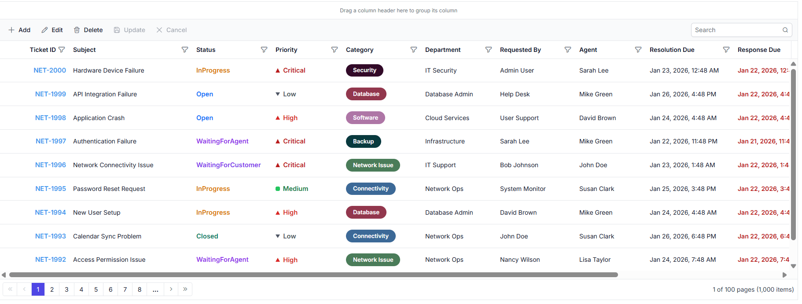

# Data Binding and CRUD Operations in Blazor WebApiAdaptor

This article demonstrates data retrieval from a WebAPI controller and binding to the DataGrid component through the [WebApiAdaptor](https://blazor.syncfusion.com/documentation/data/adaptors#web-api-adaptor) of `SfDataManager`, including support for CRUD operations.

The WebApiAdaptor of SfDataManager facilitates interaction with Web APIs configured with OData endpoints. Built as an extension of the ODataAdaptor, the WebApiAdaptor requires the target endpoint to process OData-formatted queries transmitted with each request.

To enable OData query options for Web API, refer to the [OData configuration documentation](https://learn.microsoft.com/en-us/aspnet/web-api/overview/odata-support-in-aspnet-web-api/supporting-odata-query-options)

## Connecting SQL Server to Blazor Data Grid Using Entity Framework

The [Syncfusion<sup style="font-size:70%">&reg;</sup> Blazor DataGrid](https://www.syncfusion.com/blazor-components/blazor-datagrid) supports binding data from a SQL Server database using Entity Framework Core (EF Core). This modern approach provides a more maintainable and type-safe alternative to raw SQL queries.

**What is Entity Framework Core?**

Entity Framework Core (EF Core) is a software tool that simplifies database operations in .NET applications. It serves as a bridge between C# code and databases like SQL Server.

**Key Benefits of Entity Framework Core**

- **Automatic SQL Generation**: Entity Framework Core generates optimized SQL queries automatically, eliminating the need to write raw SQL code.
- **Type Safety**: Work with strongly-typed objects instead of raw SQL strings, reducing errors.
- **Built-in Security**: Automatic parameterization prevents SQL injection attacks.
- **Version Control for Databases**: Manage database schema changes version-by-version through migrations.
- **Familiar Syntax**: Use LINQ (Language Integrated Query) syntax, which is more intuitive than raw SQL strings.

**What is Entity Framework Core SQL Server Provider?**

The **Microsoft.EntityFrameworkCore.SqlServer** package is the official Entity Framework Core provider for SQL Server. It acts as a bridge between Entity Framework Core and SQL Server, allowing applications to read, write, update, and delete data in a SQL Server database.

## Prerequisites

Ensure the following software and packages are installed before proceeding:

| Software/Package | Version | Purpose |
|-----------------|---------|---------|
| Visual Studio 2026 | 18.0 or later | Development IDE with Blazor workload |
| .NET SDK | net8.0 or compatible | Runtime and build tools |
| SQL Server | 2019 or later | Database server |
| Syncfusion.Blazor.Grids | {{site.blazorversion}} | DataGrid and UI components |
| Syncfusion.Blazor.Themes | {{site.blazorversion}} | Styling for DataGrid components |
| Microsoft.EntityFrameworkCore | 9.0.0 or later | Core framework for database operations |
| Microsoft.EntityFrameworkCore.Tools | 9.0.0 or later | Tools for managing database migrations |
| Microsoft.EntityFrameworkCore.SqlServer | 9.0.0 or later | SQL Server provider for Entity Framework Core |

## Setting Up the SQL Server Environment for Entity Framework Core

### Step 1: Create the database and Table in SQL Server

First, the **SQL Server database** structure must be created to store ticket records.

**Instructions:**
1. Open SQL Server Management Studio (SSMS) or any SQL Server client.
2. Create a new database named `NetworkSupportDB`.
3. Define a `Tickets` table with the specified schema.
4. Insert sample data for testing.

Run the following SQL script:

```sql
-- Create Database
IF NOT EXISTS (SELECT * FROM sys.databases WHERE name = 'NetworkSupportDB')
BEGIN
    CREATE DATABASE NetworkSupportDB;
END
GO

USE NetworkSupportDB;
GO

-- Create Tickets Table
IF NOT EXISTS (SELECT * FROM sys.tables WHERE name = 'Tickets')
BEGIN
    CREATE TABLE dbo.Tickets (
        TicketId INT PRIMARY KEY IDENTITY(1,1),
        PublicTicketId VARCHAR(50) NOT NULL UNIQUE,
        Title VARCHAR(200) NULL,
        Description TEXT NULL,
        Category VARCHAR(100) NULL,
        Department VARCHAR(100) NULL,
        Assignee VARCHAR(100) NULL,
        CreatedBy VARCHAR(100) NULL,
        Status VARCHAR(50) NOT NULL DEFAULT 'Open',
        Priority VARCHAR(50) NOT NULL DEFAULT 'Medium',
        ResponseDue DATETIME2 NULL,
        DueDate DATETIME2 NULL,
        CreatedOn DATETIME2 NOT NULL DEFAULT GETDATE(),
        UpdatedOn DATETIME2 NOT NULL DEFAULT GETDATE()
    );
END
GO

-- Insert Sample Data (Optional)
INSERT INTO dbo.Tickets (PublicTicketId, Title, Description, Category, Department, Assignee, CreatedBy, Status, Priority, ResponseDue, DueDate, CreatedOn, UpdatedOn)
VALUES
('NET-1001', 'Network Connectivity Issue', 'Users unable to connect to the VPN', 'Network Issue', 'Network Ops', 'John Doe', 'Alice Smith', 'Open', 'High', '2026-01-14 10:00:00', '2026-01-15 17:00:00', '2026-01-13 10:15:30', '2026-01-13 10:15:30'),
('NET-1002', 'Server Performance Degradation', 'Email server responding slowly', 'Performance', 'Infrastructure', 'Emily White', 'Bob Johnson', 'InProgress', 'Critical', '2026-01-13 15:00:00', '2026-01-14 17:00:00', '2026-01-13 11:20:10', '2026-01-13 11:20:10');
GO
```

After executing this script, the ticket records are stored in the `Tickets` table within the `NetworkSupportDB` database. The database is now ready for integration with the Blazor application.

---

### Step 2: Install Required NuGet Packages

Before installing the necessary NuGet packages, a new Blazor Web Application must be created using the default template.
This template automatically generates essential starter files—such as **Program.cs, appsettings.json, the wwwroot folder, and the Components folder**.

This guide uses a Blazor application named **Grid_MSSQL**. Once the project is set up, the next step involves installing the required NuGet packages. NuGet packages are software libraries that add functionality to the application. These packages enable Entity Framework Core and SQL Server integration.

**Method 1: Using Package Manager Console**

1. Open Visual Studio 2026.
2. Navigate to **Tools → NuGet Package Manager → Package Manager Console**.
3. Run the following commands:

```powershell
Install-Package Microsoft.EntityFrameworkCore -Version 9.0.0; 
Install-Package Microsoft.EntityFrameworkCore.Tools -Version 9.0.0; 
Install-Package Microsoft.EntityFrameworkCore.SqlServer -Version 9.0.0; 
Install-Package Syncfusion.Blazor.Grid -Version {{site.blazorversion}}; 
Install-Package Syncfusion.Blazor.Themes -Version {{site.blazorversion}}
```

**Method 2: Using NuGet Package Manager UI**

1. Open **Visual Studio 2026 → Tools → NuGet Package Manager → Manage NuGet Packages for Solution**.
2. Search for and install each package individually:
   - **Microsoft.EntityFrameworkCore** (version 9.0.0 or later)
   - **Microsoft.EntityFrameworkCore.Tools** (version 9.0.0 or later)
   - **Microsoft.EntityFrameworkCore.SqlServer** (version 9.0.0 or later)
   - **[Syncfusion.Blazor.Grid](https://www.nuget.org/packages/Syncfusion.Blazor.Grid/)** (version {{site.blazorversion}})
   - **[Syncfusion.Blazor.Themes](https://www.nuget.org/packages/Syncfusion.Blazor.Themes/)** (version {{site.blazorversion}})

All required packages are now installed.

### Step 3: Create the Data Model

A data model is a C# class that represents the structure of a database table. This model defines the properties that correspond to the columns in the `Tickets` table.

**Instructions:**

1. Create a new folder named `Data` in the Blazor application project.
2. Inside the `Data` folder, create a new file named **Tickets.cs**.
3. Define the **Tickets** class with the following code:

```csharp
using System.ComponentModel.DataAnnotations;

namespace Grid_MSSQL.Data
{
    /// <summary>
    /// Represents a ticket record mapped to the 'Tickets' table in the database.
    /// This model defines the structure of ticket-related data used throughout the application.
    /// </summary>
    public class Tickets
    {
        /// <summary>
        /// Gets or sets the unique identifier for the ticket record.
        /// </summary>
        [Key]
        public int TicketId { get; set; }

        /// <summary>
        /// Gets or sets the public-facing ticket identifier (e.g., NET-1001).
        /// </summary>
        public string? PublicTicketId { get; set; }

        /// <summary>
        /// Gets or sets the ticket title or subject.
        /// </summary>
        public string? Title { get; set; }

        /// <summary>
        /// Gets or sets a detailed description of the ticket.
        /// </summary>
        public string? Description { get; set; }

        /// <summary>
        /// Gets or sets the category of the issue (e.g., Network, Hardware, Software).
        /// </summary>
        public string? Category { get; set; }

        /// <summary>
        /// Gets or sets the department responsible for handling the ticket.
        /// </summary>
        public string? Department { get; set; }

        /// <summary>
        /// Gets or sets the name of the agent assigned to the ticket.
        /// </summary>
        public string? Assignee { get; set; }

        /// <summary>
        /// Gets or sets the name of the person who created the ticket.
        /// </summary>
        public string? CreatedBy { get; set; }

        /// <summary>
        /// Gets or sets the current status of the ticket (e.g., Open, In Progress, Resolved, Closed).
        /// </summary>
        public string? Status { get; set; }

        /// <summary>
        /// Gets or sets the priority level of the ticket (e.g., Critical, High, Medium, Low).
        /// </summary>
        public string? Priority { get; set; }

        /// <summary>
        /// Gets or sets the deadline for responding to the ticket.
        /// </summary>
        public DateTime? ResponseDue { get; set; }

        /// <summary>
        /// Gets or sets the deadline for resolving the ticket.
        /// </summary>
        public DateTime? DueDate { get; set; }

        /// <summary>
        /// Gets or sets the timestamp indicating when the ticket was created.
        /// </summary>
        public DateTime? CreatedOn { get; set; }

        /// <summary>
        /// Gets or sets the timestamp indicating when the ticket was last updated.
        /// </summary>
        public DateTime? UpdatedOn { get; set; }
    }
}
```

**Explanation:**
- The `[Key]` attribute marks the `TicketId` property as the primary key (a unique identifier for each record).
- Each property represents a column in the database table.
- The `?` symbol indicates that a property is nullable (can be empty).
- The model includes comprehensive XML documentation for each property.

The data model has been successfully created.

### Step 4: Configure the DbContext

A `DbContext` is a special class that manages the connection between the application and the SQL Server database. It handles all database operations such as saving, updating, deleting, and retrieving data.

**Instructions:**

1. Inside the `Data` folder, create a new file named **TicketsDbContext.cs**.
2. Define the `TicketsDbContext` class with the following code:

```csharp
using Microsoft.EntityFrameworkCore;

namespace Grid_MSSQL.Data
{
    /// <summary>
    /// DbContext for Tickets entity
    /// Manages database connections and entity configurations for the Network Support Ticket System
    /// </summary>
    public class TicketsDbContext : DbContext
    {
        public TicketsDbContext(DbContextOptions<TicketsDbContext> options)
            : base(options)
        {
        }

        /// <summary>
        /// DbSet for Ticket entities
        /// </summary>
        public DbSet<Tickets> Tickets => Set<Tickets>();

        /// <summary>
        /// Configures the entity mappings and constraints
        /// </summary>
        protected override void OnModelCreating(ModelBuilder modelBuilder)
        {
            base.OnModelCreating(modelBuilder);

            // Configure Tickets entity
            modelBuilder.Entity<Tickets>(entity =>
            {
                // Primary Key
                entity.HasKey(e => e.TicketId);

                // Auto-increment for Primary Key
                entity.Property(e => e.TicketId)
                    .ValueGeneratedOnAdd();

                // Column configurations
                entity.Property(e => e.PublicTicketId)
                    .HasMaxLength(50)
                    .IsRequired(true);

                entity.Property(e => e.Title)
                    .HasMaxLength(200)
                    .IsRequired(false);

                entity.Property(e => e.Description)
                    .HasMaxLength(int.MaxValue)  // For MAX type
                    .IsRequired(false);

                entity.Property(e => e.Category)
                    .HasMaxLength(100)
                    .IsRequired(false);

                entity.Property(e => e.Department)
                    .HasMaxLength(100)
                    .IsRequired(false);

                entity.Property(e => e.Assignee)
                    .HasMaxLength(100)
                    .IsRequired(false);

                entity.Property(e => e.CreatedBy)
                    .HasMaxLength(100)
                    .IsRequired(false);

                entity.Property(e => e.Status)
                    .HasMaxLength(50)
                    .IsRequired(false)
                    .HasDefaultValue("Open");

                entity.Property(e => e.Priority)
                    .HasMaxLength(50)
                    .IsRequired(false)
                    .HasDefaultValue("Medium");

                // DateTime columns
                entity.Property(e => e.ResponseDue)
                    .HasColumnType("datetime2")
                    .IsRequired(false);

                entity.Property(e => e.DueDate)
                    .HasColumnType("datetime2")
                    .IsRequired(false);

                entity.Property(e => e.CreatedOn)
                    .HasColumnType("datetime2")
                    .IsRequired(false)
                    .HasDefaultValueSql("GETDATE()");

                entity.Property(e => e.UpdatedOn)
                    .HasColumnType("datetime2")
                    .IsRequired(false)
                    .HasDefaultValueSql("GETDATE()");

                // Add indexes for frequently queried columns
                entity.HasIndex(e => e.PublicTicketId)
                    .HasDatabaseName("IX_PublicTicketId");

                entity.HasIndex(e => e.Status)
                    .HasDatabaseName("IX_Status");

                entity.HasIndex(e => e.CreatedOn)
                    .HasDatabaseName("IX_CreatedOn");

                // Table name and schema
                entity.ToTable("Tickets", schema: "dbo");
            });
        }
    }
}
```

**Explanation:**
- The `DbContext` class inherits from Entity Framework's `DbContext` base class.
- The `Tickets` property represents the `Tickets` table in the database.
- The `OnModelCreating` method configures how the database columns should behave (maximum length, required/optional, default values, data types, indexes, etc.).
- SQL Server-specific configurations include `datetime2` for timestamp columns and `GETDATE()` for default values.
- Database indexes are configured for improved query performance on frequently accessed columns.

The **TicketsDbContext** class is required because:

- It **connects** the application to the database.
- It **manages** all database operations.
- It **maps** C# models to actual database tables.
- It **configures** how data should look inside the database.
- It **enables** SQL Server-specific features like indexes and default value functions.

Without this class, Entity Framework Core will not know where to save data or how to create the Tickets table. The DbContext has been successfully configured.

### Step 5: Configure the Connection String

A connection string contains the information needed to connect the application to the SQL Server database, including the server address, database name, and authentication credentials.

**Instructions:**

1. Open the `appsettings.json` file in the project root.
2. Add or update the `ConnectionStrings` section with the SQL Server connection details:

```json
{
  "ConnectionStrings": {
    "DefaultConnection": "Data Source=CustomSQLServer;Initial Catalog=NetworkSupportDB;Integrated Security=True;Connect Timeout=30;Encrypt=False;Trust Server Certificate=False;Application Intent=ReadWrite;Multi Subnet Failover=False"
  },
  "Logging": {
    "LogLevel": {
      "Default": "Information",
      "Microsoft.AspNetCore": "Warning"
    }
  },
  "AllowedHosts": "*"
}
```

**Connection String Components:**

| Component | Description |
|-----------|-------------|
| Data Source | The address of the SQL Server instance (server name, IP address, or localhost) |
| Initial Catalog | The database name (in this case, `NetworkSupportDB`) |
| Integrated Security | Set to `True` for Windows Authentication; use `False` with Username/Password for SQL Authentication |
| Connect Timeout | Connection timeout in seconds (default is 15) |
| Encrypt | Enables encryption for the connection (set to `True` for production environments) |
| Trust Server Certificate | Whether to trust the server certificate (set to `False` for security) |
| Application Intent | Set to `ReadWrite` for normal operations or `ReadOnly` for read-only scenarios |
| Multi Subnet Failover | Used in failover clustering scenarios (typically `False`) |

The database connection string has been configured successfully.

### Step 6: Create the Grid API Controller

A controller exposes REST API endpoints for the grid to read data. This step adds minimal `Get` endpoint that return empty results. Additional CRUD endpoints will be added later when configuring WebApiAdaptor.

**Instructions:**

1. Create a new folder named `Controllers` in the project.
2. Inside the `Controllers` folder, create a new file named **TicketsController.cs**.
3. Add the following code:

```csharp
using Grid_MSSQL.Data;
using Microsoft.AspNetCore.Mvc;
using Microsoft.EntityFrameworkCore;

namespace Grid_MSSQL.Controllers
{
    [ApiController]
    [Route("api/[controller]")]
    public class TicketsController : ControllerBase
    {
        private readonly TicketsDbContext _context;

        public TicketsController(TicketsDbContext context)
        {
            _context = context;
        }

        [HttpGet]
        public object Get()
        {
            // Retrieve all records.
            List<Tickets> data = _context.Tickets.ToList();

            // Extract the query string from the incoming request.
            var queryString = Request.Query;

            // Calculate the total count of records before applying paging.
            int totalRecordsCount = data.Count();

            // Return the records along with the total count.
            return new { Items = data, Count = totalRecordsCount };
          
        }
    }
}

```

The controller has been created with basic endpoint.

### Step 7: Register Services in Program.cs

The `Program.cs` file is where application services are registered and configured. This step enables Entity Framework Core, controllers, Syncfusion Blazor, and maps controller routes.

**Instructions:**

1. Open the **Program.cs** file at the project root.
2. Add the following code after the line `var builder = WebApplication.CreateBuilder(args);`:

```csharp
using Grid_MSSQL.Components;
using Grid_MSSQL.Data;
using Syncfusion.Blazor;
using Microsoft.EntityFrameworkCore;

var builder = WebApplication.CreateBuilder(args);

// Add services to the container.
builder.Services.AddRazorComponents()
    .AddInteractiveServerComponents();
builder.Services.AddSyncfusionBlazor();

// ========== ENTITY FRAMEWORK CORE CONFIGURATION ==========
// Get connection string from appsettings.json
var connectionString = builder.Configuration.GetConnectionString("DefaultConnection");

if (string.IsNullOrEmpty(connectionString))
{
    throw new InvalidOperationException("Connection string 'DefaultConnection' not found in configuration.");
}

// Register DbContext with SQL Server provider
builder.Services.AddDbContext<TicketsDbContext>(options =>
{
    options.UseSqlServer(connectionString);

    // Enable detailed error messages in development
    if (builder.Environment.IsDevelopment())
    {
        options.EnableSensitiveDataLogging();
    }
});

builder.Services.AddControllers();


var app = builder.Build();

// Configure the HTTP request pipeline.
if (!app.Environment.IsDevelopment())
{
    app.UseExceptionHandler("/Error", createScopeForErrors: true);
    // The default HSTS value is 30 days. You may want to change this for production scenarios, see https://aka.ms/aspnetcore-hsts.
    app.UseHsts();
}
app.UseStatusCodePagesWithReExecute("/not-found", createScopeForStatusCodePages: true);
app.UseHttpsRedirection();
app.MapControllers();
app.UseAntiforgery();

app.MapStaticAssets();
app.MapRazorComponents<App>()
    .AddInteractiveServerRenderMode();
app.Run();
```

**Explanation:**

- `AddControllers()` registers MVC controllers for REST endpoints.
- `AddDbContext<TicketsDbContext>()` configures Entity Framework core to use SQL Server with the `ConnectionString` from appsettings.json.
- `MapControllers()` exposes routes like `/api/Tickets`.
- Syncfusion Blazor and Razor components are registered for the UI.

---

## Integrating Syncfusion Blazor DataGrid with WebApiAdaptor

### Step 1: Install and Configure Blazor DataGrid Components

Syncfusion is a library that provides pre-built UI components like DataGrid, which is used to display data in a table format.

**Instructions:**

* The Syncfusion.Blazor.Grids package was installed in **Step 2** of the previous heading.
* Import the required namespaces in the `Components/_Imports.razor` file:

```csharp
@using Syncfusion.Blazor
@using Syncfusion.Blazor.Grids
@using Syncfusion.Blazor.Data
@using Syncfusion.Blazor.DropDowns
@using Grid_MSSQL.Data
```

* Add the Syncfusion stylesheet and scripts in the `Components/App.razor` file. Find the `<head>` section and add:

```html
<!-- Syncfusion Blazor Stylesheet -->
<link href="_content/Syncfusion.Blazor.Themes/tailwind3.css" rel="stylesheet" />

<!-- Syncfusion Blazor Scripts -->
<script src="_content/Syncfusion.Blazor.Core/scripts/syncfusion-blazor.min.js" type="text/javascript"></script>
```
This example uses the tailwind3 theme. A different theme can be selected or the existing theme can be customized based on project requirements. Refer to the [Syncfusion Blazor Components Appearance](https://blazor.syncfusion.com/documentation/appearance/themes) documentation to learn more about theming and customization options.

Syncfusion components are now configured and ready to use. For additional guidance, refer to the Grid component's [getting‑started](https://blazor.syncfusion.com/documentation/datagrid/getting-started-with-web-app) documentation.

### Step 2: Update the Blazor DataGrid

The `Home.razor` component will display the ticket data in a Syncfusion Blazor DataGrid with paging, and CRUD capabilities using WebApiAdaptor to communicate with REST API endpoints.

**Instructions:**

1. Open the file named `Home.razor` in the `Components/Pages` folder.
2. Add the following code to create a basic DataGrid:

```cshtml
@page "/"
@rendermode InteractiveServer
<PageTitle>Network Support Ticket System</PageTitle>

<section class="bg-gray-50 dark:bg-gray-950">
    <div class="mx-auto w-full py-12 sm:px-6 px-4">
        <h1 class="mb-4 text-3xl font-bold">Network Support Ticket System</h1>
        <p class="mb-3 text-gray-600">Manage and view all support tickets from the database.</p>

        <!-- Syncfusion Blazor DataGrid Component -->
        <SfGrid TValue="Tickets" Width="100%" Height="500px" AllowPaging="true">
            <GridPageSettings PageSize="10"></GridPageSettings>
            <SfDataManager Url="api/Tickets" Adaptor="Adaptors.WebApiAdaptor"></SfDataManager>
            <GridColumns>
                <!-- Columns configuration -->
            </GridColumns>
        </SfGrid>
    </div>
</section>
```

**Component Explanation:**

- **`@rendermode InteractiveServer`**: Enables interactive server-side rendering for the component.
- **`<SfGrid>`**: The DataGrid component that displays data in rows and columns.
- **`<SfDataManager>`**: Manages data communication with REST API endpoints using WebApiAdaptor. The Url property points to the API endpoint.
- **`AllowPaging="true"`**: Enables pagination to display records in pages of 10 records each.
- **`<GridColumns>`**: Defines individual columns in the DataGrid.
- **`<GridPageSettings>`**: Configures pagination with 10 records per page.

The Home component has been updated successfully with DataGrid.

---

### Step 3: Implement the WebApiAdaptor

The WebApiAdaptor communicates with REST API endpoints for grid operations rather than executing logic in the component. The grid sends requests to endpoints defined in a controller. Below is the controller structure with the same decorators and signatures as in the project, with placeholder comments to add logic.

Open the file named **Controllers/TicketsController.cs** and use the following structure:

```csharp
using Grid_MSSQL.Data;
using Microsoft.AspNetCore.Mvc;
using Microsoft.EntityFrameworkCore;

namespace Grid_MSSQL.Controllers
{
    /// <summary>
    /// Repository pattern implementation for Tickets entity using Entity Framework Core
    /// Handles all CRUD operations and business logic for network support tickets
    /// </summary>

    [ApiController]
    [Route("api/[controller]")]
    public class TicketsController : ControllerBase
    {
        private readonly TicketsDbContext _context;

        public TicketsController(TicketsDbContext context)
        {
            _context = context;
        }

        /// <summary>
        /// Retrieves all tickets from the database 
        /// </summary>
        /// <returns>List of all tickets</returns>

        [HttpGet]
        public object Get()
        {
            // Retrieve all records.
            List<Tickets> data = _context.Tickets.ToList();

            // Extract the query string from the incoming request.
            var queryString = Request.Query;

            // Calculate the total count of records before applying paging.
            int totalRecordsCount = data.Count();

            // Return the records along with the total count.
            return new { Items = data, Count = totalRecordsCount };
          
        }

        /// <summary>
        /// Adds a new ticket to the database
        /// Generates PublicTicketId before insert
        /// </summary>
        /// <param name="value">The ticket model to add</param>

        [HttpPost]
        public async Task AddTicketAsync([FromBody] Tickets? value)
        {
            // implement logic here
        }

        /// <summary>
        /// Updates an existing ticket
        /// </summary>
        /// <param name="value">The ticket model with updated values</param>
        /// 
        [HttpPut]
        public async Task UpdateTicketAsync([FromBody] Tickets? value)
        {
           // implement logic here
        }

        /// <summary>
        /// Deletes a ticket from the database
        /// </summary>
        /// <param name="key">The ticket ID to delete</param>
        /// 
        [HttpDelete("{key}")]
        public async Task RemoveTicketAsync(int? key)
        {
            // implement logic here
        }
    }
}

```

When you run the application, the `Get()` method will be called in your API controller.

The response object from the Web API should contain the properties, `Items` and `Count`, whose values are a collection of entities and the total count of the entities, respectively.

The sample response object should look like this:

```
{
    "Items": [{..}, {..}, {..}, ...],
    "Count": 830
}
```

### Step 4: Running the Application

**Build the Application**

1. Open PowerShell or your terminal.
2. Navigate to the project directory.
3. Build the application:

```powershell
dotnet build
```

**Run the Application**

Execute the following command:

```powershell
dotnet run
```

**Access the Application**

1. Open a web browser.
2. Navigate to `https://localhost:5001` (or the port shown in the terminal).
3. The Network Support Ticket System is now running and ready to use.




### Step 5: Implement Paging Feature

Paging divides large datasets into smaller pages to improve performance and usability.

**Instructions:**

* Ensure the grid has paging enabled with `AllowPaging="true"`.
* Configure the page size using [GridPageSettings](https://help.syncfusion.com/cr/blazor/Syncfusion.Blazor.Grids.GridPageSettings.html).

```cshtml
<SfGrid TValue="Tickets" AllowPaging="true">
    <SfDataManager Url="api/Tickets" Adaptor="Adaptors.WebApiAdaptor"></SfDataManager>
    <GridColumns>
        <!-- Columns configuration -->
    </GridColumns>

    <GridPageSettings PageSize="10"></GridPageSettings>
</SfGrid>
```

* Update the `Get` action in **Controllers/TicketsController.cs** to handle paging by reading `$skip` and `$top` parameters from the query string:

```csharp
[HttpGet]
[Route("api/[controller]")]
public object Get()
{
    List<Tickets> data = _context.Tickets.ToList();

    // Extract the query string from the incoming request.
    var queryString = Request.Query;

    int totalRecordsCount = data.Count();

    // Extract the number of records to skip from the query string.
    int skip = Convert.ToInt32(queryString["$skip"]);

    // Extract the number of records to take from the query string.
    int take = Convert.ToInt32(queryString["$top"]);

    // Apply paging by skipping the specified number of records and taking the required number of records.
    return take != 0
        ? new { Items = data.Skip(skip).Take(take).ToList(), Count = totalRecordsCount }
        : new { Items = data, Count = totalRecordsCount };
  
}
```

**How Paging Works:**
- When the user navigates to a page, the WebApiAdaptor automatically sends a GET request to `http://localhost:xxxx/api/Tickets` with `$skip` and `$top` as query string parameters, where `$skip` is the number of records to bypass and `$top` is the number of records to fetch.
- The controller reads `$skip` and `$top` directly from **Request.Query** and applies `.Skip()` and `.Take()` on the dataset to return only the records for the requested page.

### Step 6: Perform CRUD Operations

CRUD operations (Create, Read, Update, Delete) enable users to manage data directly from the DataGrid. The REST API endpoints in the controller handle all database operations using Entity Framework Core.

**Instructions:**

1. Update the `<SfGrid>` component in `Home.razor` to include [GridEditSettings](https://help.syncfusion.com/cr/blazor/Syncfusion.Blazor.Grids.GridEditSettings.html):

```cshtml
 <SfGrid TValue="Tickets" Width="100%" Height="500px" AllowPaging="true" Toolbar="@(new List<string>() { "Add", "Edit", "Delete", "Update", "Cancel", "Search" })">
     <GridEditSettings AllowEditing="true" AllowDeleting="true" AllowAdding="true" Mode="EditMode.Normal"></GridEditSettings>
     <GridPageSettings PageSize="10"></GridPageSettings>
     <SfDataManager Url="api/Tickets" Adaptor="Adaptors.WebApiAdaptor"></SfDataManager>
     <GridColumns>
        // Add Columns
     </GridColumns>
 </SfGrid>
```

**Insert (Create)**

Record insertion allows new tickets to be added directly through the DataGrid component. When a new record is submitted, the DataGrid sends an `HttpPost` request to the Web API, which processes the request and saves the newly created record to the SQL Server database.

In **Controllers/TicketsController.cs**, the insert method is implemented as:

```csharp
/// <summary>
/// Adds a new ticket to the database
/// Generates PublicTicketId before insert
/// </summary>
[HttpPost]
[Route("api/[controller]")]
public async Task AddTicketAsync([FromBody] Tickets? value)
{
    try
    {
        if (value == null)
            throw new ArgumentNullException(nameof(value), "Ticket cannot be null");

        string generatedPublicTicketId = await GeneratePublicTicketIdAsync();
        value.PublicTicketId = generatedPublicTicketId;

        if (value.CreatedOn == null)
            value.CreatedOn = DateTime.Now;

        if (value.UpdatedOn == null)
            value.UpdatedOn = DateTime.Now;

        _context.Tickets.Add(value);

        await _context.SaveChangesAsync();
    }
    catch (DbUpdateException ex)
    {
        Console.WriteLine($"Database error while adding ticket: {ex.Message}");
        throw;
    }
    catch (Exception ex)
    {
        Console.WriteLine($"Error adding ticket: {ex.Message}");
        throw;
    }
}

 private async Task<string> GeneratePublicTicketIdAsync()
 {
     try
     {
         var existingTickets = await GetTicketsDataAsync();

         int maxNumber = existingTickets
             .Where(ticket => !string.IsNullOrEmpty(ticket.PublicTicketId) && ticket.PublicTicketId.StartsWith(PublicTicketIdPrefix))
             .Select(ticket =>
             {
                 string numberPart = ticket.PublicTicketId!.Substring((PublicTicketIdPrefix + PublicTicketIdSeparator).Length);
                 if (int.TryParse(numberPart, out int number))
                     return number;
                 return 0;
             })
             .DefaultIfEmpty(PublicTicketIdStartNumber - 1)
             .Max();
         int nextNumber = maxNumber + 1;
         string newPublicTicketId = $"{PublicTicketIdPrefix}{PublicTicketIdSeparator}{nextNumber}";

         return newPublicTicketId;
     }
     catch (Exception ex)
     {
         Console.WriteLine($"Error generating ticket ID: {ex.Message}");
         return $"{PublicTicketIdPrefix}{PublicTicketIdSeparator}{PublicTicketIdStartNumber}";
     }
 }
```

**Helper methods explanation:**
- `GeneratePublicTicketIdAsync()`: A new PublicTicketId is auto-generated using previously generated PublicTicketId.

**What happens behind the scenes:**

1. The user clicks the "Add" button and fills in the form.
2. The DataGrid sends a `HttpPost` request to `http://localhost:xxxx/api/Tickets`.
3. The new record is added to the `_context.Tickets` collection.
4. `SaveChangesAsync()` persists the record to the SQL Server database.
5. The DataGrid automatically refreshes to display the new record.

Now the new ticket is persisted to the database and reflected in the grid.

**Update (Edit)**

Record modification allows ticket details to be updated directly within the DataGrid. When an existing record is modified, the DataGrid sends an `HttpPut` request to the Web API, which processes the request and saves the updated record to the SQL Server database.

In **Controllers/TicketsController.cs**, the update method is implemented as:

```csharp
/// <summary>
/// Updates an existing ticket
/// </summary>
[HttpPut]
[Route("api/[controller]")]
public async Task UpdateTicketAsync([FromBody] Tickets? value)
{
    try
    {
        if (value == null)
            throw new ArgumentNullException(nameof(value), "Ticket cannot be null");

        if (value.TicketId <= 0)
            throw new ArgumentException("Ticket ID must be valid", nameof(value.TicketId));

        var existingTicket = await _context.Tickets.FindAsync(value.TicketId);
        if (existingTicket == null)
            throw new KeyNotFoundException($"Ticket with ID {value.TicketId} not found");

        existingTicket.PublicTicketId = value.PublicTicketId;
        existingTicket.Title = value.Title;
        existingTicket.Description = value.Description;
        existingTicket.Category = value.Category;
        existingTicket.Department = value.Department;
        existingTicket.Assignee = value.Assignee;
        existingTicket.CreatedBy = value.CreatedBy;
        existingTicket.Status = value.Status;
        existingTicket.Priority = value.Priority;
        existingTicket.ResponseDue = value.ResponseDue;
        existingTicket.DueDate = value.DueDate;
        existingTicket.CreatedOn = value.CreatedOn;
        existingTicket.UpdatedOn = DateTime.Now;

        await _context.SaveChangesAsync();
    }
    catch (DbUpdateConcurrencyException ex)
    {
        Console.WriteLine($"Concurrency error while updating ticket: {ex.Message}");
        throw;
    }
    catch (DbUpdateException ex)
    {
        Console.WriteLine($"Database error while updating ticket: {ex.Message}");
        throw;
    }
    catch (Exception ex)
    {
        Console.WriteLine($"Error updating ticket: {ex.Message}");
        throw;
    }
}
```

**What happens behind the scenes:**

1. The user clicks the "Edit" button and modifies the record.
2. The DataGrid sends an `HttpPut` request to `http://localhost:xxxx/api/Tickets`.
3. The existing record is retrieved from the database by ID.
4. All properties are updated with the new values.
5. `SaveChangesAsync()` persists the changes to the SQL Server database.
6. The DataGrid refreshes to display the updated record.

Now modifications are synchronized to the database and reflected in the grid UI.

**Delete (Remove)**

Record deletion allows tickets to be removed directly from the DataGrid. When a record is deleted, the DataGrid sends an `HttpDelete` request to the Web API, which processes the request and removes the corresponding record from the SQL Server database.

In **Controllers/TicketsController.cs**, the delete method is implemented as:

```csharp
/// <summary>
/// Deletes a ticket from the database
/// </summary>
[HttpDelete("{key}")]
[Route("api/[controller]")]
public async Task RemoveTicketAsync(int? key)
{
    try
    {
        if (key == null || key <= 0)
            throw new ArgumentException("Ticket ID cannot be null or invalid", nameof(key));

        var ticket = await _context.Tickets.FindAsync(key);
        if (ticket == null)
            throw new KeyNotFoundException($"Ticket with ID {key} not found");

        _context.Tickets.Remove(ticket);
        await _context.SaveChangesAsync();
    }
    catch (DbUpdateException ex)
    {
        Console.WriteLine($"Database error while deleting ticket: {ex.Message}");
        throw;
    }
    catch (Exception ex)
    {
        Console.WriteLine($"Error deleting ticket: {ex.Message}");
        throw;
    }
}
```

**What happens behind the scenes:**

1. The user selects a ticket and clicks "Delete".
2. A confirmation dialog appears (built into the DataGrid).
3. If confirmed, the DataGrid sends a `HttpDelete` request to `http://localhost:xxxx/api/Tickets`.
4. The record is located in the database by its ID.
5. The record is removed from the `_context.Tickets` collection.
6. `SaveChangesAsync()` executes the DELETE statement in SQL Server.
7. The DataGrid refreshes to remove the deleted record from the UI.

Now tickets are removed from the database and the grid UI reflects the changes immediately.

---

## Complete Sample Repository

A complete, working sample implementation is available in the [GitHub repository](https://github.com/SyncfusionExamples/binding-webapi-services-and-perform-crud).

---

## Summary

This guide demonstrates how to:

1. Create a SQL Server database with ticket records. [🔗](#step-1-create-the-database-and-table-in-sql-server)
2. Install necessary NuGet packages for Entity Framework Core and Syncfusion. [🔗](#step-2-install-required-nuget-packages)
3. Create data models and DbContext for database communication. [🔗](#step-3-create-the-data-model)
4. Configure connection strings and register services. [🔗](#step-5-configure-the-connection-string)
5. Create REST API endpoints in a controller for CRUD operations. [🔗](#step-6-Create-the-Grid-API-Controller)
6. Create a Blazor component with a DataGrid that supports paging, and CRUD operations. [🔗](#step-1-install-and-configure-blazor-datagrid-components)
7. Perform complete CRUD operations (Create, Read, Update, Delete) via REST API. [🔗](#step-6-perform-crud-operations)

The application now provides a complete solution for managing tickets with a modern, user-friendly interface using Entity Framework Core with SQL Server and REST API endpoints via WebApiAdaptor.