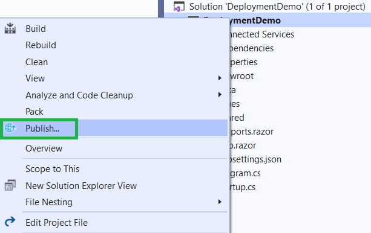
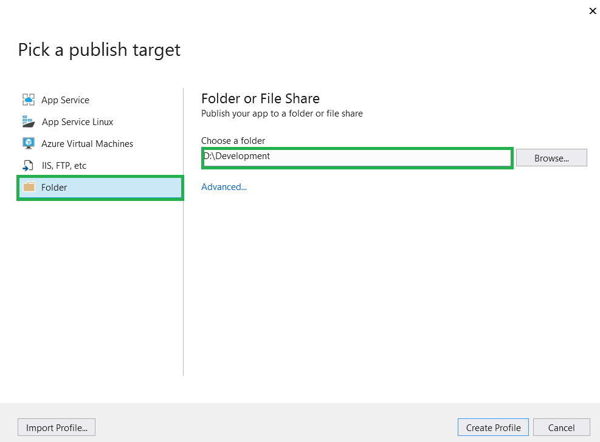
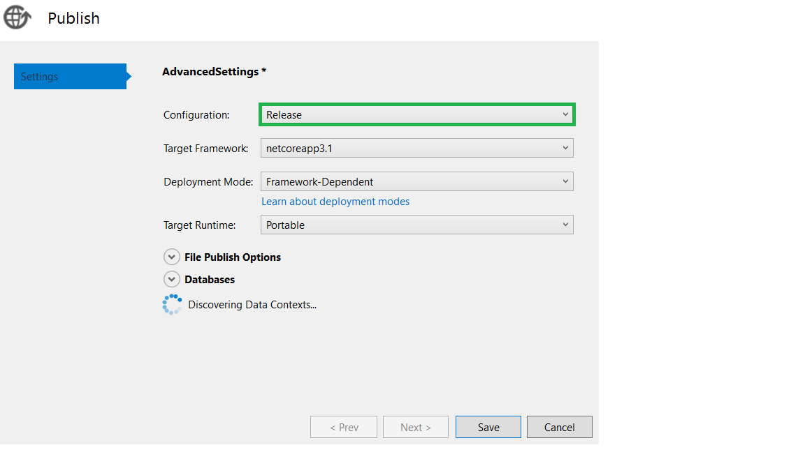
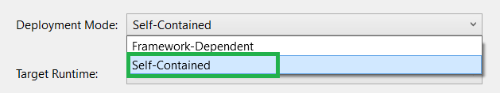

# Deployment in Blazor

This section provides information about deploying Blazor applications with the Syncfusion Blazor components. 

Refer to [Host and deploy ASP.NET Core Blazor](https://docs.microsoft.com/en-us/aspnet/core/blazor/host-and-deploy/) topic for more information.

## Publish Blazor Application with Visual Studio

* Right-click on the project in the `Solution Explorer` and select `Publish`.



* Then, select the `Folder` option and select the publishing target location.



* Check the configuration as Release by clicking the `Advanced...` option below the target location.



* For `Blazor Server side application`, set Deployment Mode as `Self-Contained`. Because some dependencies are not loaded properly when the published folder is hosted.



* Then, click `Save` and `Publish`.

    > Refer [here](https://docs.microsoft.com/en-us/visualstudio/deployment/quickstart-deploy-to-azure?view=vs-2019) for publishing the application to Azure App Service using Visual Studio.  

## Publish Blazor Application with CLI

Packing the application and its dependencies into a folder for deployment to a hosting system by using the `dotnet publish` command.

For CLI deployment, run the following command from your root directory.

```
dotnet publish -c Release
```

For Blazor Server CLI deployment.

```
dotnet publish -c Release --self-contained true -r win-x86
```

Refer to the dotnet publish\'s [optional arguments](https://docs.microsoft.com/en-us/dotnet/core/tools/dotnet-publish?tabs=netcore21#arguments).

Use the following command to specify the path for the output directory.

```
dotnet publish -c Release -o <output directory>
```

> If the output directory is not specified, it defaults to **./bin/[configuration]/[framework]/publish/** for a **framework-dependent deployment** or **./bin/[configuration]/[framework]/[runtime]/publish/** for a **self-contained deployment**.

If the path is relative, the output directory generated is relative to the project file location, not to the current working directory.

Also, refer to the MSDN reference [here](https://docs.microsoft.com/en-us/aspnet/core/host-and-deploy/azure-apps/?view=aspnetcore-3.1&tabs=netcore-cli#deploy-the-app-self-contained).

Now, you can host the published folder by using the IIS or Azure app service.

## See Also

* [Host and Deploy blazor](https://docs.microsoft.com/en-us/aspnet/core/host-and-deploy/blazor/?view=aspnetcore-3.1&tabs=visual-studio)
* [Host and deploy blazor server](https://docs.microsoft.com/en-us/aspnet/core/host-and-deploy/blazor/server)
* [Host and deploy ASP.NET Core Blazor WebAssembly](https://docs.microsoft.com/en-us/aspnet/core/host-and-deploy/blazor/webassembly)
* [Publish a Web app to Azure App Service using Visual Studio](https://docs.microsoft.com/en-us/visualstudio/deployment/quickstart-deploy-aspnet-web-app)
* [Deploy ASP.NET Core apps to Azure App Service](https://docs.microsoft.com/en-us/aspnet/core/host-and-deploy/azure-apps/)