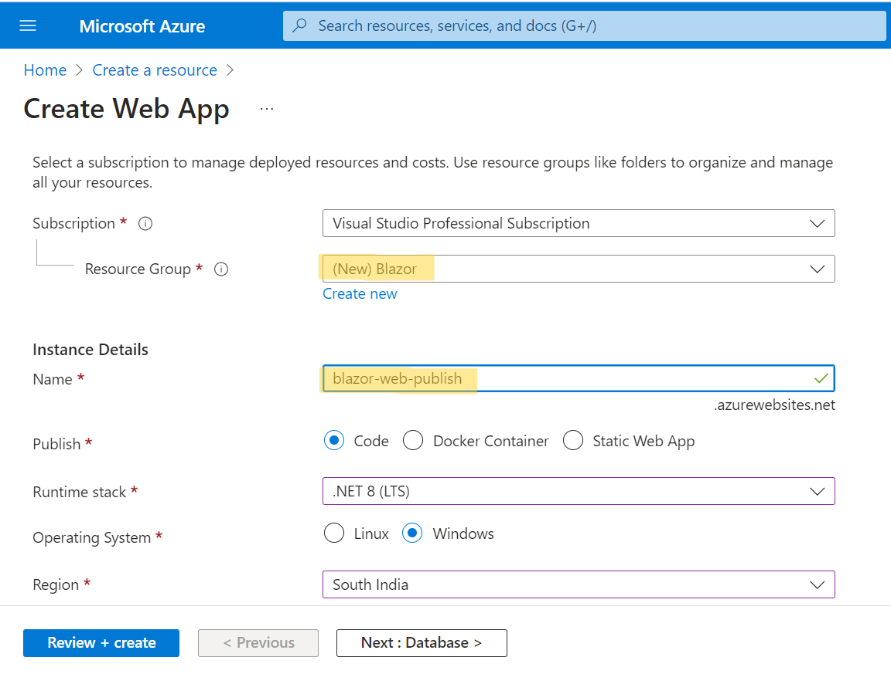

# Deploy Blazor Web App to Azure App Service

This section provides information about deploying a Blazor Web applications with the Syncfusion Blazor components to Azure App Service.

Refer to [Host and deploy ASP.NET Core Blazor](https://learn.microsoft.com/en-us/aspnet/core/blazor/host-and-deploy/?view=aspnetcore-7.0&tabs=visual-studio) topic for more information.

## Deployment procedure

If you don’t have a login for Azure, [sign up](https://azure.microsoft.com/en-in/free/) to access the Azure Portal.

### Create a resource in Azure

* Click **Create a resource** in Azure Portal to create a resource group.

* Select **Web App** Azure application service.

* After selecting Web App option, choose an appropriate resource group name and instance details.

* Once this is done, click **Review + create**.

* After configuring the Web App service. Select the created web app service (blazor-web-publish).

* Now, select the **overview** section, click on **Download publish profile**, and save the profile locally.

### Publish the Application in Azure

#### Using Azure account login

* To publish the project, right-click on it and choose **Publish** from the context menu.

* Select **Azure** as the target and **Azure App Service (Windows)**  as the specific target.

* You need to log into your Azure account and choose the web app service (blazor-web-publish) that you have created. Then, click **Publish**.

#### Using Import Profile option

* To publish the project, right-click on it and choose **Publish** from the context menu.

* Select **Import Profile** as the target and browse the downloaded publish folder. Then, click **Publish**

* Now, the application will be deployed and will be available in the specified URL: https://blazor-web-publish.azurewebsites.net/.

## See also

Refer [here](https://learn.microsoft.com/en-us/azure/app-service/quickstart-dotnetcore?tabs=net70&pivots=development-environment-vs#publish-your-web-app) for publishing the application to Azure App Service using Visual Studio.