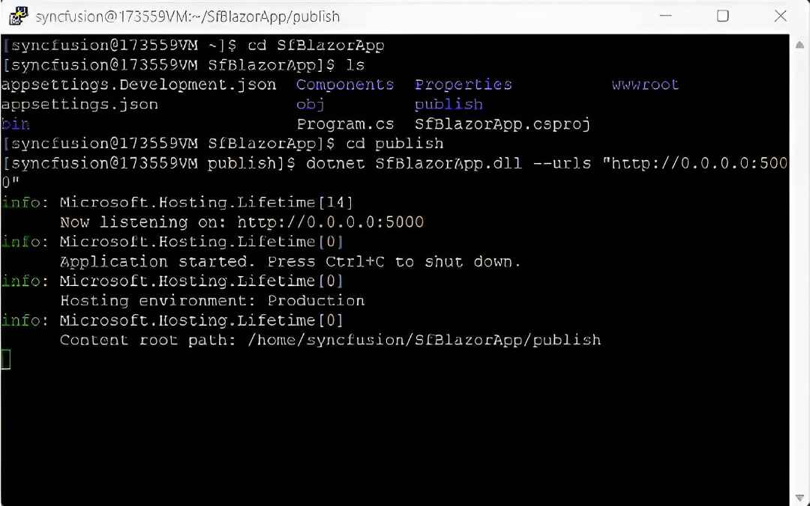
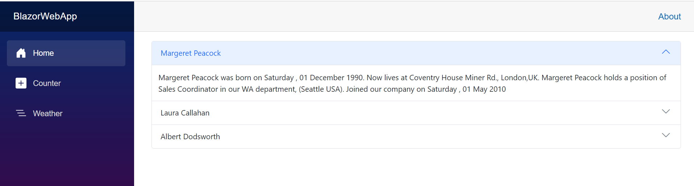

# Deploy Blazor Web App to Linux with NGINX

This section provides information about deploying a Blazor Web applications with the Syncfusion Blazor components to Linux server using NGINX as a reverse proxy.

Refer to [Host ASP.NET Core on Linux with NGINX](https://learn.microsoft.com/en-us/aspnet/core/host-and-deploy/linux-nginx?view=aspnetcore-9.0&tabs=linux-ubuntu) topic for more information.

## Prerequisites

* Linux Server – Ubuntu 20.04, Red Hat Enterprise (RHEL) 8.0 and SUSE Linux Enterprise Server 12.
* [.NET runtime](https://blazor.syncfusion.com/documentation/system-requirements#net-sdk) installed on the server.
* An existing Blazor Web App with Syncfusion components or create a new one.

## Install and Start NGINX

Install NGINX on your Linux system and enable it to start automatically:

```bash
sudo dnf install nginx
sudo systemctl start nginx
sudo systemctl enable nginx
sudo systemctl status nginx
```

**Verification**: Open `http://your-server-ip` in a browser — you should see the NGINX welcome page.

## Create and publish Your Blazor Web App with Syncfusion Components

* You can create a Blazor Web App using the .NET CLI commands with Syncfusion components by referring [here](https://blazor.syncfusion.com/documentation/getting-started/blazor-web-app?tabcontent=.net-cli).

* Publish your Blazor Web application in Release configuration using the following command and run it:

```bash
dotnet publish -c Release -o publish
cd publish
dotnet SfBlazorApp.dll --urls "http://0.0.0.0:5000"
```



## Configure NGINX to Proxy Requests

Create a new NGINX configuration file for your Blazor application:

```bash
sudo nano /etc/nginx/conf.d/blazorapp.conf
```

Add the following configuration to enable NGINX to act as a reverse proxy:

```nginx
server {
    listen 80;
    server_name _;
    location / {
        proxy_pass http://localhost:5000;
        proxy_http_version 1.1;
        proxy_set_header Host $host;
        proxy_set_header X-Real-IP $remote_addr;
        proxy_set_header X-Forwarded-For $proxy_add_x_forwarded_for;
        proxy_set_header X-Forwarded-Proto $scheme;
        proxy_set_header Upgrade $http_upgrade;
        proxy_set_header Connection "upgrade";
    }
}
```

Save and exit the file (Ctrl+O, Enter, then Ctrl+X).

## Validate and Restart NGINX

Test the NGINX configuration and restart the service:

```bash
sudo nginx -t
sudo systemctl restart nginx
```

## Configure SELinux (For Red Hat-based Systems)

On Red Hat-based systems, SELinux may block NGINX from accessing your Blazor app. Allow NGINX to connect to network services:

```bash
sudo setsebool -P httpd_can_network_connect 1
```

## Access the Application

From your Windows machine or any other device, open a browser and navigate to:

```
http://<your-vm-ip>/
```

You should now see your Blazor Web app running successfully with Syncfusion components!



## See also

* [Host ASP.NET Core on Linux with NGINX](https://learn.microsoft.com/en-us/aspnet/core/host-and-deploy/linux-nginx?view=aspnetcore-9.0)
* [Configure NGINX for ASP.NET Core](https://learn.microsoft.com/en-us/aspnet/core/host-and-deploy/linux-nginx?view=aspnetcore-9.0#configure-nginx)
