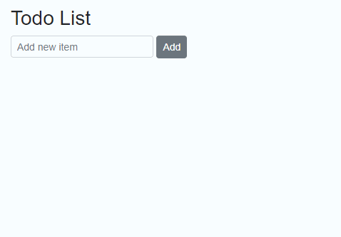

# Extend, Customize, and Reuse Components

The Blazor framework provides the support to extend a component or customize it within another component for a strong composite model.

## Extend Syncfusion Blazor component

The Syncfusion Blazor components can extend and customize the logic by creating a new Blazor component.

1. Right-click on the `~/Pages` folder in the Visual Studio and select `Add -> Razor Component` to create a new Razor component (SyncButton.razor).

2. Inherit any Syncfusion Blazor component and render your component based on your logic with Syncfusion Blazor API.

    ```cshtml
    @inherits SfButton;

    <button class="@className" disabled="@Disabled">@Content</button>

    @code {
        private string className = "btn";

        [Parameter]
        public ButtonStyles Styles { get; set; }

        public enum ButtonStyles
        {
            Basic,
            Success,
            Info,
            Warning,
            Danger
        }

        protected override void OnInitialized()
        {
            base.OnInitialized();
            ApplyStyles();
        }

        private void ApplyStyles()
        {
            if (IsPrimary)
            {
                className += " btn-primary";
            }
            else if (Styles == ButtonStyles.Success)
            {
                className += " btn-success";
            }
            else if (Styles == ButtonStyles.Info)
            {
                className += " btn-info";
            }
            else if (Styles == ButtonStyles.Warning)
            {
                className += " btn-warning";
            }
            else
            {
                className += " btn-danger";
            }
        }
    }

    ```

3. Render your new component in the view page `~/Pages/Index.razor` and run the application.

    ```cshtml
    <SyncButton Content="Primary" IsPrimary="true" Disabled="true"></SyncButton>
    <SyncButton Content="Success" Styles="SyncButton.ButtonStyles.Success"></SyncButton>
    <SyncButton Content="Info" Styles="SyncButton.ButtonStyles.Info"></SyncButton>
    <SyncButton Content="Warning" Styles="SyncButton.ButtonStyles.Warning"></SyncButton>
    <SyncButton Content="Danger" Styles="SyncButton.ButtonStyles.Danger"></SyncButton>
    ```

    

## Use Syncfusion Blazor component within another Blazor component

The Syncfusion Blazor component can be implemented within another Blazor component.

1. Right-click on the `~/Pages` folder in the Visual Studio and select `Add -> Razor Component` to create a new Razor component (TodoList.razor).

2. Add any Syncfusion Blazor component to the newly created Blazor component.

    ```cshtml
    <h3>Todo List</h3>

    @using Syncfusion.Blazor.Inputs;
    @using Syncfusion.Blazor.Buttons;
    @using Syncfusion.Blazor.Lists;

    <div class="form-group">
        <SfTextBox @oninput="UpdateItem" @bind-Value="@item" Placeholder="Add new item" Width="200px"></SfTextBox>

        <SfButton @onclick="AddItem">Add</SfButton>
    </div>


    @if (items.Count > 0)
    {
        <SfListView DataSource="@items">
            <ListViewFieldSettings TValue="ItemModel" Id="Id" Text="Text"></    ListViewFieldSettings>
        </SfListView>
    }

    @code {
        private string item;
        private List<ItemModel> items = new List<ItemModel>();

        private void UpdateItem(Microsoft.AspNetCore.Components.ChangeEventArgs     args)
        {
            item = args.Value.ToString();
        }

        // Add new items on button click.
        private void AddItem()
        {
            if (item != null && item.Length > 0)
            {
                var newItem = new ItemModel(items.Count + 1, item);
                items.Add(newItem);
                item = null;
            }
        }

        // List view data source model.
        public class ItemModel
        {
            public ItemModel(int id, string text)
            {
                Id = id;
                Text = text;
            }
            public int Id { get; set; }
            public string Text { get; set; }
        }
    }

    ```

3. Render your new component in the view page `~/Pages/Index.razor` and run the application.

    ```cshtml
    <TodoList></TodoList>
    ```

    

## Render Syncfusion Blazor component dynamically

The following methods can be used to render the Syncfusion Blazor components dynamically:

1. [RenderFragment](https://learn.microsoft.com/en-us/dotnet/api/microsoft.aspnetcore.components.renderfragment?view=aspnetcore-5.0) with [Razor Template Syntax](https://learn.microsoft.com/en-us/aspnet/core/blazor/components/?view=aspnetcore-5.0#razor-templates)
2. [RenderFragment](https://learn.microsoft.com/en-us/dotnet/api/microsoft.aspnetcore.components.renderfragment?view=aspnetcore-5.0) with [RenderTreeBuilder](https://learn.microsoft.com/en-us/dotnet/api/microsoft.aspnetcore.components.rendering.rendertreebuilder?view=aspnetcore-5.0) methods
3. [BuildRenderTree](https://learn.microsoft.com/en-us/dotnet/api/microsoft.aspnetcore.components.componentbase.buildrendertree?view=aspnetcore-7.0) method

### RenderFragment with Razor Syntax

The `RenderFragment` represents the segments of UI content that can be reused in the view page based on the application logic.

You can use [Razor Template Syntax](https://learn.microsoft.com/en-us/aspnet/core/blazor/components/?view=aspnetcore-5.0#razor-templates) to define the `RenderFragment` in the view page.

The following code demonstrates the RenderFragment that renders the `SfButton` component.

```cshtml
@{
    RenderFragment<string> ButtonFragment = content =>
    @<SfButton>@content</SfButton>;
}

@ButtonFragment("My Button")
```

The following code demonstrates the RenderFragment that renders the `SfGrid` component.

```cshtml
@{
    RenderFragment<List<Order>> GridFragment = dataModel =>
    @<SfGrid DataSource="@dataModel"></SfGrid>;
}

@GridFragment(orders)

@code {
    private List<Order> orders { get; set; }
    public class Order
    {
        public int? OrderID { get; set; }
        public string CustomerID { get; set; }
    }

    protected override void OnInitialized()
    {
        orders = Enumerable.Range(1, 5).Select(x => new Order()
        {
            OrderID = 1000 + x,
            CustomerID = (new string[] { "ALFKI", "ANANTR", "ANTON", "BLONP", "BOLID" })[new Random().Next(5)]
        }).ToList();
    }
}
```

## RenderFragment with RenderTreeBuilder methods

You can define the RenderFragment delegate with [RenderTreeBuilder](https://learn.microsoft.com/en-us/dotnet/api/microsoft.aspnetcore.components.rendering.rendertreebuilder?view=aspnetcore-5.0)'s methods.

N> Refer to [Manual RenderTreeBuilder logic](https://learn.microsoft.com/en-us/aspnet/core/blazor/advanced-scenarios?view=aspnetcore-5.0#manual-rendertreebuilder-logic) to know more about RenderTreeBuilder.

```cshtml
@RenderSfButton()

@code {
    private RenderFragment RenderSfButton()
    {
        RenderFragment button = b =>
        {
            b.OpenComponent<SfButton>(0);
            b.AddAttribute(1, "Content", "My Button");
            b.CloseComponent();
        };
        return button;
    }
}
```

You can render the nested components by using `RenderFragment`.

```cshtml
<SfChip>
    <ChipItems>
        @RenderChipItem("Apple")
        @RenderChipItem("Banana")
        @RenderChipItem("Mango")
    </ChipItems>
</SfChip>

@code {
    private RenderFragment RenderChipItem(string text)
    {
        RenderFragment chipItem = b =>
        {
            b.OpenComponent<ChipItem>(0);
            b.AddAttribute(1, "Text", text);
            b.CloseComponent();
        };
        return chipItem;
    }
}
```

## BuildRenderTree method

The `BuildRenderTree` is an override method that can be used to render a reusable component dynamically.

Suppose, if you want to add multiple text-boxes in your application with the same properties and values, you may feel like the code is repeatedly used. For example, the below form component has similar textbox settings and is wrapped with a bootstrap `form-group` class.

```cshtml
<div class="form-group">
    <label for="first-name">First Name:</label>
    <SfTextBox ID="first-name" CssClass="e-small" Autocomplete="AutoComplete.Off" ShowClearButton="true" Width="250px"></SfTextBox>
</div>
<div class="form-group">
    <label for="last-name">Last Name:</label>
    <SfTextBox ID="last-name" CssClass="e-small" Autocomplete="AutoComplete.Off" ShowClearButton="true" Width="250px"></SfTextBox>
</div>
<div class="form-group">
    <label for="address">Address:</label>
    <SfTextBox ID="address" CssClass="e-small" Autocomplete="AutoComplete.Off" ShowClearButton="true" Width="250px"></SfTextBox>
</div>
<div class="form-group">
    <label for="age">Age:</label>
    <SfTextBox ID="age" CssClass="e-small" Autocomplete="AutoComplete.Off" ShowClearButton="true" Width="250px"></SfTextBox>
</div>
<div class="form-group">
    <label for="city">City:</label>
    <SfTextBox ID="city" CssClass="e-small" Autocomplete="AutoComplete.Off" ShowClearButton="true" Width="250px"></SfTextBox>
</div>
<div class="form-group">
    <label for="country">Country:</label>
    <SfTextBox ID="country" CssClass="e-small" Autocomplete="AutoComplete.Off" ShowClearButton="true" Width="250px"></SfTextBox>
</div>
```

You can create a simple Blazor component with the `BuildRenderTree` method and get the repeated properties in a `Dictionary` field and reuse it.

1. Right-click on the `~/Pages` folder in the Visual Studio and select `Add -> Class` to create a new class file (SyncTextBox.cs).

2. Inherit the newly created class with [ComponentBase](https://learn.microsoft.com/en-us/dotnet/api/microsoft.aspnetcore.components.componentbase?view=aspnetcore-7.0) and override the [BuildRenderTree](https://learn.microsoft.com/en-us/dotnet/api/microsoft.aspnetcore.components.componentbase.buildrendertree?view=aspnetcore-7.0) method to create the component.

    ```c#
    using Microsoft.AspNetCore.Components;
    using Microsoft.AspNetCore.Components.Rendering;
    using Syncfusion.Blazor.Inputs;
    using System.Collections.Generic;

    namespace InputValidationApp.Pages
    {
        public class SyncTextBox : ComponentBase
        {
            [Parameter]
            public string ID { get; set; }

            [Parameter]
            public string Label { get; set; }

            [Parameter]
            public Dictionary<string, object> TextAttributes { get; set; }
            protected override void BuildRenderTree(RenderTreeBuilder builder)
            {
                // create div element.
                builder.OpenElement(0, "div");
                builder.AddAttribute(1, "class", "form-group");

                // creating label element.
                builder.OpenElement(2, "label");
                builder.AddAttribute(3, "for", ID);
                builder.AddContent(4, Label);
                builder.CloseElement();

                // create Syncfusion TextBox component.
                builder.OpenComponent<SfTextBox>(5);
                builder.AddAttribute(6, "ID", ID);
                // Added similar attributes used in the component.
                if (TextAttributes != null)
                {
                    builder.AddMultipleAttributes(3, TextAttributes);
                }
                builder.CloseComponent();
                builder.CloseElement();
            }
        }
    }
    ```

3. Now, render the new reusable Blazor component in the `~/Pages/Index.razor` page and run the application.

    ```cshtml
    <SyncTextBox ID="first-name" Label="First Name:" TextAttributes="@textAttributes"></SyncTextBox>
    <SyncTextBox ID="last-name" Label="Lat Name:" TextAttributes="@textAttributes"></SyncTextBox>
    <SyncTextBox ID="address" Label="Address:" TextAttributes="@textAttributes"></SyncTextBox>
    <SyncTextBox ID="age" Label="Age:" TextAttributes="@textAttributes"></SyncTextBox>
    <SyncTextBox ID="city" Label="City:" TextAttributes="@textAttributes"></SyncTextBox>
    <SyncTextBox ID="country" Label="Country:" TextAttributes="@textAttributes"></SyncTextBox>

    @code {
        public Dictionary<string, object> textAttributes { get; set; } =
            new Dictionary<string, object>() {
                { "CssClass", "e-small" },
                { "Autocomplete", AutoComplete.Off },
                { "Width" , "250px" },
                { "ShowClearButton", true }
            };
    } 
    ```

    N> The advantages of a reusable component are:
    <br/> 1. Instead of changing values in each component, you can change a property value once and it will be reflected in all the components.
    <br/> 2. Better code optimization against the repeated code.
