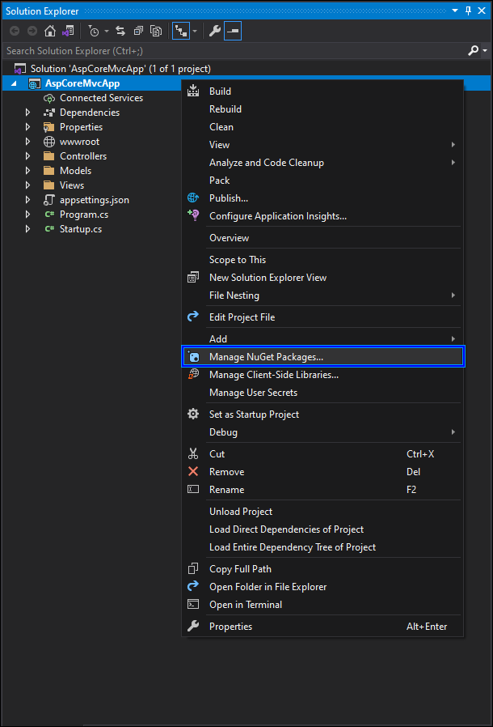
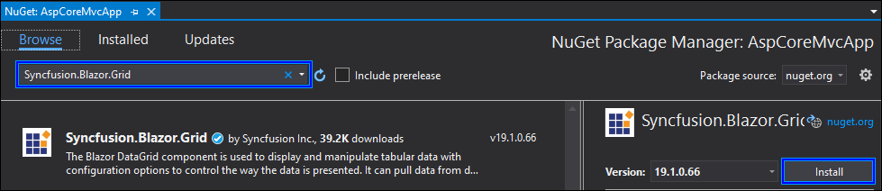
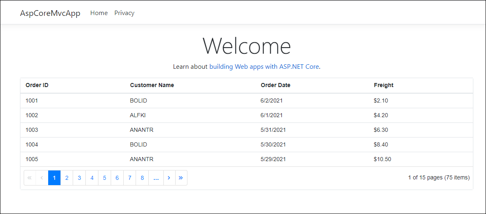

# Add a Blazor component to an existing ASP.NET Core MVC application

This guide explains how to add a Syncfusion<sup style="font-size:70%">&reg;</sup> Blazor component to an existing ASP.NET Core MVC application.

1. Open the existing ASP.NET Core MVC application in Visual Studio 2022.

2. Right-click the project and select `Manage NuGet Packages`.

    

3. Search for the `Syncfusion.Blazor.Grid` and `Syncfusion.Blazor.Themes` NuGet packages and install them.

    

4. Register Blazor Server and Syncfusion<sup style="font-size:70%">&reg;</sup> Blazor services in the `~/Program.cs` file.

    ```c#
    using Syncfusion.Blazor;
    ....
    builder.Services.AddServerSideBlazor();
    builder.Services.AddSyncfusionBlazor();

    ```

5. Add BlazorHub in the `~/Program.cs` file.

    ```c#
    // Map your endpoints here...

    app.MapRazorPages();
    app.MapBlazorHub();
    app.MapFallbackToPage("/_Host");
    ```

6. Create a `~/_Imports.razor` file at the root of the application and add the following namespaces.

    ```cshtml
    @using System.Net.Http
    @using Microsoft.AspNetCore.Authorization
    @using Microsoft.AspNetCore.Components.Authorization
    @using Microsoft.AspNetCore.Components.Forms
    @using Microsoft.AspNetCore.Components.Routing
    @using Microsoft.AspNetCore.Components.Web
    @using Microsoft.AspNetCore.Components.Web.Virtualization
    @using Microsoft.JSInterop
    @using AspCoreMvcApp;
    @using Syncfusion.Blazor
    @using Syncfusion.Blazor.Grids
    ```

7. Add Blazor script references at the end of the `<body>` tag and Syncfusion<sup style="font-size:70%">&reg;</sup> theme and script references inside the `<head>` tag in the `~/Views/Shared/_Layout.cshtml` file.

    ```cshtml
    <head>
        ....
        ....
        <link href="_content/Syncfusion.Blazor.Themes/bootstrap4.css" rel="stylesheet" />
        <script src="_content/Syncfusion.Blazor.Core/scripts/syncfusion-blazor.min.js" type="text/javascript"></script>
    </head>
    <body>
        ....
        ....
        <script src="_framework/blazor.server.js"></script>
    </body>
    ```

8. Create a new `~/Components` folder at the root of the application. Right-click the `~/Components` folder and add a new razor component via `Add -> Razor Component`.

9. Add the Syncfusion<sup style="font-size:70%">&reg;</sup> Blazor component in the created razor component file.

    ```cshtml
    <SfGrid DataSource="@Orders" AllowPaging="true">
        <GridPageSettings PageSize="5"></GridPageSettings>
        <GridColumns>
            <GridColumn Field=@nameof(Order.OrderID) HeaderText="Order ID" Width="120"></GridColumn>
            <GridColumn Field=@nameof(Order.CustomerID) HeaderText="Customer Name" Width="150"></GridColumn>
            <GridColumn Field=@nameof(Order.OrderDate) HeaderText=" Order Date" Format="d" Width="130"></GridColumn>
            <GridColumn Field=@nameof(Order.Freight) Format="C2" Width="120"></GridColumn>
        </GridColumns>
    </SfGrid>

    @code{
        public List<Order> Orders { get; set; }

        protected override void OnInitialized()
        {
            Orders = Enumerable.Range(1, 50).Select(x => new Order()
            {
                OrderID = 1000 + x,
                CustomerID = (new string[] { "ALFKI", "ANANTR", "ANTON", "BLONP", "BOLID" })[new Random().Next(5)],
                Freight = 2.1 * x,
                OrderDate = DateTime.Now.AddDays(-x),
            }).ToList();
        }

        public class Order
        {
            public int? OrderID { get; set; }
            public string CustomerID { get; set; }
            public DateTime? OrderDate { get; set; }
            public double? Freight { get; set; }
        }
    }
    ```

10. Add the Razor component to the `~/Views/Home/Index.cshtml` page using the `component` tag helper. The `.razor` file name is the razor component type. For example, the `SfGrid` component above is added in the `~/Components/MyGrid.razor` file.

    ```cshtml
    @using AspCoreMvcApp.Components;

    <component type="typeof(MyGrid)" render-mode="ServerPrerendered" />
    ```

11. Run the application by pressing `F5`. The Syncfusion<sup style="font-size:70%">&reg;</sup> Blazor Grid component is rendered in the ASP.NET Core MVC application.

    

## See Also

* [Component Tag Helper in ASP.NET Core](https://learn.microsoft.com/en-us/aspnet/core/mvc/views/tag-helpers/built-in/component-tag-helper)
* [Integrating Blazor components into existing ASP.NET Core MVC apps](https://devblogs.microsoft.com/premier-developer/integrating-blazor-components-into-existing-asp-net-core-mvc-apps/)
