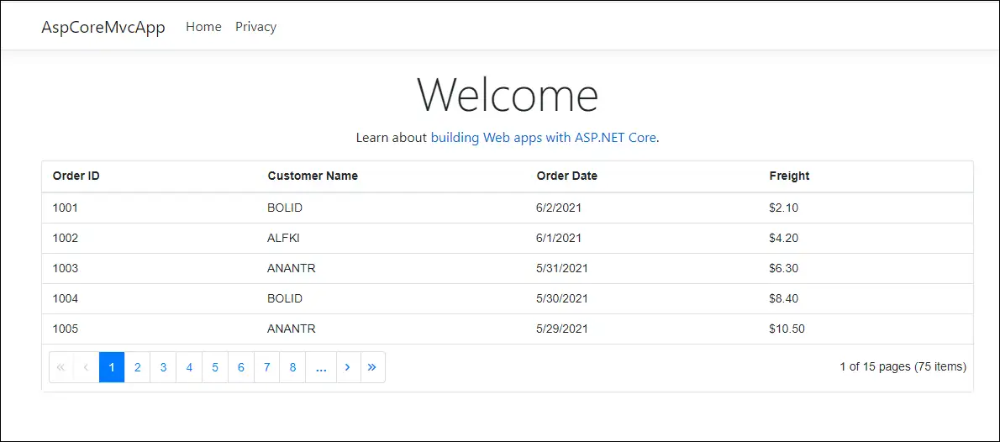

# Add a Blazor DataGrid to an Existing ASP.NET Core MVC Application

This guide explains how to add a [Blazor DataGrid](https://www.syncfusion.com/blazor-components/blazor-datagrid) component to an existing ASP.NET Core MVC application.

## Prerequisites

* [.NET SDK](https://dotnet.microsoft.com/en-us/download/visual-studio-sdks) (version 8.0 or later).
* [Visual Studio](https://visualstudio.microsoft.com/downloads/) 2022 or later.

## Steps to integrate DataGrid component

Open the existing ASP.NET Core MVC application in Visual Studio, and follow this steps one by one.

### Install the Blazor NuGet packages

* Go to *Tools → NuGet Package Manager → Manage NuGet Packages for Solution*.
* Search the required NuGet packages ([Syncfusion.Blazor.Grid](https://www.nuget.org/packages/Syncfusion.Blazor.Grid/) and [Syncfusion.Blazor.Themes](https://www.nuget.org/packages/Syncfusion.Blazor.Themes/) and install them.

Alternatively, you can install the same packages using the Package Manager Console with the following commands.




Install-Package Syncfusion.Blazor.Grid -Version {{ site.releaseversion }}
Install-Package Syncfusion.Blazor.Themes -Version {{ site.releaseversion }}




### Add the Blazor namespaces to the project

Create a new file named **`_Imports.razor`** at the project root and include the following namespaces.




@using System.Net.Http
@using Microsoft.AspNetCore.Authorization
@using Microsoft.AspNetCore.Components.Authorization
@using Microsoft.AspNetCore.Components.Forms
@using Microsoft.AspNetCore.Components.Routing
@using Microsoft.AspNetCore.Components.Web
@using Microsoft.AspNetCore.Components.Web.Virtualization
@using Microsoft.JSInterop
@using AspCoreMvcApp
@using AspCoreMvcApp.Components
@using Syncfusion.Blazor
@using Syncfusion.Blazor.Grids




### Register the Blazor Server and Blazor services in `~/Program.cs`

Open the **Program.cs** file and include the required namespace reference `using Syncfusion.Blazor;` at the top then register the services on the `WebApplicationBuilder`.




builder.Services.AddRazorPages();
builder.Services.AddServerSideBlazor();
builder.Services.AddSyncfusionBlazor();




### Map the Blazor hubs and Razor Pages in `~/Program.cs`




app.MapRazorPages();
app.MapBlazorHub();




### Add the theme stylesheet and script references in `~/Views/Shared/_Layout.cshtml`



    <head>
        ...
        <link href="_content/Syncfusion.Blazor.Themes/fluent2.css" rel="stylesheet" />
        
    </head>
    <body>
        ...
        
        ...
    </body>



### Create a Razor Component that hosts the Blazor DataGrid.

* Right-click the project root, choose **Add** → **New Folder**, and name it **Components**.
* Right-click the **Components** folder and choose **Add** → **Razor Component**.
* Name the file **`MyGrid.razor`**. The file name becomes the component class name (for example, `MyGrid`).
* Replace the contents of `MyGrid.razor` with:




@using Syncfusion.Blazor.Grids

<SfGrid DataSource="@Orders" AllowPaging="true">
    <GridPageSettings PageSize="5"></GridPageSettings>
    <GridColumns>
        <GridColumn Field=@nameof(Order.OrderID) HeaderText="Order ID" Width="120" TextAlign="TextAlign.Right"></GridColumn>
        <GridColumn Field=@nameof(Order.CustomerName) HeaderText="Customer Name" Width="150"></GridColumn>
        <GridColumn Field=@nameof(Order.ShipCity) HeaderText="Ship City" Width="150"></GridColumn>
        <GridColumn Field=@nameof(Order.OrderDate) HeaderText="Order Date" Format="d" Width="130" TextAlign="TextAlign.Right"></GridColumn>
        <GridColumn Field=@nameof(Order.Freight) HeaderText="Freight" Format="C2" Width="120" TextAlign="TextAlign.Right"></GridColumn>
    </GridColumns>
</SfGrid>

@code {
    public List<Order> Orders { get; set; }

    protected override void OnInitialized()
    {
        var customers = new string[] { "James Hopper", "Michael Smith", "Sarah Johnson", "Robert Davis", "Emily Wilson" };
        var cities = new string[] { "New York", "Los Angeles", "Chicago", "Houston", "Phoenix" };
        var rng = new Random();
        Orders = Enumerable.Range(1, 50).Select(x => new Order
        {
            OrderID = 1000 + x,
            CustomerName = customers[rng.Next(customers.Length)],
            ShipCity = cities[rng.Next(cities.Length)],
            Freight = Math.Round(10.5 + (x * 7.3), 2),
            OrderDate = DateTime.Now.AddDays(-x),
        }).ToList();
    }

    public class Order
    {
        public int? OrderID { get; set; }
        public string? CustomerName { get; set; }
        public string? ShipCity { get; set; }
        public DateTime? OrderDate { get; set; }
        public double? Freight { get; set; }
    }
}



### Insert the component into the MVC view using the component tag helper

Open **~/Views/Home/Index.cshtml** and add the following at the top, then place the `<component>` tag where the Blazor DataGrid should appear.




@using AspCoreMvcApp.Components

<component type="typeof(MyGrid)" render-mode="ServerPrerendered" />




### Run the application

Press <kbd>Ctrl</kbd>+<kbd>F5</kbd> in Visual Studio to launch the MVC application. Navigate to the MVC page where you placed the `<component>` tag. The [Blazor DataGrid](https://www.syncfusion.com/blazor-components/blazor-datagrid) renders inside the MVC view.

## See also

* [Component Tag Helper in ASP.NET Core](https://learn.microsoft.com/en-us/aspnet/core/mvc/views/tag-helpers/built-in/component-tag-helper)
* [Integrating Blazor components into existing ASP.NET Core MVC apps](https://devblogs.microsoft.com/premier-developer/integrating-blazor-components-into-existing-asp-net-core-mvc-apps/)
* [Getting started with the Blazor DataGrid in a Blazor Web App](https://blazor.syncfusion.com/documentation/datagrid/getting-started-with-web-app)
