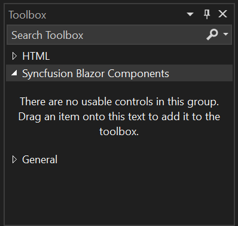
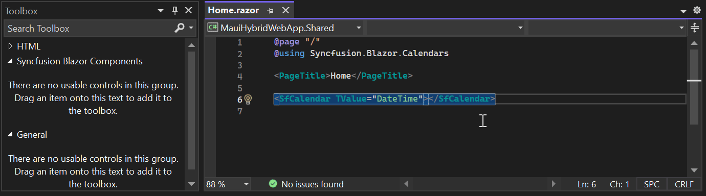
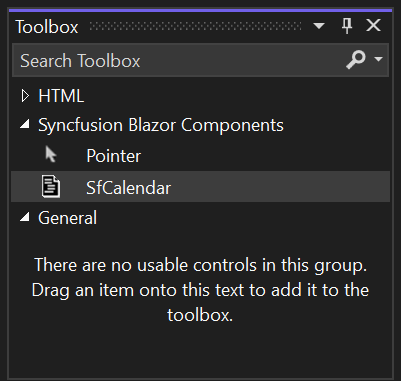
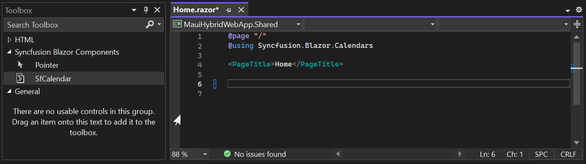

<<<<<<< HEAD
# How to add Syncfusion&reg; Component to the toolbox in Blazor Application
=======
# Add Syncfusion® Blazor components to the Visual Studio Toolbox
>>>>>>> 32c27d577704390b597a361089e564504af90b58

This guide explains how to add Syncfusion&reg; Blazor component snippets to the Visual Studio Toolbox on Windows. By default, the Toolbox shows HTML elements and Bootstrap snippets. Open the Toolbox with <kbd>Ctrl</kbd>+<kbd>Alt</kbd>+<kbd>X</kbd> or navigate to **View → Toolbox**.

To include Syncfusion&reg; components for Blazor in the Toolbox, follow these steps:

<<<<<<< HEAD
1. Right-click anywhere within the Visual Studio Toolbox window, select **Add Tab** from the context menu. Enter a name for the new tab such as Syncfusion&reg; Blazor Components and press Enter to create it.

2. In the code editor, **write or paste a Blazor component snippet**, such as the Syncfusion&reg; SfCalendar. Once the code is in place, **select the entire code snippet**, then **drag and drop it** into the newly created tab in the Visual Studio Toolbox.
=======
1. Right-click anywhere within the Visual Studio Toolbox, select **Add Tab**, then name the tab (for example, "Syncfusion Blazor Components") and press Enter.

2. In the code editor, write or paste a Blazor component snippet (for example, the Syncfusion&reg; `SfCalendar`). Select the entire snippet, then drag and drop it into the new tab in the Toolbox.
>>>>>>> 32c27d577704390b597a361089e564504af90b58

3. After the snippet is added, the Toolbox assigns a default name. Right-click the item, select **Rename**, and enter a descriptive name (for example, "SfCalendar").

4. Drag the component from the Toolbox into the code editor to insert the snippet into your Blazor project.

N> Dragging a Toolbox item inserts code into the editor. Ensure required namespaces and services are present in the project (for example, `@using Syncfusion.Blazor` and registering Syncfusion services in Program.cs).

