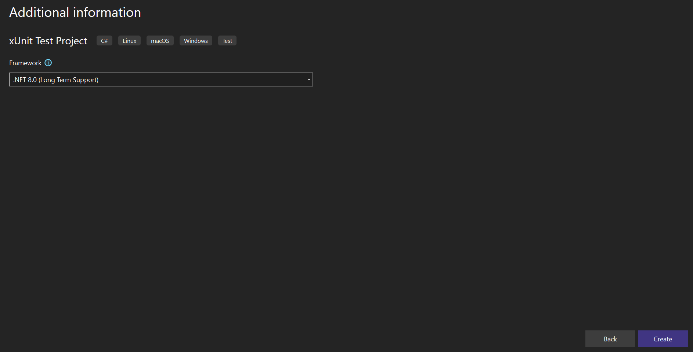

# How to configure Syncfusion Blazor Component in bUnit Testing?

This section explains how to configure Syncfusion Blazor component in bUnit testing.

## Configure bUnit with xUnit Test Project

### Create xUnit Test Project

1. Open Visual Studio 2019 and create a new `xUnit Test Project`.

    

2. Specify the project name and click the `Next` button.

    

3. Select specific `Target Framework` and click the `Create` button.

    

4. Right-click on the project in the Solution Explorer and select `Manage NuGet Package`.

    

5. Search `bunit` and install both NuGet packages in the test project.

    

### Add Existing Blazor App and Configure it on xUnit Project

1. Right-click on the Solution and select `Add -> Existing Project`. Browse and add your existing project from the local machine.

    

    N> Refer to [Blazor Server Getting Started](../../getting-started/visual-studio-2019/#getting-started-with-blazor-server-application) documentation, if you don't have any existing application.

2. Now, right-click on the xUnit project and select `Add -> Project Reference` and select the added project reference.

    

3. Add the below Syncfusion Button sample in `~/Pages/Index.razor` file on the Blazor project for testing purpose. You can test your Blazor component from your application instead of the below example component.

    ```cshtml
    @using Syncfusion.Blazor.Buttons

    <SfButton @onclick="OnButtonClick">My Button</SfButton>

    <span class="alert alert-info">Count: @clickCount</span>

    @code {
        private int clickCount = 0;

        [Parameter]
        public int Step { get; set; } = 1;

        private void OnButtonClick()
        {
            clickCount += Step;
        }
    }
    ```

4. Add the below bUnit test cases in the `~/UnitTest1.cs` file on xUnit project.

    ```c#
    using Xunit;
    using Bunit;
    using BlazorServerApp.Pages;
    using Syncfusion.Blazor;
    using Syncfusion.Blazor.Buttons;
    using Microsoft.Extensions.DependencyInjection;

    namespace BlazorXUnitTesting
    {
        public class UnitTest1
        {
            [Fact]
            public void TestIndex()
            {
                using var testContext = new TestContext();

                // Add Syncfusion Blazor service.
                testContext.Services.AddSyncfusionBlazor();
                testContext.Services.AddOptions();

                // Rendering application Index component (~/Pages/Index.razor).
                var indexComponent = testContext.RenderComponent<Index>();
                // Find Syncfusion Button component.
                var sfButton = indexComponent.FindComponent<SfButton>();
                // Find span element.
                var span = indexComponent.Find("span.alert.alert-info");

                // Assert
                // Testing span element markup.
                span.MarkupMatches("<span class=\"alert alert-info\">Count: 0</span>");

                // Click Syncfusion Button component.
                sfButton.Find(".e-btn").Click();

                // Testing span element markup again.
                span.MarkupMatches("<span class=\"alert alert-info\">Count: 1</span>");
            }
        }
    }
    ```

    From the above code snippet:

    * Created a new `TestContext` and added Syncfusion Blazor Service.

    ```c#
    using var testContext = new TestContext();

    // Add Syncfusion Blazor service.
    testContext.Services.AddSyncfusionBlazor();
    testContext.Services.AddOptions();
    ```

    * Rendered the Blazor application's `Index` component which we added in the 3rd step.

    ```c#
    // Rendering application Index component (~/Pages/Index.razor).
    var indexComponent = testContext.RenderComponent<Index>();
    ```

    * Find Syncfusion Button component and span element from the rendered `Index` component.

    ```c#
    // Find Syncfusion Button component.
    var sfButton = indexComponent.FindComponent<SfButton>();
    // Find span element.
    var span = indexComponent.Find("span.alert.alert-info");
    ```

    * Test the span element's markup at initial state.

    ```c#
    // Testing span element markup.
    span.MarkupMatches("<span class=\"alert alert-info\">Count: 0</span>");
    ```

    * Find the button element from Syncfusion Button component and trigger the click action. Test the span element's markup state after the button click.

    ```c#
    // Click Syncfusion Button component.
    sfButton.Find(".e-btn").Click();
    // Testing span element markup again.
    span.MarkupMatches("<span class=\"alert alert-info\">Count: 1</span>");
    ```

5. Right-click on the xUnit project and select `Run Tests`. The test cases will run and report the output.

    

## Configure bUnit with NUnit Test Project

### Create NUnit Test Project

1. Open Visual Studio 2019 and create a new `NUnit 3 Text Project`.

    

2. Specify the project name and click the `Next` button.

    

3. Select specific `Target Framework` and click the `Create` button.

    

4. Right-click on the project in the Solution Explorer and select `Manage NuGet Package`.

    

5. Search `bunit` and install both NuGet packages in the test project.

    

### Add existing Blazor App and configure it on NUnit project

1. Right-click on the Solution and select `Add -> Existing Project`. Browse and add your existing project from the local machine.

    

    N> Refer to [Blazor Server Getting Started](../../getting-started/visual-studio-2019/#getting-started-with-blazor-server-application) documentation, if you don't have any existing application.

2. Now, right-click on the NUnit project and select `Add -> Project Reference` and select the added project reference.

    

3. Add the below Syncfusion Button sample in `~/Pages/Index.razor` file on the Blazor project for testing purpose. You can test your Blazor component from your application instead of the below example component.

    ```cshtml
    @using Syncfusion.Blazor.Buttons

    <SfButton @onclick="OnButtonClick">My Button</SfButton>

    <span class="alert alert-info">Count: @clickCount</span>

    @code {
        private int clickCount = 0;

        [Parameter]
        public int Step { get; set; } = 1;

        private void OnButtonClick()
        {
            clickCount += Step;
        }
    }
    ```

4. Add the below bUnit test cases in the `~/UnitTest1.cs` file on NUnit project.

    ```c#
    using Bunit;
    using NUnit.Framework;
    using BlazorServerApp.Pages;
    using Syncfusion.Blazor;
    using Syncfusion.Blazor.Buttons;
    using Microsoft.Extensions.DependencyInjection;

    namespace BlazorNUnitTesting
    {
        public class Tests
        {
            [Test]
            public void TestIndex()
            {
                // Arrange
                using var testContext = new Bunit.TestContext();

                // Add Syncfusion Blazor service.
                testContext.Services.AddSyncfusionBlazor();
                testContext.Services.AddOptions();

                // Rendering application Index component (~/Pages/Index.razor).
                var indexComponent = testContext.RenderComponent<Index>();
                // Find Syncfusion Button component.
                var sfButton = indexComponent.FindComponent<SfButton>();
                // Find span element.
                var span = indexComponent.Find("span.alert.alert-info");

                // Assert
                // Testing span element markup.
                span.MarkupMatches("<span class=\"alert alert-info\">Count: 0</span>");

                // Click Syncfusion Button component.
                sfButton.Find(".e-btn").Click();

                // Testing span element markup again.
                span.MarkupMatches("<span class=\"alert alert-info\">Count: 1</span>");
            }
        }
    }
    ```

    From the above code snippet:

    * Created a new `TestContext` and added Syncfusion Blazor Service.

    ```c#
    using var testContext = new Bunit.TestContext();

    // Add Syncfusion Blazor service.
    testContext.Services.AddSyncfusionBlazor();
    testContext.Services.AddOptions();
    ```

    * Rendered the Blazor application's `Index` component which we added in the 3rd step.

    ```c#
    // Rendering application Index component (~/Pages/Index.razor).
    var indexComponent = testContext.RenderComponent<Index>();
    ```

    * Find Syncfusion Button component and span element from the rendered `Index` component.

    ```c#
    // Find Syncfusion Button component.
    var sfButton = indexComponent.FindComponent<SfButton>();
    // Find span element.
    var span = indexComponent.Find("span.alert.alert-info");
    ```

    * Test the span element's markup at initial state.

    ```c#
    // Testing span element markup.
    span.MarkupMatches("<span class=\"alert alert-info\">Count: 0</span>");
    ```

    * Find the button element from Syncfusion Button component and trigger the click action. Test the span element's markup state after the button click.

    ```c#
    // Click Syncfusion Button component.
    sfButton.Find(".e-btn").Click();
    // Testing span element markup again.
    span.MarkupMatches("<span class=\"alert alert-info\">Count: 1</span>");
    ```

5. Right-click on the NUnit project and select `Run Tests`. The test cases will run and report the output.

    

## Passing Parameters to the Blazor Component Testing

You can set the Blazor component parameter using `SetParametersAndRender` method.

```c#
[Fact]
public void TestParameter()
{
    using var testContext = new TestContext();

    // Add Syncfusion Blazor service.
    testContext.Services.AddSyncfusionBlazor();
    testContext.Services.AddOptions();

    // Rendering application Index component (~/Pages/Index.razor).
    var indexComponent = testContext.RenderComponent<Index>();
    // Set Index component parameter Step value.
    indexComponent.SetParametersAndRender(parameters => parameters.Add(p => p.Step, 5));

    // Find Syncfusion Button component.
    var sfButton = indexComponent.FindComponent<SfButton>();
    // Find span element.
    var span = indexComponent.Find("span.alert.alert-info");

    // Assert
    // Testing span element markup initial state.
    span.MarkupMatches("<span class=\"alert alert-info\">Count: 0</span>");

    // Click Syncfusion Button component.
    sfButton.Find(".e-btn").Click();

    // Testing span element markup again.
    span.MarkupMatches("<span class=\"alert alert-info\">Count: 5</span>");
}
```

## See Also

* [Create a new bUnit Test Project](https://bunit.dev/docs/getting-started/create-test-project.html?tabs=xunit)
* [Test components in ASP.NET Core Blazor](https://learn.microsoft.com/en-us/aspnet/core/blazor/test?view=aspnetcore-5.0)
