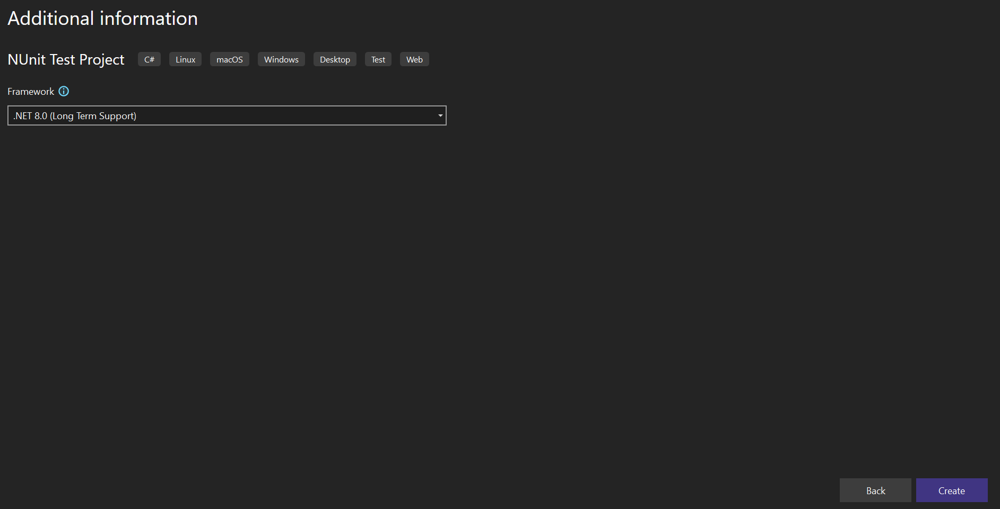

# How to configure Syncfusion® Blazor components in bUnit testing

This section explains how to configure Syncfusion<sup style="font-size:70%">&reg;</sup> Blazor components for unit testing with bUnit.

## Configure bUnit with xUnit Test Project

### Create xUnit Test Project

1. Open Visual Studio 2022 and create a new `xUnit Test Project`.

    

2. Specify the project name and click the `Next` button.

    

3. Select the target framework and click the `Create` button.

    

4. Right-click the project in Solution Explorer and select `Manage NuGet Packages`.

    

5. Search for `bunit` and install both NuGet packages in the test project.

    

### Add Existing Blazor App and Configure it on xUnit Project

1. Right-click the solution and select `Add -> Existing Project`. Browse and add your existing Blazor project.

    

    N> Refer to [Blazor Web App Getting Started](https://blazor.syncfusion.com/documentation/getting-started/blazor-web-app) documentation, if you don't have any existing application.

2. Right-click the xUnit project and select `Add -> Project Reference`, then select the added project.

    

3. Add the following Syncfusion<sup style="font-size:70%">&reg;</sup> Button sample to the `~/Pages/Home.razor` or `~/Pages/Index.razor` file in the Blazor project for testing purposes. You can test any Blazor component from your app instead of this example.

    ```cshtml
    @using Syncfusion.Blazor.Buttons

    <SfButton @onclick="OnButtonClick">My Button</SfButton>

    <span class="alert alert-info">Count: @clickCount</span>

    @code {
        private int clickCount = 0;

        [Parameter]
        public int Step { get; set; } = 1;

        private void OnButtonClick()
        {
            clickCount += Step;
        }
    }
    ```

4. Add the below bUnit test cases in the `~/UnitTest1.cs` file on xUnit project.

    ```c#
    using Xunit;
    using Bunit;
    using {Your App namespace}.Pages;
    using Syncfusion.Blazor;
    using Syncfusion.Blazor.Buttons;
    using Microsoft.Extensions.DependencyInjection;
    using Microsoft.AspNetCore.Components;
    using Microsoft.Extensions.DependencyInjection.Extensions;

    namespace BlazorXUnitTesting
    {
        public class UnitTest1
        {
            [Fact]
            public void TestIndex()
            {
                using var testContext = new TestContext();

                // Add Syncfusion Blazor service.
                testContext.Services.AddSyncfusionBlazor().Replace(ServiceDescriptor.Transient<IComponentActivator, SfComponentActivator>());
                testContext.Services.AddOptions();

                // Rendering application Home component (~/Pages/Home.razor).
                var indexComponent = testContext.RenderComponent<Home>();
                // Find Syncfusion Button component.
                var sfButton = indexComponent.FindComponent<SfButton>();
                // Find span element.
                var span = indexComponent.Find("span.alert.alert-info");

                // Assert
                // Testing span element markup.
                span.MarkupMatches("<span class=\"alert alert-info\">Count: 0</span>");

                // Click Syncfusion Button component.
                sfButton.Find(".e-btn").Click();

                // Testing span element markup again.
                span.MarkupMatches("<span class=\"alert alert-info\">Count: 1</span>");
            }
        }
    }
    ```

    From the above code snippet:

    * Created a new `TestContext` and added Syncfusion<sup style="font-size:70%">&reg;</sup> Blazor Service.

    ```c#
    using var testContext = new TestContext();

    // Add Syncfusion Blazor service.
    testContext.Services.AddSyncfusionBlazor().Replace(ServiceDescriptor.Transient<IComponentActivator, SfComponentActivator>());
    testContext.Services.AddOptions();
    ```

    * Rendered the Blazor application's `Home` component which we added in the 3rd step.

    ```c#
    // Rendering application Home component (~/Pages/Home.razor).
    var indexComponent = testContext.RenderComponent<Home>();
    ```

    * Find Syncfusion<sup style="font-size:70%">&reg;</sup> Button component and span element from the rendered `Home` component.

    ```c#
    // Find Syncfusion Button component.
    var sfButton = indexComponent.FindComponent<SfButton>();
    // Find span element.
    var span = indexComponent.Find("span.alert.alert-info");
    ```

    * Test the span element's markup at initial state.

    ```c#
    // Testing span element markup.
    span.MarkupMatches("<span class=\"alert alert-info\">Count: 0</span>");
    ```

    * Find the button element from Syncfusion<sup style="font-size:70%">&reg;</sup> Button component and trigger the click action. Test the span element's markup state after the button click.

    ```c#
    // Click Syncfusion Button component.
    sfButton.Find(".e-btn").Click();
    // Testing span element markup again.
    span.MarkupMatches("<span class=\"alert alert-info\">Count: 1</span>");
    ```

5. Right-click the xUnit project and select `Run Tests`. The test cases run and report the results.

    

## Configure bUnit with NUnit Test Project

### Create NUnit Test Project

1. Open Visual Studio 2022 and create a new `NUnit 3 Test Project`.

    

2. Specify the project name and click the `Next` button.

    

3. Select the target framework and click the `Create` button.

    

4. Right-click the project in Solution Explorer and select `Manage NuGet Packages`.

    

5. Search for `bunit` and install both NuGet packages in the test project.

    

### Add existing Blazor App and configure it on NUnit project

1. Right-click the solution and select `Add -> Existing Project`. Browse and add your existing Blazor project.

    

    N> Refer to [Blazor Web App Getting Started](https://blazor.syncfusion.com/documentation/getting-started/blazor-web-app) documentation, if you don't have any existing application.

2. Right-click the NUnit project and select `Add -> Project Reference`, then select the added project.

    

3. Add the following Syncfusion<sup style="font-size:70%">&reg;</sup> Button sample to the `~/Pages/Home.razor` or `~/Pages/Index.razor` file in the Blazor project for testing purposes. You can test any component from your app instead of this example.

    ```cshtml
    @using Syncfusion.Blazor.Buttons

    <SfButton @onclick="OnButtonClick">My Button</SfButton>

    <span class="alert alert-info">Count: @clickCount</span>

    @code {
        private int clickCount = 0;

        [Parameter]
        public int Step { get; set; } = 1;

        private void OnButtonClick()
        {
            clickCount += Step;
        }
    }
    ```

4. Add the below bUnit test cases in the `~/UnitTest1.cs` file on NUnit project.

    ```c#
    using Bunit;
    using NUnit.Framework;
    using {Your App namespace}.Pages;
    using Syncfusion.Blazor;
    using Syncfusion.Blazor.Buttons;
    using Microsoft.Extensions.DependencyInjection;
    using Microsoft.AspNetCore.Components;
    using Microsoft.Extensions.DependencyInjection.Extensions;
    

    namespace BlazorNUnitTesting
    {
        public class Tests
        {
            [Test]
            public void TestIndex()
            {
                // Arrange
                using var testContext = new Bunit.TestContext();

                // Add Syncfusion Blazor service.
                testContext.Services.AddSyncfusionBlazor().Replace(ServiceDescriptor.Transient<IComponentActivator, SfComponentActivator>());
                testContext.Services.AddOptions();

                // Rendering application Home component (~/Pages/Home.razor).
                var indexComponent = testContext.RenderComponent<Home>();
                // Find Syncfusion Button component.
                var sfButton = indexComponent.FindComponent<SfButton>();
                // Find span element.
                var span = indexComponent.Find("span.alert.alert-info");

                // Assert
                // Testing span element markup.
                span.MarkupMatches("<span class=\"alert alert-info\">Count: 0</span>");

                // Click Syncfusion Button component.
                sfButton.Find(".e-btn").Click();

                // Testing span element markup again.
                span.MarkupMatches("<span class=\"alert alert-info\">Count: 1</span>");
            }
        }
    }
    ```

    From the above code snippet:

    * Created a new `TestContext` and added Syncfusion<sup style="font-size:70%">&reg;</sup> Blazor Service.

    ```c#
    using var testContext = new Bunit.TestContext();

    // Add Syncfusion Blazor service.
    testContext.Services.AddSyncfusionBlazor().Replace(ServiceDescriptor.Transient<IComponentActivator, SfComponentActivator>());
    testContext.Services.AddOptions();
    ```

    * Rendered the Blazor application's `Home` component which we added in the 3rd step.

    ```c#
    // Rendering application Home component (~/Pages/Home.razor).
    var indexComponent = testContext.RenderComponent<Home>();
    ```

    * Find Syncfusion<sup style="font-size:70%">&reg;</sup> Button component and span element from the rendered `Home` component.

    ```c#
    // Find Syncfusion Button component.
    var sfButton = indexComponent.FindComponent<SfButton>();
    // Find span element.
    var span = indexComponent.Find("span.alert.alert-info");
    ```

    * Test the span element's markup at initial state.

    ```c#
    // Testing span element markup.
    span.MarkupMatches("<span class=\"alert alert-info\">Count: 0</span>");
    ```

    * Find the button element from Syncfusion<sup style="font-size:70%">&reg;</sup> Button component and trigger the click action. Test the span element's markup state after the button click.

    ```c#
    // Click Syncfusion Button component.
    sfButton.Find(".e-btn").Click();
    // Testing span element markup again.
    span.MarkupMatches("<span class=\"alert alert-info\">Count: 1</span>");
    ```

5. Right-click the NUnit project and select `Run Tests`. The test cases run and report the results.

    

## Passing parameters to the Blazor component during testing

Set component parameters using the `SetParametersAndRender` method.

```c#
using Microsoft.AspNetCore.Components;
using Microsoft.Extensions.DependencyInjection.Extensions;
[Fact]
public void TestParameter()
{
    using var testContext = new TestContext();

    // Add Syncfusion Blazor service.
    testContext.Services.AddSyncfusionBlazor().Replace(ServiceDescriptor.Transient<IComponentActivator, SfComponentActivator>());
    testContext.Services.AddOptions();

    // Rendering application Home component (~/Pages/Home.razor).
    var indexComponent = testContext.RenderComponent<Home>();
    // Set Index component parameter Step value.
    indexComponent.SetParametersAndRender(parameters => parameters.Add(p => p.Step, 5));

    // Find Syncfusion Button component.
    var sfButton = indexComponent.FindComponent<SfButton>();
    // Find span element.
    var span = indexComponent.Find("span.alert.alert-info");

    // Assert
    // Testing span element markup initial state.
    span.MarkupMatches("<span class=\"alert alert-info\">Count: 0</span>");

    // Click Syncfusion Button component.
    sfButton.Find(".e-btn").Click();

    // Testing span element markup again.
    span.MarkupMatches("<span class=\"alert alert-info\">Count: 5</span>");
}
```

## See Also

* [Create a new bUnit test project](https://bunit.dev/docs/getting-started/create-test-project.html?tabs=xunit)
* [Test components in ASP.NET Core Blazor](https://learn.microsoft.com/en-us/aspnet/core/blazor/test)
