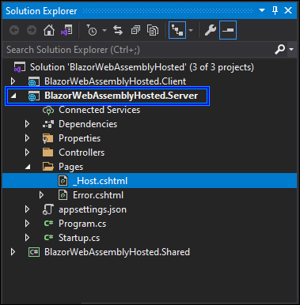

# How to Create a Blazor WebAssembly Application with Prerendering

This section explains how to enable prerendering for a hosted Blazor WebAssembly application.

## Prerequisites

Install the [.NET SDK](https://dotnet.microsoft.com/en-us/download) (7.0 or later).

## Create a new project for Blazor WebAssembly ASP.NET Core Hosted application

1. Create a new [Blazor WebAssembly ASP.NET Core Hosted application](https://blazor.syncfusion.com/documentation/getting-started/blazor-core-hosted#create-a-blazor-aspnet-core-hosted-webassembly-app-in-visual-studio).

2. Delete `~/wwwroot/index.html` file in the Client project.

3. Remove the following line from the Client project's `~/Program.cs` file.

    ```c#
    // builder.RootComponents.Add<App>("#app");
    ```

4. Add `~/Pages/_Host.cshtml` file in the Server project.



5. Copy and paste the below code content in the `~/Server/Pages/_Host.cshtml` file.

    ```cshtml
    @page "/"
    @namespace BlazorWebAssemblyHosted.Client.Pages
    @addTagHelper *, Microsoft.AspNetCore.Mvc.TagHelpers
    @{
        Layout = null;
    }

    <!DOCTYPE html>
    <html>

    <head>
        <meta charset="utf-8" />
        <meta name="viewport" content="width=device-width, initial-scale=1.0" />
        <title>BlazorWebAssemblyHosted</title>
        <base href="~/" />
        <link rel="stylesheet" href="css/bootstrap/bootstrap.min.css" />
        <link href="css/bootstrap/bootstrap.min.css" rel="stylesheet" />
        <link href="css/app.css" rel="stylesheet" />
        <link href="BlazorWebAssemblyHosted.Client.styles.css" rel="stylesheet" />
        <link href="_content/Syncfusion.Blazor.Themes/bootstrap4.css" rel="stylesheet" />
    </head>

    <body>

        <component type="typeof(App)" render-mode="WebAssemblyPrerendered" />

        <script src="_framework/blazor.webassembly.js"></script>
    </body>

    </html>
    ```

6. Open the `Program.cs` file in the Server project and change the endpoint of the `MapFallbackToFile` configuration from `index.html` to `/_Host`.

    ```c#
        ....
        app.UseEndpoints(endpoints =>
            {
                ....
                ....
                endpoints.MapFallbackToFile("/_Host"); // Previously it was mapped into "index.html".
            });
    ```

7. Add the Syncfusion<sup style="font-size:70%">&reg;</sup> Blazor service in the `~/Server/Program.cs` file.

    ```c#
    using Syncfusion.Blazor;
    ....
    builder.Services.AddSyncfusionBlazor();

    ```

8. If `HttpClient` is not injected and used on the index page, you can run the application and the component will render in the web browser with prerendering mode.

    The created [Blazor WebAssembly ASP.NET Core Hosted application](../introduction#create-a-new-project-for-blazor-webassembly-aspnet-core-hosted-application) injects `HttpClient` to fetch data for the Grid component. Refer to the next section to resolve `HttpClient` errors during prerendering.

### Resolving HttpClient errors on WebAssembly prerendering

When the index page injects `HttpClient` and prerender on the server, the client has not yet established a connection, which can result in runtime exceptions.

E> ***InvalidOperationException***: An invalid request URI was provided. The request URI must either be an absolute URI or BaseAddress must be set.

The Syncfusion<sup style="font-size:70%">&reg;</sup> Blazor service registers the HttpClient by default. In `WebAssemblyPrerendered` mode, requests require an absolute URI or a configured BaseAddress.

If you configure with absolute URI in the `~/Client/Pages/Index.razor` file, you will face another runtime error.

```c#
protected override async Task OnInitializedAsync()
{
    forecasts = await Http.GetFromJsonAsync<WeatherForecast[]>("http://localhost:44376/WeatherForecast");
}
```

E> ***SocketException***: An existing connection was forcibly closed by the remote host. <br />
***IOException***: Unable to read data from the transport connection: An existing connection was forcibly closed by the remote host <br />
***HttpRequestException***: An error occurred while sending the request.

Fetching data over HTTP from the client is not possible during prerendering because the client has not initialized.

Follow these steps to resolve these issues and enable HttpClient usage during prerendering:

1. Create a public interface in the `~/Shared/WeatherForecast.cs` file on the Shared project to abstract the API call.

    ```c#
    using System.Threading.Tasks;

    public interface IWeatherForecastService
    {
        Task<WeatherForecast[]> GetForecastAsync();
    }
    ```

2. Create a class file `~/Client/Shared/WeatherForecastService.cs` and inherit the class with the new interface `IWeatherForecastService`. Here, the override method `GetForecastAsync` will fetch the data using HTTP Get action.

    ```c#
    using System.Net.Http;
    using System.Net.Http.Json;
    using System.Threading.Tasks;
    using BlazorWebAssemblyHosted.Shared;

    namespace BlazorWebAssemblyHosted.Client.Shared
    {
        public class WeatherForecastService : IWeatherForecastService
        {
            private readonly HttpClient httpClient;

            public WeatherForecastService(HttpClient http)
            {
                httpClient = http;
            }

            public async Task<WeatherForecast[]> GetForecastAsync()
            {
                return await httpClient.GetFromJsonAsync<WeatherForecast[]> ("WeatherForecast");
            }
        }
    }
    ```

3. Create a new class file with the same class name in the Server project and implement the `IWeatherForecastService` interface. Move the data creation logic from the existing API to the `GetForecastAsync` method. The existing controller is at `~/Server/Controllers/WeatherForecastController.cs`.

    ```c#
    using System;
    using System.Linq;
    using System.Threading.Tasks;
    using BlazorWebAssemblyHosted.Shared;

    namespace BlazorWebAssemblyHosted.Server.Shared
    {
        public class WeatherForecastService : IWeatherForecastService
        {
            private static readonly string[] Summaries = new[]
            {
                "Freezing", "Bracing", "Chilly", "Cool", "Mild", "Warm", "Balmy",   "Hot", "Sweltering", "Scorching"
            };

            public async Task<WeatherForecast[]> GetForecastAsync()
            {
                var rng = new Random();
                return Enumerable.Range(1, 5).Select(index => new WeatherForecast
                {
                    Date = DateTime.Now.AddDays(index),
                    TemperatureC = rng.Next(-20, 55),
                    Summary = Summaries[rng.Next(Summaries.Length)]
                }).ToArray();
            }
        }
    }
    ```

4. Update the API controller in the `~/Server/Controllers/WeatherForecastController.cs` file as follows.

    ```c#
    using System.Threading.Tasks;
    using Microsoft.AspNetCore.Mvc;
    using System.Collections.Generic;
    using BlazorWebAssemblyHosted.Shared;

    namespace BlazorWebAssemblyHosted.Server.Controllers
    {
        [ApiController]
        [Route("[controller]")]
        public class WeatherForecastController : ControllerBase
        {
            private readonly IWeatherForecastService weatherForecastService;

            public WeatherForecastController(IWeatherForecastService    weatherService)
            {
                weatherForecastService = weatherService;
            }

            [HttpGet]
            public async Task<IEnumerable<WeatherForecast>> Get()
            {
                return await weatherForecastService.GetForecastAsync();
            }
        }
    }
    ```

5. Register the services in both the Client and Server project `~/Program.cs` files.

    ```c#
    ....
    using Syncfusion.Blazor;

    ....
    builder.Services.AddSyncfusionBlazor();

    ```

6. Now, change the DI injection from `HttpClient` to `IWeatherForecastService` on the `~/Client/Pages/Index.razor` file.

    ```cshtml
    @using BlazorWebAssemblyHosted.Shared
    @inject IWeatherForecastService  WeatherForecastService

    ....
    ....

    @code {
        private WeatherForecast[] forecasts;

        protected override async Task OnInitializedAsync()
        {
            forecasts = await WeatherForecastService.GetForecastAsync();
        }
    }
    ```

7. Run the application (for example, press `F5`). During server prerendering, data is provided by the server-side service; after client-side hydration, the client sends the HTTP GET request to retrieve data.

## See Also

* [Prerender on ASP.NET Core Razor components](https://learn.microsoft.com/en-us/aspnet/core/blazor/components/integration)
* [Stateful reconnection after prerendering](https://learn.microsoft.com/en-us/aspnet/core/blazor/components/lifecycle#stateful-reconnection-after-prerendering)
