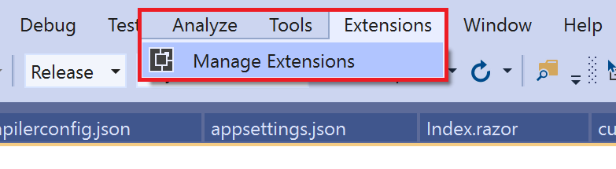
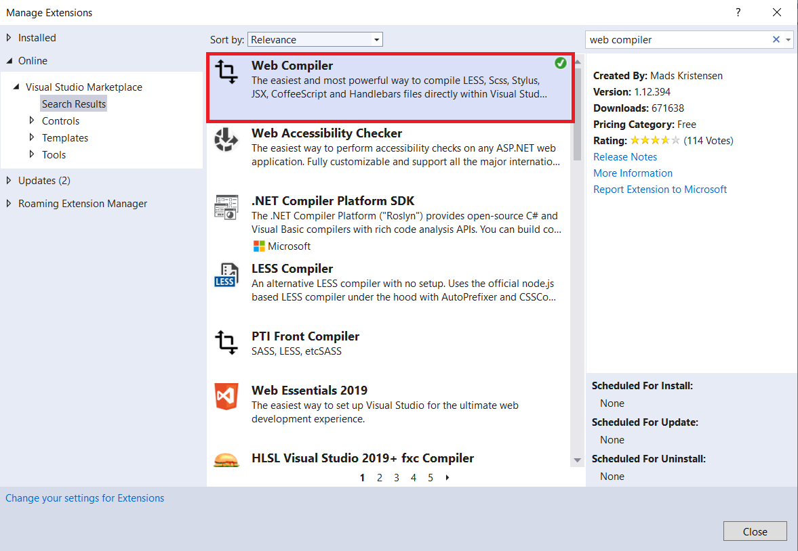
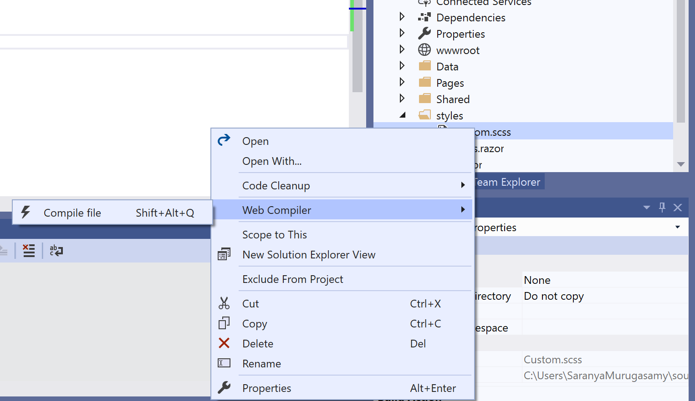
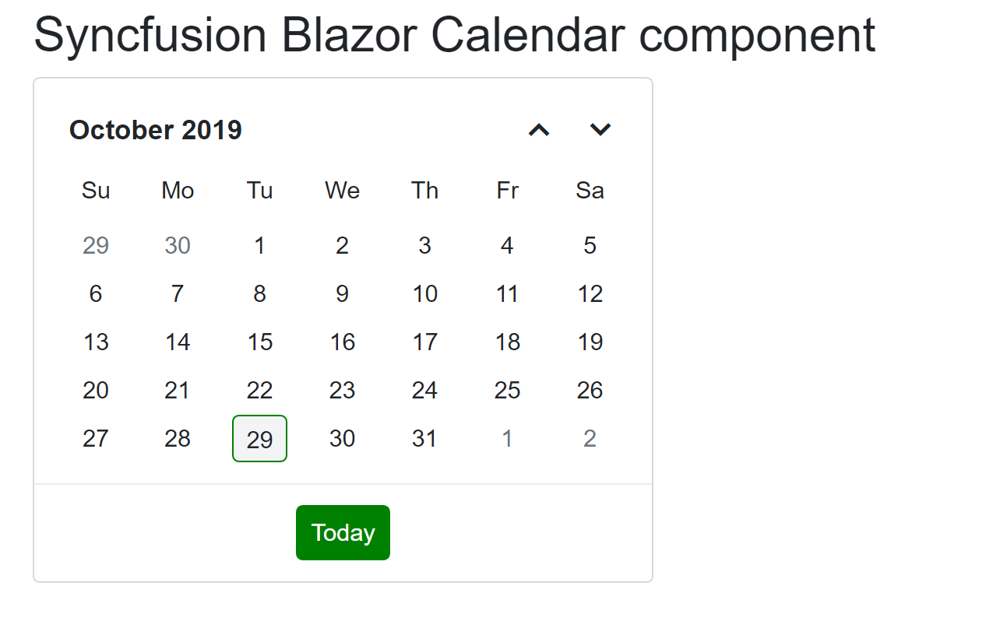

# How to customize the font size and color in Syncfusion Blazor components

## Install Web Compiler

Install the Web Compiler to compile the `SCSS` files in the Blazor Applications.

## Steps to install the Web Compiler in Visual Studio 2019**

1. Open the Visual Studio 2019 and click the **Extensions** in the visual studio toolbar.

    

2. Download and install the **Web Compiler** in the visual studio 2019.

    

## Create a Blazor Server Application in Visual Studio 2019

1. Create a Blazor server application by referring [Blazor Server](../../getting-started/blazor-server-side-visual-studio-2019/) documentation.

2. Install the Syncfusion `node_modules` in this application using this command.

    ```cmd

    npm install @syncfusion/ej2

    ```

3. Create a `SCSS` file as `~/wwwroot/styles/custom.scss` and provide the variables to override as shown below.

    ``` scss

    $calendar-normal-max-width: 362px !default;
    $calendar-normal-min-width: 256px !default;
    $primary: green !default;

    @import 'ej2-base/styles/bootstrap4.scss';
    @import 'ej2-buttons/styles/bootstrap4.scss';
    @import 'ej2-calendars/styles/bootstrap4.scss';

    ```

4. Right-click the `SCSS` file and click the Web Compiler to compile the file.

    

5. The **compilerconfig.json** file is created. Then provide the location of the compiled CSS file and include path like the following code snippet.

    ```json
        [
            {
                "outputFile": "wwwroot/styles/custom.css",
                "inputFile": "wwwroot/styles/custom.scss",
                "options": {
                    "includePath": "node_modules/@syncfusion"
                }
            }
        ]
    ```

6. The `SCSS` file has been compiled to the CSS file. Then, add this CSS file to the `<head>` element of the **~/Pages/_Host.cshtml** page.

    ```html
    <head>

    .....
    .....

    <link href="~/styles/custom.css" rel="stylesheet" />
    <head>

    ```

    > **Note:** Syncfusion provides an option to generate custom styles of selective components by using the ThemeStudio web application for the production environment. Refer to this [link](http://ej2.syncfusion.com/themestudio/) for further details.

7. Run the application. The styles are applied in our Blazor component.

    