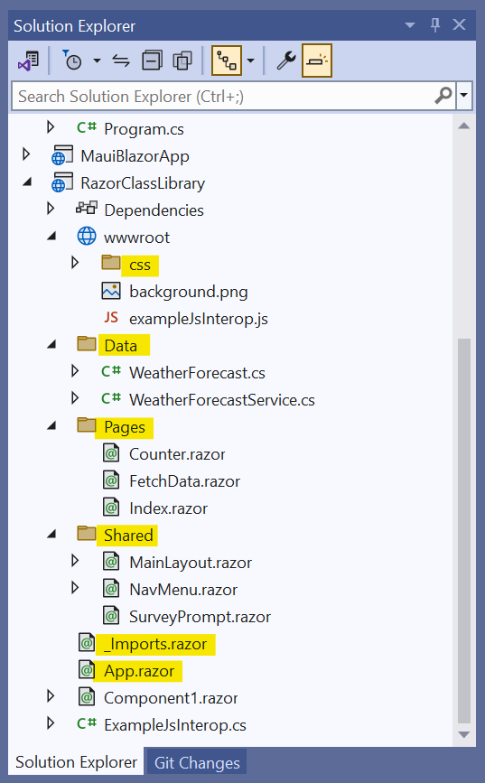
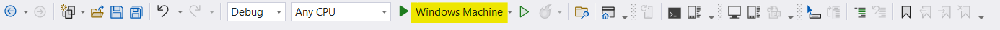

# How to port Syncfusion&reg; Blazor Server App to MAUI Blazor Hybrid App

This section explains how to port Syncfusion&reg; Blazor Web App to .NET MAUI Blazor Hybrid App using Razor Class Library (RCL). This way, you can avoid rewriting all your Blazor Web App pages for the .NET MAUI Blazor Hybrid App.

## Prerequisites

[.NET 8.0](https://dotnet.microsoft.com/en-us/download/dotnet/8.0) or later.

## Create a new project for Blazor Server App

Create a new [Blazor Web App](https://blazor.syncfusion.com/documentation/getting-started/blazor-web-app) with Syncfusion&reg; `Blazor Calendar` component using [Visual Studio](https://visualstudio.microsoft.com/vs/).

### 1. Create MAUI Hybrid App in Visual Studio

Open Visual Studio and create a new project. Search for [.NET MAUI Blazor Hybrid App](https://blazor.syncfusion.com/documentation/getting-started/maui-blazor-app) template.
Name the project and create it.

### 2. Create Razor Class Library (RCL) and 

In the solution, add a new project using the [Razor Class Library](https://blazor.syncfusion.com/documentation/getting-started/razor-class-library) template in Visual Studio and ensure it targets .NET 8.0 to match both Blazor Web App and Blazor Maui Hybrid.

### 3. Migrate Static Assets, References, NuGet Packages, Razor Pages

Move all static assets (such as CSS, JavaScript, and images) from the Blazor Web App’s wwwroot folder to the Razor Class Library’s wwwroot directory. Then, update the asset references in the MAUI Hybrid App’s wwwroot/index.html to use the Razor Class Library’s assets via the _content/RazorClassLibrary/ path.

Move all Syncfusion&reg; `Blazor NuGet packages` references from the Blazor web app's .csproj to the RCL's .csproj

Move  Components/Pages ,Components/Layouts to the RazorClassLibrary and Add Include Necessary Namespace to _Imports.razor

    

### 4. Add Project Reference 

Afterward, add Razor Class Library project reference in both the Blazor Web App and the MAUI Blazor App. Resolve any missing references or errors that arise. Once completed, remove folders such as Components/Pages and Components/Layouts from the MAUI Blazor App to avoid duplication and maintain a clean project structure.

Now, register the Syncfusion&reg; Blazor service in the `MauiProgram.cs` file of your MAUI Blazor App.

    
    

        using Syncfusion.Blazor;
        ....
        builder.Services.AddSyncfusionBlazor();
        ....

    
    

Finally, update the _Imports.razor file to include the necessary namespaces from the Razor Class Library. Then, modify the Routes.razor file in the Blazor MAUI Hybrid app to set the DefaultLayout and AppAssembly to use the MainLayout component from the Razor Class Library

### 5. Run the project

 In the Visual Studio toolbar, select the **Windows Machine** button to build and run the app.

    