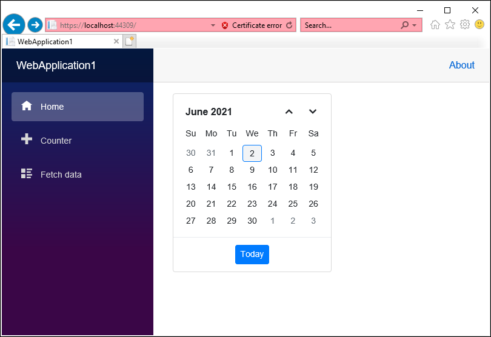

# Render a Blazor Server app in Internet Explorer 11 (IE11)

This topic explains the historical guidance for running a Blazor Server app in Internet Explorer 11 (IE11).

## Blazor WebAssembly App

Internet Explorer does not support WebAssembly. Blazor WebAssembly apps do not run in IE11.

## Blazor Server App

IE11 can run Blazor Server Apps only when using .NET Core 3.1 with additional polyfills. IE11 is not supported for Blazor on .NET 5.0 or later. For current details, see [Blazor supported platforms and browsers](https://learn.microsoft.com/aspnet/core/blazor/supported-platforms).

Follow these steps to add the polyfills for a .NET Core 3.1 Blazor Server app:

1. Create a Blazor Server Application using the [Blazor Server getting started](https://blazor.syncfusion.com/documentation/getting-started/blazor-server-side-visual-studio) guide.

2. Add the polyfill script reference in the `<head>` element of the `~/Pages/_Host.cshtml` page.

    ```html
    <head>

        .....
        .....

        <script src="https://github.com/Daddoon/Blazor.Polyfill/releases/download/3.0.8/blazor.polyfill.min.js"></script>
    </head>

    ```

N> This [polyfill](https://github.com/Daddoon/Blazor.Polyfill/releases/tag/3.0.8) is required to configure in Blazor server application for IE 11 support for .NET Core 3.1 app.

3. Run the application in IE11. The Syncfusion<sup style="font-size:70%">&reg;</sup> Blazor component renders in IE11 when polyfills are correctly configured.

    

## See Also

* [Blazor supported platforms and browsers](https://learn.microsoft.com/en-us/aspnet/core/blazor/supported-platforms)
* [Blazor browser support updated (.NET 5)](https://learn.microsoft.com/en-us/dotnet/core/compatibility/aspnet-core/5.0/blazor-browser-support-updated)
