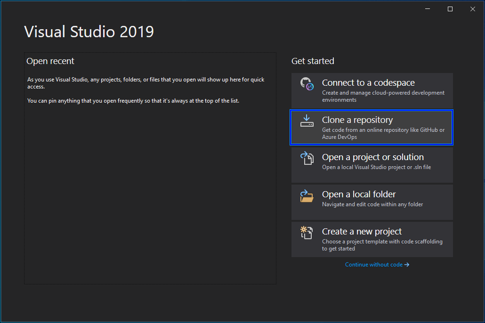
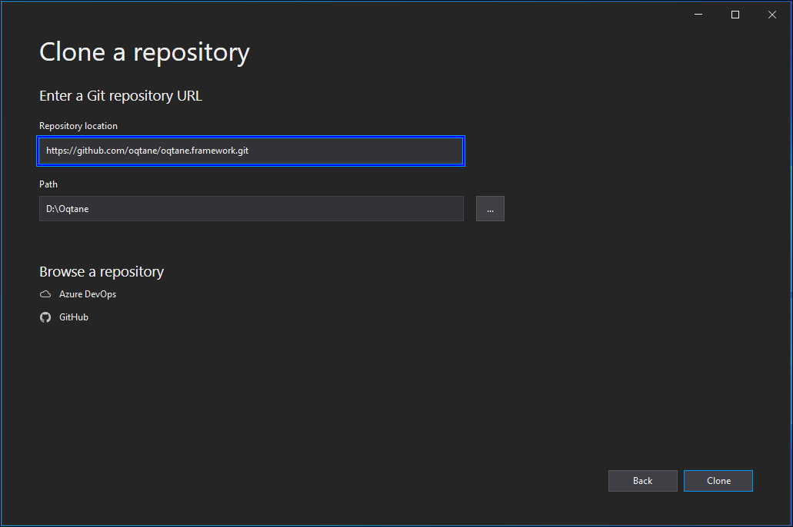
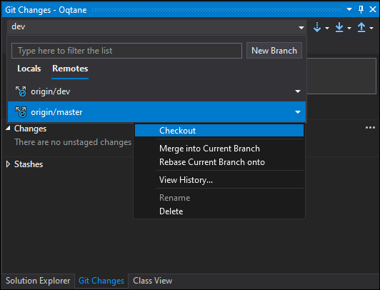
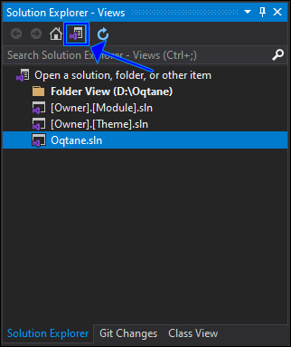
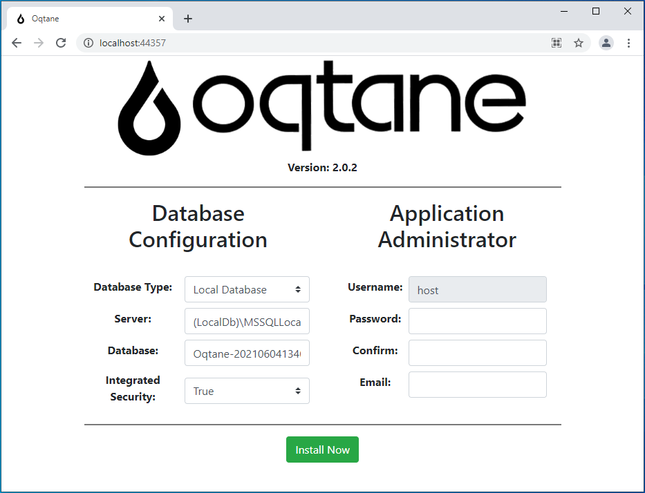
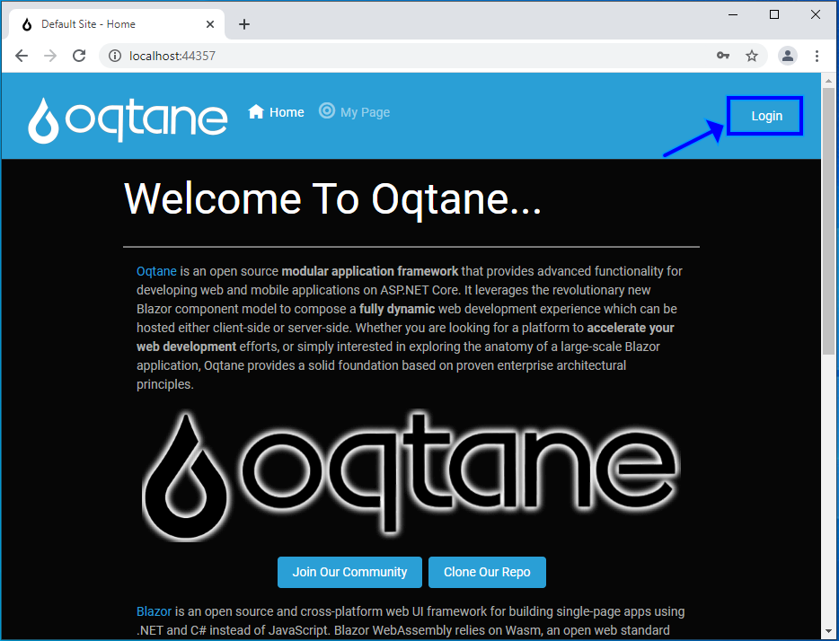
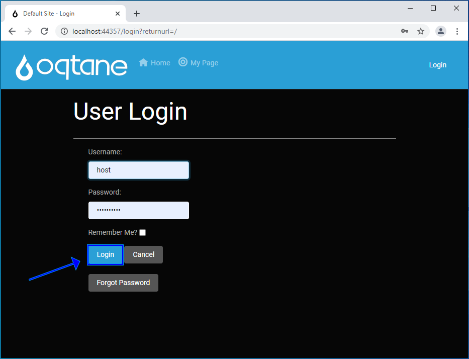
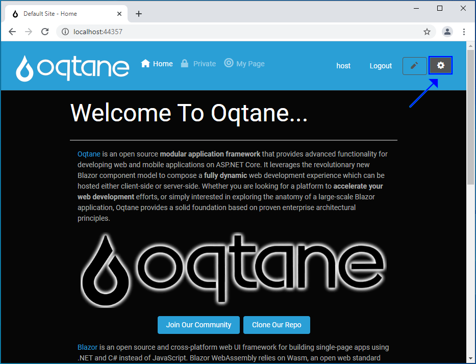
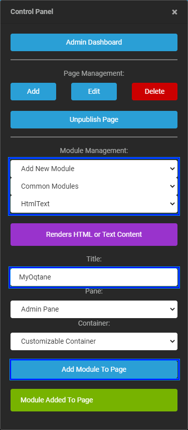

# How to Use Syncfusion Blazor Component in Oqtane Framework

This section explains how to use Syncfusion Blazor component in Oqtane framework.

## Prerequisites

* [.NET 5.0 SDK](https://dotnet.microsoft.com/download/dotnet/5.0) or later.
* [Visual Studio 2019 (v16.8 or later)](https://visualstudio.microsoft.com/vs/)

> Make sure to install the `ASP.NET and web development` and `.NET desktop development` workload installed on the Visual Studio 2019.

## Create Oqtane Module in Visual Studio 2019

1. Open Visual Studio 2019 and select `Clone a repository`.

    

2. Specify the below repository location and click the `Clone` button.

    ```bash
    https://github.com/oqtane/oqtane.framework.git
    ```

    

3. Once cloning completed, checkout the master branch in the `Git Changes` settings.

    

4. Switch the solution explorer and open `Oqtane.sln`.

    

5. Run the application by pressing `F5` key. It will open the Oqtane app in the web browser.

    

6. Setup the required Database configuration and create credentials and click `Install Now` button. It will open the default Oqtane page.

    

7. Click `Login` button and fill-up the credentials you entered earlier and click `Login` button.

    

8. Open `Administration` settings in the top right corner.

    

9. Create a new Module  configuration and click `Add Module To Page` button.

    
