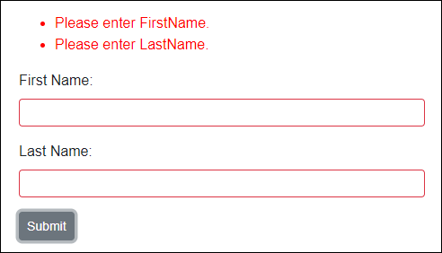
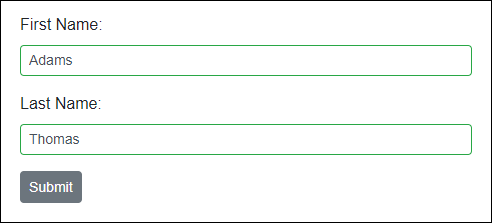
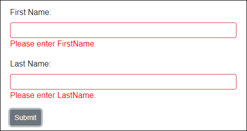
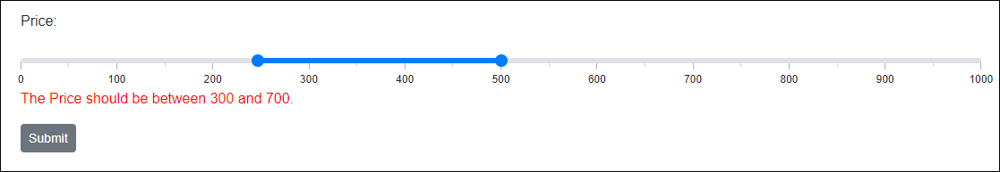

# Input Form Validation and Data Annotation

The Syncfusion Blazor UI input and editor components can be validated by the standards defined in the Blazor [Form Validation](https://learn.microsoft.com/en-us/aspnet/core/blazor/forms-and-input-components?view=aspnetcore-5.0). The user's input value can be validated based on the [DataAnnotation attributes](https://learn.microsoft.com/en-us/aspnet/core/mvc/models/validation?view=aspnetcore-5.0) defined in the model class.

## How to validate Syncfusion Blazor UI components

1. Create a model class and set [DataAnnotation attributes](https://learn.microsoft.com/en-us/aspnet/core/mvc/models/validation?view=aspnetcore-5.0) to its properties.

    ```cshtml
    @using System.ComponentModel.DataAnnotations;

    @code {
        private EmployeeDetails employeeModel = new EmployeeDetails();

        public class EmployeeDetails
        {
            [Required(ErrorMessage = "Please enter {0}.")]
            public string FirstName { get; set; }

            [Required(ErrorMessage = "Please enter {0}.")]
            public string LastName { get; set; }

            ....
            ....
        }
    }
    ```

2. Add the `EditForm` component in the view page and assign the model object to its `Model` property. Also, declare the `DataAnnotationsValidator` and `ValidationSummary` components inside the `EditForm` component.

    ```cshtml
    <EditForm Model="@employeeDetails">
        <DataAnnotationsValidator />
        <ValidationSummary/>
    </EditForm>
    ```

    N> [DataAnnotationsValidator](https://learn.microsoft.com/en-us/dotnet/api/microsoft.aspnetcore.components.forms.dataannotationsvalidator?view=aspnetcore-5.0) - Attaches validation support to an `EditContext` using data annotations.
    <br/>[ValidationSummary](https://learn.microsoft.com/en-us/dotnet/api/microsoft.aspnetcore.components.forms.validationsummary?view=aspnetcore-5.0) - Used to display a summarized list of all validation messages.

3. Add any desired [Syncfusion components](#blazor-form-validation-supported-components) inside the `EditForm` and provide the values through `@bind-` property.

    ```cshtml
    <EditForm Model="@employeeModel">
        <DataAnnotationsValidator />
        <ValidationSummary />
        <div class="form-group">
            <label for="first-name">First Name:</label>
            <SfTextBox ID="first-name" @bind-Value="employeeModel.FirstName"></SfTextBox>
        </div>
        <div class="form-group">
            <label for="last-name">Last Name:</label>
            <SfTextBox ID="last-name" @bind-Value="employeeModel.LastName"></SfTextBox>
        </div>
        <SfButton>Submit</SfButton>
    </EditForm>
    ```

    N> Refer to [this table](#blazor-form-validation-supported-components) for the Syncfusion Blazor components which supports the form validation and its `@bind` property details.  

4. The `EditForm` validates the input values based on its edit context and displays the validation message on the `ValidationSummary` component when submitting the form.

    **Validation Failure:**

    

    **Validation Success:**

    

    N> Green color border around the textbox indicates validation success state and Red color indicates validation failure state.

5. You can also use the `ValidationMessage` component to display the validation error message for each input component instead of displaying a validation summary using the `ValidationSummary` component.

    ```cshtml
    <EditForm Model="@employeeModel">
        <DataAnnotationsValidator />
        <div class="form-group">
            <label for="first-name">First Name:</label>
            <SfTextBox ID="first-name" @bind-Value="employeeModel.FirstName"></SfTextBox>
            <ValidationMessage For="@(() => employeeModel.FirstName)"></ValidationMessage>
        </div>
        <div class="form-group">
            <label for="last-name">Last Name:</label>
            <SfTextBox ID="last-name" @bind-Value="employeeModel.LastName"></SfTextBox>
            <ValidationMessage For="@(() => employeeModel.LastName)"></ValidationMessage>
        </div>
        <SfButton>Submit</SfButton>
    </EditForm>
    ```

    

6. The `EditForm`'s submit events [OnValidSubmit](https://learn.microsoft.com/en-us/dotnet/api/microsoft.aspnetcore.components.forms.editform.onvalidsubmit?view=aspnetcore-5.0) and [OnInvalidSubmit](https://learn.microsoft.com/en-us/dotnet/api/microsoft.aspnetcore.components.forms.editform.oninvalidsubmit?view=aspnetcore-5.0) can be used to get the validation success and failure `EditContext` details.

    ```cshtml
    <EditForm Model="@employeeDetails" OnValidSubmit="FormValidSubmit" OnInvalidSubmit="FormInvalidSubmit">
        ....
        ....
    </EditForm>

    @code {
        private void FormValidSubmit(EditContext context)
        {   
            // Triggers when form input has valid values.
        }
        private void FormInvalidSubmit(EditContext context)
        {
            // Triggers when form input has invalid values.
        }
    }
    ```

    You can also replace the above two events with [OnSubmit](https://learn.microsoft.com/en-us/dotnet/api/microsoft.aspnetcore.components.forms.editform.onsubmit?view=aspnetcore-5.0) handler and validate the form manually.

    ```cshtml
    <EditForm Model="@employeeDetails" OnSubmit="FormSubmit">
        ....
        ....
    <EditForm>

    @code {
        private void FormSubmit(EditContext context)
        {
            // Validates the EditContext and returns bool to indicate whether it has valid or invalid input values.
            bool isValid = context.Validate();
            if (isValid)
            {
                // Form has valid inputs.
            }
            else
            {
                // Form has invalid inputs.
            }
        }
    }
    ```

    W> You shouldn't use the `OnSubmit` handler along with `OnValidSubmit` and `OnInvalidSubmit` event handlers in the `EditForm` component. It will throw a runtime error.

## Blazor form validation supported components

The following section provides the details about the Syncfusion Blazor UI components that are supported with form validation, corresponding `@bind` properties, and validation examples.

<!-- markdownlint-disable MD033 -->
<table>
<tr>
<td>
<b>NuGet Package Name</b>
</td>
<td>
<b>Component Name</b>
</td>
<td>
<b>Property Name</b>
</td>
</tr>
<tr>
<td>
<a href="http://nuget.org/packages/Syncfusion.Blazor.Buttons/">Syncfusion.Blazor.Buttons</a>
</td>
<td>
<ul>
<li><a href="#sfcheckbox">SfCheckBox</a></li>
<li><a href="#sfradiobutton">SfRadioButton</a></li>
<li><a href="#sfswitch">SfSwitch</a></li>
</ul>
</td>
<td>
<ul>
<li>Checked</li>
</ul>
</td>
</tr>
<tr>
<td rowspan="2">
<a href="http://nuget.org/packages/Syncfusion.Blazor.Calendars/">Syncfusion.Blazor.Calendars</a>
</td>
<td>
<ul>
<li><a href="#sfcalendar">SfCalendar</a></li>
<li><a href="#sfdatepicker">SfDatePicker</a></li>
<li><a href="#sfdatetimepicker">SfDateTimePicker</a></li>
<li><a href="#sftimepicker">SfTimePicker</a></li>
</ul>
</td>
<td>
<ul>
<li>Value</li>
</ul>
</td>
</tr>
<tr>
<td>
<ul>
<li><a href="#sfdaterangepicker">SfDateRangePicker</a></li>
</ul>
</td>
<td>
<ul>
<li>StartDate</li>
<li>EndDate</li>
</ul>
</td>
</tr>
<tr>
<td>
<a href="http://nuget.org/packages/Syncfusion.Blazor.DropDowns/">Syncfusion.Blazor.DropDowns</a>
</td>
<td>
<ul>
<li><a href="#sfautocomplete">SfAutoComplete</a></li>
<li><a href="#sfcombobox">SfComboBox</a></li>
<li><a href="#sfdropdownlist">SfDropDownList</a></li>
<li><a href="#sflistbox">SfListBox</a></li>
<li><a href="#sfmultiselect">SfMultiSelect</a></li>
</ul>
</td>
<td>
<ul>
<li>Value</li>
</ul>
</td>
</tr>
<tr>
<td>
<a href="http://nuget.org/packages/Syncfusion.Blazor.InPlaceEditor/">Syncfusion.Blazor.InPlaceEditor</a>
</td>
<td>
<ul>
<li><a href="#sfinplaceeditor">SfInPlaceEditor</a></li>
</ul>
</td>
<td>
<ul>
<li>Value</li>
</ul>
</td>
</tr>
<tr>
<td>
<a href="http://nuget.org/packages/Syncfusion.Blazor.Inputs/">Syncfusion.Blazor.Inputs</a>
</td>
<td>
<ul>
<li><a href="#sfcolorpicker">SfColorPicker</a></li>
<li><a href="#sfmaskedtextbox">SfMaskedTextBox</a></li>
<li><a href="#sfnumerictextbox">SfNumericTextBox</a></li>
<li><a href="#sfslider">SfSlider</a></li>
<li><a href="#sftextbox">SfTextBox</a></li>
</ul>
</td>
<td>
<ul>
<li>Value</li>
</ul>
</td>
</tr>
<tr>
<td>
<a href="http://nuget.org/packages/Syncfusion.Blazor.RichTextEditor/">Syncfusion.Blazor.RichTextEditor</a>
</td>
<td>
<ul>
<li><a href="#sfrichtexteditor">SfRichTextEditor</a></li>
</ul>
</td>
<td>
<ul>
<li>Value</li>
</ul>
</td>
</tr>
</table>
<!-- markdownlint-enable MD033 -->

N> Make sure to use nullable integer `int?` when you use the `Required` attribute on the `Value` property. The default value for `int` is 0. So, it will pass the validation when you submit the form.

### SfAutoComplete

The Autocomplete component provides a list of suggestions when the user types the value on the input field. It uses the `@bind-Value` parameter to validate the form model `EditContext`.

```cshtml
@using System.ComponentModel.DataAnnotations;

<EditForm Model="@dropdownModel">
    <DataAnnotationsValidator />
    <div class="form-group">
        <label for="country">Country:</label>
        <SfAutoComplete ID="country" @bind-Value="@dropdownModel.Country" DataSource="@Countries">
            <AutoCompleteFieldSettings Value="Name"></AutoCompleteFieldSettings>
        </SfAutoComplete>
        <ValidationMessage For="@(() => dropdownModel.Country)"></ValidationMessage>
    </div>
    <SfButton>Submit</SfButton>
</EditForm>

@code {
    private DropdownModel dropdownModel = new DropdownModel();

    public class DropdownModel
    {
        [Required(ErrorMessage = "Please select your country.")]
        public string Country { get; set; }
    }

    public class Country
    {
        public string Name { get; set; }
        public string Code { get; set; }
    }

    public List<Country> Countries = new List<Country>
    {
        new Country() { Name = "Australia", Code = "AU" },
        new Country() { Name = "Bermuda", Code = "BM" },
        new Country() { Name = "Canada", Code = "CA" }
    };
}
```

### SfCalendar

The Calendar is a component to display the date and days of the week. It uses the `@bind-Value` parameter to validate the form model `EditContext`.

If you are using the `Required` attribute, make sure to use the `DateTime?` type. You can also specify the `Range` attribute to validate between two specific date values.

```cshtml
@using System.ComponentModel.DataAnnotations;

<EditForm Model="@dateModel">
    <DataAnnotationsValidator />
    <div class="form-group">
        <label for="calendar">Calendar:</label>
        <SfCalendar ID="calendar" @bind-Value="@dateModel.Date"></SfCalendar>
        <ValidationMessage For="@(() => dateModel.Date)"></ValidationMessage>
    </div>
    <SfButton>Submit</SfButton>
</EditForm>

@code {
    private DateModel dateModel = new DateModel();

    public class DateModel
    {
        [Required]
        [Range(typeof(DateTime), "1/1/1950", "12/31/2000",
        ErrorMessage = "The {0} value must be between {1:dd/MM/yyyy} and {2:dd/MM/yyyy}.")]
        public DateTime? Date { get; set; }
    }
}
```

### SfCheckBox

The Checkbox component is used to select one or more options from a list of predefined choices. It uses the `@bind-Checked` parameter to validate the form model `EditContext`.

```cshtml
@using System.ComponentModel.DataAnnotations;

<EditForm Model="@myModel">
    <DataAnnotationsValidator />
    <div class="form-group">
        <SfCheckBox Label="I accept the Terms and Conditions" @bind-Checked="@myModel.IsAccepted"></SfCheckBox>
        <ValidationMessage For="@(() => myModel.IsAccepted)"></ValidationMessage>
    </div>
    <SfButton>Submit</SfButton>
</EditForm>

@code {
    private MyModel myModel = new MyModel();

    public class MyModel
    {
        [Required]
        [Range(typeof(bool), "true", "true",
        ErrorMessage = "You need to accept the Terms and Conditions.")]
        public bool IsAccepted { get; set; }
    }
}
```

### SfColorPicker

The ColorPicker component allows you to choose a specific color value instead of input. It uses the `@bind-Value` parameter to validate the form model `EditContext`.

```cshtml
@using System.ComponentModel.DataAnnotations;

<EditForm Model="@personal">
    <DataAnnotationsValidator />
    <div class="form-group">
        <label for="fav-color">Favorite Color:</label>
        <SfColorPicker ID="fav-color" @bind-Value="@personal.FavoriteColor"></SfColorPicker>
        <ValidationMessage For="@(() => personal.FavoriteColor)"></ValidationMessage>
    </div>
    <SfButton>Submit</SfButton>
</EditForm>

@code {
    private Personal personal = new Personal();

    public class Personal
    {
        [Required(ErrorMessage = "Please specify your favorite color.")]
        public string FavoriteColor { get; set; }
    }
}
```

### SfComboBox

The Combobox component is an editable dropdown list that also allows users to select an option from a predefined popup list. It uses the `@bind-Value` parameter to validate the form model `EditContext`.

```cshtml
@using System.ComponentModel.DataAnnotations;

<EditForm Model="@dropdownModel">
    <DataAnnotationsValidator />
    <div class="form-group">
        <label for="country">Country:</label>
        <SfComboBox ID="country" @bind-Value="@dropdownModel.Country" DataSource="@Countries">
            <ComboBoxFieldSettings Value="Name"></ComboBoxFieldSettings>
        </SfComboBox>
        <ValidationMessage For="@(() => dropdownModel.Country)"></ValidationMessage>
    </div>
    <SfButton>Submit</SfButton>
</EditForm>

@code {
    private DropdownModel dropdownModel = new DropdownModel();

    public class DropdownModel
    {
        [Required(ErrorMessage = "Please select your country.")]
        public string Country { get; set; }
    }

    public class Country
    {
        public string Name { get; set; }
        public string Code { get; set; }
    }

    public List<Country> Countries = new List<Country>
    {
        new Country() { Name = "Australia", Code = "AU" },
        new Country() { Name = "Bermuda", Code = "BM" },
        new Country() { Name = "Canada", Code = "CA" },
        new Country() { Name = "Cameroon", Code = "CM" }
    };
}
```

### SfDatePicker

The DatePicker component allows you to enter or select a date value on the input field. It uses the `@bind-Value` parameter to validate the form model `EditContext`.

If you are using the `Required` attribute, make sure to use the `DateTime?` type. You can also specify the `Range` attribute to validate between two specific date values.

```cshtml
@using System.ComponentModel.DataAnnotations;

<EditForm Model="@dateModel">
    <DataAnnotationsValidator />
    <div class="form-group">
        <label for="dob">Date of Birth:</label>
        <SfDatePicker ID="dob" @bind-Value="@dateModel.Date"></SfDatePicker>
        <ValidationMessage For="@(() => dateModel.Date)"></ValidationMessage>
    </div>
    <SfButton>Submit</SfButton>
</EditForm>

@code {
    private DateModel dateModel = new DateModel();

    public class DateModel
    {
        [Required]
        [Range(typeof(DateTime), "1/1/1950", "12/31/2000",
        ErrorMessage = "The {0} value must be between {1:dd/MM/yyyy} and {2:dd/MM/yyyy}.")]
        public DateTime? Date { get; set; }
    }
}
```

### SfDateRangePicker

The DateRangePicker component allows you to enter or select a range of start and end date values on the input field. It uses `@bind-StartDate` and `@bind-EndDate` parameters to validate the form model `EditContext`.

If you are using the `Required` attribute, make sure to use the `DateTime?` type. You can also specify the `Range` attribute to validate between two specific date values.

```cshtml
@using System.ComponentModel.DataAnnotations;

<EditForm Model="@dateRange">
    <DataAnnotationsValidator />
    <div class="form-group">
        <label for="date-range">Date Range:</label>
        <ValidationMessage For="@(() => dateRange.StartDate)"></ValidationMessage>
        <SfDateRangePicker ID="date-range" @bind-StartDate="@dateRange.StartDate" @bind-EndDate="@dateRange.EndDate"></SfDateRangePicker>
        <ValidationMessage For="@(() => dateRange.EndDate)"></ValidationMessage>
    </div>
    <SfButton>Submit</SfButton>
</EditForm>

@code {
    private DateModel dateRange = new DateModel();

    public class DateModel
    {
        [Required]
        [Range(typeof(DateTime), "1/1/1990", "12/31/2000",
        ErrorMessage = "The {0} value should be between {1:dd/MM/yyyy} and {2:dd/MM/yyyy}.")]
        public DateTime? StartDate { get; set; }

        [Required]
        [Range(typeof(DateTime), "1/1/1990", "12/31/2000",
        ErrorMessage = "The {0} value should be between {1:dd/MM/yyyy} and {2:dd/MM/yyyy}.")]
        public DateTime? EndDate { get; set; }
    }
}
```

### SfDateTimePicker

The DateTimePicker component allows you to enter or select date and time values on the input field. It uses the `@bind-Value` parameter to validate the form model `EditContext`.

If you are using the `Required` attribute, make sure to use the `DateTime?` type. You can also specify the `Range` attribute to validate between two specific date values.

```cshtml
@using System.ComponentModel.DataAnnotations;

<EditForm Model="@dateModel">
    <DataAnnotationsValidator />
    <div class="form-group">
        <label for="date-time">Date and Time:</label>
        <SfDateTimePicker ID="date-time" @bind-Value="@dateModel.DateTime"></SfDateTimePicker>
        <ValidationMessage For="@(() => dateModel.DateTime)"></ValidationMessage>
    </div>
    <SfButton>Submit</SfButton>
</EditForm>

@code {
    private DateModel dateModel = new DateModel();

    public class DateModel
    {
        [Required]
        [Range(typeof(DateTime), "1/1/1990 09:00:00 AM", "12/31/2000 06:00:00 PM",
        ErrorMessage = "The {0} value should be between {1:dd/MM/yyyy hh:mm tt} and {2:dd/MM/yyyy hh:mm tt}.")]
        public DateTime? DateTime { get; set; }
    }
}
```

### SfDropDownList

The DropdownList component allows users to select an option from a predefined popup list. It uses the `@bind-Value` parameter to validate the form model `EditContext`.

```cshtml
@using System.ComponentModel.DataAnnotations;

<EditForm Model="@dropdownModel">
    <DataAnnotationsValidator />
    <div class="form-group">
        <label for="country">Country:</label>
        <SfDropDownList ID="country" @bind-Value="@dropdownModel.Country" DataSource="@Countries">
            <DropDownListFieldSettings Value="Name"></DropDownListFieldSettings>
        </SfDropDownList>
        <ValidationMessage For="@(() => dropdownModel.Country)"></ValidationMessage>
    </div>
    <SfButton>Submit</SfButton>
</EditForm>

@code {
    private DropdownModel dropdownModel = new DropdownModel();

    public class DropdownModel
    {
        [Required(ErrorMessage = "Please select your country.")]
        public string Country { get; set; }
    }

    public class Country
    {
        public string Name { get; set; }
        public string Code { get; set; }
    }

    public List<Country> Countries = new List<Country>
    {
        new Country() { Name = "Australia", Code = "AU" },
        new Country() { Name = "Bermuda", Code = "BM" },
        new Country() { Name = "Canada", Code = "CA" },
        new Country() { Name = "Cameroon", Code = "CM" }
    };
}
```

### SfInPlaceEditor

The In-PlaceEditor component allows users to dynamically edit within its context. It uses the `@bind-Value` parameter to validate the form model `EditContext`.

```cshtml
@using System.ComponentModel.DataAnnotations;

<EditForm Model="@editorModel">
    <DataAnnotationsValidator />
    <div class="form-group">
        <label for="name">Employee Name:</label>
        <SfInPlaceEditor ID="name" Type="Syncfusion.Blazor.InPlaceEditor.InputType.Text" @bind-Value="@editorModel.Name">
            <EditorComponent>
                <SfTextBox @bind-Value="@editorModel.Name"></SfTextBox>
            </EditorComponent>
        </SfInPlaceEditor>
        <ValidationMessage For="@(() => editorModel.Name)"></ValidationMessage>
    </div>
    <SfButton>Submit</SfButton>
</EditForm>

@code {
    private EditorModel editorModel = new EditorModel();
    public class EditorModel
    {
        [Required(ErrorMessage = "Employee name is required.")]
        public string Name { get; set; }
    }
}
```

### SfListBox

The ListBox component allows users to select multiple options from a list of predefined values. It uses the `@bind-Value` parameter to validate the form model `EditContext`.

```cshtml
@using System.ComponentModel.DataAnnotations;

<EditForm Model="@dropdownModel">
    <DataAnnotationsValidator />
    <div class="form-group">
        <label for="games">Sports:</label>
        <SfListBox ID="games" DataSource="@Games" @bind-Value="@dropdownModel.Games">
            <ListBoxFieldSettings Text="Text" Value="ID" />
        </SfListBox>
        <ValidationMessage For="@(() => dropdownModel.Games)"></ValidationMessage>
    </div>
    <SfButton>Submit</SfButton>
</EditForm>

@code {
    private DropdownModel dropdownModel = new DropdownModel();

    public class DropdownModel
    {
        [Required]
        [MinLength(3, ErrorMessage = "Please select atleast 3 games.")]
        public string[] Games { get; set; }
    }

    public class GameFields
    {
        public string ID { get; set; }
        public string Text { get; set; }
    }

    public List<GameFields> Games = new List<GameFields>()
    {
        new GameFields(){ ID= "Game1", Text= "American Football" },
        new GameFields(){ ID= "Game2", Text= "Badminton" },
        new GameFields(){ ID= "Game3", Text= "Basketball" },
        new GameFields(){ ID= "Game4", Text= "Cricket" },
        new GameFields(){ ID= "Game5", Text= "Football" },
        new GameFields(){ ID= "Game6", Text= "Golf" },
        new GameFields(){ ID= "Game7", Text= "Hockey" },
        new GameFields(){ ID= "Game8", Text= "Rugby"},
        new GameFields(){ ID= "Game9", Text= "Snooker" },
        new GameFields(){ ID= "Game10", Text= "Tennis"},
    };
}
```

### SfMaskedTextBox

The Masked TextBox component provides an easy and reliable way to collect user input based on a standard mask. It uses the `@bind-Value` parameter to validate the form model `EditContext`.

```cshtml
@using System.ComponentModel.DataAnnotations;

<EditForm Model="@cardModel">
    <DataAnnotationsValidator />
    <div class="form-group">
        <label for="credit-card">Credit Card:</label>
        <SfMaskedTextBox ID="credit-card" Mask="0000-0000-0000-0000" @bind-Value="@cardModel.CreditCard"></SfMaskedTextBox>
        <ValidationMessage For="@(() => cardModel.CreditCard)"></ValidationMessage>
    </div>
    <div class="form-group">
        <label for="pin-number">Pin Number:</label>
        <SfMaskedTextBox ID="pin-number" Mask="0000" @bind-Value="@cardModel.Pin"></SfMaskedTextBox>
        <ValidationMessage For="@(() => cardModel.Pin)"></ValidationMessage>
    </div>
    <div class="form-group">
        <label for="phone">Phone:</label>
        <SfMaskedTextBox ID="phone" Mask="+1-000-000-0000" @bind-Value="@cardModel.Phone"></SfMaskedTextBox>
        <ValidationMessage For="@(() => cardModel.Phone)"></ValidationMessage>
    </div>
    <SfButton>Submit</SfButton>
</EditForm>

@code {
    private CardModel cardModel = new CardModel();
    public class CardModel
    {
        [Required]
        [RegularExpression("^4[0-9]{12}(?:[0-9]{3})?$", ErrorMessage = "Please enter a valid credit card number.")]
        public string CreditCard { get; set; }

        [Required]
        [RegularExpression("^[0-9]{4}$", ErrorMessage = "Invalid pin number.")]
        public string Pin { get; set; }

        [MinLength(10, ErrorMessage = "Please enter a valid phone number.")]
        public string Phone { get; set; }
    }
}
```

### SfMultiSelect

The MultiSelect component allows the user to type or select multiple values from a list of predefined options. It uses the `@bind-Value` parameter to validate the form model `EditContext`.

```cshtml
@using System.ComponentModel.DataAnnotations;

<EditForm Model="@dropdownModel">
    <DataAnnotationsValidator />
    <div class="form-group">
        <label for="sports">Favorite Sports:</label>
        <SfMultiSelect ID="sports" @bind-Value="@dropdownModel.Games" DataSource="@Games">
            <MultiSelectFieldSettings Text="Text" Value="ID"></MultiSelectFieldSettings>
        </SfMultiSelect>
        <ValidationMessage For="@(() => dropdownModel.Games)"></ValidationMessage>
    </div>
    <SfButton>Submit</SfButton>
</EditForm>

@code {
    private DropdownModel dropdownModel = new DropdownModel();

    public class DropdownModel
    {
        [Required]
        [MinLength(3, ErrorMessage = "Please select atleast 3 games.")]
        public string[] Games { get; set; }
    }

    public class GameFields
    {
        public string ID { get; set; }

        public string Text { get; set; }
    }

    public List<GameFields> Games = new List<GameFields>()
    {
        new GameFields(){ ID= "Game1", Text= "American Football" },
        new GameFields(){ ID= "Game2", Text= "Badminton" },
        new GameFields(){ ID= "Game3", Text= "Basketball" },
        new GameFields(){ ID= "Game4", Text= "Cricket" },
        new GameFields(){ ID= "Game5", Text= "Football" },
        new GameFields(){ ID= "Game6", Text= "Golf" },
        new GameFields(){ ID= "Game7", Text= "Hockey" },
        new GameFields(){ ID= "Game8", Text= "Rugby"},
        new GameFields(){ ID= "Game9", Text= "Snooker" },
        new GameFields(){ ID= "Game10", Text= "Tennis"},
    };
}
```

### SfNumericTextBox

The Numeric TextBox component is used to get number inputs from the users. It uses the `@bind-Value` parameter to validate the form model `EditContext`.

```cshtml
@using System.ComponentModel.DataAnnotations;

<EditForm Model="@numericModel">
    <DataAnnotationsValidator />
    <div class="form-group">
        <label for="age">Age:</label>
        <SfNumericTextBox ID="age" @bind-Value=@numericModel.Age></SfNumericTextBox>
        <ValidationMessage For="@(() => numericModel.Age)"></ValidationMessage>
    </div>
    <SfButton>Submit</SfButton>
</EditForm>

@code {
    private NumericModel numericModel = new NumericModel();

    public class NumericModel
    {
        [Required]
        [Range(typeof(int), "22", "50", ErrorMessage = "The {0} value should be between {1} and {2}.")]
        public int Age { get; set; }
    }
}
```

### SfRadioButton

The Radio Button component allows users to select one option from a list of predefined choices. It uses the `@bind-Checked` parameter to validate the form model `EditContext`.

```cshtml
@using System.ComponentModel.DataAnnotations;

<EditForm Model="@myModel">
    <DataAnnotationsValidator />
    <div class="form-group">
        <SfRadioButton Label="Small" Name="size" Value="1" @bind-Checked="@myModel.Value"></SfRadioButton>
        <SfRadioButton Label="Medium" Name="size" Value="2" @bind-Checked="@myModel.Value"></SfRadioButton>
        <SfRadioButton Label="Large" Name="size" Value="3" @bind-Checked="@myModel.Value"></SfRadioButton>
        <SfRadioButton Label="Extra Large" Name="size" Value="4" @bind-Checked="@myModel.Value"></SfRadioButton>
        <ValidationMessage For="@(() => myModel.Value)"></ValidationMessage>
    </div>
    <SfButton>Submit</SfButton>
</EditForm>

@code {
    private MyModel myModel = new MyModel();

    public class MyModel
    {
        [Required]
        [Range(typeof(int), "1", "3", ErrorMessage = "Extra-large size product is currently unavailable. Please select any other size.")]
        public int Value { get; set; } = 1;
    }
}
```

### SfRichTextEditor

The RichTextEditor component is used to create blogs, forum posts, notes sections, support tickets (incidents), comment sections, messaging applications, and more. It uses the `@bind-Value` parameter to validate the form model `EditContext`.

```cshtml
@using System.ComponentModel.DataAnnotations;

<EditForm Model="@editorModel">
    <DataAnnotationsValidator />
    <div class="form-group">
        <label for="comments">Comments:</label>
        <SfRichTextEditor ID="comments" @bind-Value="@editorModel.Feedback" />
        <ValidationMessage For="(() => editorModel.Feedback)"></ValidationMessage>
    </div>
    <SfButton>Submit</SfButton>
</EditForm>

@code {
    private EditorModel editorModel = new EditorModel();

    public class EditorModel
    {
        [Required]
        [MaxLength(100, ErrorMessage = "The maximum length of this field is {1} character.")]
        public string Feedback { get; set; }
    }
}
```

### SfSlider

The Slider component allows you to select a value or range of values between specified min and max values. It uses the `@bind-Value` parameter to validate the form model `EditContext`.

N> You can create your own [custom validation](#apply-custom-validation-attributes) logic to validate the `Range` type slider.

```cshtml
@using System.ComponentModel.DataAnnotations;

<EditForm Model="@myModel">
    <DataAnnotationsValidator />
    <div class="form-group">
        <label for="volume">Volume:</label>
        <SfSlider ID="volume" @bind-Value="@myModel.Volume" Type="SliderType.MinRange">
            <SliderTicks Placement="Placement.After" ShowSmallTicks="true" LargeStep="10" SmallStep="5"></SliderTicks>
        </SfSlider>
        <ValidationMessage For="(() => myModel.Volume)"></ValidationMessage>
    </div>
    <SfButton>Submit</SfButton>
</EditForm>

@code {
    private MyModel myModel = new MyModel();

    public class MyModel
    {
        [Required]
        [Range(0, 70, ErrorMessage = "Reached higher volume limit. Please reduce to below {2}.")]
        public int Volume { get; set; }
    }
}
```

### SfSwitch

The Switch component allows you to perform a toggle (on/off) action between checked and unchecked states. It uses the `@bind-Checked` parameter to validate the form model `EditContext`.

```cshtml
@using System.ComponentModel.DataAnnotations;

<EditForm Model="@myModel">
    <DataAnnotationsValidator />
    <div class="form-group">
        <SfSwitch @bind-Checked="@myModel.IsAccepted">I agree to receive the newsletter.</SfSwitch>
        <ValidationMessage For="@(() => myModel.IsAccepted)"></ValidationMessage>
    </div>
    <SfButton>Submit</SfButton>
</EditForm>

@code {
    private MyModel myModel = new MyModel();
    public class MyModel
    {
        [Range(typeof(bool), "true", "true", ErrorMessage = "You need to agree to receive the newsletter.")]
        public bool IsAccepted { get; set; }
    }
}
```

### SfTextBox

The TextBox is a component for editing, displaying, or entering plain text on forms to capture user names, phone numbers, email, and more. It uses the `@bind-Value` parameter to validate the form model `EditContext`.

```cshtml
@using System.ComponentModel.DataAnnotations;

<EditForm Model="@editorModel">
    <DataAnnotationsValidator />
    <div class="form-group">
        <label for="employee-name">Employee Name:</label>
        <SfTextBox ID="employee-name" @bind-Value="editorModel.Name"></SfTextBox>
        <ValidationMessage For="@(() => editorModel.Name)"></ValidationMessage>
    </div>
    <SfButton>Submit</SfButton>
</EditForm>

@code {
    private EditorModel editorModel = new EditorModel();
    public class EditorModel
    {
        [Required(ErrorMessage = "Enter employee name.")]
        [MinLength(3, ErrorMessage = "Name should have more than 2 characters.")]
        public string Name { get; set; }
    }
}
```

### SfTimePicker

The TimePicker component allows users to select a time value either from a pop-up time list or by entering the value directly in the text box. It uses the `@bind-Value` parameter to validate the form model `EditContext`.

If you are using the `Required` attribute, make sure to use the `DateTime?` type. You can also specify the `Range` attribute to validate between two specific date and time values.

```cshtml
@using System.ComponentModel.DataAnnotations;

<EditForm Model="@dateModel">
    <DataAnnotationsValidator />
    <div class="form-group">
        <label for="work-hours">Work Hours:</label>
        <SfTimePicker ID="work-hours" @bind-Value="@dateModel.WorkHours"></SfTimePicker>
        <ValidationMessage For="@(() => dateModel.WorkHours)"></ValidationMessage>
    </div>
    <SfButton>Submit</SfButton>
</EditForm>

@code {
    private DateModel dateModel = new DateModel();
    public class DateModel
    {
        [Required]
        [Range(typeof(DateTime), "09:00:00 AM", "06:00:00 PM", ErrorMessage = "The work hours should be between {1} to {2}.")]
        public DateTime? WorkHours { get; set; }
    }
}
```

## Apply custom validation attributes

You can implement your custom validation logic and apply the [custom attributes](https://learn.microsoft.com/en-us/aspnet/core/mvc/models/validation?view=aspnetcore-5.0#custom-attributes) on the model class properties. Refer to the following steps to create and apply custom attributes to a model property.

1. Create a class and inherit it from [ValidationAttribute](https://learn.microsoft.com/en-us/dotnet/api/system.componentmodel.dataannotations.validationattribute?view=net-5.0).

2. Override the [IsValid](https://learn.microsoft.com/en-us/dotnet/api/system.componentmodel.dataannotations.validationattribute.isvalid?view=net-7.0) method to implement your custom validation logic.

3. Add the custom attribute to the model class property.

```cshtml
@using System.ComponentModel.DataAnnotations;

<EditForm Model="@rangeModel">
    <DataAnnotationsValidator />
    <div class="form-group">
        <label for="price">Price:</label>
        <SfSlider ID="price" @bind-Value="@rangeModel.Price" Type="SliderType.Range" Min="0" Max="1000">
            <SliderTicks Placement="Placement.After" ShowSmallTicks="true" LargeStep="100" SmallStep="50"></SliderTicks>
        </SfSlider>
        <ValidationMessage For="@(() => rangeModel.Price)"></ValidationMessage>
    </div>
    <SfButton>Submit</SfButton>
</EditForm>

@code {
    private RangeModel rangeModel = new RangeModel();

    public class RangeModel
    {
        [Required]
        [CustomRange(300, 700)]
        public int[] Price { get; set; } = { 500, 600 };
    }

    public class CustomRangeAttribute : ValidationAttribute
    {
        public int StartRange { get; }
        public int EndRange { get; }

        public CustomRangeAttribute(int startRange, int endRange)
        {
            StartRange = startRange;
            EndRange = endRange;
        }

        protected override ValidationResult IsValid(object value, ValidationContext validationContext)
        {
            var inputValues = (int[])value;
            if (inputValues[0] < StartRange || inputValues[1] > EndRange)
            {
                return new ValidationResult($"The {validationContext.DisplayName} should be between {StartRange} and {EndRange}.");
            }
            return ValidationResult.Success;
        }
    }
}
```



### Validate Syncfusion components inside another component

You can create a new Blazor component and use [Syncfusion Blazor components](#blazor-form-validation-supported-components) on top of it for your custom implementation. In this case, you may need to validate your Blazor component that should validate the Syncfusion Blazor components.

Refer to the following steps to create and validate the Syncfusion Blazor component on your custom Blazor component.

1. Right-click on the `~/Pages/` folder in the Visual Studio and navigate to `Add -> Razor Component`. Specify the component name and create it.

2. Add Syncfusion Blazor component in the new component and assign the `Value`, `ValueChanged`, and `ValueExpression` properties. Refer [here](https://learn.microsoft.com/en-us/aspnet/core/blazor/components/data-binding?view=aspnetcore-5.0#binding-with-component-parameters), to know more about data binding in component parameters.

    ```cshtml
    @using System.Linq.Expressions;

    <label for="@ID">@Label</label>
    <SfTextBox ID="@ID" Value="@Text" ValueChanged="@((text) => Text = text)"   ValueExpression="@TextExpression"></SfTextBox>

    @code {
        [Parameter]
        public string ID { get; set; }

        [Parameter]
        public string Label { get; set; }

        [Parameter]
        public string Text
        {
            get => text;
            set
            {
                if (text != value)
                {
                    text = value;
                    TextChanged.InvokeAsync(value);
                }
            }
        }
        private string text;

        [Parameter]
        public EventCallback<string> TextChanged { get; set; }

        [Parameter]
        public Expression<Func<string>> TextExpression { get; set; }
    }
    ```

3. Add your new component in the view page `~/Pages/Index.razor` and implement validation using DataAnnotation.

    ```cshtml
    @using System.ComponentModel.DataAnnotations;

    <EditForm Model="@editorModel">
        <DataAnnotationsValidator />
        <div class="form-group">
            <MyTextBox ID="name" Label="Name" @bind-Text="@editorModel.Name"></MyTextBox>
            <ValidationMessage For="@(() => editorModel.Name)"></ValidationMessage>
        </div>
        <SfButton>Submit</SfButton>
    </EditForm>

    @code {
        private EditorModel editorModel = new EditorModel();
        public class EditorModel
        {
            [Required(ErrorMessage = "Enter employee name.")]
            [MinLength(3, ErrorMessage = "Name should have more than 2 characters.")]
            public string Name { get; set; }
        }
    }
    ```

## See Also

* [Model validation in ASP.NET Core and Razor Pages](https://learn.microsoft.com/en-us/aspnet/core/mvc/models/validation?view=aspnetcore-5.0)
* [Blazor Forms and Validation](https://learn.microsoft.com/en-us/aspnet/core/blazor/forms-and-input-components?view=aspnetcore-5.0)
