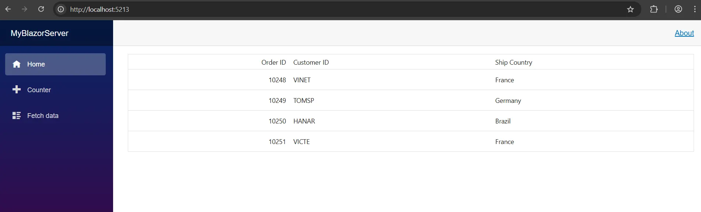

# Integrating Syncfusion® Angular Components in Blazor

This guide explains how to render [Syncfusion® Angular components](https://www.syncfusion.com/angular-components) inside a Blazor application by packaging the Angular component as a **custom element (Web Component)**. Blazor and Angular use different rendering engines, so Angular cannot run directly inside a Blazor page. However, [Angular custom elements](https://angular.dev/guide/elements) allow Angular components to be compiled into standard HTML tags, enabling seamless integration within Blazor.

A common use case for this integration is when a Blazor application needs to reuse existing Angular components without migrating them to .NET. By converting Angular components into custom elements, teams can embed rich UI elements such as charts, grids, editors, and schedulers directly within Blazor pages. This is especially useful for enterprise applications in **ERP**, **logistics**, **health-care**, and **analytics platforms**.

## Prerequisites

* [.NET 10 SDK](https://dotnet.microsoft.com/en-us/download/dotnet/10.0) 
* [Node.js 18+](https://nodejs.org/en/download)
* [Angular CLI 18+](https://www.npmjs.com/package/@angular/cli) 

## Creating the Angular application 

### Create the project

If you already have an Angular project, move to the **Install custom elements package** section. Otherwise, create a new Angular project following Syncfusion documentation.

[Angular Getting Started](https://ej2.syncfusion.com/angular/documentation/getting-started/angular-standalone)

### Install custom elements package

To enable Angular custom elements, install the package below: 




npm i @angular/elements




This package enables exporting Angular components as Web Components. This allows Blazor to load Angular UI using a simple HTML tag. 

### Adding CSS references

The following CSS styles are available in the `../node_modules/@syncfusion` folder. Reference them in `src/styles.css` as follows:




@import '../node_modules/@syncfusion/ej2-base/styles/fluent2.css';  
@import '../node_modules/@syncfusion/ej2-buttons/styles/fluent2.css';  
@import '../node_modules/@syncfusion/ej2-calendars/styles/fluent2.css';  
@import '../node_modules/@syncfusion/ej2-dropdowns/styles/fluent2.css';  
@import '../node_modules/@syncfusion/ej2-inputs/styles/fluent2.css';  
@import '../node_modules/@syncfusion/ej2-navigations/styles/fluent2.css';
@import '../node_modules/@syncfusion/ej2-popups/styles/fluent2.css';
@import '../node_modules/@syncfusion/ej2-splitbuttons/styles/fluent2.css';
@import '../node_modules/@syncfusion/ej2-notifications/styles/fluent2.css';
@import '../node_modules/@syncfusion/ej2-angular-grids/styles/fluent2.css';




N> Syncfusion provides multiple theme variants, allowing selection of the theme that best aligns with the application's UI design. Additional theme options and customization details are available in the [theming documentation](https://ej2.syncfusion.com/angular/documentation/appearance/overview).

### Add Syncfusion&reg; component

Update your `src/app/app.ts` file to incorporate the Syncfusion DataGrid component: 




import { Component } from '@angular/core';
import { GridModule } from '@syncfusion/ej2-angular-grids';

@Component({
  selector: 'app-root',
  standalone: true,
  imports: [GridModule],
  template: `
    <ejs-grid [dataSource]="data" height="400">
      <e-columns>
        <e-column field="OrderID" headerText="Order ID" width="120"></e-column>
        <e-column field="CustomerID" headerText="Customer ID" width="150"></e-column>
        <e-column field="ShipCountry" headerText="ShipCountry" width="120"></e-column>
      </e-columns>
    </ejs-grid>
  `
})
export class AppComponent {
  public data = [
    { OrderID: 10248, CustomerID: 'VINET', ShipCountry: 'France' },
    { OrderID: 10249, CustomerID: 'TOMSP', ShipCountry: 'Germany' },
    { OrderID: 10250, CustomerID: 'HANAR', ShipCountry: 'Brazil' },
    { OrderID: 10251, CustomerID: 'VICTE', ShipCountry: 'France' }
  ];
}




N> If your project uses the default Angular CLI naming, the file may be named `app.component.ts` instead of `app.ts`.

### Register the Angular component as a custom element

The Angular component is converted into a Web Component by registering it with [customElements.define()](https://developer.mozilla.org/en-US/docs/Web/API/CustomElementRegistry/define). After this registration, the component is available as a standalone HTML element such as `<sf-grid>` that Blazor can display. 

Add the following code inside `main.ts` to expose the component as a custom element.




import { AppComponent } from './app/app';
import { createApplication } from '@angular/platform-browser';
import { provideHttpClient } from '@angular/common/http';
import { createCustomElement } from '@angular/elements';

(async () => {
  try {
    const app = await createApplication({
      providers: [ provideHttpClient() ]
    });
    const element = createCustomElement(AppComponent, { injector: app.injector });
    if (!customElements.get('sf-grid')) {
      customElements.define('sf-grid', element);
    }
  } catch (err) {
    console.error(err);
  }
})();




**Build the Angular application:**

The Angular production build generates JavaScript and CSS files that represent the Web Component.




ng build --configuration production --output-hashing=none




## Integrating the custom elements in Blazor 

### Create the Blazor app 

If you already have a Blazor project, move to the next step. Otherwise, create one using the following command. 

**Blazor WebAssembly:**




dotnet new blazorwasm -o BlazorHost




**Blazor Server:**




dotnet new blazor --interactivity Server -o BlazorHost




N> For .NET 8 and later, use the `blazor` template with the `--interactivity` parameter. If you're using .NET 6 or 7, use `dotnet new blazorserver` instead.

### Add MSBuild automation to build & copy Angular output

An MSBuild script is added to the Blazor project, so Angular builds automatically whenever Blazor builds. This ensures that the Web Component files are always up to date and copied into Blazor’s `wwwroot` folder. 

Add this target block to your Blazor project’s `.csproj` file:




 <Target Name="BuildAngularElement" BeforeTargets="Build">
    <!-- Replace 'syncfusion-angular-app' with your Angular project folder name -->
    <PropertyGroup>
      <AngularProject>../syncfusion-angular-app</AngularProject>
      <AngularDist>$(AngularProject)/dist/syncfusion-angular-app</AngularDist>
      <BlazorLib>wwwroot/lib/sf-grid</BlazorLib>
    </PropertyGroup>
    <!-- Install & build Angular (skip if you prefer pnpm/yarn) -->
    <Exec WorkingDirectory="$(AngularProject)" Command="npm ci" />
    <Exec WorkingDirectory="$(AngularProject)" Command="npx ng build --configuration production --output-hashing=none" />
    <!-- Clean & copy -->
    <RemoveDir Directories="$(BlazorLib)" />
    <MakeDir Directories="$(BlazorLib)" />
    <ItemGroup>
      <AngularFiles Include="$(AngularDist)/**/*.*" />
    </ItemGroup>
    <Copy SourceFiles="@(AngularFiles)"
          DestinationFolder="$(BlazorLib)" />
  </Target>




N> Replace **syncfusion-angular-app** in both `<AngularProject>` and `<AngularDist>` with the actual name of your Angular project folder.

### Load Web Component scripts and themes in Blazor

 The generated Angular files (`main.js` and `styles.css`) are referenced inside the Blazor host page. This is required for the Web Component to initialize and render correctly inside the Blazor layout. 

Include the stylesheet in the `<head>` and the script at the end of the `<body>` in the `App.razor` file as shown below:




<head>
    ....
    <link rel="stylesheet" href="/lib/sf-grid/styles.css" />
</head>
<body>
    ....
    
</body>




### Use the Angular custom element in Blazor

You can place the `<sf-grid>` HTML tag directly inside any `.razor` (e.g `Index.razor`) component. 




<sf-grid></sf-grid> 




N> `<sf-grid>` is the wrapper web component, not the Syncfusion grid tag itself.

## Run the application




dotnet run




Once the compilation is complete, open your browser and navigate to the hosted link to view your application with the integrated Syncfusion® DataGrid component:

## See also

* [Getting started with Syncfusion Blazor DataGrid](https://blazor.syncfusion.com/documentation/datagrid/getting-started-with-web-app)
* [Getting started with Syncfusion Angular DataGrid](https://ej2.syncfusion.com/angular/documentation/grid/getting-started)

