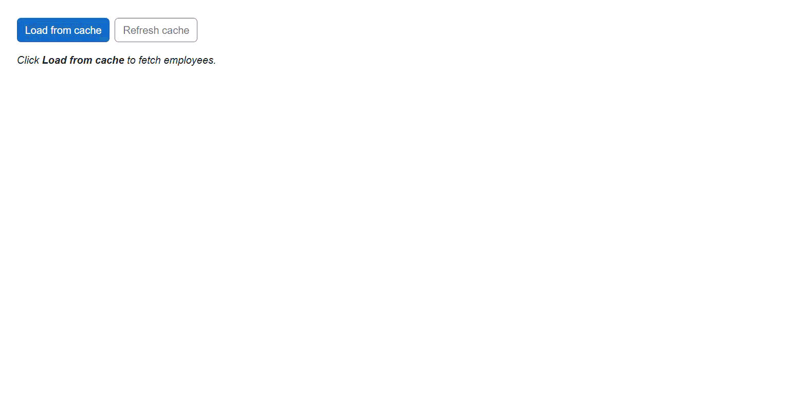

# Integrating Blazor Components with Azure Cache for Redis

This guide explains how to integrate [Blazor components](https://www.syncfusion.com/blazor-components) with [Azure Cache for Redis](https://learn.microsoft.com/en-us/azure/azure-cache-for-redis/) as a distributed cache backend in a Blazor application. The pattern follows the cache-aside model: the component injects a service, the service checks Redis first and falls back to the data source on a miss, then primes the cache for the next request.

## Prerequisites

* [.NET SDK](https://dotnet.microsoft.com/en-us/download/visual-studio-sdks) (version 8.0 or later, this guide uses .NET 10.0)
* [Visual Studio](https://visualstudio.microsoft.com/downloads/) 2022 or later, or [Visual Studio Code](https://code.visualstudio.com/) with the [C# Dev Kit](https://marketplace.visualstudio.com/items?itemName=ms-dotnettools.csdevkit) extension
* An [Azure Cache for Redis](https://learn.microsoft.com/en-us/azure/azure-cache-for-redis/quickstart-create-redis) instance provisioned in your subscription

## Create the Blazor project

To create a Blazor server application, follow the [Blazor Server App getting started guide](https://blazor.syncfusion.com/documentation/getting-started/blazor-server-side-visual-studio).

This guide names the project `BlazorRedisServer`, substitute your own project name in the namespaces below if different

## Install required NuGet packages

Install packages in your project using the NuGet Package Manager in Visual Studio (*Tools → NuGet Package Manager → Manage NuGet Packages for Solution*), the integrated terminal in Visual Studio Code, or the .NET CLI.

**Syncfusion packages:**

* [Syncfusion.Blazor.Grid](https://www.nuget.org/packages/Syncfusion.Blazor.Grid)
* [Syncfusion.Blazor.Themes](https://www.nuget.org/packages/Syncfusion.Blazor.Themes)

**Microsoft package (Redis cache integration):**

* [Microsoft.Extensions.Caching.StackExchangeRedis](https://www.nuget.org/packages/Microsoft.Extensions.Caching.StackExchangeRedis)

Alternatively, you can install the same packages using the .NET CLI with the following commands.




dotnet add package Microsoft.Extensions.Caching.StackExchangeRedis
dotnet add package Syncfusion.Blazor.Grid -v {{ site.releaseversion }}
dotnet add package Syncfusion.Blazor.Themes -v {{ site.releaseversion }}




## Add required namespaces

Open your project's `_Imports.razor` and import the namespaces below.




@using Syncfusion.Blazor
@using Syncfusion.Blazor.Grids




## Configure the connection string

Add the Azure Redis connection string to the `appsettings.json` file.

**Get your connection string from Azure portal:**
1. Navigate to **Settings → Authentication**
2. Select **Access keys** menu
3. Copy the **Primary connection string (StackExchange.Redis)**




{
  ...
  "ConnectionStrings": {
    "Redis": "your-cache-name.redis.cache.windows.net:6380,password=<PRIMARY_KEY>,ssl=True,abortConnect=False"
  },
  ...
}




## Register Blazor and cache services

Add the Blazor and Redis cache services to `Program.cs` to enable components and distributed caching in the application.




using BlazorRedisServer.Components;
using BlazorRedisServer.Services;
using StackExchange.Redis;
using Syncfusion.Blazor;

var builder = WebApplication.CreateBuilder(args);

builder.Services.AddRazorComponents()
    .AddInteractiveServerComponents();

builder.Services.AddSyncfusionBlazor();

// Register the Redis-backed IDistributedCache so EmployeeService can resolve it.
builder.Services.AddStackExchangeRedisCache(options =>
{
    var connectionString = builder.Configuration.GetConnectionString("Redis");
    if (string.IsNullOrWhiteSpace(connectionString))
    {
        throw new InvalidOperationException(
            "Missing connection string 'Redis'. Add it under ConnectionStrings:Redis in appsettings.json.");
    }
    options.Configuration = connectionString;
    options.InstanceName = "BlazorRedisServer:";
    
    // Configure timeouts and connection options for Azure Redis
    var configOptions = ConfigurationOptions.Parse(connectionString);
    configOptions.ConnectTimeout = 10000;  // 10 seconds
    configOptions.SyncTimeout = 10000;     // 10 seconds
    options.ConfigurationOptions = configOptions;
});

// Sample domain service that uses the distributed (Azure Redis) cache.
builder.Services.AddScoped<IEmployeeService, EmployeeService>();




## Add stylesheet and script resources

The theme stylesheet and script can be accessed from NuGet through [Static Web Assets](https://blazor.syncfusion.com/documentation/appearance/themes#static-web-assets). Include the [stylesheet](https://blazor.syncfusion.com/documentation/appearance/themes) and [script references](https://blazor.syncfusion.com/documentation/common/adding-script-references) in the **App.razor** file.




<head>
    ...
    <!-- Blazor theme stylesheet -->
    <link href="_content/Syncfusion.Blazor.Themes/bootstrap5.css" rel="stylesheet" />
    ...
</head>
<body>
    ...
    <!-- Blazor script -->
    
    ...
</body>




## Implement the cache layer

This section creates a service layer that uses the cache-aside pattern with Azure Cache for Redis. The Blazor application uses this service to retrieve and cache employee data before it is displayed in the UI.

### Domain model

Add a new file named `Models/Employee.cs`. The Employee class represents the data displayed in the application.




namespace BlazorRedisServer.Models;

public class Employee
{
    public int EmployeeId { get; set; }
    public string Name { get; set; } = string.Empty;
    public string Designation { get; set; } = string.Empty;
    public string Department { get; set; } = string.Empty;
    public string Location { get; set; } = string.Empty;
    public DateTime JoinDate { get; set; }
    public decimal Salary { get; set; }
}




### Create the Service

Create the service file as below. The interface defines the operations required to retrieve employee data and refresh the cache. The `EmployeeService` class implements the cache-aside pattern by using `IDistributedCache`. 

When a request is received, the service attempts to read data from Azure Cache for Redis. If the requested data is not available, the service generates the employee dataset, stores it in Redis, and returns the result. Cached data remains available until it expires automatically after the configured.




using BlazorRedisServer.Models;

namespace BlazorRedisServer.Services;

public interface IEmployeeService
{
    Task<List<Employee>> GetEmployeesAsync(CancellationToken cancellationToken = default);
    Task<Employee?> GetEmployeeByIdAsync(int id, CancellationToken cancellationToken = default);
    Task RefreshCacheAsync(CancellationToken cancellationToken = default);
}





using BlazorRedisServer.Models;
using Microsoft.Extensions.Caching.Distributed;
using System.Text.Json;

namespace BlazorRedisServer.Services;

public class EmployeeService : IEmployeeService
{
    private const string EmployeesListCacheKey = "employees:all";
    private const string EmployeeByIdCacheKeyPrefix = "employees:byId:";

    private static readonly TimeSpan CacheDuration = TimeSpan.FromMinutes(5);

    private static readonly JsonSerializerOptions JsonOptions = new()
    {
        PropertyNamingPolicy = JsonNamingPolicy.CamelCase
    };

    private readonly IDistributedCache _cache;
    private readonly ILogger<EmployeeService> _logger;

    public EmployeeService(IDistributedCache cache, ILogger<EmployeeService> logger)
    {
        _cache = cache;
        _logger = logger;
    }

    public async Task<List<Employee>> GetEmployeesAsync(CancellationToken cancellationToken = default)
    {
        var cached = await _cache.GetAsync(EmployeesListCacheKey, cancellationToken);
        if (cached is not null)
        {
            _logger.LogInformation("Employees retrieved from Azure Redis cache.");
            var fromCache = JsonSerializer.Deserialize<List<Employee>>(cached, JsonOptions);
            return fromCache ?? new List<Employee>();
        }

        _logger.LogInformation("Cache miss - generating fresh employee data and storing in Azure Redis.");
        var employees = SeedEmployees();

        var payload = JsonSerializer.SerializeToUtf8Bytes(employees, JsonOptions);
        await _cache.SetAsync(
            EmployeesListCacheKey,
            payload,
            new DistributedCacheEntryOptions
            {
                AbsoluteExpirationRelativeToNow = CacheDuration
            },
            cancellationToken);

        return employees;
    }

    public async Task<Employee?> GetEmployeeByIdAsync(int id, CancellationToken cancellationToken = default)
    {
        var key = EmployeeByIdCacheKeyPrefix + id;
        var cached = await _cache.GetAsync(key, cancellationToken);
        if (cached is not null)
        {
            _logger.LogInformation("Employee {Id} retrieved from Azure Redis cache.", id);
            return JsonSerializer.Deserialize<Employee>(cached, JsonOptions);
        }

        var employees = await GetEmployeesAsync(cancellationToken);
        var match = employees.FirstOrDefault(e => e.EmployeeId == id);
        if (match is not null)
        {
            var payload = JsonSerializer.SerializeToUtf8Bytes(match, JsonOptions);
            await _cache.SetAsync(
                key,
                payload,
                new DistributedCacheEntryOptions
                {
                    AbsoluteExpirationRelativeToNow = CacheDuration
                },
                cancellationToken);
        }
        return match;
    }

    public async Task RefreshCacheAsync(CancellationToken cancellationToken = default)
    {
        _logger.LogInformation("Refreshing Azure Redis cache for employees.");
        await _cache.RemoveAsync(EmployeesListCacheKey, cancellationToken);
        await GetEmployeesAsync(cancellationToken);
    }

    private static List<Employee> SeedEmployees() => new()
    {
        new() { EmployeeId = 1, Name = "Alice Johnson",  Designation = "Senior Developer", Department = "Engineering", Location = "Seattle",  JoinDate = new DateTime(2019, 4, 12), Salary = 120000m },
        new() { EmployeeId = 2, Name = "Bob Smith",      Designation = "Project Manager",  Department = "Delivery",    Location = "Austin",    JoinDate = new DateTime(2017, 9, 3),  Salary = 105000m },
        new() { EmployeeId = 3, Name = "Carol Davis",    Designation = "UX Designer",      Department = "Design",      Location = "Boston",    JoinDate = new DateTime(2021, 1, 20), Salary = 95000m  },
        new() { EmployeeId = 4, Name = "David Wilson",   Designation = "DevOps Engineer",  Department = "Operations",  Location = "Denver",    JoinDate = new DateTime(2020, 6, 5),  Salary = 115000m },
        new() { EmployeeId = 5, Name = "Eve Martinez",   Designation = "QA Lead",          Department = "Quality",     Location = "Chicago",   JoinDate = new DateTime(2018, 11, 15),Salary = 98000m  },
        new() { EmployeeId = 6, Name = "Frank Brown",    Designation = "Data Analyst",     Department = "Analytics",   Location = "New York",  JoinDate = new DateTime(2022, 3, 8),  Salary = 88000m  },
        new() { EmployeeId = 7, Name = "Grace Lee",      Designation = "Product Owner",    Department = "Product",     Location = "San Diego", JoinDate = new DateTime(2016, 7, 22), Salary = 130000m },
        new() { EmployeeId = 8, Name = "Hank Garcia",    Designation = "Tech Lead",        Department = "Engineering", Location = "Seattle",   JoinDate = new DateTime(2015, 2, 10), Salary = 145000m }
    };
}




## Integrating Blazor components in the application

This page consumes the employee service and displays employee records in a [Blazor DataGrid](https://www.syncfusion.com/blazor-components/blazor-datagrid). The page loads data through the service layer rather than directly accessing the cache.




@page "/employees"
@rendermode InteractiveServer
@inject IEmployeeService EmployeeService
@inject ILogger<Employees> Logger

<PageTitle>Employees</PageTitle>

    <button class="btn btn-primary" @onclick="LoadAsync" disabled="@isLoading">
        @if (isLoading)
        {
            
            Loading…
        }
        else
        {
            Load from cache
        }
    </button>
    <button class="btn btn-outline-secondary" @onclick="RefreshAsync" disabled="@isLoading">
        Refresh cache
    </button>

    @if (!string.IsNullOrEmpty(source))
    {
        @source
    }

@if (employees is null)
{
    
<em>Click <strong>Load from cache</strong> to fetch employees.</em>

}
else
{
    <SfGrid DataSource="@employees"
            AllowPaging="true"
            AllowSorting="true"
            AllowFiltering="true"
            AllowResizing="true"
            Toolbar="@toolbar">
        <GridPageSettings PageSize="5"></GridPageSettings>
        <GridColumns>
            <GridColumn Field=@nameof(Employee.EmployeeId) HeaderText="ID" Width="80" TextAlign="TextAlign.Right" IsPrimaryKey="true"></GridColumn>
            <GridColumn Field=@nameof(Employee.Name) HeaderText="Name" Width="160"></GridColumn>
            <GridColumn Field=@nameof(Employee.Designation) HeaderText="Designation" Width="160"></GridColumn>
            <GridColumn Field=@nameof(Employee.Department) HeaderText="Department" Width="140"></GridColumn>
            <GridColumn Field=@nameof(Employee.Location) HeaderText="Location" Width="120"></GridColumn>
            <GridColumn Field=@nameof(Employee.JoinDate) HeaderText="Join Date" Format="d" Type="ColumnType.Date" Width="120"></GridColumn>
            <GridColumn Field=@nameof(Employee.Salary) HeaderText="Salary" Format="C0" TextAlign="TextAlign.Right" Width="120"></GridColumn>
        </GridColumns>
    </SfGrid>
}

@code {
    private List<Employee>? employees;
    private bool isLoading;
    private string? source;

    private readonly List<string> toolbar = new() { "Search" };

    private async Task LoadAsync()
    {
        if (isLoading) return;
        isLoading = true;
        try
        {
            employees = await EmployeeService.GetEmployeesAsync();
            source = employees.Count > 0 ? "Loaded" : "Empty result";
            Logger.LogInformation("UI loaded {Count} employees.", employees.Count);
        }
        finally
        {
            isLoading = false;
        }
    }

    private async Task RefreshAsync()
    {
        if (isLoading) return;
        isLoading = true;
        try
        {
            await EmployeeService.RefreshCacheAsync();
            employees = await EmployeeService.GetEmployeesAsync();
            source = "Cache refreshed";
        }
        finally
        {
            isLoading = false;
        }
    }
}




## Run the application

Press <kbd>Ctrl</kbd>+<kbd>F5</kbd> (Windows) or <kbd>⌘</kbd>+<kbd>F5</kbd> (macOS) to launch the application. 

Alternatively, run the application using the following .NET CLI command from the project root directory.




dotnet run




## See also

* [Getting started with Blazor DataGrid](https://blazor.syncfusion.com/documentation/datagrid/getting-started)
* [Azure Cache for Redis documentation](https://learn.microsoft.com/en-us/azure/azure-cache-for-redis/)
* [Azure Managed Redis](https://learn.microsoft.com/en-us/azure/redis/managed-redis/overview)

