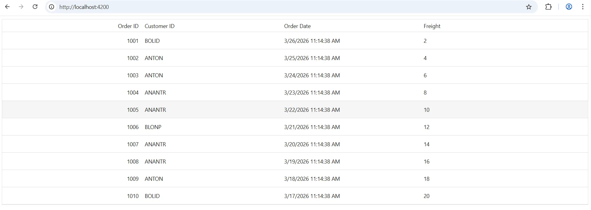

# Integrating Syncfusion® Blazor Components in Angular

This guide demonstrates how to use [Syncfusion® Blazor components](https://www.syncfusion.com/blazor-components) inside an **Angular application**.

Blazor and Angular are two different web technologies. Blazor uses .NET and Razor components, while Angular uses TypeScript and HTML. Normally, these frameworks cannot share UI components. However, [Blazor custom elements](https://learn.microsoft.com/en-us/aspnet/core/blazor/components/js-spa-frameworks?view=aspnetcore-10.0#blazor-custom-elements) make this possible. A custom element turns a Blazor component into a standard HTML tag that Angular can recognize and render.

A common use case for this integration is when an existing Angular application needs advanced UI features such as rich grids, charts, or schedulers without rewriting the project in Blazor. By exposing Syncfusion Blazor components as custom elements, teams can seamlessly add powerful .NET-based controls into Angular pages. This is especially helpful in **enterprise dashboards**, **order management**, **analytics**, and **admin portals** where capabilities like sorting, filtering, exporting, and high-performance data handling are required, all while keeping the Angular app intact.

## Prerequisites

* [.NET 10 SDK](https://dotnet.microsoft.com/en-us/download/dotnet/10.0) 
* [Node.js 18+](https://nodejs.org/en/download)
* [Angular CLI 18+](https://www.npmjs.com/package/@angular/cli) 

## Creating the Blazor application 

### Create the project

If you already have a Blazor project, proceed to the package installation section. Otherwise, create one using Syncfusion Blazor getting started guides.

* [WebAssembly](https://blazor.syncfusion.com/documentation/getting-started/blazor-webassembly-app)
* [Server](https://blazor.syncfusion.com/documentation/getting-started/blazor-server-side-visual-studio)

### Install custom elements packages

To enable custom elements, install the required Microsoft packages.




dotnet add package Microsoft.AspNetCore.Components.Web --version 10.0.3 
dotnet add package Microsoft.AspNetCore.Components.CustomElements --version 10.0.3 




### Add Syncfusion component

Create a `.razor` file to incorporate the Syncfusion DataGrid component:

In this example, the file name used is `OrdersGrid.razor`.




@using Syncfusion.Blazor.Grids
@namespace BlazorServerHost.Pages

<SfGrid DataSource="@Orders" >
  <GridColumns>
    <GridColumn Field="OrderID" HeaderText="Order ID" TextAlign="TextAlign.Right" Width="100"></GridColumn>
    <GridColumn Field="CustomerID" HeaderText="Customer ID" Width="100"></GridColumn>
    <GridColumn Field="OrderDate" HeaderText="Order Date" Width="100"></GridColumn>
    <GridColumn Field="Freight" HeaderText="Freight" Width="120"></GridColumn>
  </GridColumns>
</SfGrid>

@code{
    public List<Order> Orders { get; set; }

    protected override void OnInitialized()
    {
        Orders = Enumerable.Range(1, 10).Select(x => new Order()
        {
            OrderID = 1000 + x,
            CustomerID = (new string[] { "ALFKI", "ANANTR", "ANTON", "BLONP", "BOLID" })[new Random().Next(5)],
            Freight = 2 * x,
            OrderDate = DateTime.Now.AddDays(-x),
        }).ToList();
    }

    public class Order {
        public int? OrderID { get; set; }
        public string CustomerID { get; set; }
        public DateTime? OrderDate { get; set; }
        public double? Freight { get; set; }
    }
}




**BlazorServerHost.Pages** defines the namespace where Razor components are grouped within a Blazor Server application. It usually corresponds to the **Pages** folder and helps organize UI components like `OrdersGrid.razor` in a structured way.

### Register as a custom element

To use your Razor component inside an Angular application, you must register it as a **Blazor custom element**. This registration exposes your `.razor` file as a standard HTML tag.

Any Razor component that you want to use in Angular must be registered inside the `Program.cs` file. Add the following line:




builder.RootComponents.RegisterCustomElement<BlazorServerHost.Pages.OrdersGrid>("sf-orders-grid"); 




This line registers the **OrdersGrid** component as a custom element named `<sf-orders-grid>`, making it available for use within your Angular application. The **BlazorServerHost.Pages** namespace uniquely identifies the Razor component, which is required when accessing it outside the Blazor app. This namespace is essential for registering the component as a custom element and enabling seamless integration and usage within an Angular application.

## Integrating the custom elements in Angular 

### Create the Angular app 

If you already have an Angular project, move to the next step. Otherwise, create one using the Angular CLI. 




ng new AngularApp --standalone 




### Configure Angular proxy 

Blazor and Angular run on different local servers. To allow Angular to load Blazor files, you must create a proxy file. 

Create a new file named `proxy.conf.json` inside the Angular project’s `src/` folder and add the below content.




{ 

  "/blazor": { 
    "target": "http://localhost:5021", // Provide the hosted URL of the Blazor application. 
    "secure": false, 
    "changeOrigin": true, 
    "logLevel": "debug", 
    "pathRewrite": { "^/blazor": "" } 
  }, 
  "/_framework": { 
    "target": "http://localhost:5021", 
    "secure": false, 
    "changeOrigin": true, 
    "logLevel": "debug" 
  }, 
  "/_content": { 
    "target": "http://localhost:5021", 
    "secure": false, 
    "changeOrigin": true, 
    "logLevel": "debug" 
  } 
} 




Then update the start script in `package.json`.




"start": "ng serve --proxy-config proxy.conf.json" 




### Load Blazor runtime and Syncfusion theme/scripts

The Blazor runtime and Syncfusion scripts/themes are required to load Syncfusion Blazor components inside Angular. Add the following to your Angular project’s `index.html` file.




<link rel="stylesheet" href="/blazor/_content/Syncfusion.Blazor.Themes/fluent2.css" /> 
 




N> Syncfusion provides multiple theme variants, allowing selection of the theme that best aligns with the application's UI design. Additional theme options and customization details are available in the [theming documentation](https://blazor.syncfusion.com/documentation/appearance/themes).

WebAssembly:




 




Server:




 




### Use the custom element in Angular

Define the schemas and the custom element tag in the `app.ts` file. 




import { Component, CUSTOM_ELEMENTS_SCHEMA } from '@angular/core'; 

@Component({ 
  selector: 'app-root', 
  template: `<sf-orders-grid></sf-orders-grid>`, 
  schemas: [CUSTOM_ELEMENTS_SCHEMA] 
}) 

export class AppComponent {} 




[CUSTOM_ELEMENTS_SCHEMA](https://angular.dev/api/core/CUSTOM_ELEMENTS_SCHEMA) allows Angular to accept unknown HTML tags such as `<sf-orders-grid>`. 

## Running both applications 

You can run both apps separately or together. 

### Option 1: Run separately 

Blazor host:




dotnet run




Angular app:




npm start




Open the Angular development URL to see the Blazor DataGrid component inside Angular. 

N> Start the Blazor application first so that Angular can load its resources through the proxy.

### Option 2: Run both using the concurrently package 




npm install --save-dev concurrently 




N> Install this package only once.

Add the following scripts to  `package.json`.




"start:blazor": "dotnet watch run --project ../SfxGridWasm", //Replace this with your Blazor project name. 

"start:ng": "ng serve --proxy-config proxy.conf.json", 

"start:all": "concurrently -k -n BLAZOR,ANGULAR -c cyan,green \"npm:start:blazor\" \"npm:start:ng\"", 




Then, run both with one command:  




 npm run start:all 




Once the compilation completes, open your browser and navigate to `http://localhost:4200/` to see your application with the integrated Syncfusion DataGrid component: 

## See also

* [Getting started with Syncfusion Blazor DataGrid](https://blazor.syncfusion.com/documentation/datagrid/getting-started-with-web-app)
* [Getting started with Syncfusion Angular](https://ej2.syncfusion.com/angular/documentation/getting-started)
