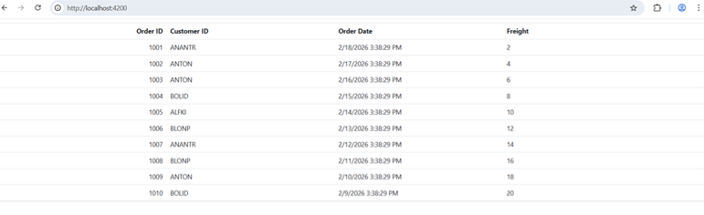

# Integrating Syncfusion Blazor Components in Angular

This guide demonstrates how to use **Syncfusion Blazor components** inside an **Angular** application.

Blazor and Angular are two different web technologies. Blazor uses .NET and Razor components, while Angular uses TypeScript and HTML. Normally, these frameworks cannot share UI components. However, **Blazor Custom Elements** make this possible. A Custom Element turns a Blazor component into a standard HTML tag that Angular can recognize and render.

## Prerequisite

* .NET 10 SDK 
* Node.js 18+ 
* Angular CLI 18+ 

## Creating the Blazor Application 

### Create the project

If you already have a Blazor project, proceed to the package installation section. Otherwise, create one using Syncfusion’s Blazor getting‑started guides.

* [WebAssembly](https://blazor.syncfusion.com/documentation/getting-started/blazor-webassembly-app)

* [Server](https://blazor.syncfusion.com/documentation/getting-started/blazor-server-side-visual-studio)

### Install Custom Elements packages

To enable Custom Elements, install the required Microsoft packages.

```
dotnet add package Microsoft.AspNetCore.Components.Web --version 10.0.3 
dotnet add package Microsoft.AspNetCore.Components.CustomElements --version 10.0.3 
```

Alternatively, install them using the NuGet Package Manager.

```
Microsoft.AspNetCore.Components.Web 
Microsoft.AspNetCore.Components.CustomElements 
```

### Add Syncfusion component

Add **.razor** file to incorporate the Syncfusion® Data Grid component:

In this example, the file name used is **OrdersGrid.razor**




@using Syncfusion.Blazor.Grids
@namespace BlazorServerHost.Pages

<SfGrid DataSource="@Orders" >
<GridColumns>
        <GridColumn Field="OrderID" HeaderText="Order ID" TextAlign="TextAlign.Right" Width="100"></GridColumn>
        <GridColumn Field="CustomerID" HeaderText="Customer ID" Width="100"></GridColumn>
        <GridColumn Field="OrderDate" HeaderText="Order Date" Width="100"></GridColumn>
        <GridColumn Field="Freight" HeaderText="Freight" Width="120"></GridColumn>
    </GridColumns>
</SfGrid>

@code{
    public List<Order> Orders { get; set; }

    protected override void OnInitialized()
    {
        Orders = Enumerable.Range(1, 10).Select(x => new Order()
        {
            OrderID = 1000 + x,
            CustomerID = (new string[] { "ALFKI", "ANANTR", "ANTON", "BLONP", "BOLID" })[new Random().Next(5)],
            Freight = 2 * x,
            OrderDate = DateTime.Now.AddDays(-x),
        }).ToList();
    }

    public class Order {
        public int? OrderID { get; set; }
        public string CustomerID { get; set; }
        public DateTime? OrderDate { get; set; }
        public double? Freight { get; set; }
    }
}




### Register it as a Custom Elements 

To use your Razor component inside an Angular application, you must register it as a **Blazor Custom Element**. This registration exposes your **.razor** file as a standard HTML tag.

Any Razor component that you want to use in Angular must be registered inside the **Program.cs** file. Add the following line:




builder.RootComponents.RegisterCustomElement<SfxGridWasm.Pages.OrdersGrid>("sf-orders-grid"); 




This line registers the **OrdersGrid** component as a custom element named `<sf-orders-grid>`, making it available for use within your Angular application.

## Integrating the Custom Elements in Angular 

### Create the Angular app 

If you already have an Angular project, move to the next step. Otherwise, create one using the Angular CLI. 

```
ng new AngularApp --standalone 
```

### Configure Angular proxy 

Blazor and Angular run on different local servers. To allow Angular to load Blazor files, you must create a proxy file. 

Create a new file named **proxy.conf.json** inside the Angular project’s **src/** folder and add the below content.




{ 

  "/blazor": { 
    "target": "http://localhost:5021", // Provide the hosted URL of the Blazor application. 
    "secure": false, 
    "changeOrigin": true, 
    "logLevel": "debug", 
    "pathRewrite": { "^/blazor": "" } 
  }, 
  "/_framework": { 
    "target": "http://localhost:5021", 
    "secure": false, 
    "changeOrigin": true, 
    "logLevel": "debug" 
  }, 
  "/_content": { 
    "target": "http://localhost:5021", 
    "secure": false, 
    "changeOrigin": true, 
    "logLevel": "debug" 
  } 
} 




Then update the start script in **package.json**.




"start": "ng serve --proxy-config proxy.conf.json" 




### Load Blazor runtime and Syncfusion theme/scripts

The Blazor runtime and Syncfusion scripts/themes are required to load Syncfusion Blazor components inside Angular. Add the following to your Angular project’s **index.html** file.





<link rel="stylesheet" href="/blazor/_content/Syncfusion.Blazor.Themes/bootstrap5.css" /> 
<script src="/blazor/_content/Syncfusion.Blazor/scripts/syncfusion-blazor.min.js"></script> 




WebAssembly:

```
<script src="/blazor/_framework/blazor.webassembly.js"></script> 
```

Server:

```
<script src="/blazor/_framework/blazor.server.js"></script> 
```

### Use the custom element in Angular

Define the schemas and the custom element tag in the **app.ts** file. 




import { Component, CUSTOM_ELEMENTS_SCHEMA } from '@angular/core'; 

@Component({ 
  selector: 'app-root', 
  template: `<sf-orders-grid></sf-orders-grid>`, 
  schemas: [CUSTOM_ELEMENTS_SCHEMA] 
}) 

export class AppComponent {} 





[CUSTOM_ELEMENTS_SCHEMA](https://angular.dev/api/core/CUSTOM_ELEMENTS_SCHEMA) allows Angular to accept unknown HTML tags such as `<sf-orders-grid>`. 

## Running Both Applications 

You can run both apps separately or together. 

### Option 1: Run separately 

Blazor host:

```
dotnet run
```

Angular app:

```
npm start
```
Open the Angular development URL to see the Blazor Grid inside Angular. 

N> Start the Blazor application first so that Angular can load its resources through the proxy.

### Option 2: Run both using the concurrently package 

```
npm install --save-dev concurrently 
```

N> Install this package only once.

Add the following scripts to  **package.json**




"start:blazor": "dotnet watch run --project ../SfxGridWasm", //Replace this with your Blazor project name. 

"start:ng": "ng serve --proxy-config proxy.conf.json", 

"start:all": "concurrently -k -n BLAZOR,ANGULAR -c cyan,green \"npm:start:blazor\" \"npm:start:ng\"", 




Then, run both with one command:  

```
 npm run start:all 
```

Once the compilation completes, open your browser and navigate to http://localhost:4200/ to see your application with the integrated Syncfusion® Data Grid component:

