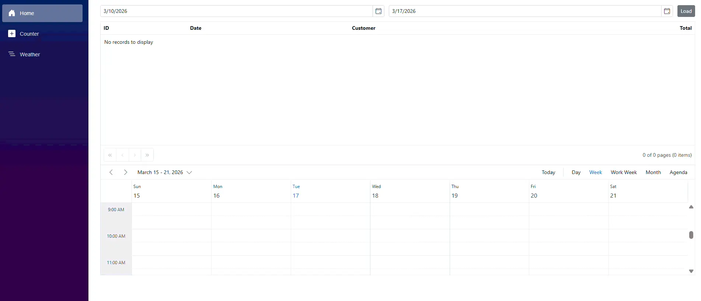

--- 
layout: post
title: Blazor WebAssembly with Azure Functions | Syncfusion
description: Step-by-step guide to integrate Azure Functions as a serverless backend for Blazor WebAssembly with Syncfusion components (Grid, Scheduler, DatePicker).
platform: Blazor
control: Common
documentation: ug
---

# Integrating Syncfusion® Blazor Components with Azure Functions

This guide shows how to build a Blazor WebAssembly app that uses [Azure Functions](https://learn.microsoft.com/en-us/azure/azure-functions/functions-overview) as a serverless backend and integrates Syncfusion Blazor components such as [DataGrid](https://www.syncfusion.com/blazor-components/blazor-datagrid), [Scheduler](https://www.syncfusion.com/blazor-components/blazor-scheduler), [DatePicker](https://www.syncfusion.com/blazor-components/blazor-datepicker). It covers local development setup, security options such as Function keys, calling functions from Blazor, CORS configuration, error handling, and a complete working example with an orders list and a scheduler view.

## What is Azure Functions?

Azure Functions is a serverless compute service designed to run small pieces of code (functions) without managing infrastructure. Azure automatically handles hosting, scaling, and execution. Functions run on demand triggered by HTTP requests, timers, queues, or other Azure events, making them ideal for lightweight APIs, background tasks, and event-driven workflows.

## Why use Azure Functions with Blazor?

Azure Functions scale independently from the UI and require minimal operational overhead, making them ideal for small backend APIs to serve Blazor WebAssembly. They integrate well with Syncfusion components like DataGrid and Scheduler by exposing lightweight HTTP endpoints that return JSON.

## Secure Azure Functions

For production applications, use **Microsoft Entra ID** for token based, per user authorization and auditing. Function keys are intended for development, testing, and trusted internal workflows, and should not be used in production client authentication.

Azure Functions supports two authorization approaches:
* **Function-level authorization (Function Keys):** Simple shared secrets passed via query parameters or headers; suitable for development and internal automation only.
* **Microsoft Entra ID / EasyAuth:** Token based authentication with per user authorization, auditing, and managed identities; recommended for production environments.

EasyAuth (App Service Authentication) lets Azure validate tokens for you. For server-side validation in isolated worker functions use `Microsoft.IdentityModel.Tokens`. EasyAuth can validate tokens at platform level so your functions don't need to parse JWTs.

### Function-level authorization

Function keys are simple shared secrets passed via `?code=` or the `x-functions-key` header, but they offer no user identity or fine-grained access control, so they shouldn’t be used as production level authorization. Reserve Function Keys for trusted server-to-server or internal automation workflows.

**Examples: How Function Keys are sent to Azure Functions**

When calling an Azure Function that uses Function-level authorization, the Function Key must be sent with every request. Azure Functions supports two common ways to send the key:

* Query string
* HTTP header

**1. Using a Query String**

 In this approach, the Function Key is added directly to the URL using the code `query` parameter.




 GET /api/orders?code=YOUR_FUNCTION_KEY




**2. Using an HTTP Header**

In this approach, the Function Key is sent in a request header called `x-functions-key`.




builder.Services.AddScoped(sp => {
  var client = new HttpClient { BaseAddress = new Uri("http://localhost:7071/") };
  client.DefaultRequestHeaders.Add("x-functions-key", Environment.GetEnvironmentVariable("FUNCTION_KEY") ?? "YOUR_FUNCTION_KEY");
  return client;
});




**Blazor HttpClient: Add HTTP Header before a request**

Instead of configuring it globally, you can add the Function Key only when making a specific request.




var req = new HttpRequestMessage(HttpMethod.Get, "/api/orders?...");
req.Headers.Add("x-functions-key", "YOUR_FUNCTION_KEY");
await Http.SendAsync(req);




For production, Microsoft Entra ID and managed identities provide better security than Function Keys.

### EasyAuth / Microsoft Entra ID

Register an application in Microsoft Entra ID and configure the Function App Authentication provider (EasyAuth) to require tokens, or keep EasyAuth off and validate JWTs inside functions with `Microsoft.IdentityModel.Tokens`. For production, Microsoft Entra ID and managed identities provide better security than Function Keys.

Use EasyAuth (platform) for standard token validation; validate JWTs in-function when you need custom claims or fine‑grained checks.

## Working with Function Apps in a real‑world Blazor app

This sample exposes `GET /api/orders` and `POST /api/orders`. The Blazor page uses `DatePicker` to select date ranges, `DataGrid` to list orders, `Scheduler` to show order events. Keep functions single purpose, persist real data in storage, and enable Application Insights for telemetry.

### Prerequisites

* [.NET SDK](https://dotnet.microsoft.com/en-us/download/visual-studio-sdks) (version 8.0 or later, this guide uses .NET 10.0)
* [Azure Functions Core Tools](https://learn.microsoft.com/en-us/azure/azure-functions/functions-run-local) (version 4.x or later)
* [Azure CLI](https://learn.microsoft.com/en-us/cli/azure/install-azure-cli-windows?view=azure-cli-latest&pivots=msi#install-or-update)
* [Visual Studio](https://visualstudio.microsoft.com/downloads/) 2022 or later or Visual Studio Code with [C# Dev Kit](https://marketplace.visualstudio.com/items?itemName=ms-dotnettools.csdevkit) extension 

Ensure the .NET SDK and Azure Functions Core Tools are compatible. Refer to the [Azure Functions supported versions](https://learn.microsoft.com/en-us/azure/azure-functions/supported-languages) to verify compatibility for your environment.

### Create solution and projects

In this section, you will create a single solution that contains:

* A Blazor WebAssembly (WASM) client application.
* An Azure Functions project using the isolated worker model.

Keeping both projects in one solution makes development and debugging easier.

**Step 1: Create the Blazor WebAssembly client project**

Run the following command to create a Blazor WebAssembly application named Client.




dotnet new blazorwasm -o Client -f net10.0




**Step 2: Create the Azure Functions project (isolated worker)**

Create an Azure Functions project named Functions using the isolated worker model, then add an HTTP-triggered function.




func init Functions --worker-runtime dotnet-isolated
cd Functions
func new --name OrdersApi --template "HTTP trigger" --authlevel function




**Step 3: Create a solution and add both projects**

Return to the root folder and create a solution file to manage both projects.




cd ..
dotnet new sln -n BlazorFunctions
dotnet sln add Client/Client.csproj
dotnet sln add Functions/Functions.csproj




## Install required NuGet packages

**Syncfusion packages:**

Navigate to the Blazor WASM project and install the necessary Syncfusion packages.




cd Client
dotnet add package Syncfusion.Blazor.Grid -v {{ site.releaseversion }}
dotnet add package Syncfusion.Blazor.Schedule -v {{ site.releaseversion }}
dotnet add package Syncfusion.Blazor.Calendars -v {{ site.releaseversion }}
dotnet add package Syncfusion.Blazor.Themes -v {{ site.releaseversion }}
cd ..




**Microsoft packages:**

Install the necessary packages for isolated worker runtime Azure Functions with HTTP triggers.




cd Functions
dotnet add package Microsoft.Azure.Functions.Worker
dotnet add package Microsoft.Azure.Functions.Worker.Extensions.Http
cd ..




### Add required namespaces

Open the `Client/_Imports.razor` file from WASM project and import the below namespaces.




@using Syncfusion.Blazor
@using Syncfusion.Blazor.Grids
@using Syncfusion.Blazor.Calendars
@using Syncfusion.Blazor.Schedule




### Register Syncfusion Blazor service

Add the Syncfusion Blazor service to the `Client/Program.cs` file to enable Syncfusion components in the application.




using Microsoft.AspNetCore.Components.Web;
using Microsoft.AspNetCore.Components.WebAssembly.Hosting;
using Client;
using Syncfusion.Blazor;

var builder = WebAssemblyHostBuilder.CreateDefault(args);
builder.RootComponents.Add<App>("#app");
builder.RootComponents.Add<HeadOutlet>("head::after");
builder.Services.AddSyncfusionBlazor();
// For production: read base address from configuration
// builder.Services.AddScoped(sp => new HttpClient { BaseAddress = new Uri(builder.Configuration["FunctionsBaseUrl"]!) });
builder.Services.AddScoped(sp => new HttpClient {  BaseAddress = new Uri("http://localhost:7071/") });




N> The `BaseAddress` is set to `http://localhost:7071/` for local development. In production, update this to your Azure Function App URL (e.g., `https://myapp.azurewebsites.net`). Consider reading this from configuration. 

### Add stylesheet and script resources

Add the Syncfusion theme CSS and required scripts to the `wwwroot/index.html` file from WASM project. 




<head>
     <!-- Syncfusion theme style sheet -->
    <link href="_content/Syncfusion.Blazor.Themes/fluent2.css" rel="stylesheet" />
</head>
<body>
    <!-- Syncfusion Blazor component's script reference -->
    
</body>




### Implement simple Azure Functions endpoints

This example shows two minimal HTTP triggered functions: GET `/api/orders` returns demo orders filtered by optional from/to query parameters (format yyyy‑MM‑dd), and POST `/api/orders` accepts and echoes a JSON payload. The functions include development-only CORS handling and basic logging; configure CORS and authentication in Azure for production.

Add the following file to your Azure Functions project (e.g., OrdersApi.cs):




using System.Text.Json;
using Microsoft.Extensions.Logging;
using Microsoft.Azure.Functions.Worker;
using Microsoft.Azure.Functions.Worker.Http;
using System.Globalization;
using System.Net;

public static class OrdersApi
{
    [Function("GetOrders")]
    public static async Task<HttpResponseData> GetOrders(
        [HttpTrigger(AuthorizationLevel.Function, "get", "options", Route = "orders")] HttpRequestData req,
        FunctionContext ctx)
    {
        // Handle CORS preflight
        if (req.Method.Equals("OPTIONS", StringComparison.OrdinalIgnoreCase))
        {
            var preflight = req.CreateResponse(HttpStatusCode.NoContent);
            preflight.Headers.Add("Access-Control-Allow-Origin", "*");//For local testing only; configure precise origins in production.
            preflight.Headers.Add("Access-Control-Allow-Methods", "GET,POST,OPTIONS");
            preflight.Headers.Add("Access-Control-Allow-Headers", "Content-Type,Authorization");
            return preflight;
        }

        var baseDate = DateTime.UtcNow.Date;
        // Generate demo orders
        var allOrders = Enumerable.Range(1, 10).Select(i => new OrderDto
        {
            Id = i,
            Date = baseDate.AddDays(-(i % 7)),
            Customer = i % 3 == 0 ? "Contoso" : i % 2 == 0 ? "Tailspin" : "ACME",
            Total = Math.Round(20 + i * 15.75, 2)
        }).ToArray();

        // Parse optional query parameters (expected yyyy-MM-dd)
        DateTime? from = null; DateTime? to = null;
        try
        {
            var query = (req.Url.Query ?? string.Empty).TrimStart('?');
            if (!string.IsNullOrEmpty(query))
            {
                var pairs = query.Split('&', StringSplitOptions.RemoveEmptyEntries);
                foreach (var p in pairs)
                {
                    var kv = p.Split('=', 2);
                    if (kv.Length == 0) continue;
                    var key = WebUtility.UrlDecode(kv[0]).Trim();
                    var val = kv.Length > 1 ? WebUtility.UrlDecode(kv[1]).Trim() : string.Empty;
                    if (string.Equals(key, "from", StringComparison.OrdinalIgnoreCase) && DateTime.TryParseExact(val, "yyyy-MM-dd", CultureInfo.InvariantCulture, DateTimeStyles.AssumeUniversal, out var f))
                        from = f.Date;
                    if (string.Equals(key, "to", StringComparison.OrdinalIgnoreCase) && DateTime.TryParseExact(val, "yyyy-MM-dd", CultureInfo.InvariantCulture, DateTimeStyles.AssumeUniversal, out var t))
                        to = t.Date;
                }
            }
        }
        catch
        {
            // ignore parse errors and return unfiltered results
        }

        var orders = allOrders.Where(o =>
            (!from.HasValue || o.Date.Date >= from.Value) &&
            (!to.HasValue || o.Date.Date <= to.Value)).ToArray();

        try
        {
            var logger = ctx.GetLogger("GetOrders");
            logger.LogInformation($"Returning {orders.Length} orders (from={from?.ToString("yyyy-MM-dd") ?? ""}, to={to?.ToString("yyyy-MM-dd") ?? ""})");
        }
        catch
        {
            // ignore logging failures
        }

        var resp = req.CreateResponse(HttpStatusCode.OK);
        resp.Headers.Add("Content-Type", "application/json; charset=utf-8");
        resp.Headers.Add("Access-Control-Allow-Origin", "*");
        await resp.WriteStringAsync(JsonSerializer.Serialize(orders));
        return resp;
    }

    [Function("PostOrder")]
    public static async Task<HttpResponseData> PostOrder(
        [HttpTrigger(AuthorizationLevel.Function, "post", "options", Route = "orders/add")] HttpRequestData req,
        FunctionContext ctx)
    {
        if (req.Method.Equals("OPTIONS", StringComparison.OrdinalIgnoreCase))
        {
            var preflight = req.CreateResponse(HttpStatusCode.NoContent);
            preflight.Headers.Add("Access-Control-Allow-Origin", "*");
            preflight.Headers.Add("Access-Control-Allow-Methods", "GET,POST,OPTIONS");
            preflight.Headers.Add("Access-Control-Allow-Headers", "Content-Type,Authorization");
            return preflight;
        }

        var body = await new StreamReader(req.Body).ReadToEndAsync();
        object? order = null;
        try
        {
            order = JsonSerializer.Deserialize<object>(body);
        }
        catch
        {
            // keep behavior: if deserialization fails, return the raw body as string
            order = body;
        }

        try
        {
            var logger = ctx.GetLogger("PostOrder");
            logger.LogInformation("Received PostOrder request");
        }
        catch
        {
        }

        var resp = req.CreateResponse(HttpStatusCode.Created);
        resp.Headers.Add("Access-Control-Allow-Origin", "*");
        await resp.WriteStringAsync(JsonSerializer.Serialize(order));
        return resp;
    }

    private sealed class OrderDto
    {
        public int Id { get; set; }
        public DateTime Date { get; set; }
        public string? Customer { get; set; }
        public double Total { get; set; }
    }
}




N> The above code example uses `Access-Control-Allow- : *` for development convenience only. In production, replace `"*"` with your Blazor client's origin (e.g., `https://myapp.azurewebsites.net`) in *Azure Portal → Function App → API → CORS*. Never use wildcards in production.

### Create the Blazor page using Syncfusion components

This example demonstrates using Syncfusion Components: Two DatePicker components to choose a range, a DataGrid to list orders, and a Scheduler to show events. 

The page expects `HttpClient` to be configured with the Azure Functions host URL as its BaseAddress. It uses JSON data returned from the Functions API to populate both the grid and the scheduler. The sample injects the `HttpClient` instance that was registered earlier in `Program.cs` where the `BaseAddress` points to the Azure Functions host.

Add the following Razor page to your Blazor WebAssembly project.




@page "/"

@using System.Net.Http.Headers
@inject HttpClient Http
@using Syncfusion.Blazor.Grids
@using Syncfusion.Blazor.Calendars
@using Syncfusion.Blazor.Schedule

  <SfDatePicker TValue="DateTime?" @bind-Value="From" Placeholder="From" />
  <SfDatePicker TValue="DateTime?" @bind-Value="To" Placeholder="To" />
  <button class="e-control e-btn" @onclick="Load">Load</button>

<SfGrid DataSource="@OrdersList" AllowPaging="true" Height="300">
  <GridColumns>
    <GridColumn Field="Id" HeaderText="ID" Width="80"></GridColumn>
    <GridColumn Field="Date" HeaderText="Date" Format="d" Width="150"></GridColumn>
    <GridColumn Field="Customer" HeaderText="Customer" Width="200"></GridColumn>
    <GridColumn Field="Total" HeaderText="Total" Format="C2" TextAlign="TextAlign.Right" Width="120"></GridColumn>
  </GridColumns>
</SfGrid>

<SfSchedule TValue="EventItem" Height="300px" SelectedDate="@DateTime.Today">
  <ScheduleEventSettings DataSource="@EventItems"></ScheduleEventSettings>
</SfSchedule>

@code {
  
  private List<Order> OrdersList = new();
  private List<EventItem> EventItems = new();
  private DateTime? From = DateTime.Today.AddDays(-7);
  private DateTime? To = DateTime.Today;
  class Order { public int Id { get; set; } public DateTime Date { get; set; } public string? Customer { get; set; } public double Total { get; set; } }
  // Use property names expected by Syncfusion Schedule (StartTime/EndTime/Subject)
  class EventItem { public DateTime StartTime { get; set; } public DateTime EndTime { get; set; } public string? Subject { get; set; } }

  private async Task Load()
  {
    try
    {
      // Bypass authentication for local development (no auth required with AuthorizationLevel.Function and a valid code parameter)
      // For production with Microsoft Entra ID, add: Http.DefaultRequestHeaders.Authorization = new AuthenticationHeaderValue("Bearer", token);
      Http.DefaultRequestHeaders.Authorization = null;
      // Try common development ports: 7071 for Azure Functions, 5298 for Blazor client. 
      string[] portsToTry = new[] { "5298", "7071" }; 
      string body = string.Empty;
      HttpResponseMessage resp = null!;
      bool found = false;
      foreach (var port in portsToTry)
      {
        //This port used testing only. In production, use HttpClient BaseAddress from configuration.
        var tryUrl = $"http://localhost:{port}/api/orders?from={From:yyyy-MM-dd}&to={To:yyyy-MM-dd}";
        try
        {
          resp = await Http.GetAsync(tryUrl);
          body = await resp.Content.ReadAsStringAsync();
          if (resp.IsSuccessStatusCode)
          {
            var trimmed = (body ?? string.Empty).TrimStart();
            if (trimmed.StartsWith("[") || trimmed.StartsWith("{"))
            {
              // valid JSON response
              try
              {
                OrdersList = System.Text.Json.JsonSerializer.Deserialize<List<Order>>(trimmed) ?? new List<Order>();
                found = true;
                break;
              }
              catch (Exception jex)
              {
                Console.WriteLine($"JSON parse failed from {tryUrl}: {jex}");
              }
            }
            else
            {
              Console.WriteLine($"Response from {tryUrl} does not appear to be JSON.");
            }
          }
        }
        catch (Exception e)
        {
          Console.WriteLine($"Request to {tryUrl} failed: {e.Message}");
        }
      }

      if (!found)
      {
        OrdersList = new List<Order>();
      }
      EventItems = OrdersList.Select(o => new EventItem { StartTime = o.Date, EndTime = o.Date.AddHours(1), Subject = $"{o.Customer} ({o.Total:C2})" }).ToList();
      StateHasChanged();
    }
    catch (Exception ex)
    {
      Console.WriteLine($"Load failed: {ex}");
    }
  }
}




For browser calls, add the Blazor origin to Function App CORS (*Azure Portal → Function App → API → CORS*).

## Run the application

**Start Functions project:**




cd Functions
func start




**In a new terminal, start the Blazor project:**




cd ../Client
dotnet run




**Output:**

* Open the client URL in a browser.
* The page displays two date pickers (From/To) and a Load button.
* Select a date range and click **Load**.
* The grid below populates with demo orders, and the schedule shows events (one per order).

## See also

* [Getting started with Syncfusion DataGrid](https://blazor.syncfusion.com/documentation/datagrid/getting-started)
* [Getting started with Syncfusion Scheduler](https://blazor.syncfusion.com/documentation/scheduler/getting-started)
* [Getting started with Syncfusion DatePicker](https://blazor.syncfusion.com/documentation/datepicker/getting-started)
