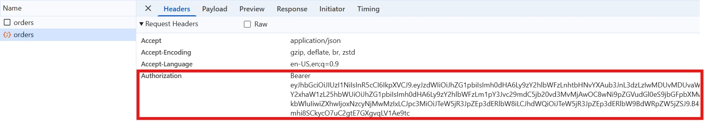

# JWT Authentication in Blazor WebAssembly and Blazor Server

This article explains how to use **JSON Web Tokens (JWT)** for authentication in Blazor WebAssembly (WASM) and Blazor Server applications. It covers backend API configuration, token generation/validation, client login flow, secure storage, attaching tokens to requests, refreshing tokens, protecting pages, and security considerations. Code snippets are provided and adapted from a **[Syncfusion® Blazor DataGrid](https://www.syncfusion.com/blazor-components/blazor-datagrid)** example.


## Introduction to JWT

**JSON Web Token (JWT)** is a compact, URL-safe way to represent claims between two parties. A server issues a signed token after a successful login; the client attaches this token in the `Authorization: Bearer <token>` header when calling protected APIs. The server validates the token signature and claims to authorize the request.

### Structure: Header, Payload, Signature

A JWT is three Base64Url-encoded parts separated by dots:

```
xxxxx.yyyy.zzzzz
```

- **Header** – declares the signing algorithm and token type (e.g., `{ "alg": "HS256", "typ": "JWT" }`).
- **Payload** – contains claims (e.g., `sub`, `name`, `role`, `exp`).
- **Signature** – computed using the header + payload + secret (or private key) to prevent tampering.



### Why JWT for Blazor?

- **Decoupled**: Works well when your Blazor client calls a separate API.
- **Stateless**: No server session to maintain; authorization is embedded in the token.
- **Interoperable**: Any client that can send HTTP headers can use it.

> Note: For **Blazor Server** apps that render UI on the server, cookie-based auth is often simpler. JWT shines when calling **separate APIs** (from Blazor WASM or Server).

### Prerequisites

- .NET 10 SDK 
- Blazor WASM or Blazor Server project
- A Web API project (Minimal APIs or MVC) to issue and validate JWTs


## Configuring the Backend API

Below is a **Minimal API** that issues and validates JWTs.

### Token generation

```csharp
// Program.cs (API)
using System.IdentityModel.Tokens.Jwt;
using System.Security.Claims;
using System.Text;
using Microsoft.AspNetCore.Authentication.JwtBearer;
using Microsoft.AspNetCore.Mvc;
using Microsoft.IdentityModel.Tokens;

var builder = WebApplication.CreateBuilder(args);

// CORS: allow the Blazor client dev origin
const string CorsPolicy = "DevClient";
builder.Services.AddCors(options =>
{
    options.AddPolicy(CorsPolicy, policy =>
        policy.WithOrigins("http://localhost:XXXX") // your WASM dev URL.
              .AllowAnyHeader()
              .AllowAnyMethod()
              .AllowCredentials());
});

// JWT setup (use secure secrets in production!)
var jwtKey   = builder.Configuration["Jwt:Key"]     ?? "dev-secret-key-change-me-please-123456";
var issuer   = builder.Configuration["Jwt:Issuer"]  ?? "SyncGridJwtDemo";
var audience = builder.Configuration["Jwt:Audience"]?? "SyncGridJwtDemoAudience";
var signingKey = new SymmetricSecurityKey(Encoding.UTF8.GetBytes(jwtKey));

builder.Services.AddAuthentication(options =>
{
    options.DefaultAuthenticateScheme = JwtBearerDefaults.AuthenticationScheme;
    options.DefaultChallengeScheme = JwtBearerDefaults.AuthenticationScheme;
})
.AddJwtBearer(options =>
{
    options.RequireHttpsMetadata = false; 
    options.TokenValidationParameters = new TokenValidationParameters
    {
        ValidateIssuer = true,
        ValidateAudience = true,
        ValidateLifetime = true,
        ValidateIssuerSigningKey = true,
        ValidIssuer = issuer,
        ValidAudience = audience,
        IssuerSigningKey = signingKey,
        ClockSkew = TimeSpan.FromSeconds(5)
    };
});

builder.Services.AddAuthorization();

var app = builder.Build();
app.UseCors(CorsPolicy);
app.UseAuthentication();
app.UseAuthorization();

record LoginRequest(string Username, string Password);

// Issue access token (and, optionally, refresh token).
app.MapPost("/api/auth/login", ([FromBody] LoginRequest req) =>
{
    if (string.IsNullOrWhiteSpace(req.Username) || string.IsNullOrWhiteSpace(req.Password))
        return Results.BadRequest("Username/password required");

    // Demo credentials. Replace with identity store.
    if (req.Username == "admin" && req.Password == "admin123")
    {
        var claims = new List<Claim>
        {
            new Claim(JwtRegisteredClaimNames.Sub, req.Username),
            new Claim(ClaimTypes.Name, req.Username),
            new Claim(ClaimTypes.Role, "Admin")
        };

        var creds = new SigningCredentials(signingKey, SecurityAlgorithms.HmacSha256);
        var token = new JwtSecurityToken(
            issuer: issuer,
            audience: audience,
            claims: claims,
            expires: DateTime.UtcNow.AddMinutes(30),
            signingCredentials: creds);

        var jwt = new JwtSecurityTokenHandler().WriteToken(token);

        return Results.Ok(new { token = jwt });
    }

    return Results.Unauthorized();
});

// Protected data endpoint.
public record Order(int OrderID, string CustomerID, string ShipCountry)
{
    public static List<Order> Seed() => new()
    {
        new(10001, "ALFKI", "Germany"),
        new(10002, "ANATR", "Brazil"),
        new(10003, "ANTON", "Mexico"),
        new(10004, "BERGS", "Sweden"),
        new(10005, "BLONP", "France"),
    };
}

app.Run();
```

### Validation

The `AddJwtBearer` configuration ensures tokens are checked for:
- Correct **issuer** and **audience**
- **Signature** with your signing key
- **Expiration**

## Setting Up Blazor to Use JWT (WebAssembly)

Your Blazor WASM app will:
1) Provide a **Login page** that calls the API to obtain a JWT.
2) **Store** the token securely (demo uses Local Storage).
3) Attach the token via a **DelegatingHandler** for every API request.
4) Optionally parse **roles/claims** for UI authorization.
5) Handle **refresh**/**logout**.

### Program.cs (WASM)

Register services in Program.cs (WASM):

```csharp
// Program.cs (Client - WASM)
using Blazored.LocalStorage;
using Microsoft.AspNetCore.Components.WebAssembly.Hosting;
using Microsoft.Extensions.DependencyInjection;
using Syncfusion.Blazor;
using System.Net.Http.Headers;
using Client.Services;
using Client;

var builder = WebAssemblyHostBuilder.CreateDefault(args);

builder.RootComponents.Add<App>("#app");

builder.Services.AddSyncfusionBlazor();

// Authorization/Authentication support for Blazor WASM
builder.Services.AddAuthorizationCore();

builder.Services.AddBlazoredLocalStorage();

builder.Services.AddTransient<AuthMessageHandler>();

var apiBase = new Uri("http://localhost:5005/");

builder.Services.AddHttpClient("ApiClient", client =>
{
    client.BaseAddress = apiBase;
    client.DefaultRequestHeaders.Accept.Add(new MediaTypeWithQualityHeaderValue("application/json"));
})
.AddHttpMessageHandler<AuthMessageHandler>();

await builder.Build().RunAsync();
```

### DelegatingHandler to attach JWT

```csharp
// Client/Services/AuthMessageHandler.cs
using System.Net.Http.Headers;
using Blazored.LocalStorage;

namespace Client.Services
{
    public class AuthMessageHandler : DelegatingHandler
    {
        private readonly ILocalStorageService storage;
        public AuthMessageHandler(ILocalStorageService storage) => this.storage = storage;

        protected override async Task<HttpResponseMessage> SendAsync(HttpRequestMessage request, CancellationToken ct)
        {
            var token = await storage.GetItemAsync<string>("jwtToken");
            if (!string.IsNullOrWhiteSpace(token))
            {
                request.Headers.Authorization = new AuthenticationHeaderValue("Bearer", token);
            }

            var response = await base.SendAsync(request, ct);
            return response;
        }
    }
}
```

### Login page logic

```razor
@page "/login"
@using Microsoft.Extensions.DependencyInjection
@inject IHttpClientFactory ClientFactory
@inject Blazored.LocalStorage.ILocalStorageService Storage
@inject NavigationManager Nav

<h3>Login</h3>
@if (!string.IsNullOrWhiteSpace(message))
{
    <div style="color:red">@message</div>
}

<div class="card p-3" style="max-width:420px">
    <div class="mb-2">
        <label>Username</label>
        <input @bind="username" class="form-control" />
    </div>
    <div class="mb-2">
        <label>Password</label>
        <input @bind="password" type="password" class="form-control" />
    </div>
    <button class="btn btn-primary" @onclick="LoginAsync">Login</button>
    <button class="btn btn-secondary ms-2" @onclick="Logout">Logout</button>
</div>

@code {
    private string? username;
    private string? password;
    private string? message;

    private async Task Logout()
    {
        await Storage.RemoveItemAsync("jwtToken");
        Nav.NavigateTo("/login", forceLoad: true);
    }

    private async Task LoginAsync()
    {
        try
        {
            var client = ClientFactory.CreateClient("ApiClient");
            var resp = await client.PostAsJsonAsync("api/auth/login", new { Username = username, Password = password });
            if (resp.IsSuccessStatusCode)
            {
                var json = await resp.Content.ReadFromJsonAsync<TokenResponse>();
                if (!string.IsNullOrWhiteSpace(json?.token))
                {
                    await Storage.SetItemAsync("jwtToken", json!.token);
                    Nav.NavigateTo("/orders", true);
                    return;
                }
            }
            message = "Invalid credentials";
        }
        catch (Exception ex)
        {
            message = ex.Message;
        }
    }

    public class TokenResponse { public string? token { get; set; } }
}
```

### Storing JWT (secure storage)

For demos, **Local Storage** is fine. For production:
- Prefer **short-lived access tokens** in **memory** and use a **refresh token** in an **HttpOnly** cookie (safer against XSS).
- If you must use Local Storage/Session Storage, harden against XSS and keep token TTL short.

### Attaching JWT to HTTP Requests

Already handled via `AuthMessageHandler`. Configure your components to use the named client:

```razor
@page "/orders"
@using Syncfusion.Blazor
@using Syncfusion.Blazor.Data
@using Syncfusion.Blazor.Grids
@using Microsoft.Extensions.DependencyInjection
@inject IHttpClientFactory ClientFactory

<h3>Orders (JWT protected)</h3>

<SfGrid TValue="Order" AllowPaging="true" AllowSorting="true" Height="400px">
  <SfDataManager Url="api/orders"
                 Adaptor="Adaptors.UrlAdaptor"
                 HttpClientInstance="@_apiClient" />

    <GridColumns>
        <GridColumn Field="OrderID"     HeaderText="Order ID"   TextAlign="TextAlign.Center" Width="120" />
        <GridColumn Field="CustomerID"  HeaderText="Customer"   Width="150" />
        <GridColumn Field="ShipCountry" HeaderText="Country"    Width="150" />
    </GridColumns>
</SfGrid>

@code {
    private HttpClient? _apiClient;

    protected override void OnInitialized()
        => _apiClient = ClientFactory.CreateClient("ApiClient");

    public class Order
    {
        public int    OrderID      { get; set; }
        public string? CustomerID  { get; set; }
        public string? ShipCountry { get; set; }
    }
}
```

### Using HttpClient interceptors

You can centralize 401 handling and refresh in the `AuthMessageHandler`. Example skeleton:

```csharp
protected override async Task<HttpResponseMessage> SendAsync(HttpRequestMessage request, CancellationToken ct)
{
    var token = await storage.GetItemAsync<string>("jwtToken");
    if (!string.IsNullOrWhiteSpace(token))
        request.Headers.Authorization = new AuthenticationHeaderValue("Bearer", token);

    var response = await base.SendAsync(request, ct);

    if (response.StatusCode == System.Net.HttpStatusCode.Unauthorized)
    {
        // Option 1: navigate to /login
        // Option 2: attempt refresh flow then retry the original request
    }

    return response;
}
```

## Role and Claim Extraction

To show role-based UI or protect routes, parse the token on the client and feed claims into `AuthenticationStateProvider`.

**Auth state provider (minimal):**

```csharp
// Client/Services/JwtAuthStateProvider.cs
using System.IdentityModel.Tokens.Jwt;
using System.Security.Claims;
using Blazored.LocalStorage;
using Microsoft.AspNetCore.Components.Authorization;

public class JwtAuthStateProvider : AuthenticationStateProvider
{
    private readonly ILocalStorageService storage;
    public JwtAuthStateProvider(ILocalStorageService storage) => this.storage = storage;

    public override async Task<AuthenticationState> GetAuthenticationStateAsync()
    {
        var token = await storage.GetItemAsync<string>("jwtToken");
        var identity = new ClaimsIdentity();

        if (!string.IsNullOrWhiteSpace(token))
        {
            var handler = new JwtSecurityTokenHandler();
            var jwt = handler.ReadJwtToken(token);

            if (jwt.ValidTo > DateTime.UtcNow)
            {
                identity = new ClaimsIdentity(jwt.Claims, authenticationType: "jwt");
            }
        }

        var user = new ClaimsPrincipal(identity);
        return new AuthenticationState(user);
    }

    public void NotifyUserAuthentication() => NotifyAuthenticationStateChanged(GetAuthenticationStateAsync());
}
```

**Register + use in Program.cs (WASM):**

```csharp
builder.Services.AddAuthorizationCore();
builder.Services.AddScoped<AuthenticationStateProvider, JwtAuthStateProvider>();
```

**Consume in UI:**

```razor
<AuthorizeView Roles="Admin">
    <p>Welcome Admin!</p>
</AuthorizeView>
```

**Protect routes:**

```razor
// App.razor
<CascadingAuthenticationState>
    <Router AppAssembly="@typeof(Program).Assembly">
        <Found Context="routeData">
            <AuthorizeRouteView RouteData="@routeData" DefaultLayout="@typeof(MainLayout)" />
        </Found>
        <NotFound>
            <LayoutView Layout="@typeof(MainLayout)">
                <p role="alert">Sorry, there's nothing at this address.</p>
            </LayoutView>
        </NotFound>
    </Router>
</CascadingAuthenticationState>
```


## Refreshing Tokens

**Recommended pattern (production):**
- Short-lived **access token** (e.g., 5–15 minutes) stored in memory or local storage.
- Long-lived **refresh token** stored in an **HttpOnly, Secure, SameSite=Strict** cookie.
- On 401 (or nearing expiry), call `/api/auth/refresh` to get a new access token.

**API – Refresh endpoint (conceptual):**

```csharp
app.MapPost("/api/auth/refresh", (HttpContext http) =>
{
    // Read refresh token from HttpOnly cookie
    var refresh = http.Request.Cookies["refreshToken"];
    if (string.IsNullOrWhiteSpace(refresh)) return Results.Unauthorized();

    // Validate refresh token (lookup store, check revocation/expiry, user mapping)
    // If valid, issue new access token (and optionally rotate refresh token)

    var newAccessToken = "..."; // issue JWT as in login
    return Results.Ok(new { token = newAccessToken });
});
```

Client-side logic: when receiving 401, attempt refresh flow, update stored tokens, and retry original request. Handle refresh failures by forcing re-login.

> Note: Implement refresh tokens with care (store server-side, mark revoked, use rotation, bind to client/device).

## Logout Mechanism

* Client: clear stored tokens (memory/local storage/session) and redirect to login.
* Server: invalidate refresh tokens (remove from DB or mark revoked).

**Example logout client-side:**
```razor
<button @onclick="Logout">Logout</button>

@code {
    [Inject] Blazored.LocalStorage.ILocalStorageService Storage { get; set; } = default!;
    [Inject] NavigationManager Nav { get; set; } = default!;

    private async Task Logout()
    {
        await Storage.RemoveItemAsync("jwtToken");
        Nav.NavigateTo("/login", forceLoad: true);
    }
}
```

If you issued refresh tokens via cookies, also call an API endpoint to **invalidate** the refresh token server-side and **clear the cookie**.


## Protecting Pages

- Use `<AuthorizeRouteView>` to prevent navigation to pages without a valid auth state.
- Use `<AuthorizeView>` to show/hide content based on roles/claims.


## Security Considerations

- Always use HTTPS in production.
- Prefer short-lived access tokens and use refresh tokens for long sessions.
- Store refresh tokens server-side or as HttpOnly, secure cookies to reduce XSS risk.
- Use `SameSite` and `Secure` cookie flags when using cookies.
- Protect against XSS: sanitize inputs, use CSP, avoid injecting HTML.
- Validate tokens server-side (issuer, audience, signature, expiry).
- Implement token revocation for logout or compromised tokens (maintain blacklist or token store).
- Use strong secrets or asymmetric keys, and rotate them when needed.

## Code Samples

Example grid page that uses the `ApiClient`:

```razor
@page "/orders"
@using Syncfusion.Blazor
@using Syncfusion.Blazor.Data
@using Syncfusion.Blazor.Grids
@inject IHttpClientFactory ClientFactory

<h3>Orders (JWT protected)</h3>

<SfGrid TValue="Order" AllowPaging="true" AllowSorting="true" Height="400px">
  <SfDataManager Url="api/orders"
                 Adaptor="Adaptors.UrlAdaptor"
                 HttpClientInstance="@_apiClient" />
  <GridColumns>
    <GridColumn Field="OrderID" HeaderText="Order ID" TextAlign="TextAlign.Center" Width="120"></GridColumn>
    <GridColumn Field="CustomerID" HeaderText="Customer" Width="150"></GridColumn>
    <GridColumn Field="ShipCountry" HeaderText="Country" Width="150"></GridColumn>
  </GridColumns>
</SfGrid>

@code {
    private HttpClient? _apiClient;
    protected override void OnInitialized() => _apiClient = ClientFactory.CreateClient("ApiClient");

    public class Order { public int OrderID { get; set; } public string? CustomerID { get; set; } public string? ShipCountry { get; set; } }
}
```


* The examples above are intentionally minimal to show the core ideas. 
* For production, use secure storage patterns, HTTPS-only cookies for refresh tokens, server-side token stores, and robust user management (ASP.NET Core Identity or external identity providers).