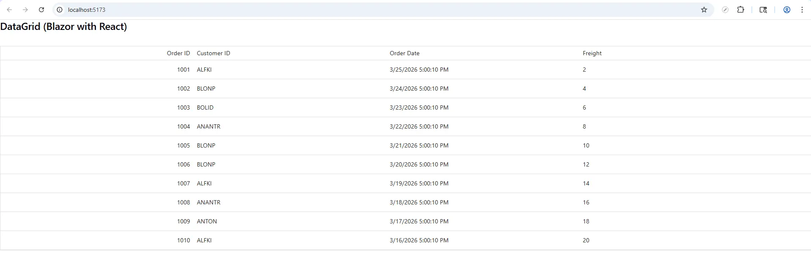

# Integrating Syncfusion® Blazor Components in React

This guide explains how to use **Syncfusion<sup style="font-size:70%">&reg;</sup> Blazor components** inside a **[React](https://react.dev/)** application.

Blazor and React are different frontend frameworks. Blazor uses .NET and Razor components, while React uses JavaScript/TypeScript and JSX. These frameworks cannot directly share UI components. However, **[Blazor Custom Elements](https://learn.microsoft.com/en-us/aspnet/core/blazor/components/js-spa-frameworks?view=aspnetcore-8.0&preserve-view=true)** make integration possible by exposing Razor components as standard web components (custom HTML elements), allowing React to render them like any other DOM element.

## Prerequisites

* [.NET 8 (LTS) or later](https://dotnet.microsoft.com/en-us/download/dotnet)
* [Node.js 18 or later](https://nodejs.org/en/download/)
* [React (Vite) project setup](https://vitejs.dev/guide/)

N> This guide uses the **Blazor Server** template with `blazor.server.js` rather than the newer Blazor Web App template with `blazor.web.js`. Microsoft recommends using `blazor.server.js` (Blazor Server) and `blazor.webassembly.js` (Blazor WebAssembly) scripts when integrating Razor components into existing JavaScript applications until better support for `blazor.web.js` is added. For more information, see [RegisterCustomElement stopped working in Blazor 8](https://github.com/dotnet/aspnetcore/issues/53920).

## Creating the Blazor application

### Create the Blazor Server project

If you already have a Blazor project, you may proceed to the next step. Otherwise, create a new Blazor Server project using the **command-line interface (CLI)**.




dotnet new blazorserver -n BlazorServerHost
cd BlazorServerHost




### Install required packages

Install Syncfusion<sup style="font-size:70%">&reg;</sup> packages and the Custom Elements package.

The **[Microsoft.AspNetCore.Components.CustomElements](https://www.nuget.org/packages/Microsoft.AspNetCore.Components.CustomElements/)** package is required because it enables Blazor components to be exported as standard custom elements, allowing them to be easily used inside the React application.




dotnet add package Syncfusion.Blazor.Grid -v {{ site.releaseversion }}
dotnet add package Syncfusion.Blazor.Themes -v {{ site.releaseversion }}

dotnet add package Microsoft.AspNetCore.Components.CustomElements --version 10.0.5




### Add required namespaces

Add the following Syncfusion<sup style="font-size:70%">&reg;</sup> Blazor namespaces to the `_Imports.razor` file.




@using Syncfusion.Blazor
@using Syncfusion.Blazor.Grids




### Add stylesheet and script resources

Before adding the stylesheet, ensure that no other Syncfusion<sup style="font-size:70%">&reg;</sup> theme CSS files (e.g., `bootstrap5.css`, `material.css`) are referenced to avoid conflicts.

Add the following stylesheet and script references inside the `_Host.cshtml` file.




<head>
    ...
    <!-- Syncfusion theme stylesheet -->
    <link href="_content/Syncfusion.Blazor.Themes/fluent2.css" rel="stylesheet" />
</head>

<body>
    ...
    <!-- Syncfusion Blazor Core script -->
    <script src="_content/Syncfusion.Blazor.Core/scripts/syncfusion-blazor.min.js" type="text/javascript"></script>
    ...
</body>




### Create the Syncfusion<sup style="font-size:70%">&reg;</sup> Blazor DataGrid component

Create a `.razor` file inside the `Pages` folder to add the Syncfusion<sup style="font-size:70%">&reg;</sup> [DataGrid](https://www.syncfusion.com/blazor-components/blazor-datagrid) component.

In this example, the file name is `OrdersGrid.razor`.




@using Syncfusion.Blazor.Grids
@namespace BlazorServerHost.Pages

<SfGrid DataSource="@Orders">
    <GridColumns>
        <GridColumn Field="OrderID" HeaderText="Order ID" TextAlign="TextAlign.Right" Width="100"></GridColumn>
        <GridColumn Field="CustomerID" HeaderText="Customer ID" Width="100"></GridColumn>
        <GridColumn Field="OrderDate" HeaderText="Order Date" Width="100"></GridColumn>
        <GridColumn Field="Freight" HeaderText="Freight" Width="120"></GridColumn>
    </GridColumns>
</SfGrid>

@code{
    public List<Order> Orders { get; set; } = new List<Order>();

    protected override void OnInitialized()
    {
        Orders = Enumerable.Range(1, 10).Select(x => new Order()
        {
            OrderID = 1000 + x,
            CustomerID = (new string[] { "ALFKI", "ANANTR", "ANTON", "BLONP", "BOLID" })[new Random().Next(5)],
            Freight = 2 * x,
            OrderDate = DateTime.Now.AddDays(-x),
        }).ToList();
    }

    public class Order {
        public int? OrderID { get; set; }
        public string CustomerID { get; set; } = string.Empty;
        public DateTime? OrderDate { get; set; }
        public double? Freight { get; set; }
    }
}




### Register the component and Syncfusion<sup style="font-size:70%">&reg;</sup> services

To use your Razor component inside a React application, you need to register it as a **Blazor Custom Element**. This makes the `.razor` component available as a standard HTML element that React can render.

Register any Razor component you want to use in React inside the `Program.cs` file.

Also, ensure that Syncfusion<sup style="font-size:70%">&reg;</sup> Blazor services are added so that Syncfusion<sup style="font-size:70%">&reg;</sup> components function correctly.



... 
using Syncfusion.Blazor;
...
// Registers the OrdersGrid component as the <sf-orders-grid> custom element.
builder.Services.AddServerSideBlazor(options =>
{
    options.RootComponents.RegisterCustomElement<BlazorServerHost.Pages.OrdersGrid>("sf-orders-grid");
});
// Adds Syncfusion Blazor services required for component rendering.
builder.Services.AddSyncfusionBlazor();
....



This registers the **OrdersGrid** component as the `<sf-orders-grid>` custom element and enables the required Syncfusion<sup style="font-size:70%">&reg;</sup> services, allowing the component to render correctly inside the React application.

## Integrating the custom elements in React

### Create the React app (Vite)

If you already have a React project, you may proceed to the next step. Otherwise, create a new React application using the following commands from the project’s root.




npm create vite@latest react-grid
cd react-grid
npm install




### Configure Vite dev proxy for Blazor

React (Vite) and Blazor run on separate development servers. To allow React to access Blazor's static files, you need to configure a development proxy.

Before setting up the proxy, run your Blazor application and copy its **local development server URL** from the console output (e.g., `http://localhost:5167`). You will need this URL when assigning the `target` field.

Open the `vite.config.js` file and configure the proxy to the Blazor server by replacing the following code.




import { defineConfig } from 'vite'
import react from '@vitejs/plugin-react'

export default defineConfig({
  plugins: [react()],
  server: {
    proxy: {
      '/_framework': {
        target: 'http://localhost:5167', // Replace with the hosted URL of the Blazor application.
        changeOrigin: true,
        ws: true
      },
      '/_content': {
        target: 'http://localhost:5167', // Same Blazor hosted URL.
        changeOrigin: true
      },
      '/_blazor': {
        target: 'http://localhost:5167', // Same Blazor hosted URL.
        changeOrigin: true,
        ws: true
      }
    }
  }
})




### Load Blazor runtime and Syncfusion<sup style="font-size:70%">&reg;</sup> assets in React

The Blazor runtime and Syncfusion<sup style="font-size:70%">&reg;</sup> scripts/themes are required for rendering Syncfusion<sup style="font-size:70%">&reg;</sup> Blazor components inside React. Add the following resources to the `index.html` file of your React project. Place the stylesheet in the `<head>` section and the scripts before the closing `</body>` tag.




<!-- Syncfusion Blazor theme stylesheet-->
<link rel="stylesheet" href="/_content/Syncfusion.Blazor.Themes/fluent2.css" />

<!-- Syncfusion Blazor Core script -->
<script src="/_content/Syncfusion.Blazor.Core/scripts/syncfusion-blazor.min.js"></script>

<!-- Blazor runtime script -->
<script src="/_framework/blazor.server.js"></script>




### Use the custom element in React

**Create a React wrapper component**

In this example, the Syncfusion<sup style="font-size:70%">&reg;</sup> DataGrid component is wrapped inside a custom Razor component named `OrdersGrid`, which is then exposed to React as the `<sf-orders-grid>` custom element.

Create a `.jsx` file inside the `src` folder and add the React wrapper component. In this example, the file name is `OrdersGrid.jsx`.




export default function OrdersGrid() {
  return (
    <div>
      <h2>DataGrid (Blazor with React)</h2>

      <sf-orders-grid></sf-orders-grid>
    </div>
  );
}




**Integrate the component into the App**

Add the following code snippet to the `App.jsx` file.




import OrdersGrid from './OrdersGrid'

function App() {
  return <OrdersGrid />
}

export default App




## Run both applications

You need to run both applications simultaneously in separate terminal windows.

**Terminal 1 - Blazor Server**

```
dotnet run
```

**Terminal 2 - React (Vite)**

```
npm run dev
```

Open the React development URL to see the Syncfusion<sup style="font-size:70%">&reg;</sup> Blazor DataGrid running inside the React application.

N> Start the Blazor application first so that React can load its resources through the proxy.


