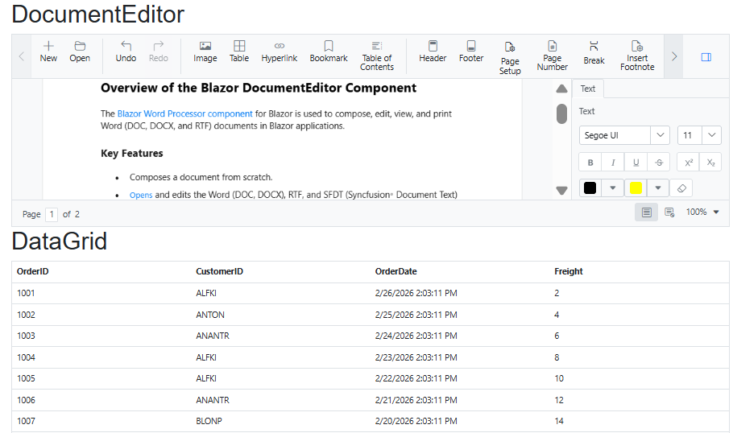

# Integrating Syncfusion® DataGrid with Document Editor in Blazor App

This guide shows how to integrate the **Syncfusion® Blazor Document Editor** (WordProcessor) together with the **Syncfusion® Blazor DataGrid** in a Blazor Web App using `Server` interactivity.

## Prerequisites

* [Syncfusion Blazor system requirements](https://blazor.syncfusion.com/documentation/system-requirements): Make sure your development environment meets the required system specifications for using Syncfusion Blazor components.

## Create a project

Create a Blazor Web App using Server render mode. Open the terminal and run the command:




dotnet new blazor -o BlazorWebAppServer -int Server
cd BlazorWebAppServer




## Install NuGet Packages

Open the integrated terminal in the project folder (where the `.csproj` is) and run:




dotnet add package Syncfusion.Blazor.WordProcessor -v {{ site.releaseversion }}
dotnet add package Syncfusion.Blazor.Grid -v {{ site.releaseversion }}
dotnet add package Syncfusion.Blazor.Themes -v {{ site.releaseversion }}
dotnet restore




> Do not install `Syncfusion.Blazor` together with `Syncfusion.Blazor.WordProcessor`. They conflict and produce ambiguity errors.

## Add Required Namespaces

Add Syncfusion namespaces to your project-level `_Imports.razor`:




@using Syncfusion.Blazor
@using Syncfusion.Blazor.DocumentEditor
@using Syncfusion.Blazor.Grids




## Register Syncfusion Blazor Service

Register the Syncfusion Blazor service in your app’s **~/Program.cs**.




using Syncfusion.Blazor;

var builder = WebApplication.CreateBuilder(args);

builder.Services.AddRazorComponents()
    .AddInteractiveServerComponents()
builder.Services.AddSyncfusionBlazor();

var app = builder.Build();
....




## Add Stylesheet and Script Resources

Add the theme CSS and Syncfusion scripts in `~/App.razor`:

```html
<head>
    <link href="_content/Syncfusion.Blazor.Themes/bootstrap5.css" rel="stylesheet" />
</head>

<body>
   	<!-- Syncfusion Blazor Document Editor component's script reference-->
	<script src="_content/Syncfusion.Blazor.WordProcessor/scripts/syncfusion-blazor-documenteditor.min.js" type="text/javascript"></script>
	<!-- Syncfusion Blazor DataGrid component's script reference -->
	<script src="_content/Syncfusion.Blazor.Core/scripts/syncfusion-blazor.min.js" type="text/javascript"></script>
</body>
```

## Configure Render Mode

If your app’s interactivity location is set to `Per page/component`, add a render mode directive at the top of `~Pages/*.razor` where you need interactivity. 




@rendermode InteractiveServer




## Add Syncfusion Blazor Document Editor component and DataGrid component

Add the Syncfusion Document Editor and DataGrid components to a `.razor` file within your app: 




@page "/"
@rendermode InteractiveServer

<h1>DocumentEditor</h1>

<SfDocumentEditorContainer EnableToolbar=true></SfDocumentEditorContainer>

<h1>DataGrid</h1>

<SfGrid DataSource="@Orders" />

@code{
    public List<Order> Orders { get; set; }

    protected override void OnInitialized()
    {
        Orders = Enumerable.Range(1, 10).Select(x => new Order()
        {
            OrderID = 1000 + x,
            CustomerID = (new string[] { "ALFKI", "ANANTR", "ANTON", "BLONP", "BOLID" })[new Random().Next(5)],
            Freight = 2 * x,
            OrderDate = DateTime.Now.AddDays(-x),
        }).ToList();
    }

    public class Order {
        public int? OrderID { get; set; }
        public string CustomerID { get; set; }
        public DateTime? OrderDate { get; set; }
        public double? Freight { get; set; }
    }
}




Note: By default, the `SfDocumentEditorContainer` component initializes an `SfDocumentEditor` instance internally. If you like to use the events of `SfDocumentEditor` component, then you can set `UseDefaultEditor` property as **false** and define your own `SfDocumentEditor` instance with event hooks in the application (Razor file).

## Run the Application

Run from the project root:




dotnet run




The app launches and renders the Syncfusion® Blazor Document Editor and DataGrid in your default browser.


