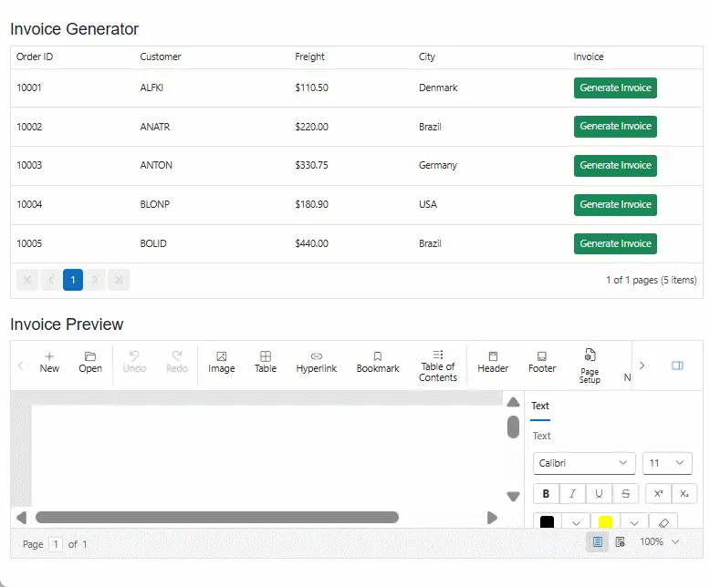

# Integrating Syncfusion® DataGrid with DocumentEditor in Blazor app

This guide shows how to integrate the **[Syncfusion® Blazor DocumentEditor](https://www.syncfusion.com/docx-editor-sdk/blazor-docx-editor)** (WordProcessor) together with the **[Syncfusion® Blazor DataGrid](https://www.syncfusion.com/blazor-components/blazor-datagrid)** in a Blazor Web App using `Server` interactivity.

A common use case for this integration is helping users work with structured records while creating or updating a related document at the same time. Users can browse, filter, or select items in the DataGrid and instantly view the matching details in the DocumentEditor as an editable Word style document. This is especially valuable in scenarios such as **order confirmation**, **HR record management**, and **customer support workflows**, where teams frequently transform Grid data into formal documents. It allows users to create invoices, summaries, letters, or agreements from one screen without switching tools, copying data, or risking errors from manual entry.

## Create a project

Create a **Blazor Web App** using **Server** render mode. Open the terminal and run the command.




dotnet new blazor -o BlazorWebAppServer -int Server
cd BlazorWebAppServer




## Install NuGet packages

Open the integrated terminal in the project folder (where the `.csproj` is) and run.




dotnet add package Syncfusion.Blazor.WordProcessor -v {{ site.releaseversion }}
dotnet add package Syncfusion.Blazor.Grid -v {{ site.releaseversion }}
dotnet add package Syncfusion.Blazor.Themes -v {{ site.releaseversion }}
dotnet restore




> Do not install [Syncfusion.Blazor](https://www.nuget.org/packages/Syncfusion.Blazor/) together with [Syncfusion.Blazor.WordProcessor](https://www.nuget.org/packages/Syncfusion.Blazor.WordProcessor). They conflict and produce ambiguity errors.

## Add required namespaces

Open the `_Imports.razor` file and import the Syncfusion namespaces.




@using Syncfusion.Blazor
@using Syncfusion.Blazor.DocumentEditor
@using Syncfusion.Blazor.Grids




## Register Syncfusion Blazor service

To enable Syncfusion Blazor components, add the required service registration in your app’s `~/Program.cs`.




using Syncfusion.Blazor;

var builder = WebApplication.CreateBuilder(args);

builder.Services.AddRazorComponents()
    .AddInteractiveServerComponents();

builder.Services.AddSyncfusionBlazor();
....




## Add stylesheet and script resources

To apply styles and enable Syncfusion features, reference the theme CSS and scripts within the `~/App.razor` file.

```html
<head>
    <link href="_content/Syncfusion.Blazor.Themes/fluent2.css" rel="stylesheet" />
</head>

<body>
   	<!-- Syncfusion Blazor DocumentEditor component's script reference-->
	<script src="_content/Syncfusion.Blazor.WordProcessor/scripts/syncfusion-blazor-documenteditor.min.js" type="text/javascript"></script>

	<!-- Syncfusion Blazor DataGrid component's script reference -->
	<script src="_content/Syncfusion.Blazor.Core/scripts/syncfusion-blazor.min.js" type="text/javascript"></script>
</body>
```

## Configure render mode

If your app’s interactivity location is set to `Per page/component`, add a render mode directive at the top of `~Pages/*.razor` where you need interactivity. 




@rendermode InteractiveServer




## Integrate DataGrid and DocumentEditor

Add the Syncfusion Blazor DocumentEditor and DataGrid components to a `.razor` file within your app. 

In this example, clicking the Invoice button in the DataGrid row generates an invoice for that order and displays it in the DocumentEditor for preview.




@page "/"
@rendermode InteractiveServer

@using Syncfusion.Blazor.Grids
@using Syncfusion.Blazor.DocumentEditor

<h4 class="mt-4">Invoice Generator</h4>

<SfGrid TItem="Order" DataSource="@Orders" AllowPaging="true">

    <GridColumns>
        <GridColumn Field="@nameof(Order.OrderID)" HeaderText="Order ID" Width="120" />
        <GridColumn Field="@nameof(Order.CustomerID)" HeaderText="Customer" Width="150" />
        <GridColumn Field="@nameof(Order.Freight)" HeaderText="Freight" Width="120" Format="C2" />
        <GridColumn Field="@nameof(Order.ShipCity)" HeaderText="City" Width="150" />

        <GridColumn HeaderText="Invoice" Width="130">
            <Template>
                @{
                    var row = context as Order;
                }
                <button class="btn btn-success btn-sm" @onclick="@(() => GenerateInvoice(row))">
                    Generate Invoice
                </button>
            </Template>
        </GridColumn>
    </GridColumns>

</SfGrid>

<h4 class="mt-4">Invoice Preview</h4>

<SfDocumentEditorContainer @ref="EditorContainer" EnableToolbar="true">
</SfDocumentEditorContainer>

@code {
    private SfDocumentEditorContainer? EditorContainer;

    private List<Order> Orders = new()
    {
        new() { OrderID = 10001, CustomerID = "ALFKI", Freight = 110.50, ShipCity = "Denmark" },
        new() { OrderID = 10002, CustomerID = "ANATR", Freight = 220.00, ShipCity = "Brazil" },
        new() { OrderID = 10003, CustomerID = "ANTON", Freight = 330.75, ShipCity = "Germany" },
        new() { OrderID = 10004, CustomerID = "BLONP", Freight = 180.90, ShipCity = "USA" },
        new() { OrderID = 10005, CustomerID = "BOLID", Freight = 440.00, ShipCity = "Brazil" }
    };

    public class Order
    {
        public int OrderID { get; set; }
        public string CustomerID { get; set; } = "";
        public double Freight { get; set; }
        public string ShipCity { get; set; } = "";
    }

    private async Task GenerateInvoice(Order order)
    {
        if (EditorContainer?.DocumentEditor == null)
            return;
        
        var sfdt = BuildInvoice(order);
        await EditorContainer.DocumentEditor.OpenAsync(sfdt);
    }

    private string BuildInvoice(Order o)
    {
        // Generate the invoice in SFDT format.
        return $$"""
        {
            "sections": [
                {
                    "blocks": [
                        { "paragraphFormat": { "textAlignment": "Center" },
                        "inlines": [ { "text": "My Orders PVT LTD", "bold": true, "fontSize": 24 } ] },
                        
                        { "paragraphFormat": { "textAlignment": "Center" },
                        "inlines": [ { "text": "No.123, Main Street, Business City" } ] },
                        
                        { "paragraphFormat": { "textAlignment": "Center" },
                        "inlines": [ { "text": "Phone: +1 234 567 8900\n" } ] },
                        
                        { "inlines": [ { "text": "INVOICE", "bold": true, "fontSize": 22 } ] },
                        { "inlines": [ { "text": "Invoice No: INV-{{o.OrderID}}" } ] },
                        { "inlines": [ { "text": "Customer ID: {{o.CustomerID}}" } ] },
                        { "inlines": [ { "text": "City: {{o.ShipCity}}" } ] },
                        { "inlines": [ { "text": "Date: {{DateTime.Now:dd-MMM-yyyy}}" } ] },
                        { "inlines": [ { "text": "Amount: ${{o.Freight:F2}}" } ] },
                        { "inlines": [ { "text": "Notes: Thank you for your business." } ] },
                        
                        { "inlines": [ { "text": "\n" } ] },
                        
                        { "inlines": [ { "text": "Authorized Signature", "bold": true } ] },
                        { "inlines": [ { "text": "______________________________" } ] }
                    ]
                }
            ]
        }
        """;
    }
}




> By default, the `SfDocumentEditorContainer` component initializes an `SfDocumentEditor` instance internally. If you like to use the events of `SfDocumentEditor` component, then you can set `UseDefaultEditor` property as **false** and define your own `SfDocumentEditor` instance with event hooks in the application (Razor file).

## Run the application

Use the following command to run the application in the browser.




dotnet run




The app launches and renders the **[Syncfusion® Blazor DocumentEditor](https://www.syncfusion.com/docx-editor-sdk/blazor-docx-editor)** and **[Syncfusion® Blazor DataGrid](https://www.syncfusion.com/blazor-components/blazor-datagrid)** in your default browser.



## See also

- [Getting started with Blazor DocumentEditor component in Web app](https://help.syncfusion.com/document-processing/word/word-processor/blazor/getting-started/web-app)

- [Getting started with Blazor DataGrid in Web app](https://blazor.syncfusion.com/documentation/datagrid/getting-started-with-web-app)