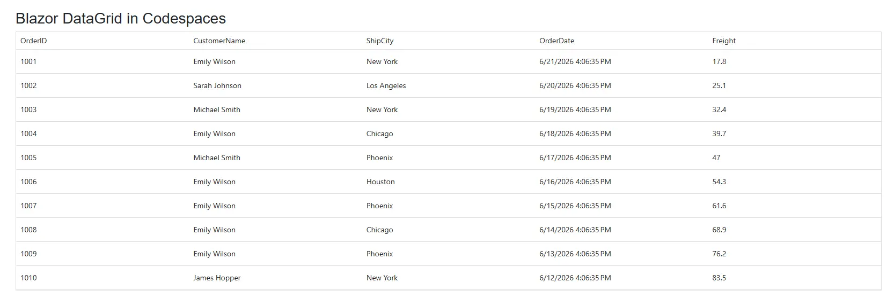

# Integrating Blazor DataGrid with GitHub Codespaces

This article explains how to integrate the **[Blazor DataGrid](https://www.syncfusion.com/blazor-components/blazor-datagrid)** and run it seamlessly in **[GitHub Codespaces](https://docs.github.com/en/codespaces/about-codespaces/what-are-codespaces)**.

GitHub Codespaces provides a cloud-based development environment that eliminates the need for local setup and enables instant development in Visual Studio Code directly in the browser.

## Prerequisites

Before getting started, ensure you have the following:

* A [GitHub](https://github.com/) account
* Access to [GitHub Codespaces](https://docs.github.com/en/codespaces/about-codespaces/what-are-codespaces)

## Configure a development container for .NET 10 and Blazor

To run Blazor applications in GitHub Codespaces, configure a development container with the **.NET 10 SDK** and support for **ASP.NET Core and Blazor development**.

### Prerequisites for dev container setup

* A local [Git](https://git-scm.com/) client installed on your machine
* Your repository cloned locally or access to create files through the [GitHub web interface](https://docs.github.com/en/repositories/working-with-files/managing-files/creating-new-files)

### Create the dev container configuration

#### Step 1: Clone your repository

Clone your GitHub repository to your local machine.




git clone <your-repo-url>
cd <your-repo>




You can also create files directly in GitHub by navigating to your repository and selecting **Add file → Create new file**.

#### Step 2: Create the `.devcontainer` folder

Create a folder named `.devcontainer` at the root level of your repository.




mkdir .devcontainer




#### Step 3: Add the `devcontainer.json` file

Inside the `.devcontainer` folder, create a file named `devcontainer.json` and add the following configuration. GitHub Codespaces automatically applies the settings from this file when a codespace starts. Add it to your repository before launching Codespaces so the environment is configured correctly.




{
  "name": "Blazor (.NET 10) Codespaces Development Container",
  "image": "mcr.microsoft.com/devcontainers/dotnet:10.0",
  "features": {
    "ghcr.io/devcontainers/features/github-cli:1": {}
  },
  "customizations": {
    "vscode": {
      "extensions": [
        "ms-dotnettools.csharp",
        "ms-dotnettools.csdevkit",
        "ms-dotnettools.vscodeintellicode-csharp",
        "ms-dotnettools.blazor-tools",
        "ms-azuretools.vscode-docker",
        "GitHub.codespaces"
      ]
    }
  },
  "forwardPorts": [5000],
  "portsAttributes": {
    "5000": {
      "label": "Blazor HTTP",
      "onAutoForward": "openBrowser",
      "requireLocalPort": false
    }
  },
  "postCreateCommand": "dotnet workload install wasm-tools",
  "postStartCommand": "dotnet restore || true",
  "updateContentCommand": "dotnet workload update",
  "remoteUser": "vscode",
  "remoteEnv": {
    "DOTNET_SYSTEM_GLOBALIZATION_INVARIANT": "false",
    "ASPNETCORE_ENVIRONMENT": "Development",
    "ASPNETCORE_URLS": "http://0.0.0.0:5000",
    "DOTNET_CLI_TELEMETRY_OPTOUT": "true"
  },
  "waitFor": "postCreateCommand"
}




#### Key configuration details

* **Base image**: Uses the official .NET 10 development container image
* **Features**: Includes [GitHub CLI](https://cli.github.com/) for repository operations within Codespaces
* **VS Code extensions**: Installs [C# Dev Kit](https://marketplace.visualstudio.com/items?itemName=ms-dotnettools.csdevkit), Blazor tools, and [Docker](https://marketplace.visualstudio.com/items?itemName=ms-azuretools.vscode-docker) support automatically
* **Port forwarding**: Uses `forwardPorts` to expose the HTTP port (5000), enabling external access to the application running inside the Codespaces container
* **WebAssembly (WASM) tools**: Installs Blazor WebAssembly development tools via `workload install`
* **Environment variables**: Configures [.NET globalization](https://learn.microsoft.com/en-us/dotnet/core/extensions/globalization), development environment, and both protocol URLs
* **Post-create command**: Automatically restores NuGet packages and installs required workloads after container setup
* **Post-start restoration**: Runs `dotnet restore` on each container start, and the `|| true` ensures the container starts successfully even if restore produces non-critical warnings

This configuration ensures your Codespaces environment is ready to build and run Blazor applications without any manual setup.

#### Step 4: Commit and push to GitHub

Commit the `.devcontainer` folder to your repository.




git add .devcontainer/devcontainer.json
git commit -m "Add dev container configuration for Blazor development in GitHub Codespaces"
git push origin main




## Launch GitHub Codespaces

After adding the dev container configuration to your repository, launch GitHub Codespaces:

1. Open your GitHub repository in the browser.
2. Click the **Code** button.
3. Select the **Codespaces** tab.
4. Click **Create codespace on main**.

GitHub Codespaces automatically performs the following actions:

* Provisions a cloud-based development environment
* Detects the `.devcontainer/devcontainer.json` configuration
* Installs and configures the .NET 10 development container
* Installs required VS Code extensions for [C#](https://marketplace.visualstudio.com/items?itemName=ms-dotnettools.csharp), Blazor tools, [Docker](https://marketplace.visualstudio.com/items?itemName=ms-azuretools.vscode-docker), and [GitHub CLI](https://cli.github.com/)
* Executes the post-create command to restore NuGet packages
* Installs Blazor WebAssembly workload tools
* Launches [Visual Studio Code](https://code.visualstudio.com/) in the browser

After Codespaces finishes initializing, verify the setup:

1. Open the terminal in Codespaces.
2. Run `dotnet --list-sdks` to confirm that the .NET 10 SDK is installed.
3. Run `dotnet workload list` to verify that the `wasm-tools` workload is present.
4. Check the terminal output for any errors from the post-create command.

If the setup encounters errors, review the container logs or rebuild the codespace.

## Create a Blazor Web App

In the Codespaces root terminal, run the following commands to create a new **Blazor Web App (Interactive Server)**.




dotnet new blazor -o BlazorApp --interactivity Server
cd BlazorApp




## Install required NuGet packages

Install the [Syncfusion.Blazor.Grid](https://www.nuget.org/packages/Syncfusion.Blazor.Grid/) and [Syncfusion.Blazor.Themes](https://www.nuget.org/packages/Syncfusion.Blazor.Themes/) NuGet packages. All Syncfusion Blazor packages are available on [nuget.org](https://www.nuget.org/packages?q=syncfusion.blazor). See the [NuGet packages](https://blazor.syncfusion.com/documentation/nuget-packages) topic for details.




dotnet add package Syncfusion.Blazor.Grid -v {{ site.releaseversion }}
dotnet add package Syncfusion.Blazor.Themes -v {{ site.releaseversion }}




## Add required namespaces

After the packages are installed, open the `~/_Imports.razor` file in Blazor Web App and import the `Syncfusion.Blazor` and `Syncfusion.Blazor.Grids` namespaces.




@using Syncfusion.Blazor
@using Syncfusion.Blazor.Grids




## Register Blazor service

Open the `~/Program.cs` file in Blazor Web App and register the Blazor service to enable [Blazor components](https://www.syncfusion.com/blazor-components) in the application.




using Syncfusion.Blazor;

var builder = WebApplication.CreateBuilder(args);

builder.Services.AddRazorComponents()
    .AddInteractiveServerComponents();

// Register Blazor service
builder.Services.AddSyncfusionBlazor();

var app = builder.Build();




## Add stylesheet and script resources

The theme stylesheet and script can be accessed from NuGet through [Static Web Assets](https://blazor.syncfusion.com/documentation/appearance/themes#static-web-assets). Include the [stylesheet](https://blazor.syncfusion.com/documentation/appearance/themes) and [script references](https://blazor.syncfusion.com/documentation/common/adding-script-references) in the `~/App.razor` file.




<head>
    ...
    <link href="_content/Syncfusion.Blazor.Themes/fluent2.css" rel="stylesheet" />
</head>

<body>
    ...
    
</body>




## Configure render mode (Server)

For Server render mode, if your app's interactivity location is set to `Per page/component`, add the following directive at the top of each `~/Pages/*.razor` file that requires interactive Server components.

**Per-page directive (Server)**




@rendermode InteractiveServer




## Add Blazor DataGrid component

Open a Razor file located in the `~/Pages/*.razor` (for example, `Home.razor`) and add the [Blazor DataGrid](https://www.syncfusion.com/blazor-components/blazor-datagrid) component inside the razor file.




@page "/"
@rendermode InteractiveServer

<h3>Blazor DataGrid in Codespaces</h3>

<SfGrid DataSource="@Orders" />

@code {
    public List<Order> Orders { get; set; } = new List<Order>();

    protected override void OnInitialized()
    {
        var customers = new string[] { "James Hopper", "Michael Smith", "Sarah Johnson", "Robert Davis", "Emily Wilson" };
        var cities = new string[] { "New York", "Los Angeles", "Chicago", "Houston", "Phoenix" };
        var rng = new Random();
        Orders = Enumerable.Range(1, 10).Select(x => new Order()
        {
            OrderID = 1000 + x,
            CustomerName = customers[rng.Next(customers.Length)],
            ShipCity = cities[rng.Next(cities.Length)],
            Freight = Math.Round(10.5 + (x * 7.3), 2),
            OrderDate = DateTime.Now.AddDays(-x),
        }).ToList();
    }

    public class Order {
        public int? OrderID { get; set; }
        public string CustomerName { get; set; } = string.Empty;
        public string ShipCity { get; set; } = string.Empty;
        public DateTime? OrderDate { get; set; }
        public double? Freight { get; set; }
    }
}




## Run the application in Codespaces

In the Codespaces terminal, run:




dotnet run --urls=http://0.0.0.0:5000




### Access the application

After running:

1. Codespaces automatically detects the running ports.
2. Open the **Ports** panel in the VS Code bottom panel.
3. Click **Open in Browser** on the HTTP port (5000) for the best experience.

The Blazor application loads with the DataGrid displaying 10 order records. The grid is fully interactive and runs within the Codespaces browser environment.

## See also

* [Getting Started with Blazor DataGrid in Blazor Web App](https://blazor.syncfusion.com/documentation/datagrid/getting-started-with-web-app)
* [Integrating Blazor DataGrid with PDF Viewer](https://blazor.syncfusion.com/documentation/common/integration/blazor-with-pdf-viewer)
* [Integrating Blazor DataGrid with Spreadsheet](https://blazor.syncfusion.com/documentation/common/integration/blazor-grid-with-spreadsheet)
* [Integrating Blazor DataGrid with Bold Report Viewer](https://blazor.syncfusion.com/documentation/common/integration/blazor-datagrid-boldreports)