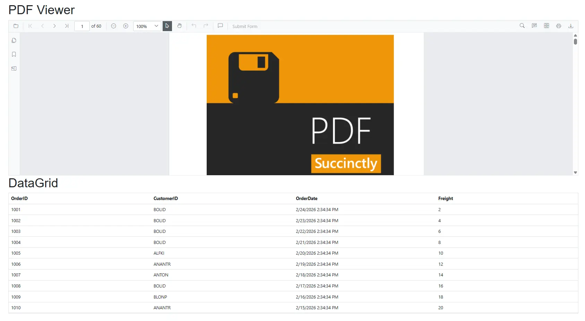

# Integrating Syncfusion® DataGrid with PDF Viewer in Blazor Apps

This article explains how to integrate the **Syncfusion<sup style="font-size:70%">&reg;</sup> Blazor PDF Viewer (Next‑Gen)**,`SfPdfViewer`, together with the **Syncfusion® Blazor DataGrid**, `SfGrid`, in the following project types:
* Blazor Web App (interactive render modes: Auto, WebAssembly, or Server)
* Blazor WebAssembly (WASM) App

This guide uses [Visual Studio Code](https://code.visualstudio.com/). If you haven’t created your Blazor app yet, follow the [Blazor getting started guide](https://blazor.syncfusion.com/documentation/getting-started/blazor-web-app?tabcontent=visual-studio-code) instructions for Visual Studio Code, then return to this article.

### Prerequisites

* [System requirements for Blazor components](https://blazor.syncfusion.com/documentation/system-requirements): Make sure your development environment meets the required system specifications for using Syncfusion<sup style="font-size:70%">&reg;</sup> Blazor components.
* For Blazor WASM or Blazor Web App using Auto or WebAssembly modes, install SkiaSharp/WASM tool workloads(specifically required for client‑side rendering of the Syncfusion PDF Viewer). Install only the workload that matches your .NET version.

Example (choose one based on your target .NET version):

```
# .NET 8
dotnet workload install wasm-tools-net8

# .NET 9
dotnet workload install wasm-tools-net9

# .NET 10
dotnet workload install wasm-tools-net10

```

### Install Syncfusion<sup style="font-size:70%">&reg;</sup> Blazor PDF Viewer, DataGrid, and Themes NuGet Packages

If your Blazor Web App is using the `WebAssembly` or `Auto` render modes, ensure that all package installations are performed inside the `client` project.

From the project folder (where the `.csproj` is located), install:
 * [Syncfusion.Blazor.SfPdfViewer](https://www.nuget.org/packages/Syncfusion.Blazor.SfPdfViewer) 
 * [Syncfusion.Blazor.Grid](https://www.nuget.org/packages/Syncfusion.Blazor.Grid)
 * [Syncfusion.Blazor.Themes](https://www.nuget.org/packages/Syncfusion.Blazor.Themes/)
 * [SkiaSharp.Views.Blazor](https://www.nuget.org/packages/SkiaSharp.Views.Blazor)





dotnet add package Syncfusion.Blazor.SfPdfViewer -v {{ site.releaseversion }}
dotnet add package Syncfusion.Blazor.Grid -v {{ site.releaseversion }}
dotnet add package Syncfusion.Blazor.Themes -v {{ site.releaseversion }}
dotnet add package SkiaSharp.Views.Blazor -v 3.119.2
dotnet restore





N> Syncfusion<sup style="font-size:70%">&reg;</sup> Blazor components are available in [nuget.org](https://www.nuget.org/packages?q=syncfusion.blazor). Refer to the [NuGet packages](https://blazor.syncfusion.com/documentation/nuget-packages) topic for the available NuGet package list with component details. Verify the latest versions before installation.

### Add Required Namespaces

Add Syncfusion<sup style="font-size:70%">&reg;</sup> namespaces in the appropriate **~/_Imports.razor** file depending on the project type:

| Project Type | File to add namespaces |
| -- | -- |
| WebAssembly or Auto | **~/_Imports.razor** in the client project |
| Server | **~/Components/_Imports.razor** |
| Standalone Blazor WASM | **~/_Imports.razor** |




@using Syncfusion.Blazor
@using Syncfusion.Blazor.SfPdfViewer
@using Syncfusion.Blazor.Grids




### Register Syncfusion<sup style="font-size:70%">&reg;</sup> Blazor Service

Register the Syncfusion<sup style="font-size:70%">&reg;</sup> Blazor service in your app’s **~/Program.cs**.

For Blazor Web App with `WebAssembly` or `Auto` render modes, register in both **~/Program.cs** files (Server and Client).




...
using Syncfusion.Blazor;

var builder = WebApplication.CreateBuilder(args);

builder.Services.AddRazorComponents() 
    .AddInteractiveServerComponents();

builder.Services.AddSignalR(o => { o.MaximumReceiveMessageSize = 102400000; });

builder.Services.AddMemoryCache();
//Add Syncfusion Blazor service to the container.
builder.Services.AddSyncfusionBlazor();

...
...





...
...
using Syncfusion.Blazor;

var builder = WebApplication.CreateBuilder(args);
builder.Services.AddRazorComponents()
.AddInteractiveWebAssemblyComponents();

builder.Services.AddMemoryCache();
//Add Syncfusion Blazor service to the container
builder.Services.AddSyncfusionBlazor();

...
...





...
...
using Syncfusion.Blazor;

var builder = WebApplication.CreateBuilder(args);
builder.Services.AddRazorComponents()
.AddInteractiveServerComponents() .AddInteractiveWebAssemblyComponents();

builder.Services.AddSignalR(o => { o.MaximumReceiveMessageSize = 102400000; });

builder.Services.AddMemoryCache();
//Add Syncfusion Blazor service to the container
builder.Services.AddSyncfusionBlazor();

...
...





...
...
using Syncfusion.Blazor;

var builder = WebAssemblyHostBuilder.CreateDefault(args);
builder.RootComponents.Add<App>("#app");
builder.RootComponents.Add<HeadOutlet>("head::after");

builder.Services.AddMemoryCache();
builder.Services.AddScoped(sp => new HttpClient { BaseAddress = new Uri(builder.HostEnvironment.BaseAddress) });

// Add Syncfusion Blazor service to the container.
builder.Services.AddSyncfusionBlazor();

...
...





### Add stylesheet and script resources

Before adding the stylesheet, make sure no other Syncfusion<sup style="font-size:70%">&reg;</sup> theme CSS (e.g., bootstrap5.css, material.css) is already referenced to avoid conflicts.

**Blazor Web App**

Add the following stylesheet and script references in the `~/Components/App.razor`. 

**Standalone WASM**

Add the same stylesheet and script references to `wwwroot/index.html`.




<head>
    <!-- Syncfusion theme style sheet -->
    <link href="_content/Syncfusion.Blazor.Themes/bootstrap5.css" rel="stylesheet" />
</head>

<body>
    <!-- Syncfusion Blazor PDF Viewer component script -->
    <script src="_content/Syncfusion.Blazor.SfPdfViewer/scripts/syncfusion-blazor-sfpdfviewer.min.js" type="text/javascript"></script>

    <!-- Syncfusion Blazor Core script (required for most components, including DataGrid) -->
    <script src="_content/Syncfusion.Blazor.Core/scripts/syncfusion-blazor.min.js" type="text/javascript"></script>
</body>




### Configure Render Mode (Blazor Web App)

If Interactivity location is set to `Per page/component`, specify a render mode at the top of each `~Pages/*.razor` component as needed:

| Interactivity location | RenderMode | Code |
| --- | --- | --- |
| Per page/component | Auto | @rendermode InteractiveAuto |
|  | WebAssembly | @rendermode InteractiveWebAssembly |
|  | Server | @rendermode InteractiveServer |
|  | None | --- |


N> If an **Interactivity Location** is set to `Global` and the **Render Mode** is set to `Auto` or `WebAssembly`, the render mode is configured in the `App.razor` file by default. No per‑page directive is necessary.

**Example (per page):**




@* Define the desired render mode here *@
@rendermode InteractiveAuto




### Add Syncfusion<sup style="font-size:70%">&reg;</sup> Blazor PDF Viewer component and DataGrid component

Add the Syncfusion<sup style="font-size:70%">&reg;</sup> PDF Viewer (Next-Gen) and DataGrid components to a `.razor` file within your app: 

**Blazor Web App (WebAssembly or Auto Render Mode)**
Add to a `.razor` file inside the `client` project’s `Pages` folder.

**Blazor Web App (Server Render Mode) or Standalone WASM**
Add to `~/Pages/Home.razor` or any `.razor` file under under the `Pages` folder.




@page "/"

<h1>PDF Viewer</h1>

<SfPdfViewer2 DocumentPath="https://cdn.syncfusion.com/content/pdf/pdf-succinctly.pdf"
              Height="100%"
              Width="100%">
</SfPdfViewer2>

<h1>DataGrid</h1>

<SfGrid DataSource="@Orders" />

@code{
    public List<Order> Orders { get; set; }

    protected override void OnInitialized()
    {
        Orders = Enumerable.Range(1, 10).Select(x => new Order()
        {
            OrderID = 1000 + x,
            CustomerID = (new string[] { "ALFKI", "ANANTR", "ANTON", "BLONP", "BOLID" })[new Random().Next(5)],
            Freight = 2 * x,
            OrderDate = DateTime.Now.AddDays(-x),
        }).ToList();
    }

    public class Order {
        public int? OrderID { get; set; }
        public string CustomerID { get; set; }
        public DateTime? OrderDate { get; set; }
        public double? Freight { get; set; }
    }
}




N> In Syncfusion PDF Viewer, if the [DocumentPath](https://help.syncfusion.com/cr/blazor/Syncfusion.Blazor.SfPdfViewer.PdfViewerBase.html#Syncfusion_Blazor_SfPdfViewer_PdfViewerBase_DocumentPath) property is not set, the PDF Viewer renders without loading a PDF. Use the **Open** toolbar option to browse and open a PDF.


###  Run the Application

```

dotnet run

```

The app launches and renders the Syncfusion<sup style="font-size:70%">&reg;</sup> Blazor PDF Viewer and DataGrid in your default browser.


