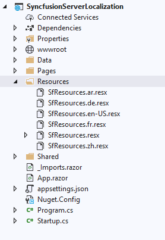
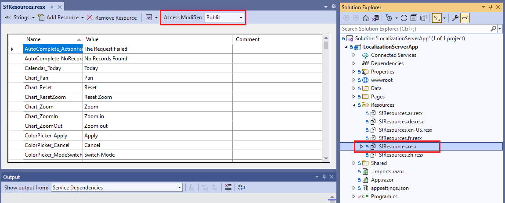

# Localization of Blazor Components

[Localization](https://learn.microsoft.com/en-us/aspnet/core/blazor/globalization-localization?view=aspnetcore-8.0) is the process of translating application resources into different languages for specific cultures. Syncfusion&reg; Blazor components can be localized by adding a resource file for each language.

## Localization of Syncfusion&reg; Blazor Components

Use the following steps to localize Syncfusion&reg; Blazor components based on culture. Example code is available in the repository below.

N> [View sample on GitHub](https://github.com/SyncfusionExamples/blazor-localization)

### Adding culture-based .resx files

Syncfusion&reg; components can be localized using Resource `.resx` files. Default and culture-specific localization files are available in the following GitHub repository.

N> Download default and culture-based resource files from [GitHub](https://github.com/syncfusion/blazor-locale).

Copy the default `.resx` file (`SfResources.resx`) and any required culture-specific `.resx` files to the **Resources** folder. For a .NET MAUI Blazor app, create a **LocalizationResources** folder and add them there.

N> Update the localization files whenever upgrading Syncfusion&reg; NuGet packages to prevent mismatches in localization strings.

After adding the resource files, open the default resource file (`SfResources.resx`) in the **Resource Editor** and set **Access Modifier** to **Public**.

### Create and register localization service

[ISyncfusionStringLocalizer](https://help.syncfusion.com/cr/blazor/Syncfusion.Blazor.ISyncfusionStringLocalizer.html) acts as middleware between Syncfusion&reg; Blazor UI components and resource files and uses the [ResourceManager](https://help.syncfusion.com/cr/blazor/Syncfusion.Blazor.ISyncfusionStringLocalizer.html#Syncfusion_Blazor_ISyncfusionStringLocalizer_ResourceManager) to provide culture-specific resources at runtime. Create a class that implements `ISyncfusionStringLocalizer`. In the class, return the `ResourceManager` created in the previous step for the [ResourceManager](https://help.syncfusion.com/cr/blazor/Syncfusion.Blazor.ISyncfusionStringLocalizer.html#Syncfusion_Blazor_ISyncfusionStringLocalizer_ResourceManager) property and update [GetText](https://help.syncfusion.com/cr/blazor/Syncfusion.Blazor.ISyncfusionStringLocalizer.html#Syncfusion_Blazor_ISyncfusionStringLocalizer_GetText_System_String_) to return the localized string.

In the following code, the `SyncfusionLocalizer` class implements the `ISyncfusionStringLocalizer` interface, and the `ResourceManager` is configured to return the cached `ResourceManager` instance of the default resource file created in the “Adding culture-based .resx files” step.





using Syncfusion.Blazor;

public class SyncfusionLocalizer : ISyncfusionStringLocalizer
{
    public string GetText(string key)
    {
        return this.ResourceManager.GetString(key);
    }

    public System.Resources.ResourceManager ResourceManager
    {
        get
        {
            // Replace the ApplicationNamespace with your application name.
            return ApplicationNamespace.Resources.SfResources.ResourceManager;

            //For .Net Maui Blazor App
            // Replace the ApplicationNamespace with your application name.
            //return ApplicationNamespace.LocalizationResources.SfResources.ResourceManager;
        }
    }
}





Register `ISyncfusionStringLocalizer` and the Syncfusion&reg; Blazor service in the **~/Program.cs** file of your app.

* For a Blazor Web App using an **Interactive render mode** (WebAssembly or Auto), register `SyncfusionLocalizer` and the Syncfusion&reg; Blazor services in both **Server** and **Client** `~/Program.cs` files.
* For a **.NET MAUI Blazor** app, register the Syncfusion&reg; Blazor service in **~/MauiProgram.cs**.





using Syncfusion.Blazor;
...
builder.Services.AddSyncfusionBlazor();
// Register the locale service to localize the  SyncfusionBlazor components.
builder.Services.AddSingleton(typeof(ISyncfusionStringLocalizer), typeof(SyncfusionLocalizer));
...





## Statically set the culture

If culture changes are not required at runtime, set the culture statically using the options below.

### Blazor Web App and Blazor WASM App

In Blazor Web App and Blazor WebAssembly (WASM) apps, set culture either in Blazor’s start options or in C# code.

#### Setting the culture in Blazor’s start option

Set the app’s culture in JavaScript by configuring `applicationCulture` in Blazor’s start options:

* For **.NET 8 and .NET 9** Blazor Web Apps using any render mode (Server, WebAssembly, or Auto), prevent Blazor autostart by adding `autostart="false"` to the Blazor `
    ...
</body>





<body>
    ...
    
    ...
</body>





* Add the script block below the Blazor `
    
    ...
</body>




<body>
    ...
    
    
    ...
</body>





#### Setting the culture in C# code

For Blazor Web App and Blazor WASM apps, set culture in C# as an alternative to Blazor’s start option. Set `CultureInfo.DefaultThreadCurrentCulture` and `CultureInfo.DefaultThreadCurrentUICulture` in `Program.cs` to the same culture before the call that builds and runs the `WebAssemblyHostBuilder` (`await builder.Build().RunAsync();`).





using System.Globalization;

CultureInfo.DefaultThreadCurrentCulture = new CultureInfo("de-DE");
CultureInfo.DefaultThreadCurrentUICulture = new CultureInfo("de-DE");





### MAUI Blazor App

In a .NET MAUI Blazor app, set culture in C# by configuring `CultureInfo.DefaultThreadCurrentCulture` and `CultureInfo.DefaultThreadCurrentUICulture` in `MauiProgram.cs` to the same culture. Ensure this configuration occurs before returning from `MauiApp.CreateBuilder()` (that is, before `return builder.Build();`).





using System.Globalization;

CultureInfo.DefaultThreadCurrentCulture = new CultureInfo("de-DE");
CultureInfo.DefaultThreadCurrentUICulture = new CultureInfo("de-DE");





## Dynamically set the culture

Set culture dynamically based on user preference. The following example uses a localization cookie or local storage to persist the user’s selection.

### Blazor Web App and Blazor Standalone WASM App

For Blazor Web App and Blazor WASM Standalone apps, set the `BlazorWebAssemblyLoadAllGlobalizationData` property to true in the project file:





<PropertyGroup>
    <BlazorWebAssemblyLoadAllGlobalizationData>true</BlazorWebAssemblyLoadAllGlobalizationData>
</PropertyGroup>





* For **.NET 8 and .NET 9** Blazor Web Apps using any render mode (Server, WebAssembly, or Auto), add JavaScript in **~/Components/App.razor** (after the Blazor `








In `Program.cs`, use JS interop to call the functions above and retrieve the user’s culture selection from local storage. If local storage doesn’t contain a culture, a default of United States English (`en-US`) is set.

For a Blazor Web App using an **Interactive render mode** (WebAssembly or Auto), register `SyncfusionLocalizer` and Syncfusion&reg; Blazor services in both **Server** and **Client** `~/Program.cs` files.





using Microsoft.JSInterop;
using System.Globalization;

...

builder.Services.AddSyncfusionBlazor();
//Register the Syncfusion locale service to localize Syncfusion Blazor components.
builder.Services.AddSingleton(typeof(ISyncfusionStringLocalizer), typeof(SyncfusionLocalizer));

var host = builder.Build();

//Setting culture of the application
var jsInterop = host.Services.GetRequiredService<IJSRuntime>();
var result = await jsInterop.InvokeAsync<string>("cultureInfo.get");
CultureInfo culture;
if (result != null)
{
    culture = new CultureInfo(result);
}
else
{
    culture = new CultureInfo("en-US");
    await jsInterop.InvokeVoidAsync("cultureInfo.set", "en-US");
}
CultureInfo.DefaultThreadCurrentCulture = culture;
CultureInfo.DefaultThreadCurrentUICulture = culture;

await builder.Build().RunAsync();





Create a `CultureSwitcher` component to store the user’s culture selection in browser local storage via JS interop and force a page reload to apply the updated culture.





@using  System.Globalization
@inject IJSRuntime JSRuntime
@inject NavigationManager NavigationManager

<select @bind="Culture">
    @foreach (var culture in supportedCultures)
    {
        <option value="@culture">@culture.DisplayName</option>
    }
</select>

@code {
    private CultureInfo[] supportedCultures = new[]
    {
        new CultureInfo("en-US"),
        new CultureInfo("de-DE"),
        new CultureInfo("fr-FR"),
        new CultureInfo("ar-AE"),
        new CultureInfo("zh-HK")
    };

    private CultureInfo Culture
    {
        get => CultureInfo.CurrentCulture;
        set
        {
            if (CultureInfo.CurrentCulture != value)
            {
                var js = (IJSInProcessRuntime)JSRuntime;
                js.InvokeVoid("cultureInfo.set", value.Name);

                NavigationManager.NavigateTo(NavigationManager.Uri, forceLoad: true);
            }
        }
    }
}





Add the `CultureSwitcher` component to `~/MainLayout.razor` to enable the culture switcher on all pages. For a Blazor Web App with interactivity location set to `Per page/component`, specify a render mode on the `CultureSwitcher` component instance in `~/MainLayout.razor`.




    ....
    <main>
        

            <CultureSwitcher @rendermode="@InteractiveAuto" />
            ....
        

    </main>




    ....
    <main>
        

            <CultureSwitcher />
            <a href="https://docs.microsoft.com/aspnet/" target="_blank">About</a>
        

    </main>





### Blazor Server App and Blazor Web App (Interactive Server)

Configure supported cultures and ensure the app processes controller actions by calling `AddControllers` and `MapControllers`.

For a Blazor Web App using the **Interactive render mode** of `Server`, register `SyncfusionLocalizer` and Syncfusion&reg; Blazor services in the `~/Program.cs` files.





builder.Services.AddControllers();

builder.Services.AddSyncfusionBlazor();
builder.Services.AddLocalization();

var supportedCultures = new[] { "en-US", "de-DE", "fr-FR", "ar-AE", "zh-HK" };
var localizationOptions = new RequestLocalizationOptions()
    .SetDefaultCulture(supportedCultures[0])
    .AddSupportedCultures(supportedCultures)
    .AddSupportedUICultures(supportedCultures);

var app = builder.Build();
app.UseRequestLocalization(localizationOptions);
// Configure the HTTP request pipeline.
if (!app.Environment.IsDevelopment())
{
    app.UseExceptionHandler("/Error");
    // The default HSTS value is 30 days. You may want to change this for production scenarios, see https://aka.ms/aspnetcore-hsts.
    app.UseHsts();
}
app.UseHttpsRedirection();
app.UseStaticFiles();
app.UseRouting();
app.MapControllers();
app.MapBlazorHub();
app.MapFallbackToPage("/_Host");

app.Run();




For .NET 9 and .NET 8, set the current culture in a cookie in the App component file.





@using System.Globalization
@using Microsoft.AspNetCore.Localization
@code {
    [CascadingParameter]
    public HttpContext? HttpContext { get; set; }

    protected override void OnInitialized()
    {
        HttpContext?.Response.Cookies.Append(
            CookieRequestCultureProvider.DefaultCookieName,
            CookieRequestCultureProvider.MakeCookieValue(
                new RequestCulture(
                    CultureInfo.CurrentCulture,
                    CultureInfo.CurrentUICulture)));
    }
}





Provide a UI to allow the user to select a culture using a redirect-based approach with a localization cookie. The controller sets the user’s selected culture into a cookie and redirects back to the original URI.





using Microsoft.AspNetCore.Localization;
using Microsoft.AspNetCore.Mvc;

[Route("[controller]/[action]")]
public class CultureController : Controller
{
    public IActionResult SetCulture(string culture, string redirectUri)
    {
        if (culture != null)
        {
            HttpContext.Response.Cookies.Append(
                CookieRequestCultureProvider.DefaultCookieName,
                CookieRequestCultureProvider.MakeCookieValue(
                    new RequestCulture(culture)));
        }
        return LocalRedirect(redirectUri);
    }
}





Create a `CultureSwitcher` component and place it inside the shared folder to perform the initial redirection when the user selects a culture.





@using  System.Globalization
@inject NavigationManager NavigationManager
@inject HttpClient Http

    <label>
        Select your locale:
        <select @bind="Culture">
            @foreach (var culture in supportedCultures)
            {
                <option value="@culture">@culture.DisplayName</option>
            }
        </select>
    </label>

@code {

    private CultureInfo[] supportedCultures = new[]
    {
        new CultureInfo("en-US"),
        new CultureInfo("de-DE"),
        new CultureInfo("fr-FR"),
        new CultureInfo("ar-AE"),
        new CultureInfo("zh-HK")
    };

    protected override void OnInitialized()
    {
        Culture = CultureInfo.CurrentCulture;
    }

    private CultureInfo Culture
    {
        get => CultureInfo.CurrentCulture;
        set
        {
            if (CultureInfo.CurrentCulture != value)
            {
                var uri = new Uri(NavigationManager.Uri)
                    .GetComponents(UriComponents.PathAndQuery, UriFormat.Unescaped);
                var cultureEscaped = Uri.EscapeDataString(value.Name);
                var uriEscaped = Uri.EscapeDataString(uri);

                NavigationManager.NavigateTo(
                    $"Culture/SetCulture?culture={cultureEscaped}&redirectUri={uriEscaped}",
                    forceLoad: true);
            }
        }
    }
}





Add the `CultureSwitcher` component to `Shared/MainLayout.razor` to enable the culture switcher on all pages.





 

    

        <NavMenu />
    

    <main>
        

            <CultureSwitcher></CultureSwitcher>
            <a href="https://learn.microsoft.com/aspnet/core/" target="_blank">About</a>
        

        <article class="content px-4">
            @Body
        </article>
    </main>

        




### MAUI Blazor App

In `App.xaml.cs`, use [Preferences](https://learn.microsoft.com/en-us/dotnet/maui/platform-integration/storage/preferences?view=net-maui-9.0&viewFallbackFrom=net-maui-8.0&tabs=windows) to retrieve the user’s stored culture selection. If storage doesn’t contain a culture, default to United States English (`en-US`).





using System.Globalization;

namespace LocalizationMauiBlazor
{
    public partial class App : Application
    {
        public App()
        {
            InitializeComponent();
            var language = Preferences.Get("language", "en-US");
            var culture = new CultureInfo(language);
            CultureInfo.DefaultThreadCurrentCulture = culture;
            CultureInfo.DefaultThreadCurrentUICulture = culture;
            MainPage = new MainPage();
        }
    }
}





Create a `CultureSwitcher` component to store the user’s culture selection via [Preferences](https://learn.microsoft.com/en-us/dotnet/maui/platform-integration/storage/preferences?view=net-maui-9.0&viewFallbackFrom=net-maui-8.0&tabs=windows) and force a page reload to apply the updated culture.





@using System.Globalization
@inject NavigationManager NavigationManager

<select @bind="Culture">
    @foreach (var culture in supportedCultures)
    {
        <option value="@culture">@culture.DisplayName</option>
    }
</select>

@code {
    private CultureInfo[] supportedCultures = new[]
    {
        new CultureInfo("en-US"),
        new CultureInfo("de-DE"),
        new CultureInfo("fr-FR"),
        new CultureInfo("ar-AE"),
        new CultureInfo("zh-HK")
    };

    private CultureInfo Culture
    {
        get => CultureInfo.CurrentCulture;
        set
        {
            if (CultureInfo.CurrentCulture != value)
            {
                CultureInfo.DefaultThreadCurrentCulture = value;
                CultureInfo.DefaultThreadCurrentUICulture = value;
                Preferences.Set("language", value.Name);
                NavigationManager.NavigateTo(NavigationManager.Uri, forceLoad: true);
            }
        }
    }
}





Add the `CultureSwitcher` component to `Layout/MainLayout.razor` to enable the culture switcher on all pages.





@inherits LayoutComponentBase

    

        <NavMenu />
    

    <main>
        

            <a href="https://learn.microsoft.com/aspnet/core/" target="_blank">About</a>
        

        <article class="content px-4">
            <CultureSwitcher />
            @Body
        </article>
    </main>





N> [View sample on GitHub](https://github.com/SyncfusionExamples/blazor-localization)

## Localization using database in Blazor

* [How to perform localization using database instead of resource files in Blazor?](https://support.syncfusion.com/kb/article/11465/how-to-perform-localization-using-database-instead-of-resource-files-in-blazor)

## See also
* [Statically set the culture in Blazor WebAssembly app](https://learn.microsoft.com/en-us/aspnet/core/blazor/globalization-localization?pivots=webassembly&view=aspnetcore-8.0#statically-set-the-culture)
* [Statically set the culture in Blazor Server app](https://learn.microsoft.com/en-us/aspnet/core/blazor/globalization-localization?pivots=server&view=aspnetcore-8.0#statically-set-the-culture)
* [Dynamically set the culture by user preference in WebAssembly](https://learn.microsoft.com/en-us/aspnet/core/blazor/globalization-localization?pivots=webassembly&view=aspnetcore-8.0#dynamically-set-the-culture-by-user-preference)
* [Dynamically set the culture by user preference in Server](https://learn.microsoft.com/en-us/aspnet/core/blazor/globalization-localization?pivots=server&view=aspnetcore-8.0#dynamically-set-the-culture-by-user-preference)
