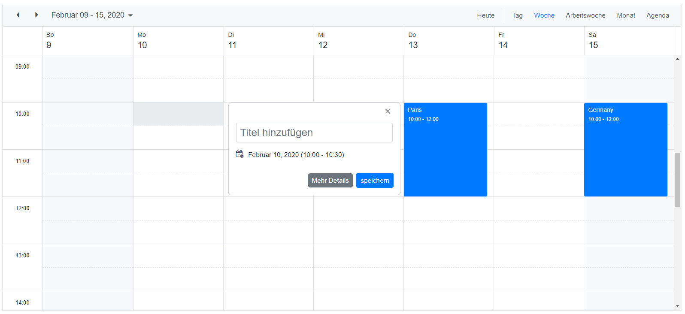

# Localization (Multi-Language) support in Syncfusion Blazor components

Localization (L10N) is the process of adapting application components and content to the desired language with its corresponding region. This page shows you how to use the Localization feature in your application.

## How to enable Localization in Blazor application

To get started with Localization in Blazor application, you have to familiarize yourself with the Localization and its architecture in the framework. Refer to the below resources to know more about Localization in the Blazor framework.

* [Blazor Localization](https://docs.microsoft.com/en-us/aspnet/core/blazor/globalization-localization)

* [ASP.Net Core Localization](https://docs.microsoft.com/en-us/aspnet/core/fundamentals/localization)

The culture can be set using one of the following approaches:

* [Cookies](https://docs.microsoft.com/en-us/aspnet/core/blazor/globalization-localization#cookies)

* [Provide UI to choose the culture](https://docs.microsoft.com/en-us/aspnet/core/blazor/globalization-localization#provide-ui-to-choose-the-culture)

## How Syncfusion Blazor UI Component supports Localization

* The Syncfusion Blazor UI components can translate its UI element content based on the user-defined language or culture. The Localization support is processed by using Resource `.resx` files. These resource files contain the key-value pair of locale content in the following format.

    ```
    <Component_Name>_<Feature_Name>_<Locale_Key>
    ```

* The Syncfusion Blazor UI components are using `en-Us` culture for default rendering.

* The various locale culture resource files for Syncfusion Blazor UI components are available in the [blazor-locale](https://github.com/syncfusion/blazor-locale) GitHub repository.

## Enable Localization in Blazor Server application

1. Add the Localization service configuration in the `~/Startup.cs` file.

    > The Syncfusion locale service should be added after the Syncfusion default service. so that the application level Syncfusion locale service injection will override the default Syncfusion locale service. Map the folder path to the `ResourcesPath` in the default localization service.

    ```c#
    using Syncfusion.Blazor;
    using System.Globalization;
    using ApplicationNamespace.Shared;
    using Microsoft.Extensions.Options;
    using Microsoft.AspNetCore.Localization;

    public class Startup
    {
        .....
        .....

        public void ConfigureServices(IServiceCollection services)
        {
            services.AddControllers();

            #region Localization
            // Set the resx file folder path to access
            services.AddLocalization(options => options.ResourcesPath = "Resources")    ;
            services.AddSyncfusionBlazor();
            // Register the Syncfusion locale service to customize the  SyncfusionBlazor component locale culture
            services.AddSingleton(typeof(ISyncfusionStringLocalizer), typeof    (SyncfusionLocalizer));
            services.Configure<RequestLocalizationOptions>(options =>
            {
                // Define the list of cultures your app will support
                var supportedCultures = new List<CultureInfo>()
                {
                    new CultureInfo("en-US"),
                    new CultureInfo("de")
                };
                // Set the default culture
                options.DefaultRequestCulture = new RequestCulture("en-US");
                options.SupportedCultures = supportedCultures;
                options.SupportedUICultures = supportedCultures;
            });
            #endregion

            .....
            .....
        }

        public void Configure(IApplicationBuilder app, IWebHostEnvironmentenv)
        {
            #region Localization
            app.UseRequestLocalization(app.ApplicationServices. GetService<IOptions<RequestLocalizationOptions>>().Value);

            #endregion

            .....
            .....

            app.UseEndpoints(endpoints =>
            {
                // Adds endpoints for controller actions to the     IEndpointRouteBuilder without specifying any routes.
                endpoints.MapControllers();
                endpoints.MapBlazorHub();
                endpoints.MapFallbackToPage("/_Host");
            });
        }
    }
    ```

    > Here, the `ApplicationNamespace` is your application name.

2. Create `~/Shared/SyncfusionLocalizer.cs` file and implement `ISyncfusionStringLocalizer` to the class. This acts as a middle ware to connect the Syncfusion Blazor UI components and resource files.

    > Map the `SfResources.ResourceManager` to this interface `Manager`.

    ```c#
    using Syncfusion.Blazor;

    public class SyncfusionLocalizer : ISyncfusionStringLocalizer
    {
        // To get the locale key from mapped resources file
        public string GetText(string key)
        {
            return this.ResourceManager.GetString(key);
        }

        // To access the resource file and get the exact value for locale key

        public System.Resources.ResourceManager ResourceManager {
            get
            {
                // Replace the ApplicationNamespace with your application name.
                return ApplicationNamespace.Resources.SfResources.ResourceManager;
            }
        }
    }
    ```

3. Add the resource files in the `~/Resources` folder. The locale resource files for different cultures are available in this [GitHub](https://github.com/syncfusion/blazor-locale) repository. You can get any culture resource file from there and utilize it in your application.

    

    After adding the resource file in the application we need to generate the designer class for the resources. To generate the designer class, open the default `resx` file in Visual Studio, and set its `Access Modifier` to `Public`. This will create an entry in your `.csproj` file similar to the following.

    ```xml
    <ItemGroup>
        <EmbeddedResource Update="Resources\SfResources.en-US.resx">
            <Generator>PublicResXFileCodeGenerator</Generator>
        </EmbeddedResource>
        <EmbeddedResource Update="Resources\SfResources.resx">
            <Generator>PublicResXFileCodeGenerator</Generator>
            <LastGenOutput>SfResources.Designer.cs</LastGenOutput>
        </EmbeddedResource>
    </ItemGroup>
    ```

4. Create `~/Pages/_Host.cshtml.cs` file and use cookies to store the user-selected culture.

    ```c#
    using Microsoft.AspNetCore.Http;
    using Microsoft.AspNetCore.Localization;
    using Microsoft.AspNetCore.Mvc.RazorPages;
    using System.Globalization;

    public class HostModel : PageModel
    {
        public void OnGet()
        {
            HttpContext.Response.Cookies.Append(
                CookieRequestCultureProvider.DefaultCookieName,
                CookieRequestCultureProvider.MakeCookieValue(
                    new RequestCulture(
                        CultureInfo.CurrentCulture,
                        CultureInfo.CurrentUICulture)));
        }
    }
    ```

5. Create `~/Controllers/CultureController.cs` file and configure the controller to switch the culture using UI.

    ```c#
    using Microsoft.AspNetCore.Mvc;
    using Microsoft.AspNetCore.Http;
    using Microsoft.AspNetCore.Localization;

    [Route("[controller]/[action]")]
    public class CultureController : Controller
    {
        public IActionResult SetCulture(string culture, string redirectUri)
        {
            if (culture != null)
            {
                HttpContext.Response.Cookies.Append(
                    CookieRequestCultureProvider.DefaultCookieName,
                    CookieRequestCultureProvider.MakeCookieValue(
                        new RequestCulture(culture)));
            }

            return LocalRedirect(redirectUri);
        }
    }
    ```

6. Create a Blazor component `CultureSwitcher.razor` in the `~/Shared/` folder.

    ```cshtml
    @inject NavigationManager NavigationManager

    <h3>Select your language</h3>

    <select @onchange="OnSelected">
        <option>Select Culture</option>
        <option value="en-US">English</option>
        <option value="de">German</option>
    </select>

    @code {
        private void OnSelected(ChangeEventArgs e)
        {
            var culture = (string)e.Value;
            var uri = new Uri(NavigationManager.Uri)
                .GetComponents(UriComponents.PathAndQuery, UriFormat.Unescaped);
            var query = $"?culture={Uri.EscapeDataString(culture)}&" +
                $"redirectUri={Uri.EscapeDataString(uri)}";

            NavigationManager.NavigateTo("/Culture/SetCulture" + query, forceLoad:  true);
        }
    }
    ```

7. Add `CultureSwitcher` component to `~/Shared/MainLayout.razor` file to enable the culture switcher in all pages.

    ```cshtml
    <div class="main">
        <div class="top-row px-4">
            <CultureSwitcher />
            <a href="https://docs.microsoft.com/aspnet/" target="_blank">About</a>
        </div>

        <div class="content px-4">
            @Body
        </div>
    </div>
    ```

8. Add Syncfusion Blazor UI components in `~/Pages/*.razor` and run the application. The following screenshot illustrates the output of the German `de-DE` culture.

    

    > Download Blazor Server app App from [Github](https://github.com/SyncfusionExamples/blazor-localization/tree/master/blazor-server-app).

## Enable Localization in Blazor WebAssembly application

1. Add the Localization service configuration in the `~/Program.cs` file.

    ```c#
    using Syncfusion.Blazor;
    using Microsoft.JSInterop;
    using System.Globalization;
    using ApplicationNamespace.Shared;

    public class Program
    {
        public static async Task Main(string[] args)
        {
            var builder = WebAssemblyHostBuilder.CreateDefault(args);
            .....
            .....

            builder.Services.AddSyncfusionBlazor();

            #region Localization
            // Register the Syncfusion locale service to customize the  SyncfusionBlazor component locale culture
            builder.Services.AddSingleton(typeof(ISyncfusionStringLocalizer), typeof(SyncfusionLocalizer));

            // Set the default culture of the application
            CultureInfo.DefaultThreadCurrentCulture = new CultureInfo("en-US");
            CultureInfo.DefaultThreadCurrentUICulture = new CultureInfo("en-US");

            // Get the modified culture from culture switcher
            var host = builder.Build();
            var jsInterop = host.Services.GetRequiredService<IJSRuntime>();
            var result = await jsInterop.InvokeAsync<string>("cultureInfo.get");
            if (result != null)
            {
                // Set the culture from culture switcher
                var culture = new CultureInfo(result);
                CultureInfo.DefaultThreadCurrentCulture = culture;
                CultureInfo.DefaultThreadCurrentUICulture = culture;
            }
            #endregion

            await builder.Build().RunAsync();
        }
    }
    ```

    > Here, the `ApplicationNamespace` is your application name.

2. Create `~/Shared/SyncfusionLocalizer.cs` file and implement `ISyncfusionStringLocalizer` to the class. This acts as a middle ware to connect the Syncfusion Blazor UI components and resource files.

    > Map the `SfResources.ResourceManager` to this interface `Manager`.

    ```c#
    using Syncfusion.Blazor;

    public class SyncfusionLocalizer : ISyncfusionStringLocalizer
    {
        // To get the locale key from mapped resources file
        public string GetText(string key)
        {
            return this.ResourceManager.GetString(key);
        }

        // To access the resource file and get the exact value for locale key

        public System.Resources.ResourceManager ResourceManager {
            get
            {
                // Replace the ApplicationNamespace with your application name.
                return ApplicationNamespace.Resources.SfResources.ResourceManager;
            }
        }
    }
    ```
    > For .NET 5.0 Blazor Webassembly globalization, we should configure the `BlazorWebAssemblyLoadAllGlobalizationData` in the project file when the application uses large resources and dynamic culture changes. 
    
    ```xml
    <PropertyGroup>
        <BlazorWebAssemblyLoadAllGlobalizationData>true</BlazorWebAssemblyLoadAllGlobalizationData>
    </PropertyGroup>
    ```

    Refer [here](https://docs.microsoft.com/en-us/aspnet/core/blazor/globalization-localization?view=aspnetcore-5.0#blazor-webassembly) for more details.

3. Add the resource files in the `~/Resources` folder. The locale resource files for different cultures are available in this [GitHub](https://github.com/syncfusion/blazor-locale) repository. You can get any culture resource file from there and utilize it in your application.

    

    After adding the resource file in the application we need to generate the designer class for the resources. To generate the designer class, open the default `resx` file in Visual Studio, and set its `Access Modifier` to `Public`. This will create an entry in your `.csproj` file similar to the following.

    ```xml
    <ItemGroup>
      <Compile Update="Resources\SfResources.Designer.cs">
        <DesignTime>True</DesignTime>
        <AutoGen>True</AutoGen>
        <DependentUpon>SfResources.resx</DependentUpon>
      </Compile>
    </ItemGroup>

    <ItemGroup>
      <EmbeddedResource Update="Resources\SfResources.resx">
        <Generator>PublicResXFileCodeGenerator</Generator>
        <LastGenOutput>SfResources.Designer.cs</LastGenOutput>
      </EmbeddedResource>
    </ItemGroup>
    ```

4. Add the custom JavaScript interop function to get or set the culture in `~/wwwroot/index.html`.

    ```html
    <body>
        .....
        .....

        <script src="_framework/blazor.webassembly.js"></script>

        <script>
            window.cultureInfo = {
                get: () => window.localStorage['BlazorCulture'],
                set: (value) => window.localStorage['BlazorCulture'] = value
            };
        </script>
    </body>
    ```

5. Create a Blazor component `CultureSwitcher.razor` in the `~/Shared/` folder.

    ```cshtml
    @using  System.Globalization
    @inject IJSRuntime JSRuntime
    @inject NavigationManager NavigationManager

    <select @bind="Culture">
        @foreach (var culture in supportedCultures)
        {
            <option value="@culture">@culture.DisplayName</option>
        }
    </select>

    @code {
        private CultureInfo[] supportedCultures = new[]
        {
            new CultureInfo("en-US"),
            new CultureInfo("de")
        };

        private CultureInfo Culture
        {
            get => CultureInfo.CurrentCulture;
            set
            {
                if (CultureInfo.CurrentCulture != value)
                {
                    var js = (IJSInProcessRuntime)JSRuntime;
                    js.InvokeVoid("cultureInfo.set", value.Name);

                    NavigationManager.NavigateTo(NavigationManager.Uri, forceLoad:  true);
                }
            }
        }
    }
    ```
6. Add `CultureSwitcher` component to `~/Shared/MainLayout.razor` file to enable the culture switcher in all pages.

    ```cshtml
    <div class="main">
        <div class="top-row px-4">
            <CultureSwitcher />
            <a href="https://docs.microsoft.com/aspnet/" target="_blank">About</a>
        </div>

        <div class="content px-4">
            @Body
        </div>
    </div>
    ```

7. Add Syncfusion Blazor UI components in `~/Pages/*.razor` and run the application. The following screenshot illustrates the output of the German `de-DE` culture.

    

    > Download Blazor WebAssembly App from [Github](https://github.com/SyncfusionExamples/blazor-localization/tree/master/blazor-webassembly-app).

## See Also

* [How to Perform Localization using Database instead of Resource Files in Blazor?](https://www.syncfusion.com/kb/13012/how-to-perform-localization-using-database-instead-of-resource-files-in-blazor)