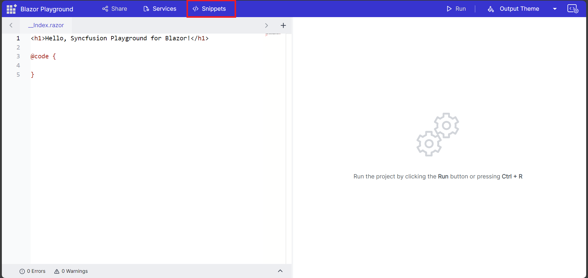
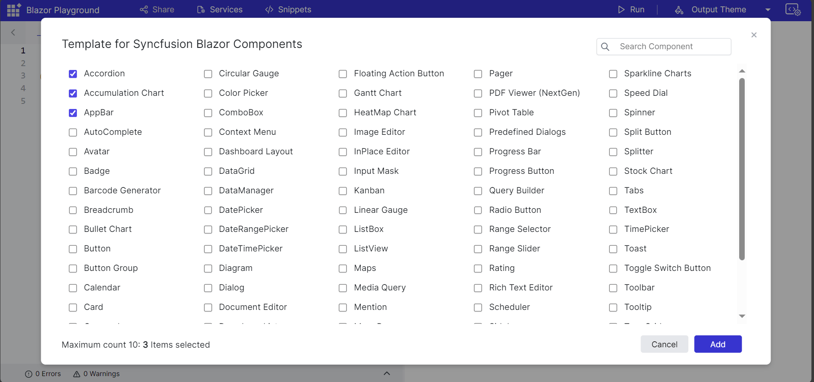
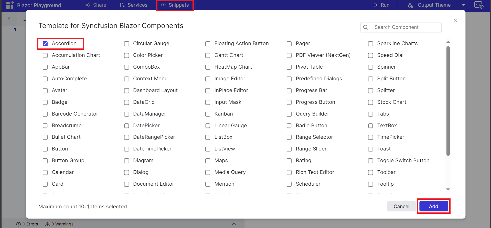
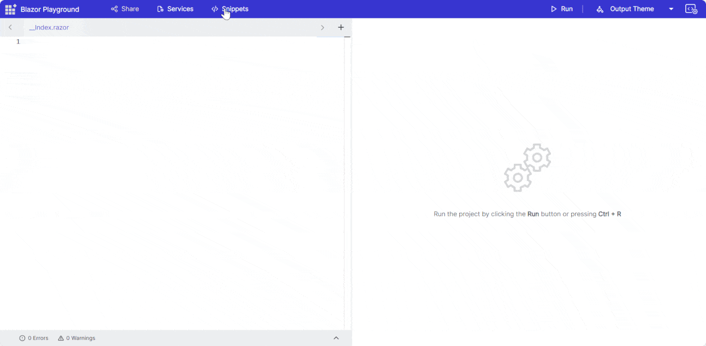

# Predefined code snippets for Blazor Playground
Blazor Playground provides predefined code snippets for all Syncfusion&reg; Blazor components to quickly insert component code examples.

* Click the Snippet button to open a dialog containing a list of predefined code snippets for Syncfusion&reg; Blazor UI components.

* Select up to 10 components to render by clicking the desired snippets. Multiple components can be selected simultaneously.

* After selecting components, click the Add button. The chosen snippets are added to the editor.

N> For each selected component, the corresponding individual NuGet package (latest version) is added automatically, and the overall `Syncfusion.Blazor` package is removed.

* Press the Run button or <kbd>Ctrl</kbd>+<kbd>R</kbd> to execute the code. The output appears in the result view.
