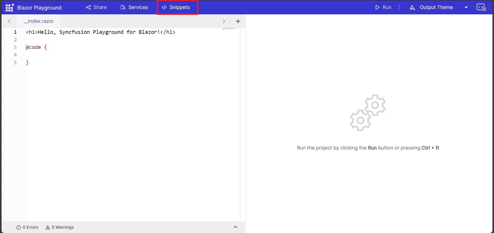
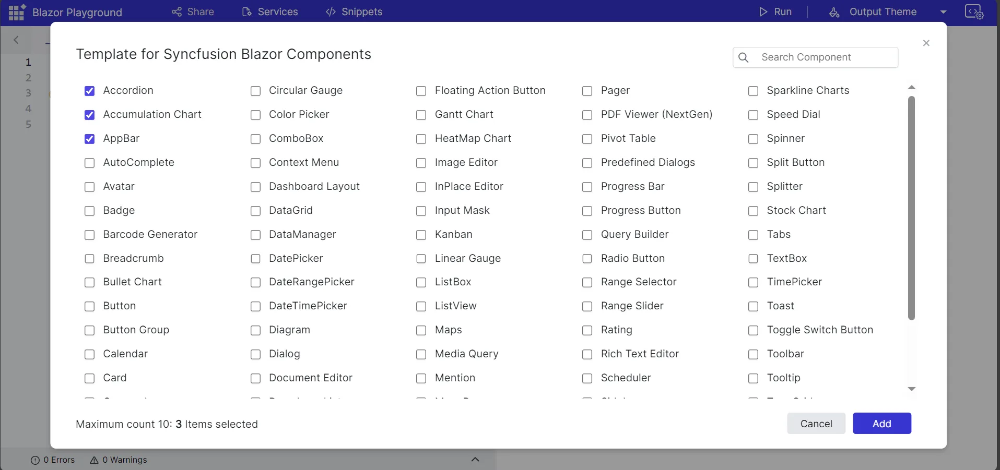
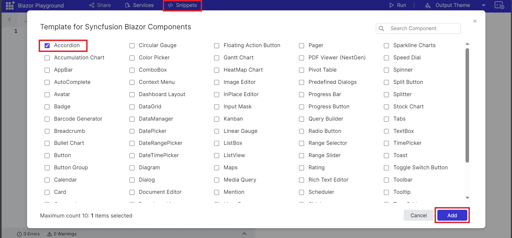
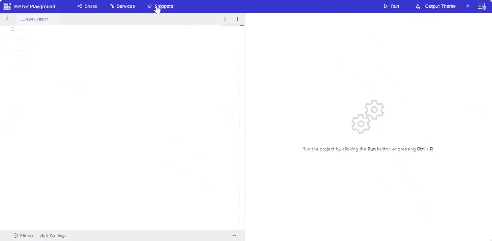

# Predefined Code Snippets for Blazor Playground

The [Blazor Playground](https://blazorplayground.syncfusion.com) provides predefined code snippets for all [Blazor components](https://www.syncfusion.com/blazor-components) to quickly insert component code examples.

1\. Click the **Snippet** button to open a dialog box containing predefined code snippets.

2\. Select up to 10 components by clicking the desired snippets. Multiple components can be selected simultaneously.

3\. Click the **Add** button. The selected code snippets are inserted into the editor.

N> For each selected component, the corresponding individual NuGet package (latest version) is added automatically, and the overall [Syncfusion.Blazor](https://www.nuget.org/packages/Syncfusion.Blazor) package is removed.

4\. Press the **Run** button or <kbd>Ctrl</kbd>+<kbd>R</kbd> to execute the code. The output appears in the result view.

## See also

* [Getting Started with Blazor Playground](./getting-started)
* [Working with components in Blazor Playground](./working-with-components)
* [Features and capabilities of Blazor Playground](./end-user-capabilities)
* [Manage NuGet packages in Blazor Playground](./managing-nuget-packages)

