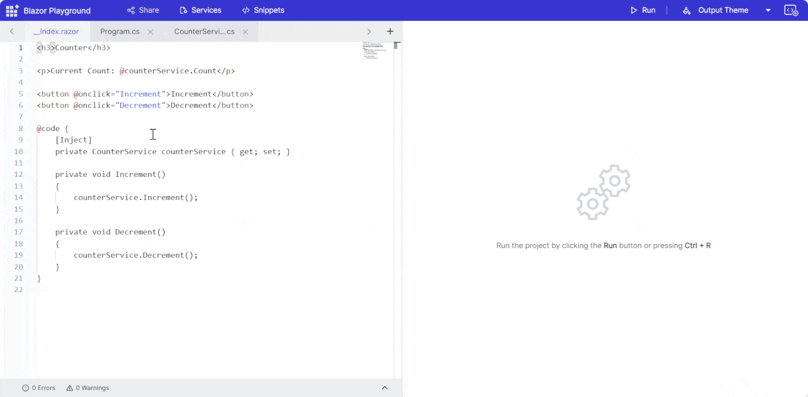

# Configure services in Blazor Playground

You can add or modify services in Blazor Playground using the Services button in the app bar.

* Open the Services button to edit Program.cs and the `ConfigureServices` method.
* Add or update service registrations in `ConfigureServices`.
* Inject the service into components as needed.

For example:

* Add a class file by clicking '+' button and include the following code snippet.

```csharp
using System;
using System.Text;
using System.Linq;
using System.Threading.Tasks;
using System.Collections.Generic;

namespace Playground.User
{
    public class CounterService
    {
        private int _count = 0;

        public int Count => _count;

        public void Increment()
        {
            _count++;
        }

        public void Decrement()
        {
            _count--;
        }
    }
}
```
* Click the Services button to open Program.cs and register the service in the `ConfigureServices` method.

```csharp
using System;
using System.Text;
using System.Linq;
using System.Threading.Tasks;
using System.Collections.Generic;
using Microsoft.AspNetCore.Components.WebAssembly.Hosting;
using Microsoft.Extensions.DependencyInjection;

namespace Playground.User
{
    public class Program
    {
        /// <summary>
        /// Configure Services method to add and configure the <see href="https://docs.microsoft.com/en-us/dotnet/api/microsoft.extensions.dependencyinjection.iservicecollection">service collection</see>.
        /// </summary>
        /// <param name="WebAssemblyHostBuilder">A builder for configuring services and creating a WebAssemblyHost.</param>
        /// <returns>The collection of services.</returns>
        public static void ConfigureServices(WebAssemblyHostBuilder builder)
        {
            builder.Services.AddScoped<CounterService>();
            // Configure your service here.
            // For e.g., builder.Services.AddSingleton(new CustomClass());
        }
    }
}
```

* Inject the service in the `_Index.razor` file.

```csharp

<h3>Counter</h3>

<p>Current Count: @counterService.Count</p>

<button @onclick="Increment">Increment</button>
<button @onclick="Decrement">Decrement</button>

@code {
    [Inject]
    private CounterService counterService { get; set; }

    private void Increment()
    {
        counterService.Increment();
    }

    private void Decrement()
    {
        counterService.Decrement();
    }
}

```
* Press the Run button to execute the code. The output appears in the result view.


