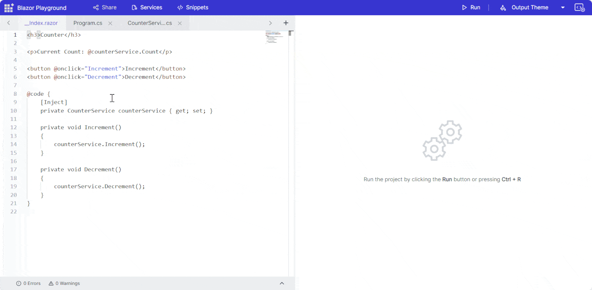

# Configure Services in Blazor Playground

You can add or modify services in [Blazor Playground](https://blazorplayground.syncfusion.com) using the **Services** button in the app bar.

The following example creates a `CounterService` class, registers it in `Program.cs`, and injects it into `_Index.razor` to manage a counter with increment and decrement actions.

1\. Click the **+** button to add a new file and include the `CounterService` code.




using System;
using System.Text;
using System.Linq;
using System.Threading.Tasks;
using System.Collections.Generic;

namespace Playground.User
{
    public class CounterService
    {
        private int _count = 0;

        public int Count => _count;

        public void Increment()
        {
            _count++;
        }

        public void Decrement()
        {
            _count--;
        }
    }
}




2\. Click the **Services** button to open `Program.cs` and register the service in `ConfigureServices`.




using System;
using System.Text;
using System.Linq;
using System.Threading.Tasks;
using System.Collections.Generic;
using Microsoft.AspNetCore.Components.WebAssembly.Hosting;
using Microsoft.Extensions.DependencyInjection;

namespace Playground.User
{
    public class Program
    {
        /// 

        /// Configure Services method to add and configure the <see href="https://docs.microsoft.com/en-us/dotnet/api/microsoft.extensions.dependencyinjection.iservicecollection">service collection</see>.
        /// 

        /// <param name="WebAssemblyHostBuilder">A builder for configuring services and creating a WebAssemblyHost.</param>
        /// <returns>The collection of services.</returns>
        public static void ConfigureServices(WebAssemblyHostBuilder builder)
        {
            builder.Services.AddScoped<CounterService>();
            // Configure your service here.
            // For e.g., builder.Services.AddSingleton(new CustomClass());
        }
    }
}




3\. Inject the service into `_Index.razor` file.




<h3>Counter</h3>

Current Count: @counterService.Count

<button @onclick="Increment">Increment</button>
<button @onclick="Decrement">Decrement</button>

@code {
    [Inject]
    private CounterService counterService { get; set; }

    private void Increment()
    {
        counterService.Increment();
    }

    private void Decrement()
    {
        counterService.Decrement();
    }
}




4\. Press the **Run** button or <kbd>Ctrl</kbd>+<kbd>R</kbd> to execute the code. The output appears in the result view.

## See also

* [Getting Started with Blazor Playground](./getting-started)
* [Working with components in Blazor Playground](./working-with-components)
* [Manage NuGet packages in Blazor Playground](./managing-nuget-packages)
* [Features and capabilities of Blazor Playground](./end-user-capabilities)

