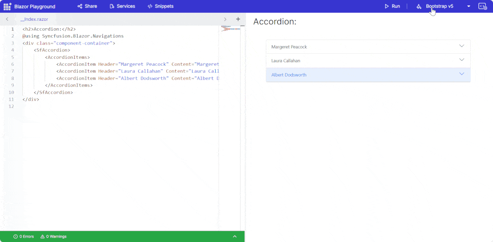
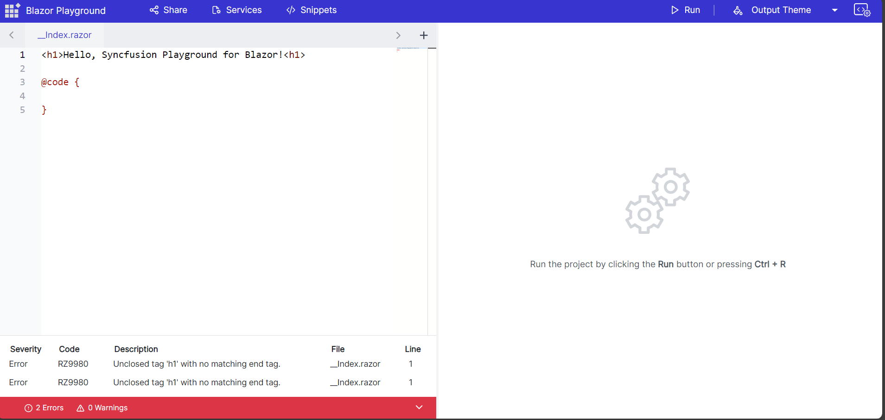
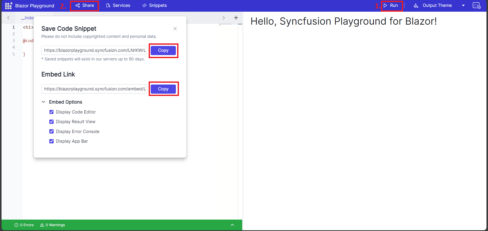
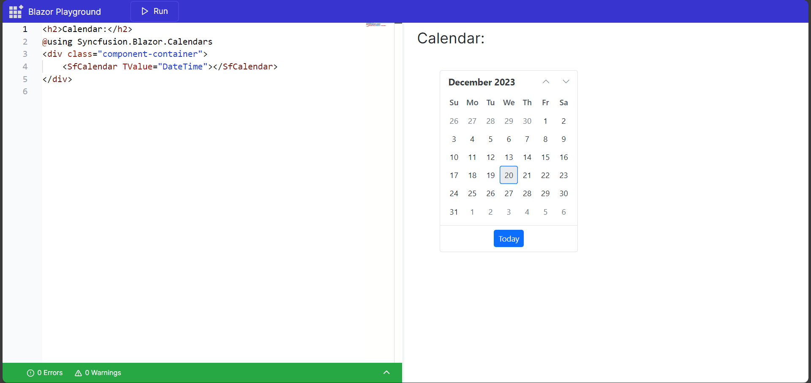
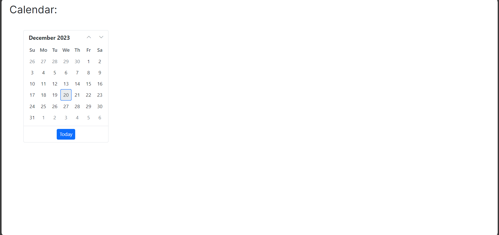
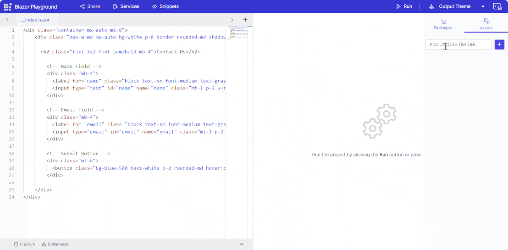

# End-user capabilities

## Switch themes

Blazor Playground lets users customize the appearance of Syncfusion&reg; Blazor components by choosing a theme from the dropdown available via the **Output Theme** button.

## Explore the code editor 

* Type, copy, cut, paste, and edit your code within the editor.
* Create and manage .razor and .cs files alongside the default `_Index.razor`.
* Enhance readability with syntax highlighting for keywords, variables, strings, and comments.

## Compiling and running code

* Execute code by pressing the Run button or using the <kbd>Ctrl</kbd>+<kbd>R</kbd> keyboard shortcut.
* View the compiled output in the result view.

## Preview code output

* Click the Run button to compile your code.
* If there are no errors, the result view displays the output.

## Error and warning handling

During compilation, any errors or warnings are displayed with their corresponding line numbers for efficient identification and resolution.

## Sharing code

Click the Share button to generate a unique URL for collaboration and discussion. The dialog presents two sections: **Shared Link** and **Embed Link**.

## Embedding code

Embed links provide customization options:
* **Display Code Editor:** Enables the code editor for the end user.
* **Display Result View:** Disables the code editor and shows only the result.
* **Display Error Console:** Shows the warnings and errors console.
* **Display App Bar:** Enables the app bar with the Run button.

For example, enable all options in an embed link. 

For example, show only the result view and disable all other options.

## Handling static assets

Manage CSS and JavaScript files for styling and scripting your application in Blazor Playground.
* Add CDN links for static assets through the **Static Assets** tab in the **NuGet Asset Manager**.
* Include the CDN link in your code files (for example, `__Index.razor`) to apply styles or scripts.

