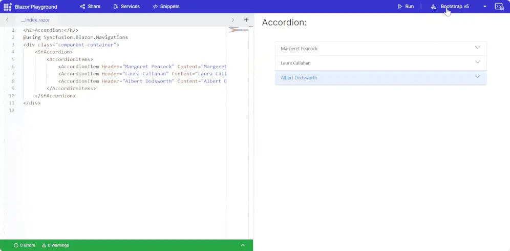
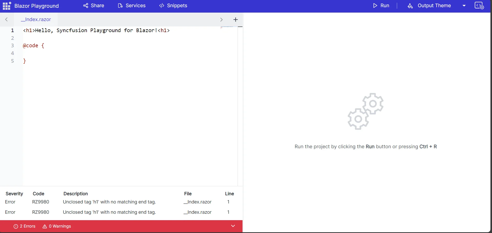
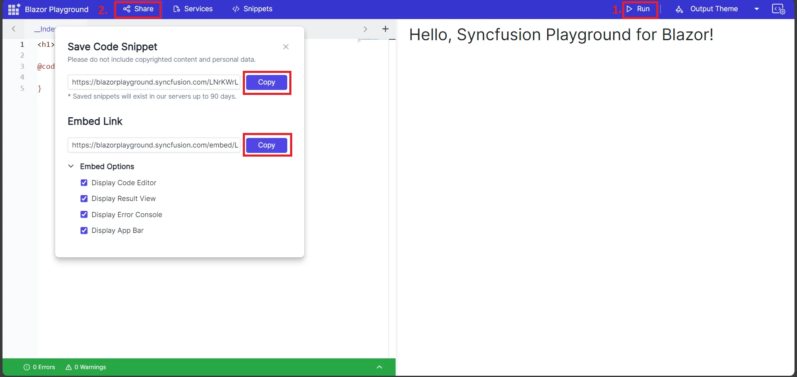
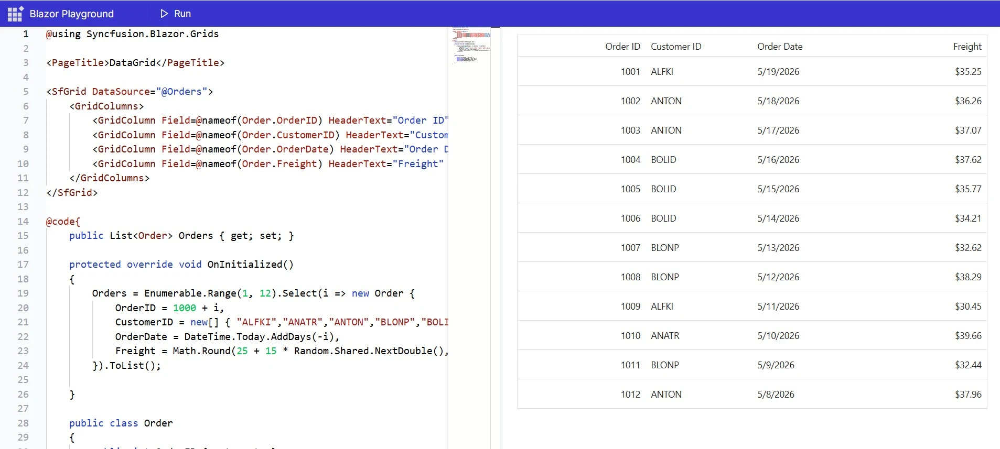
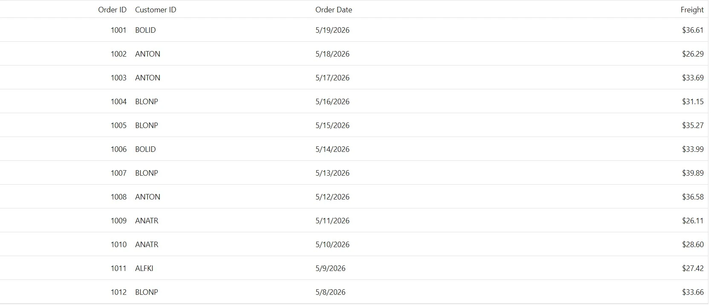
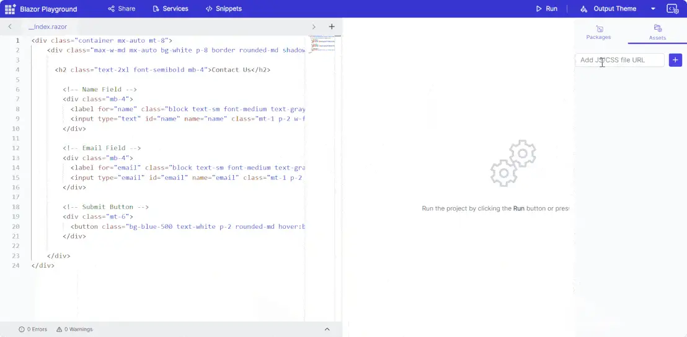

# Features and Capabilities of Blazor Playground

The [Blazor Playground](https://blazorplayground.syncfusion.com) provides a rich set of built-in features for developing, testing, and sharing [Blazor components](https://www.syncfusion.com/blazor-components) directly in the browser, including theme switching, a feature-rich code editor, error handling, code sharing, embedding, and static asset management.

## Switch themes

Blazor Playground allow you to customize the appearance of Blazor components.

1. Click the **Output Theme** button in the toolbar.
2. Select a theme from the dropdown to apply it to the component output.

## Explore the code editor 

* Type, copy, cut, paste, and edit your code within the editor.
* Create and manage `.razor` and `.cs` files alongside the default `_Index.razor`.
* Enhance readability with syntax highlighting for keywords, variables, strings, and comments.

## Compile and run code

1. Press the **Run** button or use the <kbd>Ctrl</kbd>+<kbd>R</kbd> keyboard shortcut to compile and execute your code.
2. If there are no errors, the result view displays the compiled output.

## Handle errors and warnings

During compilation, errors and warnings are displayed in the error console with their corresponding line numbers.

1. Review the error message and note the line number.
2. Click the error entry to navigate to the corresponding line in the code editor.
3. Fix the issue and press the **Run** button or <kbd>Ctrl</kbd>+<kbd>R</kbd> to recompile.

## Share code

Click the **Share** button to generate a unique URL for collaboration and discussion. The dialog presents two sections: **Shared Link** and **Embed Link**.

### Embed code

Embed links provide customization options:
* **Display Code Editor:** Shows the code editor in the embedded view.
* **Display Result View:** Disables the code editor and shows only the result.
* **Display Error Console:** Shows the warnings and errors console.
* **Display App Bar:** Enables the app bar with the Run button.

The following example shows the embedded output when all display options are enabled. 

The following example shows the embedded output when only the result view is enabled and all other options are disabled.

## Manage static assets

Manage CSS and JavaScript files for styling and scripting your application in Blazor Playground.
* Add CDN links for static assets through the **Static Assets** tab in the **NuGet Asset Manager**.
* Include the CDN link in your code files (for example, `_Index.razor`) to apply styles or scripts.

## See also

* [Getting Started with Blazor Playground](./getting-started)
* [Working with components in Blazor Playground](./working-with-components)
* [Manage NuGet packages in Blazor Playground](./managing-nuget-packages)