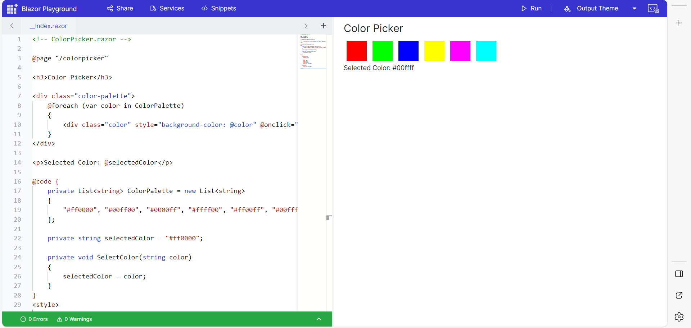

# Getting Started with Blazor Playground

The Blazor playground allows you to develop and test any Blazor component, including both general components and pre-built Syncfusion<sup style="font-size:70%">&reg;</sup> Blazor components.

To get started quickly with Blazor Playground, watch the following video.



## Blazor component

You can create a Blazor component in Blazor playground by following the given steps below:

* Open the [Blazor Playground](https://blazorplayground.syncfusion.com/) URL in your browser.
* In the editor, add the following code:

```cshtml
<!-- ColorPicker.razor -->

@page "/colorpicker"

<h3>Color Picker</h3>

<div class="color-palette">
    @foreach (var color in ColorPalette)
    {
        <div class="color" style="background-color: @color" @onclick="() => SelectColor(color)"></div>
    }
</div>

<p>Selected Color: @selectedColor</p>

@code {
    private List<string> ColorPalette = new List<string>
    {
        "#ff0000", "#00ff00", "#0000ff", "#ffff00", "#ff00ff", "#00ffff"
    };

    private string selectedColor = "#ff0000";

    private void SelectColor(string color)
    {
        selectedColor = color;
    }
}
<style>

    .color-palette {
        display: flex;
        flex-wrap: wrap;
    }

    .color {
        width: 50px;
        height: 50px;
        margin: 5px;
        cursor: pointer;
        border: 2px solid #fff;
    }

    .color:hover {
        border: 2px solid #000;
    }
    
</style>
```
* Press the Run button or <kbd>Ctrl</kbd>+<kbd>R</kbd> to execute the code. The output appears in the result view.



## Syncfusion<sup style="font-size:70%">&reg;</sup> Blazor component

Blazor Playground is preconfigured with the `Syncfusion.Blazor` package, stylesheets, and scripts. To render Syncfusion<sup style="font-size:70%">&reg;</sup> components in the Playground, import the required namespaces and add the component as shown below:

* Import the `Syncfusion.Blazor` and `Syncfusion.Blazor.Calendars` namespaces at the top of the editor.


```cshtml

@using Syncfusion.Blazor
@using Syncfusion.Blazor.Calendars

```

* Add the Blazor Calendar component in the editor.

```cshtml

<SfCalendar TValue="DateTime"></SfCalendar>

```

* Press the Run button or <kbd>Ctrl</kbd>+<kbd>R</kbd> to execute the code. The output appears in the Result view.

