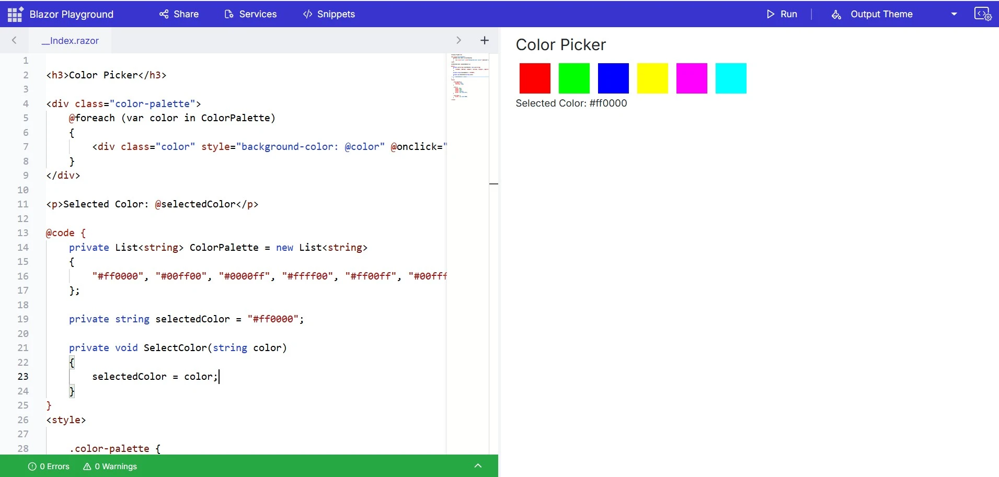
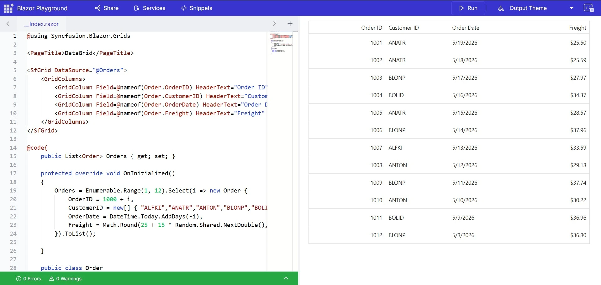

# Getting Started with Blazor Playground

The [Blazor Playground](https://blazorplayground.syncfusion.com) allows you to develop and test any Blazor component, including both general components and pre-built [Blazor components](https://www.syncfusion.com/blazor-components).

To get started quickly with Blazor Playground, watch the following video.



## Create a Blazor component

You can create a Blazor component in Blazor Playground by following these steps:

* Open the [Blazor Playground](https://blazorplayground.syncfusion.com/) URL in your browser.
* In the editor, add the following code:




<h3>Color Picker</h3>

    @foreach (var color in ColorPalette)
    {
        
 SelectColor(color)">

    }

Selected Color: @selectedColor

@code {
    private List<string> ColorPalette = new List<string>
    {
        "#ff0000", "#00ff00", "#0000ff", "#ffff00", "#ff00ff", "#00ffff"
    };

    private string selectedColor = "#ff0000";

    private void SelectColor(string color)
    {
        selectedColor = color;
    }
}




* Press the **Run** button or <kbd>Ctrl</kbd>+<kbd>R</kbd> to execute the code. The output appears in the result view.



## Add a Syncfusion® Blazor Component

Blazor Playground is preconfigured with the Syncfusion® Blazor package, stylesheets, and scripts. To use [Syncfusion® Blazor components](https://www.syncfusion.com/blazor-components) in the Playground, import the required namespace and add the component as shown below:

* Add the `@using Syncfusion.Blazor.Grids` namespace at the top of the editor. This namespace is provided by the [Syncfusion.Blazor.Grid](https://www.nuget.org/packages/Syncfusion.Blazor.Grid) NuGet package.




@using Syncfusion.Blazor.Grids




* Add the [Blazor DataGrid](https://www.syncfusion.com/blazor-components/blazor-datagrid) component in the editor.




@using Syncfusion.Blazor.Grids

<PageTitle>DataGrid</PageTitle>

<SfGrid DataSource="@Orders">
    <GridColumns>
        <GridColumn Field=@nameof(Order.OrderID) HeaderText="Order ID" TextAlign="Syncfusion.Blazor.Grids.TextAlign.Right" Width="120" />
        <GridColumn Field=@nameof(Order.CustomerID) HeaderText="Customer ID" Width="100" />
        <GridColumn Field=@nameof(Order.OrderDate) HeaderText="Order Date" Format="d" Type="Syncfusion.Blazor.Grids.ColumnType.Date" Width="100" />
        <GridColumn Field=@nameof(Order.Freight) HeaderText="Freight" Format="C2" TextAlign="Syncfusion.Blazor.Grids.TextAlign.Right" Width="120" />
    </GridColumns>
</SfGrid>

@code {
    public List<Order> Orders { get; set; }

    protected override void OnInitialized()
    {
        Orders = Enumerable.Range(1, 12).Select(i => new Order {
            OrderID = 1000 + i,
            CustomerID = new[] { "ALFKI","ANATR","ANTON","BLONP","BOLID" }[Random.Shared.Next(5)],
            OrderDate = DateTime.Today.AddDays(-i),
            Freight = Math.Round(25 + 15 * Random.Shared.NextDouble(), 2)
        }).ToList();

    }

    public class Order
    {
        public int OrderID { get; set; }
        public string CustomerID { get; set; }
        public DateTime OrderDate { get; set; }
        public double Freight { get; set; }
        
    }
}




* Press the **Run** button or <kbd>Ctrl</kbd>+<kbd>R</kbd> to execute the code. 



## See also

* [Working with components in Blazor Playground](./working-with-components)
* [Manage NuGet packages in Blazor Playground](./managing-nuget-packages)
* [Features and capabilities of Blazor Playground](./end-user-capabilities)