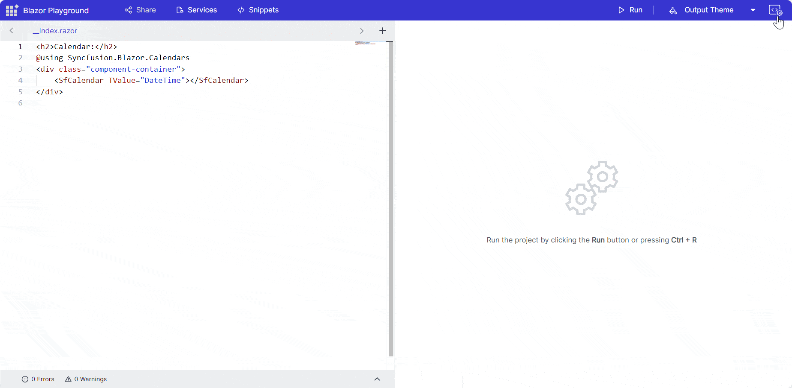
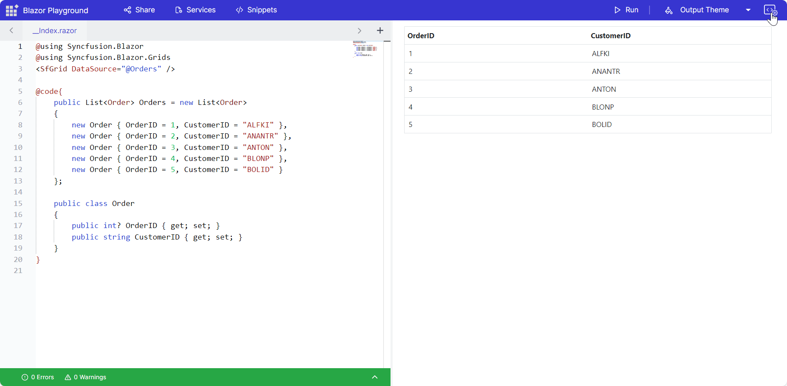
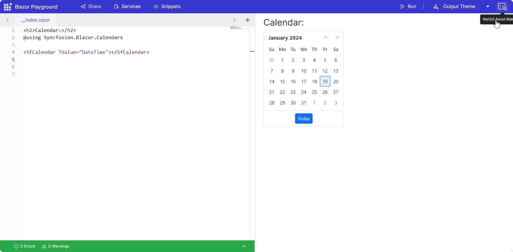

# Manage NuGet packages

Syncfusion<sup style="font-size:70%">&reg;</sup> Blazor Playground is preconfigured with the `Syncfusion.Blazor` package for immediate component rendering. This loads the full library, which can impact initial load time. For better performance, install individual NuGet packages to load only the components required.

## Adding NuGet packages

* Open the NuGet Asset Manager sidebar.
* Search for the desired package, select a version, and click the Install NuGet button. The Playground restores packages automatically.

N> Uninstall the `Syncfusion.Blazor` package before installing individual packages to avoid duplication and reduce payload size.

For example, uninstall `Syncfusion.Blazor` and install the latest [Syncfusion.Blazor.Calendars](https://blazor.syncfusion.com/documentation/nuget-packages#syncfusionblazorcalendars).



* Add rendering code in the editor.

```csharp
@using Syncfusion.Blazor
@using Syncfusion.Blazor.Calendars
<SfCalendar TValue="DateTime"></SfCalendar>
```
* Press the Run button or <kbd>Ctrl</kbd>+<kbd>R</kbd> to execute the code. The output appears in the result view.

### Remove packages

Click the `Remove` button next to the installed package details to uninstall it.



### Control NuGet versioning

Upgrade or downgrade packages by searching for the package name and selecting a specific version. The Playground handles installation or updates automatically.

N> Maintain consistent versions across all Syncfusion<sup style="font-size:70%">&reg;</sup> Blazor packages to avoid compatibility issues.

