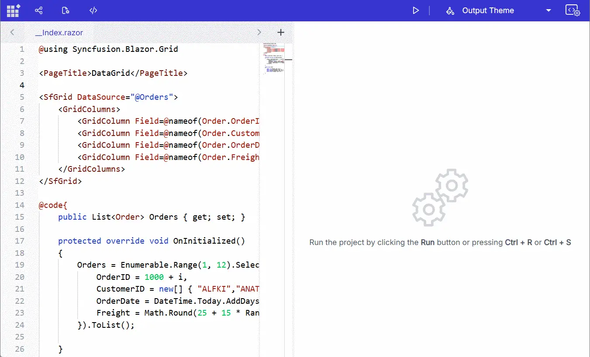
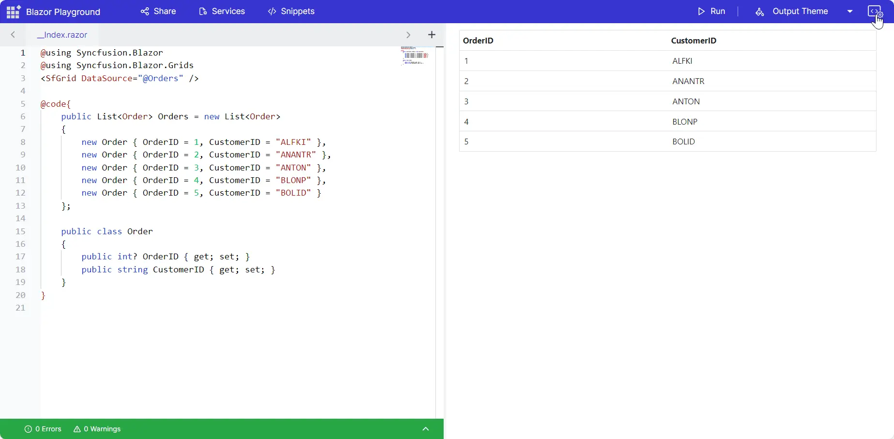
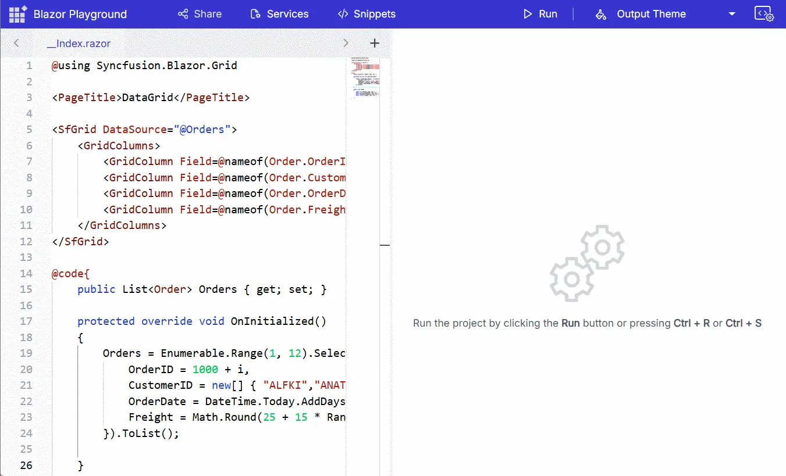

# Manage NuGet Packages in Blazor Playground

The [Blazor Playground](https://blazorplayground.syncfusion.com) is preconfigured with the [Syncfusion.Blazor](https://www.nuget.org/packages/Syncfusion.Blazor) meta package, which bundles all [Blazor components](https://www.syncfusion.com/blazor-components) for immediate use. Because this loads the full library, it can impact initial load time. For better performance, uninstall the meta package and install only the individual NuGet packages required for your components

N> Uninstall the [Syncfusion.Blazor](https://www.nuget.org/packages/Syncfusion.Blazor) package before installing individual packages to avoid duplication and reduce payload size.

## Add NuGet packages

1\. Open the **NuGet Asset Manager** sidebar.
2\. Search for the desired package and select a version.
3\. Click the **Install NuGet** button. The Playground restores packages automatically.

The following example demonstrates how to install the individual NuGet package [Syncfusion.Blazor.Grid](https://www.nuget.org/packages/Syncfusion.Blazor.Grid).

4\. Add rendering code in the editor.




@using Syncfusion.Blazor.Grids

<PageTitle>DataGrid</PageTitle>

<SfGrid DataSource="@Orders">
    <GridColumns>
        <GridColumn Field=@nameof(Order.OrderID) HeaderText="Order ID" TextAlign="Syncfusion.Blazor.Grids.TextAlign.Right" Width="120" />
        <GridColumn Field=@nameof(Order.CustomerID) HeaderText="Customer ID" Width="100" />
        <GridColumn Field=@nameof(Order.OrderDate) HeaderText="Order Date" Format="d" Type="Syncfusion.Blazor.Grids.ColumnType.Date" Width="100" />
        <GridColumn Field=@nameof(Order.Freight) HeaderText="Freight" Format="C2" TextAlign="Syncfusion.Blazor.Grids.TextAlign.Right" Width="120" />
    </GridColumns>
</SfGrid>

@code {
    public List<Order> Orders { get; set; }

    protected override void OnInitialized()
    {
        Orders = Enumerable.Range(1, 12).Select(i => new Order {
            OrderID = 1000 + i,
            CustomerID = new[] { "ALFKI","ANATR","ANTON","BLONP","BOLID" }[Random.Shared.Next(5)],
            OrderDate = DateTime.Today.AddDays(-i),
            Freight = Math.Round(25 + 15 * Random.Shared.NextDouble(), 2)
        }).ToList();

    }

    public class Order
    {
        public int OrderID { get; set; }
        public string CustomerID { get; set; }
        public DateTime OrderDate { get; set; }
        public double Freight { get; set; }
        
    }
}






## Remove packages

Click the **Remove** button next to the installed package details to uninstall it.

## Control NuGet versioning

Upgrade or downgrade packages by searching for the package name and selecting a specific version. The Playground handles installation or updates automatically.

N> Maintain consistent versions across all Blazor packages to avoid compatibility issues.

## See also

* [Getting Started with Blazor Playground](./getting-started)
* [Working with components in Blazor Playground](./working-with-components)
* [Features and capabilities of Blazor Playground](./end-user-capabilities)