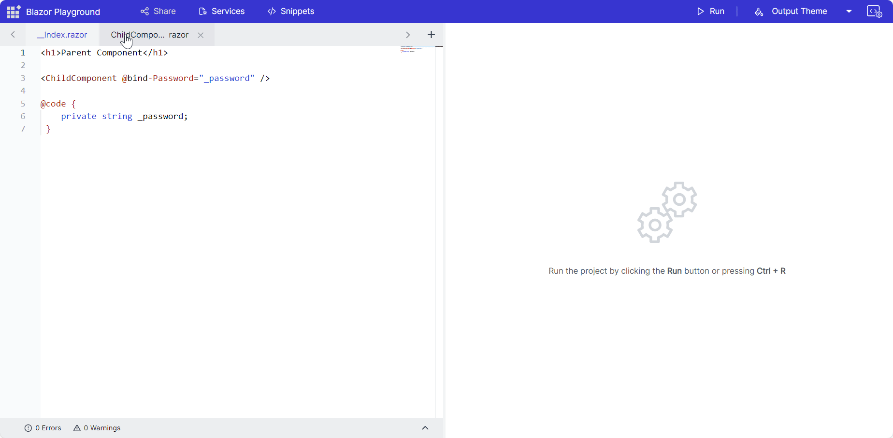

# Working with components in Blazor Playground

## Add a child component

* Click the "+" button to add a new component.
* Name the component in the input box.
* Add code to the child component file (for example, a .razor file).

For example, **ChildComponent.razor**:

```cshtml
<input @oninput="OnPasswordChanged"
       required
       type="@(_showPassword ? "text" : "password")"
       value="@Password" />
<button class="btn btn-primary" @onclick="ToggleShowPassword">
    Show password
</button>
@code {
    private bool _showPassword;
    [Parameter]
    public string Password { get; set; }
    [Parameter]
    public EventCallback<string> PasswordChanged { get; set; }

    private Task OnPasswordChanged(ChangeEventArgs e)
    {
        Password = e.Value.ToString();

        return PasswordChanged.InvokeAsync(Password);
    }
    private void ToggleShowPassword()
    {
        _showPassword = !_showPassword;
    }
}
```
* The **__Index.razor** file is the main entry point in the Blazor Playground. To render the child component, reference it in **__Index.razor**.

```cshtml
<h1>Parent Component</h1>

<ChildComponent @bind-Password="_password" />

@code {
    private string _password;
}
```
* Press the Run button to execute the code and see the component rendered.



## Remove a child component

Click the delete icon next to the child component in the Playground.

N> The Playground does not automatically remove references from `__Index.razor`. Manually update the file to reflect the deletion and prevent build errors.

